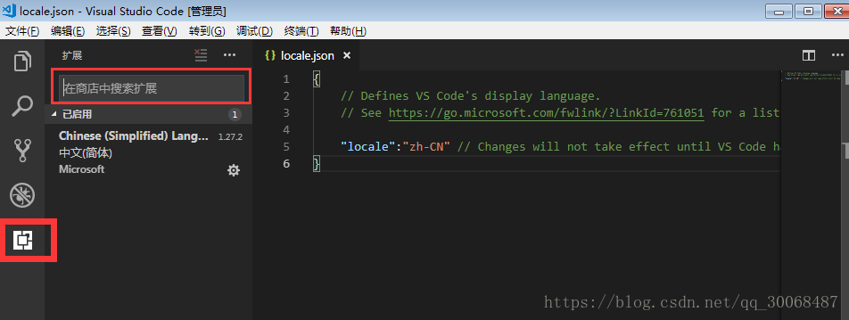
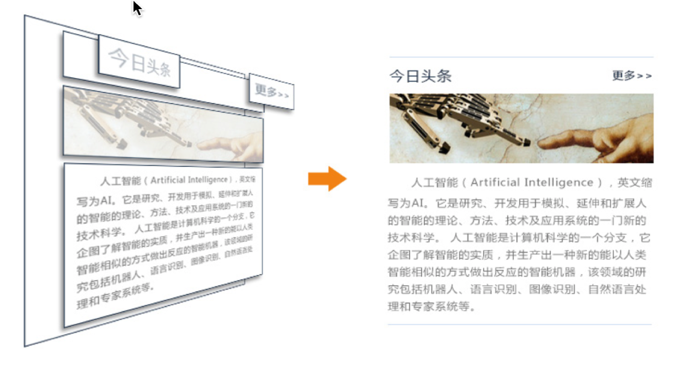

## 1. 前端课程

学习目标 

+ 内容介绍

### 1.1 内容介绍

+ 原生
  + HTML
    + html是一个网页的主题，是由多个元素组合成的，但是这写元素保留的是基本默认属性.
  + CSS
    + css就是这个网页的样式，css定义了元素的属性.
  + JavaScript
    + js是通过javascript语言，实现在一个页面上展现不同的css样式.

> 小结:
>
> 三者的关系通俗讲就是 html是一个赤裸裸的人，css是人的衣服，js作用是让人动起来.

+ 框架
  + JQuery
    + jquery是一个类库，提供了很多方法，不能算框架。在过去和现在Jquery是最流行的web前端js库，可是现在无论国内还是国外，他的使用率正在渐渐被其他的js库所替代.
  + Vue
    + vue是一个刚兴起不久的前端框架，有一套完整的体系，是一个精简的MVVM，vue以它独特的优势简单、快速、组合、紧凑、强大而迅速崛起.

>小结:
>
>JQuery和Vue其实就是对js的封装而已
>
>达到的预期就是写的少,得到的多
>


## 2. HTML的概述

学习目标

+ 什么是HTML
+ HTML的作用

#### 2.1 什么是HTML

HTML 是用来描述网页的一种语言。

- HTML 指的是超文本标记语言: **H**yper**T**ext **M**arkup **L**anguage

- HTML 不是一种编程语言，而是一种**标记**语言
- 标记语言是一套**标记标签** (markup tag)
- HTML 使用标记标签来**描述**网页
- HTML 文档包含了HTML **标签**及**文本**内容
- HTML文档也叫做 **web 页面**

#### 2.2 HTML的作用

>小结:
>
>纯文本:只有文字
>
>超文本:包含了图片,音频,视频,链接,程序等
>
>在html中,标记, 标签, 元素都是一个意思

## 3. VSCode的基本使用

学习目标

+ VSCode的介绍
+ VSCode的安装
+ VSCode的设置语言
+ VSCode的使用
+ VSCode的快捷键

#### 3.1 VSCode的介绍

Visual Studio Code（以下简称vscode）是一个轻量且强大的代码编辑器，支持Windows，OS X和Linux。内置JavaScript、TypeScript和Node.js支持，而且拥有丰富的插件生态系统，可通过安装插件来支持C++、C#、Python、PHP等其他语言。

据vscode的作者介绍，这款产品可能是微软第一款支持Linux的产品。

#### 3.2 VSCode的安装

超级简单,一路next即可!

#### 3.3 VSCode设置语言

默认情况下,vscode使用的语言为英文(en),如果不适应可以改成中文.

+ 打开vscode工具；
+ 使用快捷键组合【Ctrl+Shift+p】，在搜索框中输入“configure display language”，点击确定后；
+ 修改locale.json文件下的属性“locale”为“zh-CN”(老版本);
+ 直接选择你需要安装的语言即可(en 或者 zh-cn)(新版本);
+ 重启vscode工具；

如果重启后vscode菜单等仍然是英文显示，在商店查看已安装的插件，把中文插件重新安装一遍（如下图），然后在重启工具。



在上图中商店中搜索Chinese（Simplied） Lang，安装即可。

#### 3.4 VSCode的使用

+ 在目标路径创建项目文件夹
+ 在vscode打开这个项目文件夹
+ 可以通过点击图片或者快捷键来创建文件或者文件夹

+ 创建文件的时候记得要加对应的后缀(例如.py .html .css)
+ 记得安装插件(open in browser) 
  + 记得安装谷歌浏览器(不要用ie做前端开发)

+ vscode中默认写的内容是不保存的,所以需要设置自动保存
  + 点击文件 --> 勾选自动保存

>小结:
>
>如果记不住,多操作几遍就好了,如果使用快捷键不舒服,也可以在对应的html文件中进行右键选择.

#### 3.5 VSCode的快捷键

```html
基本操作：
1、Ctrl + X 剪切（未选中文本的情况下，剪切光标所在行）
2、Ctrl + C 复制（未选中文本的情况下，复制光标所在行）
3、Alt + Up 向上移动行
4、Alt + Down 向下移动行
5、Shift + Alt + Up 向上复制行
6、Shift + Alt + Down 向下复制行
7、Ctrl + Enter 下一行插入
8、Ctrl + Shift + Enter 上一行插入

光标操作：
Alt + 点击 插入多个光标
Ctrl + Alt + Up 向上插入光标
Ctrl + Alt + Down 向下插入光标
Ctrl + F2 选中所有与当前选中单词相同的单词

显示：
Ctrl + + 放大
Ctrl + - 缩小
Ctrl + B 显示、隐藏侧边栏
```


## 4. HTML的基本结构

学习目标

+ 文档中的结构划分

#### 4.1 文档中的结构划分

+ 文档的声明
+ 文档的整体
  + head
    + 编码格式
    + title
  + body
    + 显示的内容

```html
<!-- 1. 文档声明 -->
<!DOCTYPE html>
<!-- 2. 文档的整体结构 -->
<html>
    <!-- 2.1 头部 -->
    <head>
        <!-- 编码格式 -->
        <meta charset="utf-8">

        <title>网页标题</title>
    </head>

    <!--  2.2 身体 -->
    <body>
         网页显示内容
    </body>
</html> 
```


## 5. 快速创建HTML

学习目标

+ 快捷键的使用
+ 注释的快捷键
+ 浏览器相关的快捷键

#### 5.1 快捷键的使用

+ ! + Tab键即可

```html
<!DOCTYPE html>
<!-- 统一页面中的中英文个数 不需要在意 -->
<html lang="en">
<head>
    <meta charset="UTF-8">
    <!-- 以下两行 用于移动端开发使用的 放在这里即可 不影响我们开发 -->
    <meta name="viewport" content="width=device-width, initial-scale=1.0">
    <meta http-equiv="X-UA-Compatible" content="ie=edge">
    <title>Document</title>
</head>
<body>
    
</body>
</html>
```

#### 5.2 注释的快捷键

需要大家注意下操作系统

+ Windows系统
  + ctrl + /

+ Mac系统
  + cmd + /

```html
<!-- 单行注释 -->

<!-- 
    多行
    注释
-->
```

#### 5.3 浏览器相关的快捷键

+ 打开默认的浏览器
  + Alt + B
+ 选择指定浏览器
  + Shift + Alt + B

>小结:
>
>打开浏览器感觉麻烦, 我们可以直接在html文档中进行右键,进行选择
>
>如果书写文档内容代码格式乱了,也可以右键进行自动排版


## 6. 标题标签

学习目标

+ 标题标签的作用和格式




#### 6.1 标题标签的作用和格式

作用:显示的文字加大加粗

格式:

```html
<hn>显示内容</hn>
```


示例代码:

```html
<!DOCTYPE html>
<html lang="en">
<head>
    <meta charset="UTF-8">
    <meta name="viewport" content="width=device-width, initial-scale=1.0">
    <meta http-equiv="X-UA-Compatible" content="ie=edge">
    <title>标题标签</title>
</head>
<body>
    <!-- 标题标签一共分为6个类别 -->
    <!-- 文字加粗 依次变小 -->
    <h1>标题标签h1</h1>
    <h2>标题标签h2</h2>
    <h3>标题标签h3</h3>
    <h4>标题标签h4</h4>
    <h5>标题标签h5</h5>
    <h6>标题标签h6</h6>

</body>
</html>
```

>小结：
>
>不要瞎写, 只用h1~h6, 没有什么h7等等, 写不报错, 但是不生效.


## 7. 链接标签

学习目标

+ 链接标签的作用和格式

+ 网络链接
+ 本地链接
+ 空链接
+ 链接打开方式

#### 7.1 链接标签的作用和格式

作用:完成打开文件或者网址或者空链接

格式:

```html
<a href="网络链接或者本地链接或者空链接" target="链接打开方式">显示内容</a>
```

+ 标签名字
  + a

+ 标签属性
  + href
    + 设置网址
    + 设置路径
    + 设置空链接
  + target
    + _self
      + 直接打开
    + _blank
      + 创建一个新空白页打开

#### 7.2 网络链接

```html
格式 
<a href="网址">网路的链接标签</a>
例如
<a href="http://www.baidu.com">网路的链接标签</a>
```

#### 7.3 本地链接

```html
格式
<a href="路径">本地的链接标签</a>
例如
<a href="./03-标题标签.html">本地的链接标签</a>
```

注意: 如果想有路径提示记得安装插件(Path Autocomplete)

#### 7.4 空链接

```html
<!-- 会刷新页面 一般我们不这么用 -->
<a href="">''空字符串</a>
<!-- 4.2 # 不会刷新页面 如果不跳转页面 都会使用它-->
<a href="#">#</a>
```

#### 7.5 链接打开方式

+ 直接打开

  ```html
  <!-- <a href="网址或者路径" target="_self">直接打开</a> -->
  ```

+ 创建一个新空白页打开

  ```html
  <!-- <a href="网址或者路径" target="_blank">创建一个新空白页打开</a> -->
  ```

注意:其实target后面随意写个字符串也会创建一个新空白页打开, 但是程序员已经约定俗成啦.


## 8. 图片标签

学习目标

+ 图片标签的作用和格式

#### 8.1 图片标签的作用和格式

作用:在浏览器显示图片

格式:

```html

```

+ 标签名字
  + img(image的简写)

+ 标签属性

  + src
    + 设置访问图片的路径

  + alt
    + 如果图片不存在, 提示用户
    + 网络爬虫中,爬取对应图片的标识

示例

```html

```


## 9. 绝对路径和相对路径

学习目标

+ 路径的作用

+ 绝对路径
+ 相对路径

#### 9.1 路径的作用

读取文件的一种方式

#### 9.2 绝对路径

+ 带有根目录(linux mac)

  ```html
  /Users/solo_m/Music
  ```

+ 带有盘符(windows)

  ```html
  C:\Users\solo_m\Music
  ```

#### 9.3 相对路径

+ 同级

  + ./
  + 不写

+ 上一级

  + ../

+ 上两级

  + ../../


## 10. 换行标签和段落标签

学习目标

+ 换行标签的作用和格式
+ 段落标签的作用和格式

示例文字:

```html
人工智能（Artificial Intelligence），英文缩写为AI。它是研究、开发用于模拟、延伸和扩展人的智能的理论、方法、技术及应用系统的一门新的技术科学。 人工智能是计算机科学的一个分支，它企图了解智能的实质，并生产出一种新的能以人类智能相似的方式做出反应的智能机器，该领域的研究包括机器人、语言识别、图像识别、自然语言处理和专家系统等.
```

#### 10.1 换行标签的作用和格式

作用: 完成浏览器中显示的文字换行

格式:

在html中标签分为两种:

+ 双标签

  ```html
  <html>
      
  </html>
  ```

+ 单标签

  ```html
  简写
  <br>
  完整的写法
  <br/>
  ```

标签名称

+ br

示例

```html
人工智能（Artificial Intelligence），英文缩写为AI。它是<br>
研究、开发用于模拟、延伸和扩展人的智能的理论、方法、技术及应<br>
用系统的一门新的技术科学。 人工智能是计算机科学的一个分支，它<br>
企图了解智能的实质，并生产出一种新的能以人类智能相似的方式做出<br>
反应的智能机器，该领域的研究包括机器人、语言识别、图像识别、自<br>
然语言处理和专家系统等.
```

#### 10.2 段落标签的作用和格式

作用: 浏览器显示的内容,每个段落显示内容的时候都有一行间距

格式:

```html
<p>
    段落中显示的内容
</p>
```

标签名称

+ p

示例

```html
<p>
    人工智能（Artificial Intelligence），英文缩写为AI。它是<br>
    研究、开发用于模拟、延伸和扩展人的智能的理论、方法、技术及应<br>
    用系统的一门新的技术科学。 人工智能是计算机科学的一个分支，它<br>
    企图了解智能的实质，并生产出一种新的能以人类智能相似的方式做出<br>
    反应的智能机器，该领域的研究包括机器人、语言识别、图像识别、自<br>
    然语言处理和专家系统等.
</p>

<p>
    人工智能（Artificial Intelligence），英文缩写为AI。它是<br>
    研究、开发用于模拟、延伸和扩展人的智能的理论、方法、技术及应<br>
    用系统的一门新的技术科学。 人工智能是计算机科学的一个分支，它<br>
    企图了解智能的实质，并生产出一种新的能以人类智能相似的方式做出<br>
    反应的智能机器，该领域的研究包括机器人、语言识别、图像识别、自<br>
    然语言处理和专家系统等.
</p>

<p>
    人工智能（Artificial Intelligence），英文缩写为AI。它是<br>
    研究、开发用于模拟、延伸和扩展人的智能的理论、方法、技术及应<br>
    用系统的一门新的技术科学。 人工智能是计算机科学的一个分支，它<br>
    企图了解智能的实质，并生产出一种新的能以人类智能相似的方式做出<br>
    反应的智能机器，该领域的研究包括机器人、语言识别、图像识别、自<br>
    然语言处理和专家系统等.
</p>
```


## 11. 字符实体

学习目标

+ 空格的格式
+ 大于号的格式
+ 小于号的格式

**因为空格或者大于号小于号可能会被浏览器无法解析或者误解释,所以需要使用字符实体.**

#### 11.1 空格

```html
&nbsp;
牛逼space
```

#### 11.2 大于号

```html
&gt;
great
```

#### 11.3 小于号

```html
&lt;
little
```

示例

```html
<!-- 空格 -->
<p>
    &nbsp;&nbsp;&nbsp;&nbsp;&nbsp;&nbsp;人工智能（Artificial Intelligence），英文缩写为AI。它是<br>
    研究、开发用于模拟、延伸和扩展人的智能的理论、方法、技术及应<br>
    用系统的一门新的技术科学。 人工智能是计算机科学的一个分支，它<br>
    企图了解智能的实质，并生产出一种新的能以人类智能相似的方式做出<br>
    反应的智能机器，该领域的研究包括机器人、语言识别、图像识别、自<br>
    然语言处理和专家系统等.
</p>
<!-- 只是想单纯的显示大于号或者小于号 不要被浏览器误解析 -->
<p>
    今天学习了段落标签
    &lt;p&gt;&lt;/p&gt;
</p>
```

## 12. div和span标签

学习目标

+ div的作用和格式
+ span的作用和格式

**div是块级标签,span是行内标签**

#### 12.1 div的作用和格式

作用:div属于块级样式定义元素,它的插入会使原有结构产生变化,所有div元素都会在新的一行产生一个文档模型定义容器,等待设计者为它提供属性.

格式:

```html
<div 属性='属性值'></div>
```

#### 12.2 span的作用和格式

作用:span属于行内样式定义元素,它的插入不会使原有结构产生任何变化,直到设计者为它提供了属性为止.

格式:

```html
<span 属性='属性值'></span>
```

示例

```html
<!DOCTYPE html>
<html lang="en">
<head>
    <meta charset="UTF-8">
    <meta name="viewport" content="width=device-width, initial-scale=1.0">
    <meta http-equiv="X-UA-Compatible" content="ie=edge">
    <title>div和span标签</title>

    <style>

        div{
            width: 200px;
            height: 200px;
            background-color: red;
        }

        span{
            color:red;
        }

    </style>
</head>
<body>

    <!-- div标签 -->
    <div class='box'>
            div标签
    </div>

    <!-- span标签 --> 
    <p><span>苹果</span>是水果中的一种，是蔷薇科苹果亚科苹果属植物，其树为落叶乔木。苹果的果实富含矿物质和维生素，是人们经常食用的水果之一。</p>
    
</body>
</html>
```


## 13. 常用标签总结

+ 带语义标签
  + 标题标签

      ```html
      <hn>显示内容</hn>
      ```

  + 链接标签

      + _self
      + _blank

      ```html
      <a href="网络链接或者本地链接或者空链接" target="链接打开方式">显示内容</a>
      ```

  + 图片标签

      + 绝对路径
      + 相对路径

      ```html
      
      ```

  + 换行标签

      + 全写\<br/>

      ```html
      <br>
      ```

  + 段落标签

      ```html
      <p>段落中显示的内容</p>
      ```

+ 不带语义标签
  + div

      ```html
      <div 属性='属性值'>包裹的内容</div>
      ```

  + span

    ```html
    <span 属性='属性值'>包裹的内容</span>
    ```


