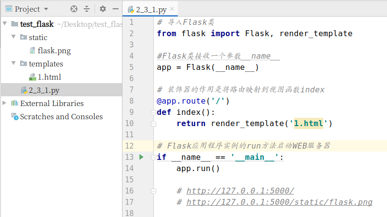
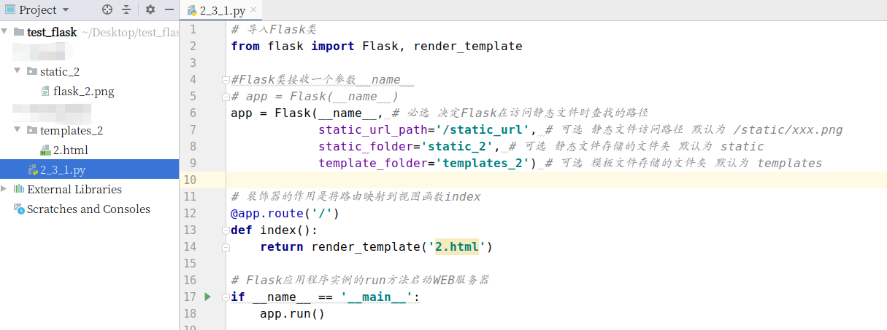
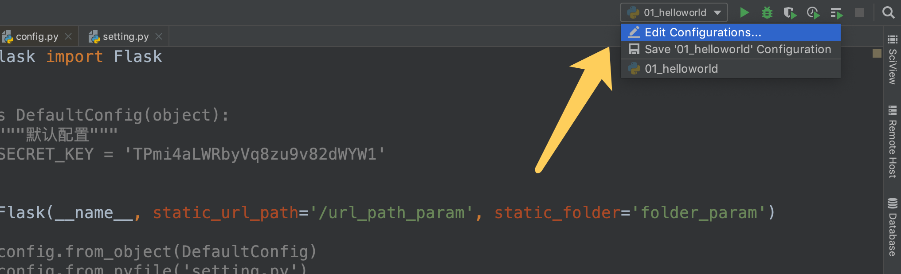
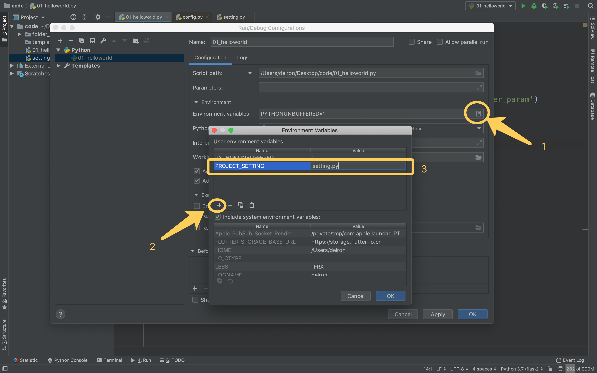

# 参数说明

> - Flask对象的初始化参数
> - 应用程序配置参数
> - app.run()运行参数

[TOC]
<!-- toc -->

## 1. Flask对象初始化参数

> Flask 程序实例在创建的时候，需要默认传入当前 Flask 程序所指定的包(模块)，接下来就来详细查看一下 Flask 应用程序在创建的时候一些需要我们关注的参数

#### 1.1 默认参数情况下的项目路径

> http://127.0.0.1:5000/
>
> http://127.0.0.1:5000/static/flask.png
>
> 

#### 1.2 修改参数的情况下

> http://127.0.0.1:5000/
>
> http://127.0.0.1:5000/static_url/flask_2.png
>
> 

## 2. 应用程序配置参数

>> 对于Flask对象初始化参数仅仅设置的是Flask本身的属性，比如：
>>
>> - Flask从哪里读取静态文件
>> - Flask从哪里读取模板文件
>> - ...
>>
>> 应用程序配置参数设置的是一个Web应用工程的相关信息，比如：
>>
>> - 数据库的连接信息
>> - 日志的配置信息
>> - 自定义的配置信息
>> - ...
>
>- 配置作用
>
>  - 集中管理项目的所有配置信息
>
>- 使用方式
>
>  > Django将所有配置信息都放到了settings.py文件中，而Flask则不同。
>
>  **Flask将配置信息保存到了`app.config`属性中，该属性可以按照字典类型进行操作。**
>
>- 读取
>
>  - `app.config.get(name)`
>  - `app.config[name]`
>
>- 设置
>
>  > 有三种方式：
>  >
>  > - 从配置对象中加载
>  > - 从配置文件中加载
>  > - 从环境变量中加载

### 2.1 从配置类中加载

> `app.config.from_object(配置类)`
>
> 应用场景：作为默认配置写在程序代码中
>
> ```python
> from flask import Flask
> app = Flask(__name__)
> # 配置类
> class DefaultConfig(object):
>     """默认配置"""
>     SECRET_KEY = 'TPmi4aLWRbyVq8zu9v82dWYW1'
> # 从配置对象中加载
> app.config.from_object(DefaultConfig)
> 
> @app.route("/")
> def index():
>     print(app.config['SECRET_KEY'])
>     return app.config['SECRET_KEY']
> 
> if __name__ == '__main__':
>     app.run()
> ```
>
> - 可以继承
>
> ```python
> from flask import Flask
> app = Flask(__name__)
> # 配置类
> class DefaultConfig(object):
>     """默认配置"""
>     SECRET_KEY = 'TPmi4aLWRbyVq8zu9v82dWYW1'
> # 发生继承的配置类
> class DevelopmentConfig(DefaultConfig):
>     DEBUG=True
>     SECRET_KEY_2 = '这是2'
> # 从发生继承的配置类中加载
> app.config.from_object(DevelopmentConfig)
> 
> @app.route("/")
> def index():
>     print(app.config['SECRET_KEY'])
>     print(app.config['SECRET_KEY_2'])
>     return app.config['SECRET_KEY_2']
> 
> if __name__ == '__main__':
>     app.run()
> ```

### 2.2 从配置文件中加载

> `app.config.from_pyfile(配置文件)`
>
> 应用场景：在项目中使用固定的配置文件
>
> - 新建一个配置文件settings.py
>
>   ```python
>   SECRET_KEY = '这是settings.py中的SECRET_KEY'
>   ```
>
> - 在Flask程序文件中
>
>   ```python
>   from flask import Flask
>   app = Flask(__name__)
>   # 从配置文件中加载配置文件，文件中所有变量就加载到app.config字典中
>   app.config.from_pyfile('settings.py')
>   
>   @app.route("/")
>   def index():
>       print(app.config['SECRET_KEY'])
>       return app.config['SECRET_KEY']
>   
>   if __name__ == '__main__':
>       app.run()
>   ```

### 2.3 从环境变量中加载

> **环境变量**（environment variables）一般是指在操作系统中用来指定操作系统运行**环境**的一些参数，如：临时文件夹位置和系统文件夹位置等。 **环境变量**是在操作系统中一个具有特定名字的对象，它包含了一个或者多个应用程序所将使用到的信息。
>
> > 通俗的理解，环境变量就是我们设置在操作系统中，由操作系统代为保存的变量值
>
> - 在Linux系统中设置和读取环境变量的方式如下：
>
>   ```shell
>   export ITCAST=python # 设置 export 变量名=变量值  
>   echo $ITCAST # 读取 echo $变量名  
>   ```
>
> - 在flask中从环境变量中加载配置
>
>   > **Flask使用环境变量加载配置的本质是通过环境变量值找到配置文件**，再读取配置文件的信息.
>   >
>   > 其使用方式为`app.config.from_envvar('环境变量名')` ，**该`环境变量名`值为`配置文件的绝对路径`**
>   >
>   > - 应用场景：
>   >   - 配置文件的地址不固定；
>   >   - 在代码中不想暴露真实的配置文件地址，只在运行代码的服务器上才有真实配置文件的信息。
>
>   - 先在终端中执行如下命令
>
>     > ```shell
>     > export PROJECT_SETTING='.../settings.py'
>     > # /home/worker/Desktop/test_flask/settings.py
>     > # 不能~/Desktop/test_flask/settings.py
>     > ```
>
>   - 再运行如下代码，**运行方式：在终端中python xxx.py运行！**
>
>     > ```shell
>     > from flask import Flask
>     > app = Flask(__name__)
>     > 
>     > # silent=True 安静的处理，即时没有值也让Flask正常的运行下去
>     > app.config.from_envvar('PROJECT_SETTING', silent=True)
>     > 
>     > @app.route("/")
>     > def index():
>     >     print(app.config['SECRET_KEY'])
>     >     return app.config['SECRET_KEY']
>     > 
>     > if __name__ == '__main__':
>     >     app.run()
>     > ```
>
>   - 关于`silent`参数的说明：
>
>     > 表示系统环境变量中没有设置相应值时是否抛出异常
>     >
>     > - False 表示不安静的处理，没有值时报错通知，默认为False
>     > - True 表示安静的处理，即时没有值也让Flask正常的运行下去
>
>     
>
> - Pycharm运行时设置环境变量的方式
>
>   > 按下图设置完毕后，点击`Edit Configurations...`右边的绿色运行按钮
>   >
>   > 
>   >
>   > 

## 3. app.run 参数

> 可以指定运行的主机IP地址，端口，是否开启调试模式
>
> ```python
> ......
> if __name__ == '__main__':
> 	app.run(host="0.0.0.0", port=5000, debug=True)
> ```
>
> 关于DEBUG调试模式
>
> - 程序代码修改后可以自动重启服务器
> - 在服务器出现相关错误的时候可以直接将错误信息返回到前端进行展示

## 4. 项目中的常用工厂模式创建Flask_app

> 使用工厂模式创建Flask app，并结合使用配置对象与环境变量加载配置
>
> - 使用配置对象加载默认配置
> - 使用环境变量加载不想出现在代码中的敏感配置信息
>
> ```python
> from flask import Flask
> 
> class DefaultConfig(object):
>     """默认配置"""
>     SECRET_KEY = 'itcast1'
> 
> class DevelopmentConfig(DefaultConfig):
>     DEBUG = True # 相当于app.run(debug=True)
> 
> # 创建flask app的函数
> def create_flask_app(config):
>     """
>     创建Flask应用
>     :param config: 配置类
>     :return: Flask应用对象
>     """
>     app = Flask(__name__)
>     # 从配置类加载配置信息
>     app.config.from_object(config)
> 
>     # 从环境变量指向的配置文件中读取的配置信息会覆盖掉从配置对象中加载的同名参数
>     # app.config.from_envvar("PROJECT_SETTING", silent=True)
>     return app
> 
> # 创建flask app
> app = create_flask_app(DevelopmentConfig)
> 
> @app.route("/")
> def index():
>     print(app.config['SECRET_KEY'])
>     return "hello world"
> 
> if __name__ == '__main__':
>     app.run()
> ```
