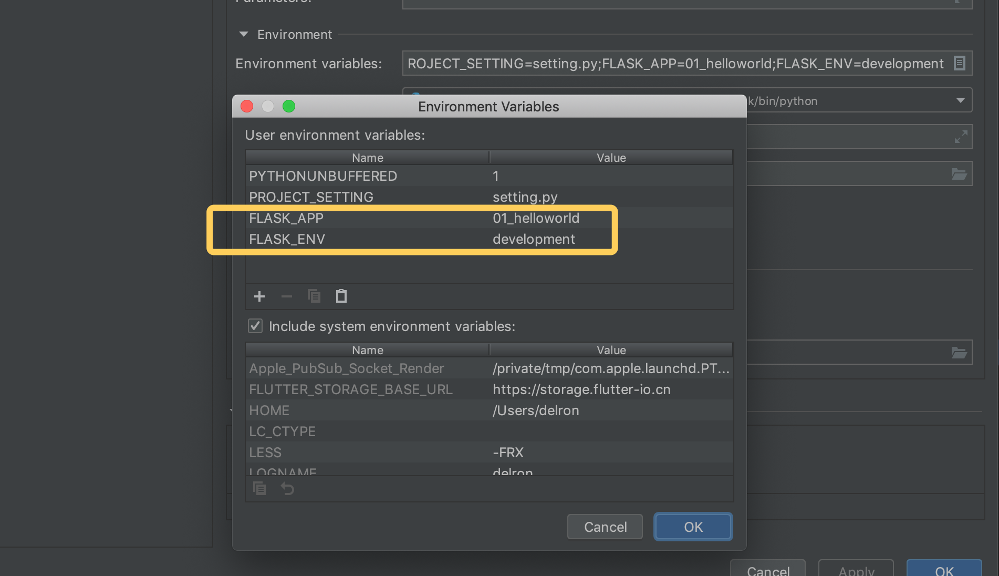
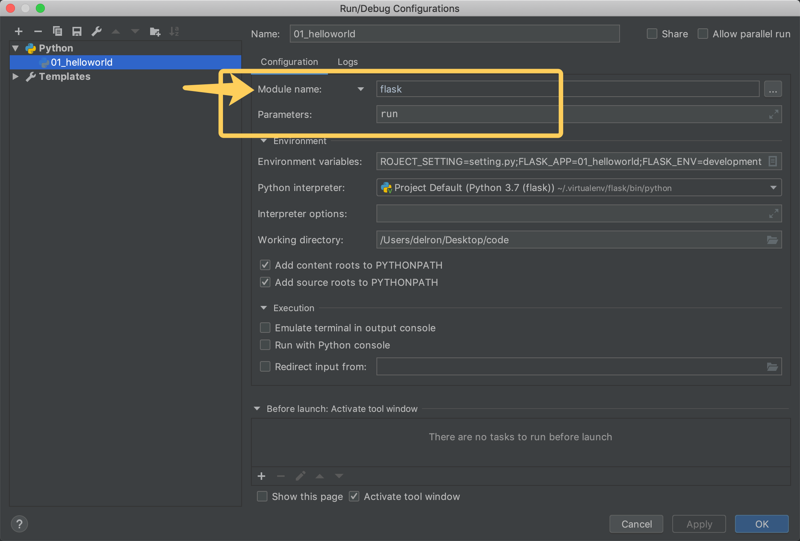
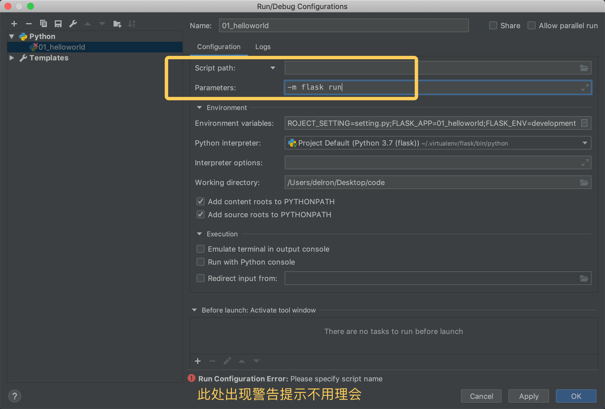

# 开发服务器启动方式

> 在flask1.0版本之后，Flask新增了flask app的启动方式，在命令行中输入`flask run`启动。
>
> ```python
> from flask import Flask
> app = Flask(__name__)
> 
> @app.route('/')
> def index():
>     return 'Hello World'
> 
> # 程序中可以不用再写app.run()
> # 在终端中设置FLASK_APP环境变量后
> # 以 flask run -p port 启动程序
> ```

[TOC]
<!-- toc -->

## 1. 终端启动

> ```shell
> export FLASK_APP='./xxx.py'
> flask run -h 0.0.0.0 -p 5000
> ```

### 1.1 说明

> - 环境变量 FLASK_APP 指明flask的启动实例
>
> - `flask run -h 0.0.0.0 -p 5000` 绑定地址 端口
>
> - `flask run --help`获取帮助
>
> - 生产模式与开发模式的控制
>
>   通过`FLASK_ENV`环境变量指明
>
>   - `export FLASK_ENV=production` 运行在生产模式，未指明则默认为此方式
>   - `export FLASK_ENV=development` 运行在开发模式

### 1.2 也可以以 python -m flask run 的方式运行

> ```shell
> export FLASK_APP=helloworld
> python -m flask run
> ```

## 2. Pycharm启动

### 2.1 新版pycharm设置

> 如下图设置好环境变量后，就可以点击运行按钮了
>
> 
>
> 

### 2.2 旧版本Pycharm设置

> 

