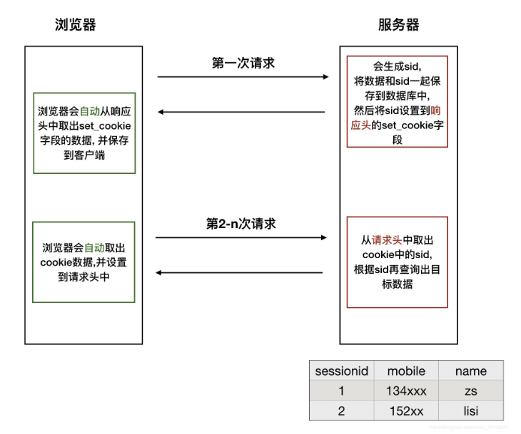

# Cookie与Session

[TOC]
<!-- toc -->

## 1. 关于cookie与session

### 1.1 cookie和session在请求过程中的交互过程

> 

### 1.2 cookie

> - 一旦保存了cookie数据，访问该网站的任意路由时，cookie数据都会放在请求头中被发送
> - cookie数据智慧发送给生成该cookie网站（同源策略）
> - cookie在前端可以通过js操作，浏览器本身能够执行js

### 1.3 session

> - session依赖cookie机制
> - 传统的session机制和flask session机制区别
>   - 传统session把信息存储在服务器
>   - flask session把信息存储在客户端
> - flask-session模块可以实现传统session机制

## 2. 在flask中操作Cookie

### 2.1 运行下边的代码

> ```python
> from flask import Flask, make_response, request
> 
> app = Flask(__name__)
> 
> 
> @app.route('/set_cookie')
> def set_cookie():
>     resp = make_response('set cookie ok')
>     # 设置cookie： key, value, max_age(过期时间，秒，默认浏览器关闭过期，但现在很多浏览器控制关闭也不过期)
>     resp.set_cookie('username', 'itcast', max_age=3600)
>     return resp
> 
> @app.route('/get_cookie')
> def get_cookie():
>     # 读取请求中cookie的特定key的值
>     resp_str = request.cookies.get('username')
>     return resp_str
> 
> @app.route('/delete_cookie')
> def delete_cookie():
>     response = make_response('cookie is deleted.')
>     # 删除cookie中的某个key
>     response.delete_cookie('username')
>     return response
> 
> if __name__ == '__main__':
>     app.run(debug=True)
> ```

### 2.2 用浏览器访问查看效果

#### 2.2.1 `/set_cookie`

> 

#### 2.2.2 `/get_cookie`

> 

#### 2.2.3 `/delete_cooke`

> 

## 3. 在flask中操作Session

### 3.1 运行下边的代码

> 在flask中需要先设置SECRET_KEY
>
> ```python
> from datetime import timedelta
> from flask import Flask, session
> 
> app = Flask(__name__)
> 
> # 在flask中需要先设置SECRET_KEY，才可以使用session
> class DefaultConfig(object):
>     SECRET_KEY = 'fih9fh9eh9gh2'
> app.config.from_object(DefaultConfig)
> 
> @app.route('/set_session')
> def set_session():
>     session['username'] = 'itcast' # 设置session的key value
>     # session.permanent = True # 设置session永久有效
>     app.permanent_session_lifetime = timedelta(seconds=100) # 设置session过期时间
>     # session的默认过期时间是31天
>     return 'set session ok'
> 
> @app.route('/get_session')
> def get_session():
>     username = session.get('username') # 获取session中某个key的值
>     return 'get session username {}'.format(username)
> 
> @app.route('/delete_session')
> def delete_session():
>     _ = session.pop('username', None) # 弹出指定key的值，如果取不出，则返回设置的默认值
>     session.clear() # 删除全部session信息
>     return 'session is deleted.'
> 
> @app.route('/check_session')
> def check_session():
>     return session.pop('username', 'session is deleted.')
> 
> if __name__ == '__main__':
>     app.run(debug=True)
> ```

### 3.2 打开浏览器测试

#### 3.2.1 `/set_session`

> 

#### 3.2.2 `/get_session`

> 

#### 3.2.3 `/delete_session`

> 

#### 3.2.4 `/check_session`

> 
>
> 

## 4. 思考:在flask中,cookie和session区别和联系?

> - 存储的位置都是在客户端浏览器
> - session基于客户端的cookie来存储
> - session基于flask框架自身的功能自行对信息进行加密


