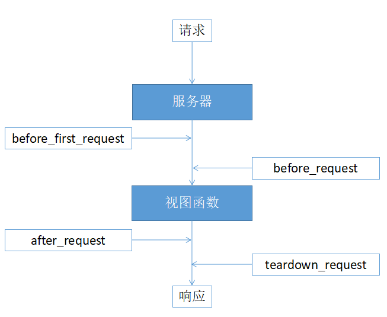

# 请求钩子

> 在客户端和服务器交互的过程中，有些准备工作或扫尾工作需要处理，比如：
>
> - 在请求开始时，建立数据库连接；
> - 在请求开始时，根据需求进行权限校验；
> - 在请求结束时，指定数据的交互格式；
>
> 为了让每个视图函数避免编写重复功能的代码，Flask提供了通用设施的功能，即**请求钩子**。

[TOC]
<!-- toc -->

## 1. 认识请求钩子

> 请求钩子是通过装饰器的形式实现，支持如下四种请求钩子：
>
> - before_first_request
>
>   - 整个进程在处理第一个请求前执行
>
> - before_request
>
>   - 在每次请求前执行
>   - 如果在执行before_request时返回了一个响应，视图函数将不再被调用
>
> - after_request
>
>   - 如果没有抛出错误，在每次请求后执行
>   - 接受一个固定参数：视图函数返回的响应对象
>   - 在此函数中可以对响应值在返回之前做最后一步修改处理
>   - 在after_request处理的最后，必须将传入的响应对象返回
>
> - teardown_request：
>
>   - 在每次请求后执行
>   - 接受一个参数：错误信息，如果有相关错误抛出
>
>   
>
>   

## 2. 代码实现

> ```python
> from flask import Flask
> 
> app = Flask(__name__)
> 
> @app.route('/')
> def index():
>     print('*** [执行了视图]')
>     a = 1 / 0
>     return 'index'
> 
> # 在第一次请求之前调用，可以在此方法内部做一些初始化操作
> @app.before_first_request
> def before_first_request():
>     print('*** [before_first_request] flask app进程开启后，收到第一个请求时执行，此时请求还没有进入视图函数')
> 
> # 另一种设置的语法
> def before_request():
>     print('*** [before_request] 每次“请求之前”调用，一般完成一些请求准备工作，如参数校验，黑名单过滤，数据统计等')
> app.before_request(before_request) # 通过app对象直接注册钩子函数
> 
> # 在执行完视图函数之后会调用，并且会把视图函数所生成的响应传入,可以在此方法中对响应做最后一步统一的处理
> @app.after_request
> def after_request(response): # 必须定义形参来接受响应对象
>     print('*** [after_request] 在执行完视图函数之后会调用，并且会把视图函数所生成的响应传入,可以在此方法中对响应做最后一步统一的处理')
>     return response # 对响应内容加工后，必须返回相应对象
> 
> """teardown_request必须关闭调试模式才能生效！"""
> # 请每一次请求之后都会调用，无论是否出现异常都会执行，必须接受参数是服务器出现的错误信息
> @app.teardown_request
> def teardown_request(e): # 如果没有错误信息， e=None
>     ret = '*** [teardown_request] 请每一次请求之后都会调用，无论是否出现异常都会执行，必须接受参数是服务器出现的错误信息 {}'.format(e)
>     print(ret)
>     return ret
> 
> if __name__ == '__main__':
>     app.run(debug=False)
> ```
>
> - 输出打印：
>
> ```bash
> *** [before_first_request] flask app进程开启后，收到第一个请求时执行，此时请求还没有进入视图函数
> *** [before_request] 每次“请求之前”调用，一般完成一些请求准备工作，如参数校验，黑名单过滤，数据统计等
> *** [执行了视图]
> *** [after_request] 在执行完视图函数之后会调用，并且会把视图函数所生成的响应传入,可以在此方法中对响应做最后一步统一的处理
> *** [teardown_request] 请每一次请求之后都会调用，无论是否出现异常都会执行，必须接受参数是服务器出现的错误信息 division by zero
> ```

