# Pycharm远程开发

可以在Windows、mac、ubuntu中使用Pycharm编写代码，而代码的调试运行可以使用远程服务器中的python解释器；并设置pycharm运行代码的配置。

[TOC]

<!-- toc -->

### 1. 配置远程python解释器

在本地创建好工程项目（或从git上clone下代码）后，用Pycharm打开：

1. 打开「Tools」设置 「Deployment」

    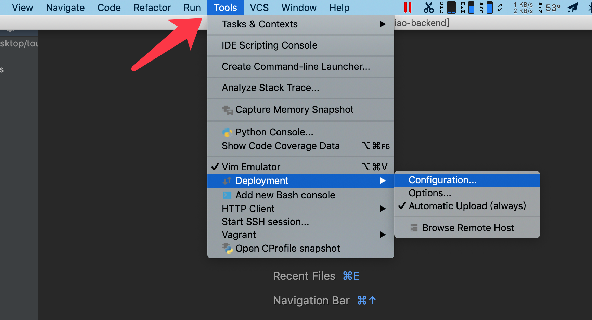

2. 选择SFTP

    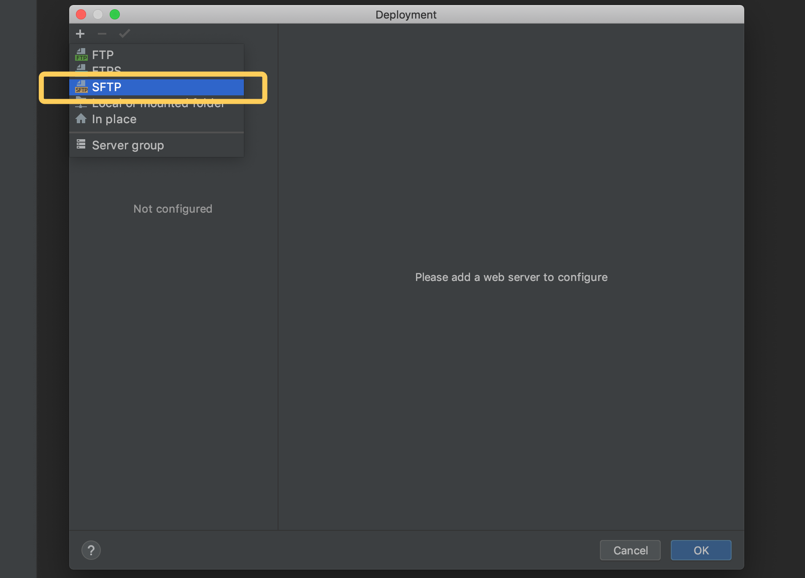

3. 设置服务器名字
    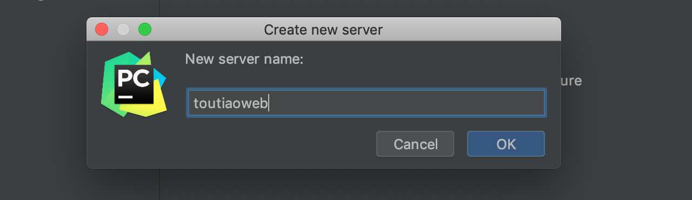

4. 设置服务器信息
    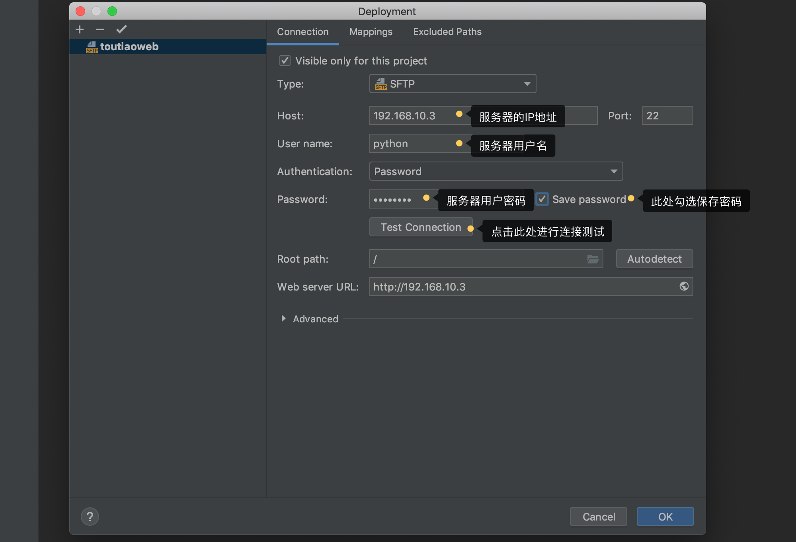

5. 测试服务器连接是否可用

    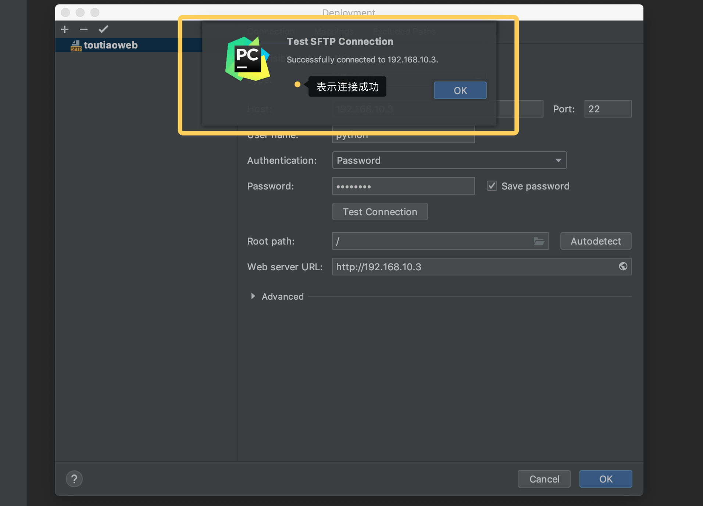

6. 设置上传代码的目录映射

    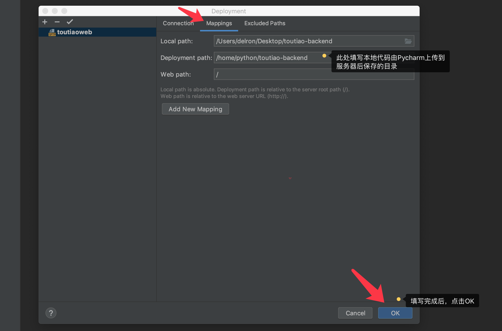

7. 打开设置，设置远程Python解释器

    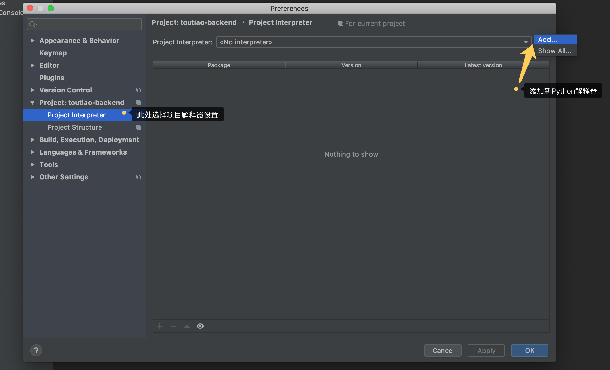

8. 选择已存在的服务器设置

    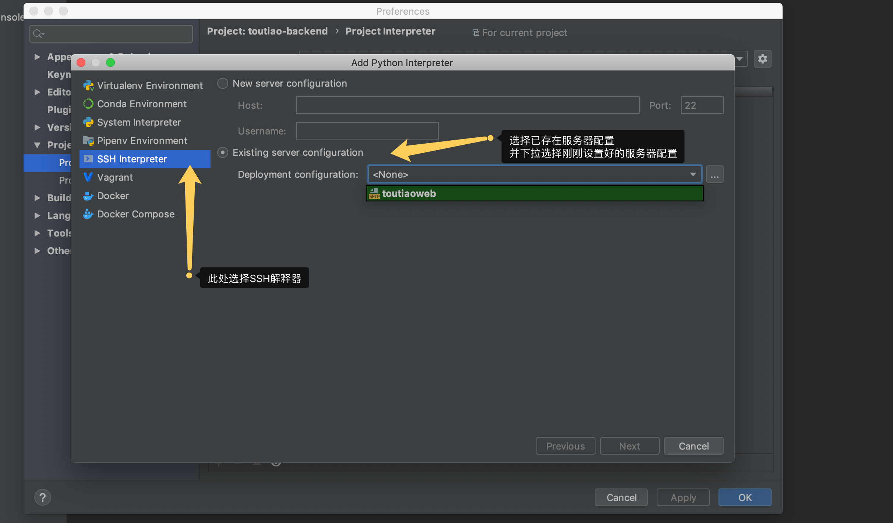

9. 选择Create 复制服务器设置到解释器中

    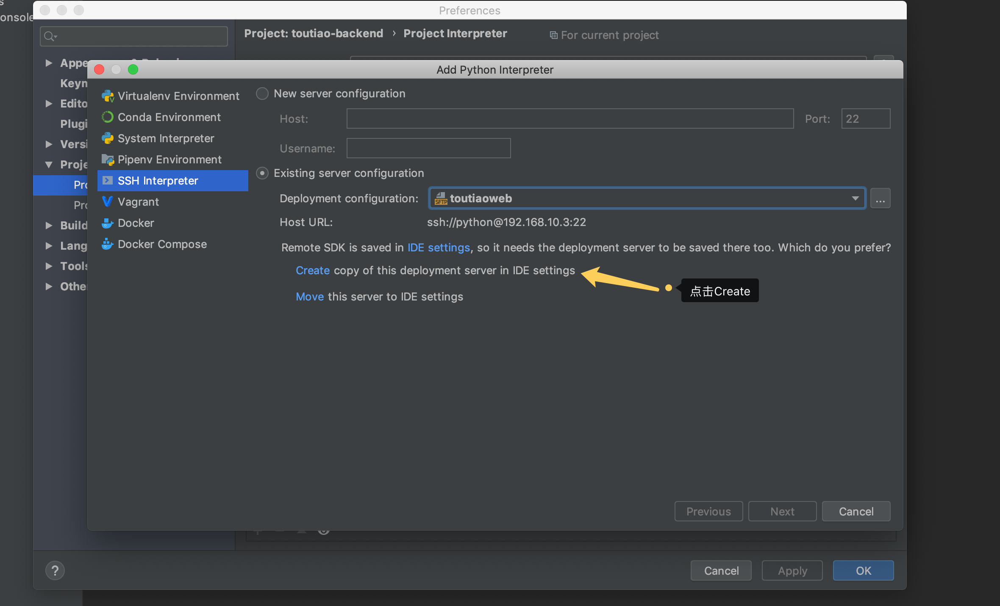

    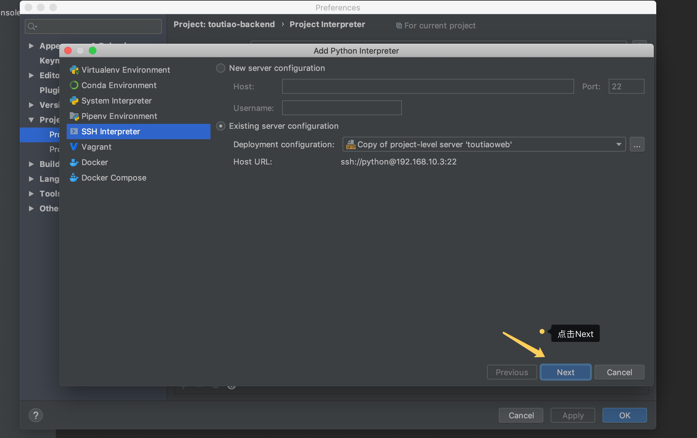

10. 选择远程服务器中虚拟环境里的解释器

   ```shell
/home/python/.virtualenvs/toutiao/bin/python
   ```

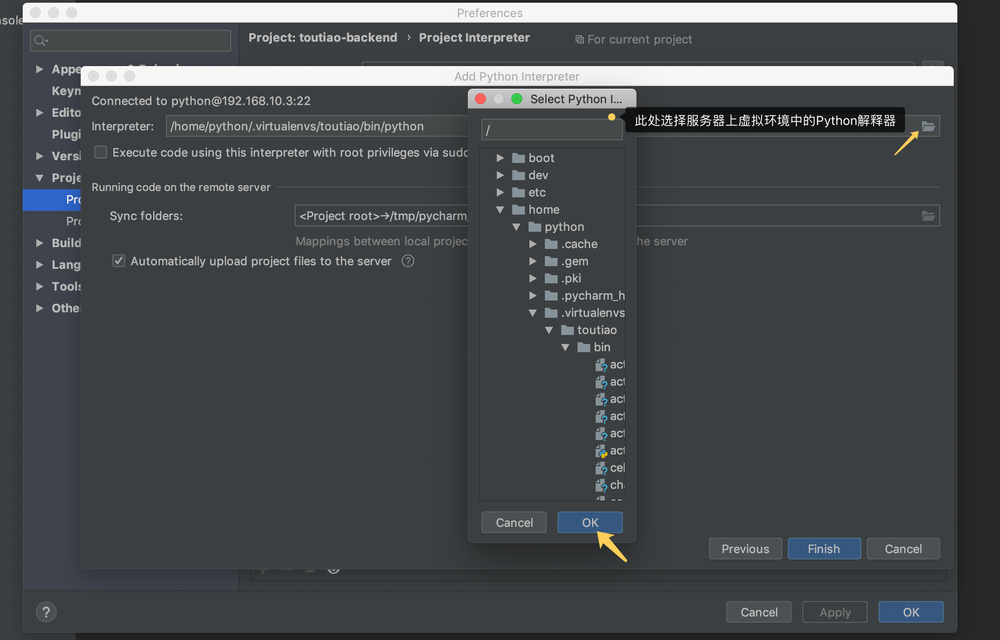

11. 设置远程服务器运行代码的目录映射

   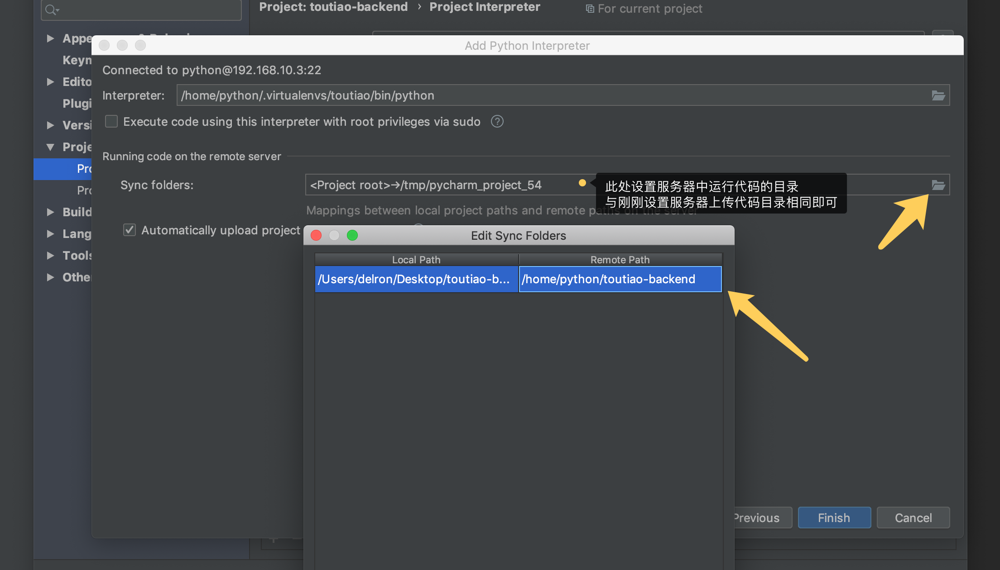

12. 若Pycharm不能自动上传代码，可勾选Automatic Upload

   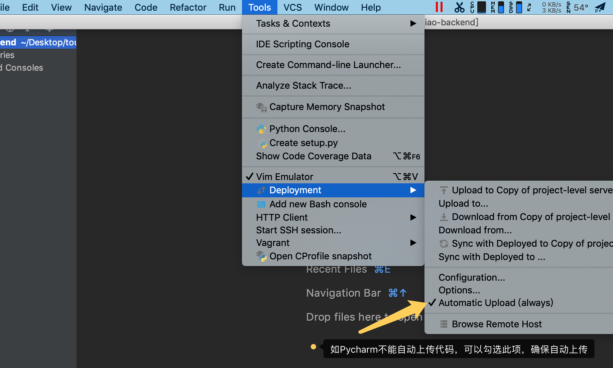

### 2. pycharm设置自定义的包模块

> 项目启动入口文件一般都是项目路径子一级文件，但很多时候有调试测试运行局部代码的场景，且调试测试的启动文件不是项目路径的子一级文件，那么在代码中可以声明的同时，Pycharm中也可以设置。

13. 设置项目路径下common文件夹添加到导包路径中

    > - 在pycharm中打开`项目路径下/toutiao/main.py`文件发现
    >
    > 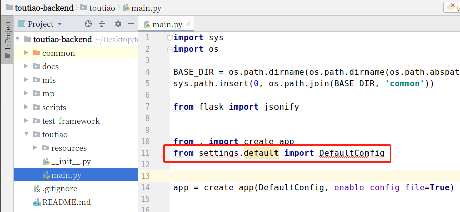
    >
    > - 解决办法：
    >
    > 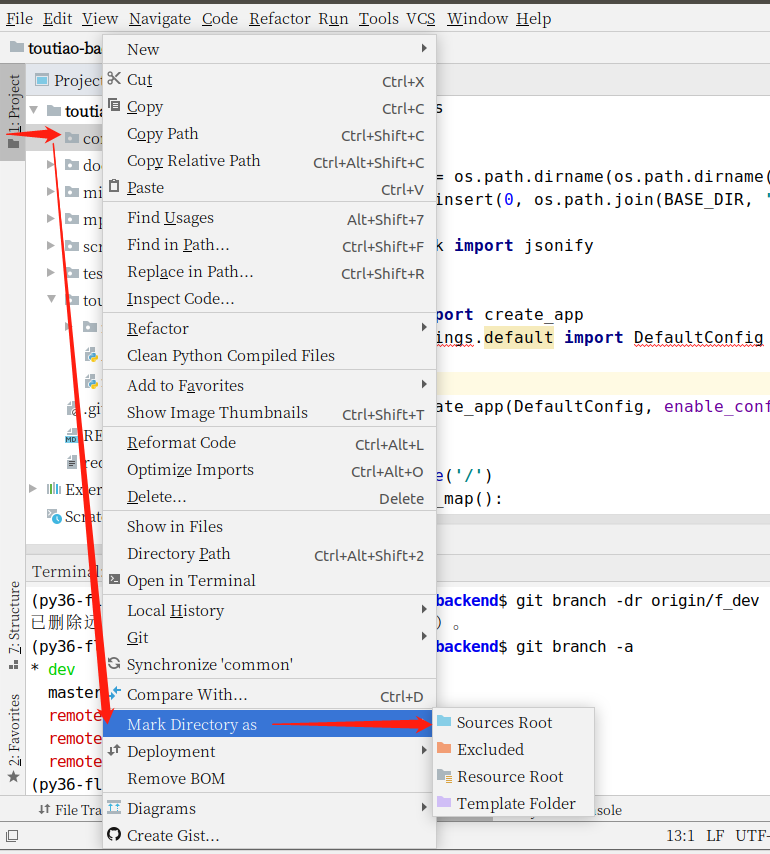

### 3. 设置pycharm中启动代码的环境

14. 如图按顺序点击进入运行配置界面


15. 如图修改配置后点击`OK`按钮

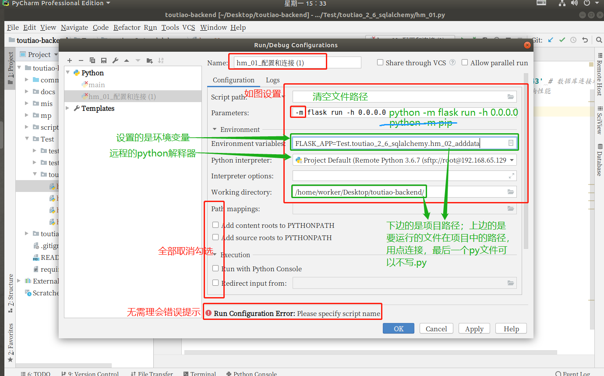

16. 点击如中绿色运行按钮，运行代码

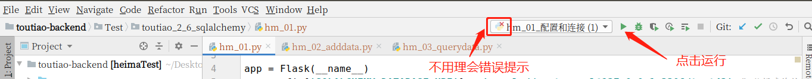


**注意，设置后Pycharm要加载环境，需要花费一定时间（只在配置后第一次使用发生）**