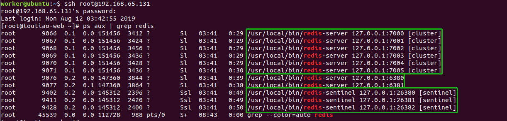

# Redis

[TOC]

<!-- toc -->

## 1. Redis回顾

### 1.1 redis数据类型及命令

#### 1.1.1 基本命令

> - `redis-cli -h 127.0.0.1 -p 6379`进入redis-client命令行客户端
> - `select 0`选择第一个库，redis默认0-15共计16个库
> - `keys *` 查看所有键
> - `flushdb`清空当前数据库
> - `exit`退出redis命令行客户端

#### 1.1.2 键命令 

> 适用于所有的类型
>
> - `type key`查看键值的类型
> - `del key` 删除数据
> - `exists key` 判断数据是否存在
> - `expire key 10 `设置10秒后过期
> - `persist key`删除过期时间
> - `ttl key`获取剩余时间
> - `move key 1` 将当前的数据库的key和值移动到数据库1，目标库有，则不能移动

#### 1.1.3 String

> 记录字符串/整数/浮点数
>
> - `set key value`  添加/修改数据
> - `get key`  获取数据
> - `mset k1 v1 k2 v2` 添加多个数据
> - `mget k1 k2` 获取多个数据
> - `incr key `计数加1
> - `decr key` 计数减1
> - `incrby key n`计数加n
> - `setnx key value`不存在就插入
> - `setex key expiry value`写入数据并设置过期时间，单位秒

#### 1.1.4 hash 

> 类似`字典`的结构
>
> - `hset key name value`  向key添加字段name，name的值为value
> - `hget key name` 获取key字段name的值
> - `hmset key name1 v1 name2 v2` 添加多个字段
> - `hmget key name1 name2`  获取多个字段
> - `hdel key name` 删除字段name
> - `hgetall key` 返回key的值

#### 1.1.5 list 

> 是一个`双向链表`
>
> - `lpush key v1 v2 v3`  从左侧追加元素
>
> - `rpush key v1 v2 v3` 从右侧追加元素
>
> - `lrange key 0 -1`  从左侧遍历元素，0和-1是下标范围，表示全部
>
> - `lset key n v` 从左侧修改元素，设置下标n的值为v
>
> - `lpop key` 从左侧删除元素，并返回删除的元素（弹出）
>
> - `rpop key`  从右侧删除元素，并返回删除的元素（弹出）
>
> - `llen key` 元素个数
>
> - `ltrim key start stop`  裁切列表，只保留列表中start到stop下标的值
>
>   > ```shell
>   > # mylist = [1, 2, 3, 4, 5]
>   > ltrim mylist 0 2 # 只保留list中下标0到下标2的值
>   > # mylist = [1, 2, 3]
>   > ```

#### 1.1.6 set

> `无序`集合  无序+去重
>
> - `sadd key v1 v2 v3` 添加元素
> - `smembers key`  遍历元素
> - `sismember key v`  判断是否包含元素v
> - `srem key v1 v2`  删除元素
> - `scard key` 元素个数

#### 1.1.7 zset

> `有序`集合, 按照分数(score)进行排序，值不能重复，但分数可以重复
>
> - `zadd key s1 v1 s2 v2` 添加/修改元素
> - `zrange key 0 -1 withscores`  按下标遍历元素(按分数从小到大)，并显示分数
> - `zrevrange key 0 -1`   按下标反向遍历元素(从大到小)，不显示分数
> - `zrangebyscore key m n withscores` 遍历指定分数范围（m--n）的元素，并显示分数
> - `zscore key v` 查询key中元素v的分数
> - `zrem key v1 v2`  删除元素
> - `zincrby key n v`  key中元素v的分数计数加n，key不存在分数设为1
> - `zcard key `元素个数

### 1.2 python模块操作redis

> - 安装 `pip install redis`
>
> - 操作
>
>   > ```python
>   > from redis import StrictRedis
>   > # 创建redis连接对象 db默认为0 decode_responses=True表示对返回的结果进行decode，即utf8编码
>   > redis_cli = StrictRedis(host='127.0.0.1', port=6379, db=0, decode_responses=True)
>   > # 操作方法和redis原生命令一样
>   > redis_cli.set('key1', 'value1')
>   > print(redis_cli.get('key1'))
>   > ```

## 2. Redis事务

### 2.1 Redis事务基本指令

> - Redis提供了有限的事务支持：可以保证一组操作原子执行不被打断，但是如果执行中出现错误，Redis不提供回滚支持。
>
> - 语法
>
>   > - MULTI  
>   >   - 开启事务, 后续的命令会被加入到同一个事务中
>   >   - 事务中的操作会发给服务端, 但是不会立即执行, 而是放到了该事务的对应的一个队列中
>   > - EXEC  
>   >   - 执行EXEC后, 事务中的命令才会被执行
>   >   - 事务中的命令出现错误时, `不会回滚也不会停止事务`, 而是继续执行
>   > - DISCARD
>   >   - 退出事务, 事务队列会清空, 客户端退出事务状态
>
> - 总结：
>
>   ```shell
>   MULTI  # 开启事务
>   GET mykey
>   SET mykey 10  
>   EXEC  # 执行
>   ```
>
>   - 使用multi开启事务后，操作的指令并未立即执行，而是被redis记录在队列中，等待一起执行。当执行exec命令后，开始执行事务指令，最终得到每条指令的结果。
>   - 如果事务中出现了错误，事务并不会终止执行，而是只会记录下这条错误的信息，并继续执行后面的指令。所以事务中出错不会影响后续指令的执行。
>
> - Python客户端操作事务
>
>   > 在Redis的Python 客户端库redis-py中，提供了pipeline (管道)，该工具的作用是：
>   >
>   > - 在客户端统一收集操作指令
>   > - 补充上multi和exec指令，当作一个事务发送到redis服务器执行
>   >
>   > ```python
>   > from redis import StrictRedis
>   > r = StrictRedis.from_url('redis://127.0.0.1:6381/0') # from_url函数传入redis的uri
>   > p = r.pipeline()
>   > p.set('a', 100)
>   > p.set('b', 200)
>   > p.get('a')
>   > p.get('b')
>   > ret = p.execute()
>   > print(ret) #  [True, True, b'100', b'200']
>   > ```

### 2.2 Redis事务watch监视指令 

> watch命令本质是redis实现的乐观锁，若在构建的redis事务在执行时依赖某些值，可以使用watch对数据值进行监视。
>
> - 机制
>
>   > - 事务开启前, 设置对数据的监听,  EXEC时, 如果发现数据发生过修改, 事务会自动取消(DISCARD)
>   > - 事务EXEC后, 无论成败, 监听会被移除
>   >
>   > ```shell
>   > set a 1  
>   > watch a # 监视a的值
>   > set a 2
>   > multi
>   > get a
>   > exec # watch的a的值在exec时发生了改变，所以取消了事务，此时返回nil
>   > ```
>   >
>   > - **注意：Redis Cluster 集群不支持事务**
>
> - Python客户端操作watch事务
>
> ````python
> from redis import StrictRedis, WatchError
> cli = StrictRedis(host='127.0.0.1', port=6379)
> cli.set('key1', 'hahaha') # 设置测试的kv
> # 创建事务管道对象
> p = cli.pipeline()
> try:
>     # 监视key的值
>     p.watch('key1')
>     print(p.get('key1')) # 可以使用管道对象立刻取出值
>     cli.set('key1', 'heiheihei') # 模拟watch的数据发生改变
>     print(p.get('key1')) # 读操作是立刻执行的
>     p.multi() # 开启事务管道
>     p.get('key1') # 事务管道添加了命令
>     ret = p.execute() # 执行并返回结果
>     print(ret)
> except WatchError as e:
>     print(e)
> ````

## 3. Redis高可用

> 为了保证redis的高可用，redis提供了三种方式
>
> - 持久化 ：单机保障
> - 主从同步+Sentinel哨兵机制 ： 
>   - 主从：故障切换，主死从替
>   - 哨兵：监控主服务状态，投票选择新的主节点
> - 分布式集群 ：均衡负载

### 3.1 redis持久化 

> redis可以将数据写入到磁盘中，在停机或宕机后，再次启动redis时，将磁盘中的备份数据加载到内存中恢复使用，这是redis的持久化。持久化有RDB和AOF两种机制。

#### 3.1.1 RDB 快照存储持久化 

> - 将`内存中的所有数据`完整的保存到硬盘中，**redis默认开启RDB 快照存储**
>
> - 机制
>
>   - fork出一个`子进程`,专门进行数据持久化, **将内存中所有数据保存到单个rdb文件中**(默认为dump.rdb)
>   - redis重启后, 会加载rdb文件中的数据到内存中
>
> - 触发方式：`定期触发`和`手动触发`
>
>   > - 定期触发：配置中设置`自动持久化策略`，配置如下
>   >
>   > ```shell
>   > save 900 1 # 多久执行一次自动快照操作 900秒（15分钟）内有1个更改, 则持久化一次
>   > save 300 10 # 多久执行一次自动快照操作 300秒（5分钟）内有10个更改, 也持久化一次
>   > save 60 10000  # 多久执行一次自动快照操作 60秒内如果更新了10000次, 也持久化一次
>   > stop-writes-on-bgsave-error no  # 创建快照失败后,是否继续执行写命令
>   > rdbcompression yes  # 是否对快照文件进行压缩
>   > dbfilename dump.rdb  # 快照文件命名
>   > dir ./ # 快照文件保存的位置
>   > #save   # 打开注释则关闭RDB机制
>   > ```
>   >
>   > - 手动触发：`SAVE` | `BGSAVE` | `SHUTDOWN` (前提是设置了自动持久化策略)
>
> - 优缺点
>
>   - 优点
>     - 方便数据备份: 由于保存到`单独的文件`中, 易于数据备份 (可以使用定时任务, 定时将文件发送给数据备份中心)
>     - 节省资源提升性能:  子进程单独完成持久化操作, 父进程不参与IO操作, 最大化redis性能 
>     - 恢复速度快：恢复大量数据时, 速度优于 AOF
>   - 缺点
>     - `不是实时保存数据`, 如果redis意外停止工作(如电源断电等), 则可能会丢失一段时间的数据
>     - 数据量大时, 创建单独完成持久化操作的子进程会比较慢（fork动作）, 持久化时使redis响应速度变慢

#### 3.1.2 AOF 追加文件持久化

> - redis可以**将执行的所有指令追加记录到文件中**持久化存储，这是redis的另一种持久化机制。redis**默认未开启AOF机制**。
>
> - 机制
>
>   - 主线程将 `写命令` 追加到aof_buf(缓冲区)中, 根据使用的策略不同, `子线程` 将缓存区的命令写入到aof文件中 (注意是redis服务进程的子线程)
>   - 当redis重启时, 会重新执行aof文件中的命令来恢复数据
>   - 如果同时开启了 **RDB**, 则优先使用 **AOF**
>
> - 配置
>
>   ```shell
>   appendonly no  # 是否开启AOF机制
>   # appendfsync always  # 每个操作都写到磁盘中
>   # appendfsync no  # 由操作系统决定写入磁盘的时机
>   appendfsync everysec  # 每秒写一次磁盘，默认
>   no-appendfsync-on-rewirete no  # 重写aof文件时是否执行同步操作
>   auto-aof-rewrite-percentage 100  # 多久执行一次aof重写, 当aof文件的体积比上一次重写后的aof文件大了一倍时
>   auto-aof-rewrite-min-size 64mb  # 多久执行一次aof重写,当aof文件体积大于64mb时
>   appendfilename appendonly.aof  # aof文件名
>   dir ./  # aof文件保存的位置(和rdb文件共享该配置)
>   ```
>
> - 优缺点
>
>   - 优点
>     - `更可靠`  默认每秒同步一次操作, 最多丢失一秒数据
>       - 提供了三种策略, 还可以不同步/每次写同步
>     - 可以进行`文件重写`, 以避免AOF文件过大
>   - 缺点
>     - 随着时间的流逝，AOF文件会变得很大，相同数据集, AOF文件比RDB`体积大`, `恢复速度慢`
>     - 除非是不同步情况, 否则普遍要比RDB `速度慢`
>
> - 关于AOF入文件修复、重写/压缩
>
>   > - 文件修复
>   >
>   >   - 如果AOF出错 (磁盘满了/写入中途宕机等), 则redis重启时会拒绝使用该AOF文件
>   >
>   >   - 修复步骤
>   >
>   >     - 首先备份AOF文件
>   >     - 使用redis-check-aof工具进行修复 (一般会删除末尾无法恢复的命令)
>   >     - 重启redis服务器, 自动载入修复后的AOF文件, 进行数据恢复
>   >
>   >     ```shell
>   >     redis-check-aof –fix
>   >     # 可选操作: 使用 diff -u 对比修复后的 AOF 文件和原始 AOF 文件的备份，查看两个文件之间的不同之处。
>   >     ```
>   >
>   > - 文件重写/压缩
>   >
>   >   > - 用户可以向Redis发送`BGREWRITEAOF`命令，这个命令会`通过移除AOF文件中的冗余命令`来重写（rewrite）AOF文件，使AOF文件的体积变得尽可能地小
>   >   >   - AOF 提供了重写/压缩机制(优化命令),  以避免AOF文件过大
>   >   >   - fork子进程来完成 AOF 重写
>   >   > - 也可以通过设置`auto-aof-rewrite-percentage`选项和`auto-aof-rewrite-min-size`选项来自动执行`BGREWRITEAOF`

#### 3.1.3 RDB和AOF的综合使用

> ##### redis允许我们同时使用两种机制，通常情况下我们会设置AOF机制为everysec 每秒写入，则最坏仅会丢失一秒内的数据。

### 3.2 redis主从以及哨兵

#### 3.2.1 redis数据库主从

> - 作用
>
>   - 数据备份
>   - 读写分离
>
> - 特点
>
>   - **只能一主多从**
>
> - 配置
>
>   > - `/usr/local/redis/`：ubuntu的redis安装目录, 其中包含了redis和sentinal的配置模板
>   >
>   > - ubuntu中 启动/重启/停止 默认的redis服务
>   >
>   >   ```shell
>   >   /etc/init.d/redis-server start/restart/stop
>   >   ```
>
>   ```shell
>   # 主从数据库分别配置ip/端口
>   bind 127.0.0.1
>   port 6379
>   # 从数据库配置slaveof参数
>   slaveof 127.0.0.1 6379 # slaveof 主库ip 主库端口
>   # 以下两条连起来: 当至少有2个从数据库可以进行复制并且响应延迟都在10秒之内时, 主数据库才允许写操作
>   min-slaves-to-write 2  
>   min-slaves-max-lag 10  
>   ```

#### 3.2.2 Sentinel 哨兵

> redis提供的哨兵是用来看护redis实例进程的，可以自动进行故障转移
>
> - 作用
>
>   - 监控redis服务器的运行状态（心跳机制）, 可以进行`自动故障转移`(failover), 实现高可用
>     - 独立的进程, 每台redis服务器应该至少配置一个哨兵程序
>     - 监控redis主服务器的运行状态
>     - 出现故障后可以向管理员/其他程序发出通知 
>     - 针对故障,可以进行自动转移, 并向客户端提供新的访问地址
>   - 与 `redis主从数据库` 配合使用
>
> - 哨兵工作机制
>
>   > - 流言协议
>   >   - 当某个哨兵程序ping 发现监视的主服务器下线后(心跳检测), 会向监听该服务器的其他哨兵询问, 是否确认主服务器下线, 当 **确认的哨兵数量** 达到要求(配置文件中设置)后, 会确认主服务器下线(客观下线), 然后进入投票环节
>   > - 投票协议  
>   >   - 当确认主服务器客观下线后, 哨兵会通过 投票的方式 来授权其中一个哨兵主导故障转移处理
>   >   - 只有在 **大多数哨兵都参加投票** 的前提下, 才会进行授权, 比如有5个哨兵, 则需要至少3个哨兵投票才可能授权
>   >   - 目的是避免出现错误的故障迁移   
>
> - 相关配置 (sentinel.conf)
>
>   ```shell
>   bind 127.0.0.1  # 哨兵绑定的ip
>   port 26381  # 哨兵监听的端口号，一般都是redis端口号前边加1, redis客户端需要访问哨兵的ip和端口号
>   daemonize yes # 后台运行
>   logfile /var/log/redis-sentinel.log # 日志文件路径
>   sentinel monitor mymaster 127.0.0.1 6380 2  # 设置哨兵  (主数据库别名 主数据库ip 主数据库端口 确认投票最小哨兵数)
>   sentinel down-after-milliseconds mymaster 60000  # 服务器断线超时时长
>   sentinel failover-timeout mymaster 180000  # 故障转移的超时时间
>   sentinel parallel-syncs mymaster 1  # 执行故障转移时,最多几个从数据库可以同时同步主数据库数据(数量少会增加完成转移的时长; 数量多则正在同步的从数据库会因同步而无法提供数据查询功能)
>   ```
>
>   - `sentinel monitor mymaster 127.0.0.1 6380 2· 说明
>     - mymaster 为sentinel监护的redis主从集群起名
>     - 127.0.0.1 6380 为主ip地址和端口，将通过它来随机设定主数据库
>     - 2 表示有两台以上的sentinel认为某一台redis宕机后，才会进行自动故障转移。
>   - 最低配置
>     - 至少在3台服务器上分别启动至少一个哨兵
>       - 如果只有一台, 则服务器宕机后, 将无法进行故障迁移
>       - 如果只有两台, 一旦一个哨兵挂掉了, 则投票会失败
>     - sentinel要分散运行在不同的机器上
>
> - 启动哨兵`redis-sentinel sentinel.conf`
>
>   - 在启动哨兵之前需要先启动主从redis
>
> - Python客户端通过哨兵操作主从redis
>
>   ```python
>   from redis.sentinel import Sentinel
>   REDIS_SENTINELS = [
>       ('127.0.0.1', '26380'),
>       ('127.0.0.1', '26381'),
>       ('127.0.0.1', '26382'),
>   ]
>   REDIS_SENTINEL_SERVICE_NAME = 'mymaster' # 哨兵配置中主从集群的名字
>   
>   _sentinel = Sentinel(REDIS_SENTINELS, decode_responses=True)
>   # 主从redis连接对象
>   master = _sentinel.master_for(REDIS_SENTINEL_SERVICE_NAME)
>   slave = _sentinel.slave_for(REDIS_SENTINEL_SERVICE_NAME)
>   # 正常操作redis数据，命令不变
>   # ret = master.set('b', '222')
>   
>   # 非事务命令管道
>   # p = master.pipeline(transaction=False)
>   
>   # 也可以使用事务管道操作，本质是python的redis模块代码实现的
>   p = master.pipeline()
>   p.multi()
>   p.set('a', '111')
>   p.get('a')
>   ret = p.execute()
>   print(ret)
>   
>   # 读数据，master读不到去slave读
>   try:
>       real_code = master.get(key)
>   except ConnectionError as e:
>       real_code = slave.get(key)
>   
>   # 写数据，只能在master里写
>   try:
>       master.delete(key)
>   except ConnectionError as e:
>       print(e)
>   ```
>
> - 注意
>
>   - **主从数据库的选择**
>     - 只读操作可以选择从库，实现读写分离
>     - 又读又写的操作，建议直接使用主数据库‘
>   - **redis主从不支持事务也不支持乐观锁**
>     - 但在Python的redis模块中可以使用事务性管道和非事务性管道打包发送操作命令

### 3.3 redis cluster分布式集群

> redis-cluster集群方案由多个节点共同保存数据，可以理解为都是master，且内部已经集成了sentinel机制来做到高可用。
>
> - 作用
>
>   - 扩展存储空间
>   - 提高吞吐量, 提高写的性能
>
> - 和单机的不同点
>
>   - **redis-cluster不再区分数据库, 只有0号库, 单机默认0-15**
>   - **redis-cluster不支持事务/watch/管道/多键操作  **
>
> - 特点
>
>   - 要求至少 `三主三从`
>   - 要求必须开启 `AOF持久化`
>   - 自动选择集群节点进行存储
>   - 默认集成哨兵, 自动故障转移
>
> - 配置
>
>   ```shell
>   # 每个节点分别配置ip/端口
>   bind 127.0.0.1
>   port 6379
>   # 集群配置
>   cluster-enabled yes   # 开启集群
>   cluster-config-file nodes-7000.conf  # 节点日志文件
>   cluster-node-timeout 15000  # 节点超时时长 15秒
>   # 开启AOF 及相关配置  
>   appendonly yes  
>   ```
>
> - 创建集群
>
>   - redis的安装包中包含了redis-trib.rb，⽤于创建集群
>   - 创建集群后, 重启redis会自动启动集群
>
>   ```shell
>   # 将命令复制到bin路径下，这样可以在任何⽬录下调⽤此命令
>   sudo cp /usr/share/doc/redis-tools/examples/redis-trib.rb /usr/local/bin/
>   # 安装ruby环境，因为redis-trib.rb是⽤ruby开发的
>   sudo apt-get install ruby
>   gem sources --add https://gems.ruby-china.com/ --remove https://rubygems.org/
>   sudo gem install redis
>   
>   # 启动主从数据库 7000-7005.conf
>   sudo redis-server 7000.conf
>   ...
>   
>   # 创建集群
>   redis-trib.rb create --replicas 1 127.0.0.1:7000 127.0.0.1:7001 127.0.0.1:7002 127.0.0.1:7003 127.0.0.1:7004 127.0.0.1:7005
>   # 访问集群  访问集群必须加-c选项, 否则无法进行读写操作
>   redis-cli -p 7000 -c
>   ```
>
> - Python客户端通操作redisredis-cluster集群
>
>   > python的rediscluster模块支持管道操作，不支持multi、watch等函数
>
>   ```python
>   # redis 集群
>   REDIS_CLUSTER = [
>       {'host': '127.0.0.1', 'port': '7000'},
>       {'host': '127.0.0.1', 'port': '7001'},
>       {'host': '127.0.0.1', 'port': '7002'},
>   ]
>   
>   from rediscluster import StrictRedisCluster
>   redis_cluster = StrictRedisCluster(startup_nodes=REDIS_CLUSTER, decode_responses=True)
>   
>   # 可以将redis_cluster就当作普通的redis客户端使用
>   redis_cluster.set('haha', 1)
>   # 不能使用watch、multi函数了！ 但还是可以使用管道
>   p = redis_cluster.pipeline()
>   p.get('haha')
>   p.set('haha', 2)
>   p.get('haha')
>   ret = p.execute()
>   print(ret)
>   ```

### 3.4 toutiao项目中的redis使用

> - 一主一从，用于保存用户的阅读历史/搜索历史等
>
>   > 开启了持久化机制
>   >
>   > 配置了三个哨兵
>
> - 6个cluster，负责实现缓存设计
>
>   > 本身自带哨兵机制
>
> 

## 4.  课后阅读

- <https://redis.io/documentation>
- 《Redis实践》 （Redis in action) 【重要】