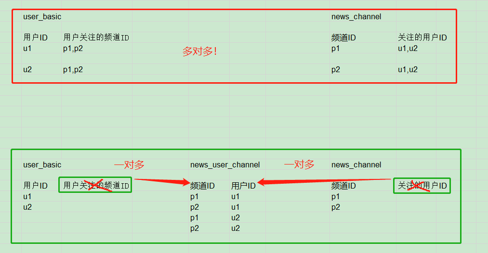
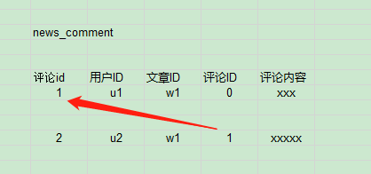
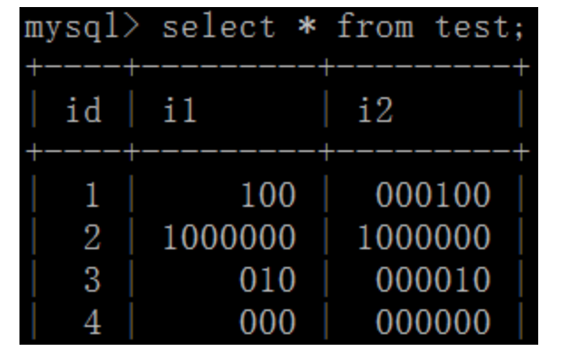
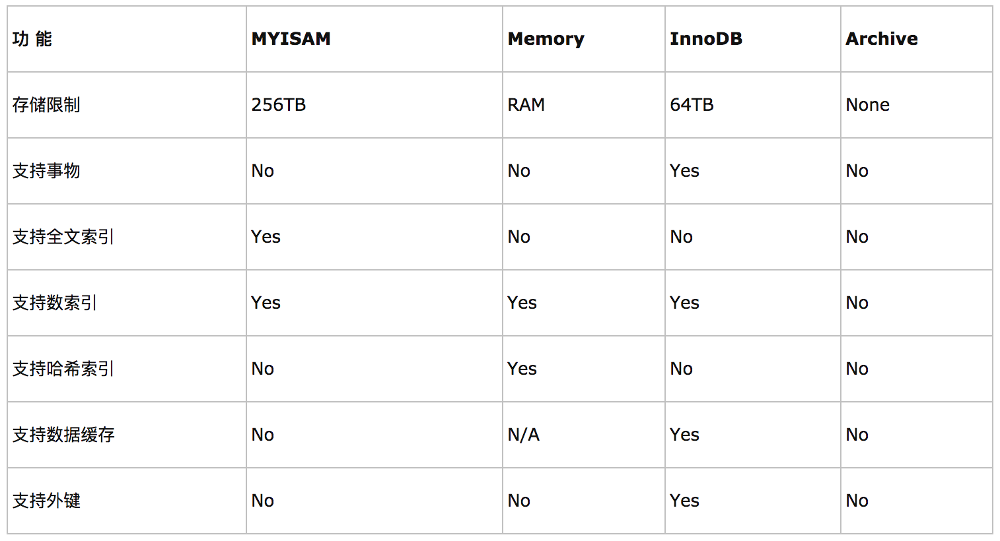

# 数据库理论--数据库表设计

> 数据库表设计的注意事项

[TOC]

<!-- toc -->

## 1. 库表设计注意事项 主键设计

> > 查看mysql-toutiao库的数据字典发现，在toutiao项目中，所有表全部使用自增主键
>
> 主键尽量不要使用业务字段：
>
> - 数据和主键索引是绑定在一起的，业务字段更新平凡，一旦修改，索引也要跟着变
> - 使用自增主键性能会快很多，主键自增就会让数据顺序添加到表中


## 2. 库表设计注意事项 多表关系

### 2.1 一对一

> - 一张表的一条记录只能与另外一条记录进行对应，反之亦然
>
> 用户基础表user_basic  == 用户信息表user_profile


### 2.2 一对多

> - 一张表中的一条记录可以对应另外一张表中的多条记录，但是反过来，另外一张表中的一条记录只能对应第一张表的一条记录，这种关系就是一对多或者多对一的关系
>
> 用户基础表user_basic == 用户拉黑表user_blacklist


### 2.3 多对多

> - 一张表中（A）的一条记录能够对应另外一张表（B）中的多条记录，同时B表找中的一条记录也能对应A表中的多条记录，多对多的关系
> - 结论：**在数据库设计的时候，当两张表存在多对多关系时，要设计第三张表：将2表多对多改为3表一对多**
>
> - 从业务逻辑上来说，`用户基础表user_basic` 和 `频道表news_channel` 是多对多关系，但是要借助`用户频道表`来帮助表达：
>   - 多对多：一个用户可以关注多个频道；一个频道可以有多个用户关注
>   - 建立用户频道表，每条数据都存放一个用户和该用户关注的一个频道；用户表不再存储关注的频道，频道表中也不再存储关注的用户
>   - 用户表中一条数据对应用户频道表中多条数据：一个用户关注多个频道，一对多
>   - 频道表中一条数据对应用户频道表中多条数据：一个频道对应多个用户，一对多
>
> 


### 2.4 一表多用

> - 两个表合为一个表，同时为2个业务逻辑服务：
>
>   - 对文章点赞表：文章ID 点赞用户ID
>
>   - 对评论点赞表：被点赞评论的ID  点赞用户ID
>   - 上边两个表合为一个态度表：目标ID 目标类型（文章、评论）点赞用户ID
>- 可以根据具体业务逻辑，将多个表合为一个表来使用
> - toutiao项目中`新闻文章表news_article_basic`属于一表多用的情况：
>  - 可以把新闻和文章看做一类，它们都有共同的业务属性，所以也就有共同的字段


### 2.5 自关联

> 用户1对文章1发表了评论1，用户2对评论1发表了评论2，情况如下图：
>
> 
>
> 2条数据在同一个 评论表news_comment 中，这种情况就是表中的数据发生了自关联
>
> - 同一个表中的数据可以在逻辑上产生关联，这要根据业务实际情况
> - 这是一种反范式设计


## 3. 库表设计注意事项 逻辑删除与反范式

> 为了查询效率，可以做冗余字段设计（**空间换时间**的思想，属于一种反范式设计），例如：`新闻频道表news_channel`中的`is_visible是否可见`字段，以及其他表中的各种**`逻辑删除`**字段。
>
> - 三范式设计，目的：减少冗余字段和重复的数据
>   - 字段具有原子性，不可拆分
>   - 依赖于全部主键，而非部分主键
>     - 比如某人的成绩，由班级+姓名决定，成绩完全依赖于班级+姓名，班主任的姓名只依赖于班级，不依赖学生姓名，所以，班主任不能在同一表中
>   - 只依赖于主键，非主键字段互不依赖
> - 反范式设计，目的：满足业务逻辑要求，提高查询速度


## 4. 库表设计注意事项 字段类型

### 4.1 整型

- #### int(n)

> 问题：int(3)和int(6)什么区别？
>
> - int(3), int(6), 都可以显示6位以上的整数。但是，当数字不足3位或6位时，前面会用0补齐。
>
> - 结论：**int的长度n并不影响数据的存储精度，长度只和显示有关**
>
> 

- #### bigint(n)

> 多用于`主键 `
>
> `bigint(20) unsigned` 显示20位长度；`unsigned`表示没有符号，数字范围将更大

- #### tinyint(n)

> 多用于`逻辑删除字段` 
>
> `tinyint(1)` 显示1位长度


### 4.2 字符串char与varchar的选择

> - char 不可变，查询效率高，可能造成存储浪费
>   - `char(5) --> '  abc'`不够5位，也用空字符串占位
> - varchar 可变，查询效率不如char，节省空间
>   - `varchar(5)-->'abc'`不够5位，实际有多少就占多少位

​	

### 4.3 json类型

> - mysql5.7版本之后`longtext类型`新增了对json字符串的支持
>
> - 在toutiao项目中，`新闻文章表news_article_basic`中`封面cover`字段采用了`longtext`类型：
>   - 把用于展示的1-3张图片的信息组装成一个json字符串，作为一个值放到了cover字段中


### 4.4 是否为空not null及默认值default

> - 主键和被索引的字段不能为null：索引不存储null，查询时不会被统计。
>
> - 对于字段一定不要忘了考虑其是否可以设置默认值


### 4.5 常见MySQL数据类型[查表]

> | 类 型                     | 大 小                              | 描 述                                                        |
> | ------------------------- | ---------------------------------- | ------------------------------------------------------------ |
> | CAHR(Length)              | Length字节                         | 定长字段，长度为0~255个字符                                  |
> | VARCHAR(Length)           | String长度+1字节或String长度+2字节 | 变长字段，长度为0~65 535个字符                               |
> | TINYTEXT                  | String长度+1字节                   | 字符串，最大长度为255个字符                                  |
> | TEXT                      | String长度+2字节                   | 字符串，最大长度为65 535个字符                               |
> | MEDIUMINT                 | String长度+3字节                   | 字符串，最大长度为16 777 215个字符                           |
> | LONGTEXT                  | String长度+4字节                   | 字符串，最大长度为4 294 967 295个字符                        |
> | TINYINT(Length)           | 1字节                              | 范围：-128~127，或者0~255（无符号）                          |
> | SMALLINT(Length)          | 2字节                              | 范围：-32 768~32 767，或者0~65 535（无符号）                 |
> | MEDIUMINT(Length)         | 3字节                              | 范围：-8 388 608~8 388 607，或者0~16 777 215（无符号）       |
> | INT(Length)               | 4字节                              | 范围：-2 147 483 648~2 147 483 647，或者0~4 294 967 295（无符号） |
> | BIGINT(Length)            | 8字节                              | 范围：-9 223 372 036 854 775 808~9 223 372 036 854 775 807，或者0~18 446 744 073 709 551 615（无符号） |
> | FLOAT(Length, Decimals)   | 4字节                              | 具有浮动小数点的较小的数                                     |
> | DOUBLE(Length, Decimals)  | 8字节                              | 具有浮动小数点的较大的数                                     |
> | DECIMAL(Length, Decimals) | Length+1字节或Length+2字节         | 存储为字符串的DOUBLE，允许固定的小数点                       |
> | DATE                      | 3字节                              | 采用YYYY-MM-DD格式                                           |
> | DATETIME                  | 8字节                              | 采用YYYY-MM-DD HH:MM:SS格式                                  |
> | TIMESTAMP                 | 4字节                              | 采用YYYYMMDDHHMMSS格式；可接受的范围终止于2037年             |
> | TIME                      | 3字节                              | 采用HH:MM:SS格式                                             |
> | ENUM                      | 1或2字节                           | Enumeration(枚举)的简写，这意味着每一列都可以具有多个可能的值之一 |
> | SET                       | 1、2、3、4或8字节                  | 与ENUM一样，只不过每一列都可以具有多个可能的值               |


## 5. 库表设计注意事项 索引

### 5.1 索引的优缺点

> - 优点
>   - 增加查询速度
> - 缺点
>   - 增加数据库的存储空间
>   - 减慢增删改速度(索引需要随之改变)
> - 思考1：为什么索引会减慢增删改的速度？
> - 思考2：为什么要读写分离？


### 5.2 索引

> - mysql中广义索引包含以下：
>   - 主键primary key
>   - 外键foreign key
>   - 索引key/index（狭义的索引）
>     - 普通索引
>     - 唯一约束uniqu
>     - 联合索引

- 主键primary key 本身就是一个唯一索引（唯一约束unique）

> `bigint(20) unsigned NOT NULL AUTO_INCREMENT`
>
> - 无符号大数bigint(20) unsigned
> - 不能为空NOT NULL
> - 自增AUTO_INCREMENT

- 外键foreign key

> ```sql
> ALTER TABLE tbl_name # 修改一张表
>  ADD [CONSTRAINT [symbol]] FOREIGN KEY # 增加一个外键约束，并给它一个自定义名称
>  [index_name] (index_col_name, ...)
>  REFERENCES tbl_name (index_col_name,...)
>  [ON DELETE reference_option] # 当删除时...
>  [ON UPDATE reference_option] # 当更新时...
> # user_resource表中的user_Id与sys_user表中的Id关联
> # 当在user_resource表中删除/更新一条数据时，从表sys_user中关联的数据随之删除/更新
> ALTER TABLE `user_resource` CONSTRAINT `FKEEAF1E02D82D57F9` 
> FOREIGN KEY (`user_Id`) 
> REFERENCES `sys_user` (`Id`) 
> ON DELETE CASCADE
> ON UPDATE CASCADE
> ```
>
> - 建立外键的目的：保持数据的完整性，一表增删改，外键关联表随之变动
>
> - 如果不做如下额外声明，创建的外键将无法删除或修改：
>
>   - **CASCADE**
>   
>     -  在父表上update/delete记录时，同步update/delete掉子表的匹配记录
>   
>       ```
>       - ON DELETE：删除主表时自动删除从表。
>       - ON UPDATE：更新主表时自动更新从表。
>       ```
>   
>   - **SET NULL**
>   
>      在父表上update/delete记录时，将子表上匹配记录的列设为null (要注意子表的外键列不能为not null)
>   
>     ```
>     - ON DELETE：删除主表时自动更新从表值为NULL。
>     - ON UPDATE：更新主表时自动更新从表值为NULL。
>     ```
>   
>   - **NO ACTION**
>   
>      如果子表中有匹配的记录,则不允许对父表对应候选键进行update/delete操作
>   
>     ```
>     - ON DELETE：从表记录不存在时，主表才可以删除。
>     - ON UPDATE：从表记录不存在时，主表才可以更新。
>     ```
>   
>   - **RESTRICT**
>   
>      同no action, 都是立即检查外键约束
>   
>   - **SET DEFAULT**
>   
>      父表有变更时,子表将外键列设置成一个默认的值 但Innodb目前不支持
>   
>     
>   
> - **toutiao项目中没有使用外键，而是通过代码实现外键逻辑**
>
>   > 如果预估业务的数据量庞大，就不要使用外键了
>
>   - 仍然可以多表联查
>
>   - 删除、更新效率高

- 索引key/index（普通索引）

> - 普通索引
>
>   > `create index idx1 on table1(col1)`
>
> - 唯一约束unique（唯一索引）
>
>   > user_basic表中对手机号moblie声明了唯一索引
>>
>   > - 保证数据不重复
>   > - 唯一是指被建立索引的字段的值具有唯一性，对于一个已经存在的值，后续将无法写入相同值
>
> - 联合索引（
>
>   > 对多个字段建立一个索引，目的是减少开销、提升效率
>  >
>     > - 比如建立一个复合索引`create index idx1 on table1(col1,col2,col3) `
>  >   - 覆盖索引：对列col1、列col2和列col3建一个联合索引，实际是建立了`(col1)、(col1,col2)、(col,col2,col3)`三个索引
>   >   - 最左原则：在mysql建立联合索引时会遵循最左前缀匹配的原则，即最左优先，在检索数据时从联合索引的最左边开始匹配。
>   >     - 在查询使用时,最好将条件顺序按找索引的顺序，这样效率最高。`select * from table1 where col1=A AND col2=B AND col3=D`
>   >     - 如果使用 `where col2=B AND col1=A` 或者 `where col2=B` 将不会使用索引
>   >     - `where col1 and col2`能够使用索引
> 


## 6. 库表设计注意事项 选择合适的引擎

> mysql引擎：在mysql进程中，按照sql语句对数据进行增删改查的服务，mysql有多种引擎，常用的有InnoDB、MyISAM，其中最常用的是InnoDB
>
> - 可以指定数据库使用哪个引擎，也可以在一个库的不同表上使用不同的引擎
>
> 

### 6.1 InnoDB

> mysql5.5开始，默认InnoDB，其特点如下：
>
> - **InnoDB给MySQL提供了具有提交、回滚和崩溃恢复能力的事物安全（ACID兼容）存储引擎**。
>
> - 支持行级锁/表级锁
> - 并发访问时效率高（事务和行级锁的原因）
> - 数据恢复可使用事务日志(undo redo log), 恢复速度快
> - 支持外键约束
> - 插入/更新/主键查询快
> - 需要内存和硬盘多，相较耗费资源

### 6.2 MyISAM

>- MyISAM特点：
>  - 不支持事务
>  - 不支持外键约束
>  - 只支持表级锁
>  - 批量插入/查询/count( )速度快
>  - 简单, 适合小型项目/以批量插入和查询为主的系统(内部管理系统)
>
>- toutiao项目中的 `global_announcement系统公告表`选择了MyISAM
>  - 因为基本不会修改, 不存在大量并发写操作, 也就不需要行级锁和事务为数据安全稳定做保障
>  - 查询多, MyISAM会更快


