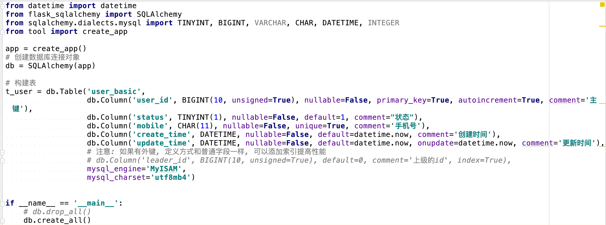
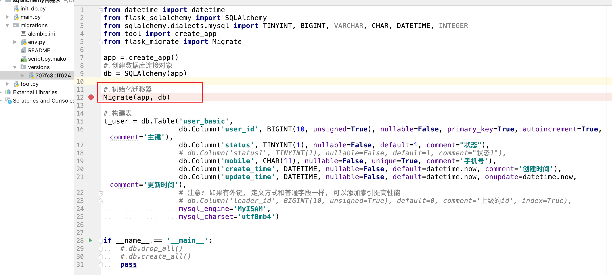
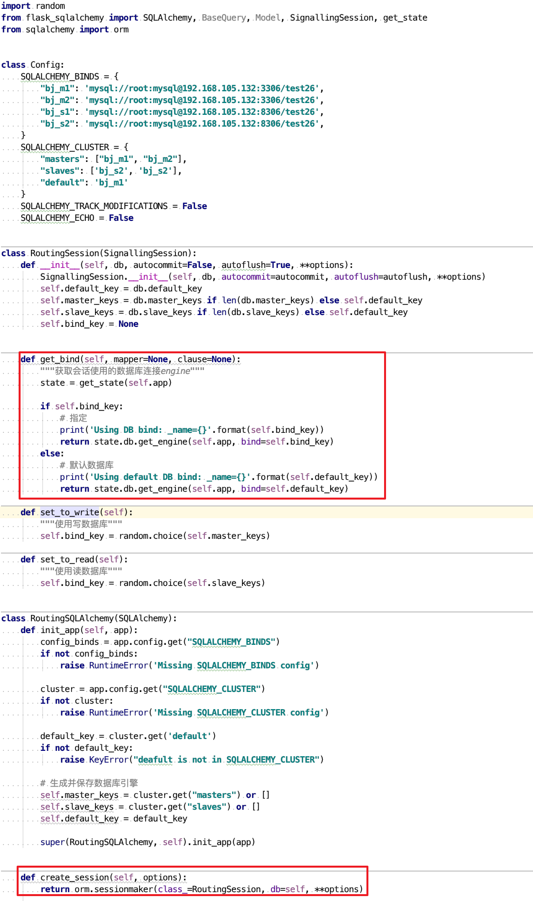
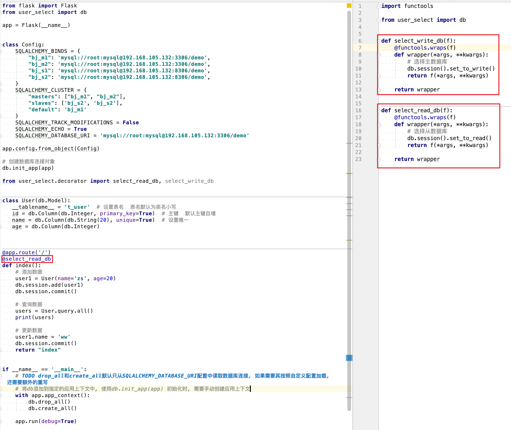

# 课后拓展：flask-sqlalchemy-进阶

[TOC]

<!-- toc-->

## 1. 生成表

- db.Model主要用于数据的增删改查, 构建表交给db.Table去完成




## 2. 数据迁移

- 用于数据库升级, 如增加字段, 修改字段类型等
- 安装 `pip install flask-migrate`



- 命令

  ```shell
  $ flask db init  # 初始化, 生成迁移文件夹
  $ flask db migrate  # 生成迁移版本
  $ flask db upgrade  # 执行迁移
  ```


## 3. sqlalchemy读写分离

- sqlalchemy没有实现读写分离, 需要自定义实现
- 读写分离的核心在于重写session的get_bind()方法
  - 自定义一个Session类, 继承默认的Session类
  - 重写get_bind()方法
  - 自定义SQLAlchemy类, 继承SQLAlchemy类
  - 重写create_session()方法



- 使用手动选择的方式来切换主从数据库
  - 接口中有读和写, 选择主数据库
  - 接口中只有读, 选择从数据库

