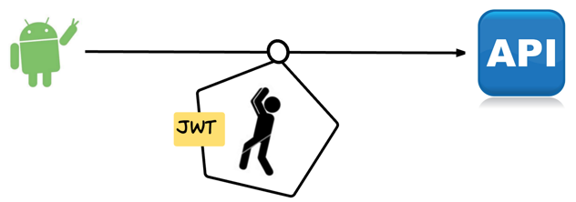
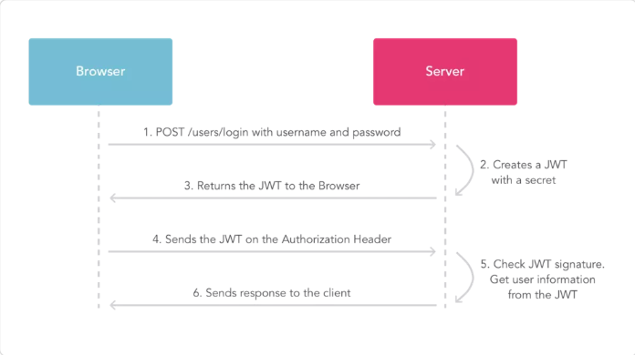
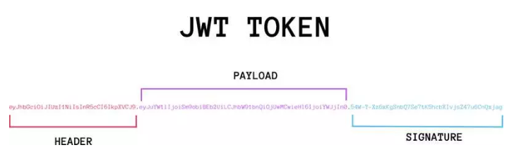
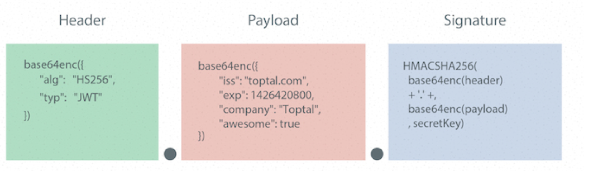

# JWT

[TOC]

<!-- toc -->

## 1. 思考 下边的场景该怎么办

> - APP不支持状态保持
>   - 不能像浏览器一样支持cookie
> - 状态保持无法跨服务器传递
>   - server1存储了session之后，请求又发到server2去了
>   - 不能建立认证中心server：就是那么寸、公司没钱了！
> - 需要用计算力代替存储空间
>   - 还是那家公司，服务器都是CPU很好，但硬盘、内存很渣

## 2. 解决 Json Web Token(JWT)

> Json web token（JWT）是为了网络应用环境间传递声明而执行的一种基于JSON的开发标准（RFC 7519），该token被设计为紧凑且安全的，特别适用于分布式站点的单点登陆（SSO）场景。JWT的声明一般被用来在身份提供者和服务提供者间传递被认证的用户身份信息，以便于从资源服务器获取资源，也可以增加一些额外的其它业务逻辑所必须的声明信息，该token也可直接被用于认证，也可被加密。
>
> - 这一点和flask的session机制很相似
>
> 

## 3. JWT流程原理

> 
>
> 
>
> **流程说明：**
>
> 1. 浏览器发起请求登陆，携带用户名和密码；
> 2. 服务端验证身份，根据算法，将用户标识符打包生成 token,
> 3. 服务器返回JWT信息给浏览器，JWT不包含敏感信息；
> 4. 浏览器发起请求获取用户资料，把刚刚拿到的 token一起发送给服务器；
> 5. 服务器发现数据中有 token，验明正身；
> 6. 服务器返回该用户的用户资料。

## 4. JWT的6个优缺点

> **结论：jwt中不要放敏感数据**
>
> 1. JWT不仅可用于认证，还可用于信息交换。善用JWT有助于减少服务器请求数据库的次数。
> 2. JWT的最大缺点是服务器不保存会话状态，所以在使用期间不可能取消令牌或更改令牌的权限。也就是说，一旦JWT签发，在有效期内将会一直有效。
>    - 在具体的业务场景中，还是有办法解决这个问题的
> 3. JWT本身包含认证信息，因此一旦信息泄露，任何人都可以获得令牌的所有权限。为了减少盗用，JWT的有效期不宜设置太长。对于某些重要操作，用户在使用时应该每次都进行进行身份验证。

## 5. JWT的数据结构

### 5.1 JWT消息构成

> JWT是一个字符串，由3部分构成，按顺序:
>
> - 头部（header)
>
> - 载荷（payload)
>
> - 签证（signature)
>
> - 上述三部分字符串之间通过"."连接。注意JWT对象为一个长字串，各字串之间也没有换行符，一般格式为：`xxxxx.yyyyy.zzzzz`
>
>   `yJhbGciOiJIUzI1NiIsInR5cCI6IkpXVCJ9.eyJzdWIiOiIxMjM0NTY3ODkwIiwibmFtZSI6IkpvaG4gRG9lIiwiaWF0IjoxNTE2MjM5MDIyfQ.SflKxwRJSMeKKF2QT4fwpMeJf36POk6yJV_adQssw5c`
>
>   

### 5.2 头部(header)

> JWT的头部承载两部分信息：
>
> - 声明类型，告诉接收者我是jwt
> - 声明加密的算法 通常直接使用 HMAC SHA256，简称`HS256`
>
> JWT里验证和签名使用的算法，可选择下面的：
>
> |  JWS  | 算法名称 |                描述                |
> | :---: | :------: | :--------------------------------: |
> | HS256 | HMAC256  |         HMAC with SHA-256          |
> | HS384 | HMAC384  |         HMAC with SHA-384          |
> | HS512 | HMAC512  |         HMAC with SHA-512          |
> | RS256 |  RSA256  |   RSASSA-PKCS1-v1_5 with SHA-256   |
> | RS384 |  RSA384  |   RSASSA-PKCS1-v1_5 with SHA-384   |
> | RS512 |  RSA512  |   RSASSA-PKCS1-v1_5 with SHA-512   |
> | ES256 | ECDSA256 | ECDSA with curve P-256 and SHA-256 |
> | ES384 | ECDSA384 | ECDSA with curve P-384 and SHA-384 |
> | ES512 | ECDSA512 | ECDSA with curve P-521 and SHA-512 |
>
> JWT的头部描述JWT元数据的参考：
>
> ```python
>  {
>      "alg": "HS256",
>      "typ": "JWT"
>  }
> ```

### 5.3 载荷(payload)

> - Payload 部分也是一个 JSON，用来存放实际需要传递的数据。JWT 规定了7个官方字段，供选用。
>
>   > iss (issuer)：签发人
>   > exp (expiration time)：过期时间
>   > sub (subject)：主题
>   > aud (audience)：受众
>   > nbf (Not Before)：生效时间
>   > iat (Issued At)：签发时间
>   > jti (JWT ID)：编号
>
> - 除以上默认字段外，我们还可以根据业务需求额外自定义私有字段，如下例：
>
>   > ```json
>   > {
>   >     "class": "传智python",
>   >     "name": "预言家",
>   >     "say": "winter is coming!"
>   > }
>   > ```
>
> - 注意，JWT 默认是不加密的，任何人都可以读到，所以不要把秘密信息放在这个部分。这个 JSON 也要使用 Base64URL 算法转成字符串。

### 5.4 签名(signature)

> Signature 部分是对前两部分的签名，防止数据篡改。
>  首先，需要指定一个密钥（secret）。这个密钥只有服务器才知道，不能泄露给用户。然后，使用 Header 里面指定的签名算法（默认是 HMAC SHA256），按照下面的公式产生签名。
>
> > HMACSHA256(  base64UrlEncode(header) + "." +  base64UrlEncode(payload),   secret)
>
> 算出签名以后，把 Header、Payload、Signature 三个部分拼成一个字符串，每个部分之间用"点"（.）分隔，就构成整个JWT对象TOKEN， 就可以返回给用户。
>
> 

### 5.5 Base64URL算法

> 前面提到，Header 和 Payload 串型化的算法是 Base64URL。这个算法跟 Base64 算法基本类似，但有一些小的不同。
>
> - JWT 作为一个令牌（token），有些场合可能会放到 URL（比如 api.example.com/?token=xxx）。Base64 有三个字符+、/和=，在 URL 里面有特殊含义，所以要被替换掉：=被省略、+替换成-，/替换成_ 。这就是 Base64URL 算法。


