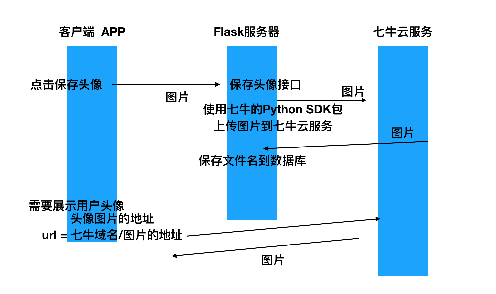
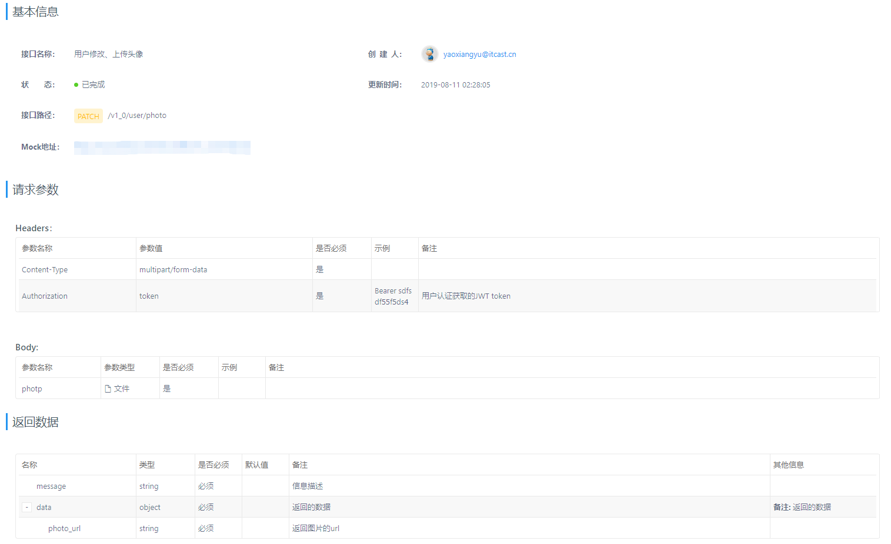

# 七牛云存储

[TOC]

<!-- toc -->

## 1. 云存储

### 1.1 需求

> 在头条项目中，如用户头像、文章图片等数据需要使用文件存储系统来保存

### 1.2 方案

> - 自己搭建文件系统服务
> - 选用第三方对象存储服务
>
> 我们在头条项目中使用七牛云对象存储服务 [http://www.qiniu.com](http://www.qiniu.com)。

### 1.3 使用

> 1. 注册
> 2. 新建存储空间
> 3. 使用七牛SDK完成代码实现
>
> 七牛Python SDK 网址 https://developer.qiniu.com/kodo/sdk/1242/python

#### 1.3.1 安装SDK

> ```python
> pip install qiniu
> ```

#### 1.3.2 编码

> 七牛提供的上传代码参考示例
>
> ```python
> from qiniu import Auth, put_file, etag
> import qiniu.config
> 
> #需要填写你的 Access Key 和 Secret Key
> access_key = 'Access_Key'
> secret_key = 'Secret_Key'
> 
> #构建鉴权对象
> q = Auth(access_key, secret_key)
> 
> #要上传的空间
> bucket_name = 'Bucket_Name'
> 
> #上传后保存的文件名
> key = 'my-python-logo.png'
> 
> #生成上传 Token，可以指定过期时间等
> token = q.upload_token(bucket_name, key, 3600)
> 
> #要上传文件的本地路径
> localfile = './sync/bbb.jpg'
> 
> ret, info = put_file(token, key, localfile)
> print(info)
> assert ret['key'] == key
> assert ret['hash'] == etag(localfile)
> ```

## 2. 头条项目实现

> 

### 2.1 查看`common/utils/storage.py`文件

> - 修改centos虚拟机中的时间，不然从七牛拿回的token无效（过期）
>
>   > ```shell
>   > date # 查看当前系统时间
>   > yum install -y ntpdate
>   > ntpdate cn.pool.ntp.org
>   > ```
>
> - 从qiniu拿到示例代码进行修改如下（项目中已经修改过了）
>
>   - 并修改QINIU相应的配置
>
>   > ```python
>   > from qiniu import Auth, put_file, etag, put_data
>   > import qiniu.config
>   > from flask import current_app
>   > 
>   > 
>   > def upload_image(file_data):
>   >     """
>   >     上传图片到七牛
>   >     :param file_data: bytes 文件
>   >     :return: file_name
>   >     """
>   >     # 需要填写你的 Access Key 和 Secret Key
>   >     access_key = current_app.config['QINIU_ACCESS_KEY']
>   >     secret_key = current_app.config['QINIU_SECRET_KEY']
>   > 
>   >     # 构建鉴权对象
>   >     q = Auth(access_key, secret_key)
>   > 
>   >     # 要上传的空间
>   >     bucket_name = current_app.config['QINIU_BUCKET_NAME']
>   > 
>   >     # 上传到七牛后保存的文件名
>   >     # key = 'my-python-七牛.png'
>   >     key = None
>   > 
>   >     # 生成上传 Token，可以指定过期时间等
>   >     token = q.upload_token(bucket_name, expires=1800)
>   > 
>   >     # # 要上传文件的本地路径
>   >     # localfile = '/Users/jemy/Documents/qiniu.png'
>   > 
>   >     # ret, info = put_file(token, key, localfile)
>   >     ret, info = put_data(token, key, file_data)
>   > 
>   >     return ret['key']
>   > 
>   > ```
>   >
>   > 
>
> - 测试`common/utils/storage.py`中`upload_image`函数
>
>   > ```python
>   > from qiniu import Auth, put_data
>   > """测试上传图片至七牛云"""
>   > def upload_image(file_data):
>   >  """上传图片到七牛
>   >  :param file_data: bytes 文件
>   >  :return: file_name"""
>   >  # 需要填写你的 Access Key 和 Secret Key
>   >  access_key = '从用户--秘钥管理 界面中获取的AKEY'
>   >  secret_key = '从用户--秘钥管理 界面中获取的SKEY'
>   >  # 构建鉴权对象
>   >  q = Auth(access_key, secret_key)
>   >  # 要上传的空间
>   >  bucket_name = '存储空间名'
>   >  # 上传到七牛后保存的文件名
>   >  # key = 'my-python-七牛.png'
>   >  key = None # 七牛自己来给图片命名，防止图片重名
>   >  # 生成上传 Token，可以指定过期时间等
>   >  token = q.upload_token(bucket_name, expires=1800)
>   >  ret, info = put_data(token, key, file_data)
>   >  print(ret)
>   >  print(info)
>   >  return ret['key']
>   > # 打开测试文件
>   > with open('./1.png', 'rb') as f:
>   >  file_date = f.read()
>   > 
>   > file_name = upload_image(file_date)
>   > 
>   > print(file_name)
>   > print('从七牛存储空间界面上获取的临时域名/{}'.format(file_name))
>   > 
>   > """"error":"expired token"
>   > date # 查看当前系统时间
>   > yum install -y ntpdate
>   > ntpdate cn.pool.ntp.org"""
>   > ```

### 2.2 完成上传头像接口

#### 2.2.1 接口设计 使用PATCH

> - PUT 修改 /user 
>
>   - PUT 语义：请求修改资源时，是修改的全部字段；如果为了符合语义，就需要传递完整的数据字段
>
> - PATCH 修改 /user
>
>   - PATCH 语义：请求修改资源时，只需要传递修改的数据字段即可
>
>   - 请求 `{'photo': photo_bytes}`
>
>   - 返回 
>
>     > `common/utils/output.py`的 `output_json`函数中，已经实现了外层数据的封装，只需要视图返回data字段中的值
>
>     ```
>     {'message': ;ok,
>      'data': {
>      	'photo_url': photo_url
>      	}
>     }
>     ```

#### 2.2.2 注册视图的路由

> 在`toutiao/resources/user/__init__.py `中打开下面代码的注释
>
> ```python
> user_api.add_resource(profile.PhotoResource, '/v1_0/user/photo',
>                       endpoint='Photo')
> ```

#### 2.2.3 新建`toutiao/resources/user/profile.py`,完成视图函数

> > 视图函数中的步骤
> >
> > - 获取并校验请求参数
> > - 把图片上传到七牛，并获取文件名
> > - 保存图片名到数据库
> > - 构造并返回数据
>
> - 代码如下：
>
>   > ```python
>   > from flask import g, current_app
>   > from flask_restful import Resource
>   > from flask_restful.reqparse import RequestParser
>   > from utils.parser import image_file
>   > from utils.storage import upload_image
>   > from utils.decorators import login_required # 导入用户认证装饰器
>   > from models.user import User # 导入User模型类
>   > from models import db
>   > 
>   > 
>   > class PhotoResource(Resource):
>   >     """用户图像 （头像、身份证）处理"""
>   >     # 用户必须登录才能修改头像
>   >     method_decorators = [login_required]
>   >     def patch(self):
>   >         """修改用户的资料（修改用户的头像）
>   >         """
>   >         # 获取并校验请求参数
>   >         # import traceback
>   >         # try:
>   >         rp = RequestParser()
>   >         rp.add_argument('photo', type=image_file, # 采用自定义的类型检查函数
>   >                         required=True, location='files') # 必须要传该参数，且从数据所在位置是files
>   >         args_dict = rp.parse_args() # 转换参数并取出args_dict参数字典，是一个字典，其中包含了photo键值对！
>   >         # print(args_dict)
>   >         # 把图片上传到七牛，并获取文件名
>   >         # 注意：上传文件上传的是文件对象
>   >         file_name = upload_image(args_dict.photo.read())
>   >         # 保存图片名到数据库 # 思考：为什么只保存文件名，而不保存完整的图片链接？ # 防止url路径改变
>   >         User.query.filter(User.id==g.user_id).update({'profile_photo': file_name})
>   >         db.session.commit()
>   >         # 如果commit报错，且不需要进行特殊处理，flask无需代码实现，会自动进行rollback回滚操作，
>   >         # 构造并返回数据
>   >         photo_url = current_app.config['QINIU_DOMAIN'] + file_name
>   >         return {'photo_url': photo_url}
>   >         # except Exception:
>   >         #     print(traceback.format_exc())
>   >         #     return {'error': traceback.format_exc()}
>   > ```
>
> - 查看在`common/utils/parser.py`中的`image_file`函数
>
>   > imghr模块通过二进制数据前几位来判断是否为图片，二进制文件前几位表明了自己的文件类型
>   >
>   > ```python
>   > import imghdr # 第三方模块
>   > 
>   > def image_file(value):
>   >     """检查是否是图片文件，用于lask_restful.reqparse.RequestParser.add_argument中的tpye参数接收
>   >     :param value:
>   >     :return:
>   >     """
>   >     try:
>   >         file_type = imghdr.what(value) # 判断一个具体的二进制数据是否为图片类型
>   >     except Exception:
>   >         raise ValueError('Invalid image.')
>   >     else:
>   >         if not file_type:
>   >             raise ValueError('Invalid image.')
>   >         else: # 必须判定该二进制数据是一个图片文件类型，才最终返回该二进制数据，否则就抛出异常
>   >             return value
>   > ```

#### 2.2.4 启动app,接口测试接口

> 用户更细自己的头像需要先登录，该功能我们已经在JWT章节中完成
>
> ```python
> import requests, json
> 
> """登录 POST /v1_0/authorizations"""
> url = 'http://127.0.0.1:5000/v1_0/authorizations'
> REDIS_SENTINELS = [('127.0.0.1', '26380'),
>                    ('127.0.0.1', '26381'),
>                    ('127.0.0.1', '26382'),]
> REDIS_SENTINEL_SERVICE_NAME = 'mymaster'
> from redis.sentinel import Sentinel
> _sentinel = Sentinel(REDIS_SENTINELS)
> redis_master = _sentinel.master_for(REDIS_SENTINEL_SERVICE_NAME)
> redis_master.set('app:code:13161933309', '123456')
> # 构造raw application/json形式的请求体
> data = json.dumps({'mobile': '13161933309', 'code': '123456'})
> # requests发送 POST raw application/json 请求
> resp = requests.post(url, data=data, headers={'Content-Type': 'application/json'})
> print(resp.json())
> token = resp.json()['data']['token']
> print(token)
> 
> """测试上传图片接口/v1_0/user/photo，需要先登录"""
> url = 'http://127.0.0.1:5000/v1_0/user/photo'
> headers = {'Authorization': 'Bearer {}'.format(token)}
> # with open('./1.png', 'rb') as f:
> #     photo = f.read()
> photo_obj = open('./1.png', 'rb')
> files_dict = {'photo': photo_obj}
> resp = requests.patch(url, files=files_dict, headers=headers)
> # files = {"zidingyi_name": open("./4_1_3.py", "rb")}
> # r = requests.post("http://127.0.0.1:5000/upload", files=files)
> print(resp.status_code)
> print(resp.json())
> ```

#### 2.2.5 接口录入

> http://mock.meiduo.site
>
> 
>
> - 选择/添加分类
> - 添加接口
> - 请求参数设置--选择form类型
>   - Body
>     - photo，类型file，必须，图像文件二进制数据
>   - Headers
>     - Authonrization，jwt_token，用户身份token
>     - content-type 会自动选择
> - 返回数据填写
>   - message string 提示信息
>   - data object 数据
>     - photo_url string 图片url


