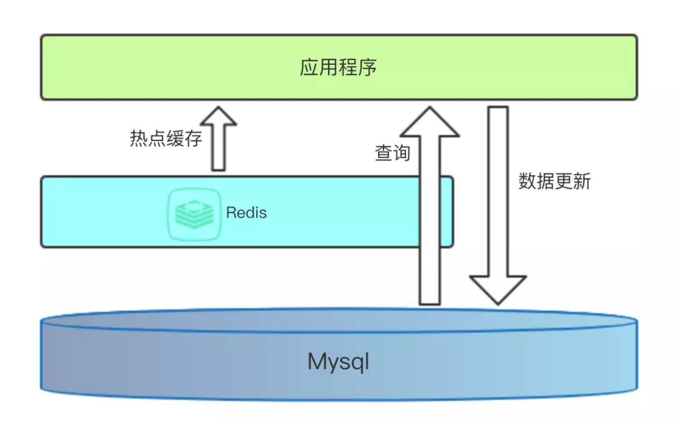
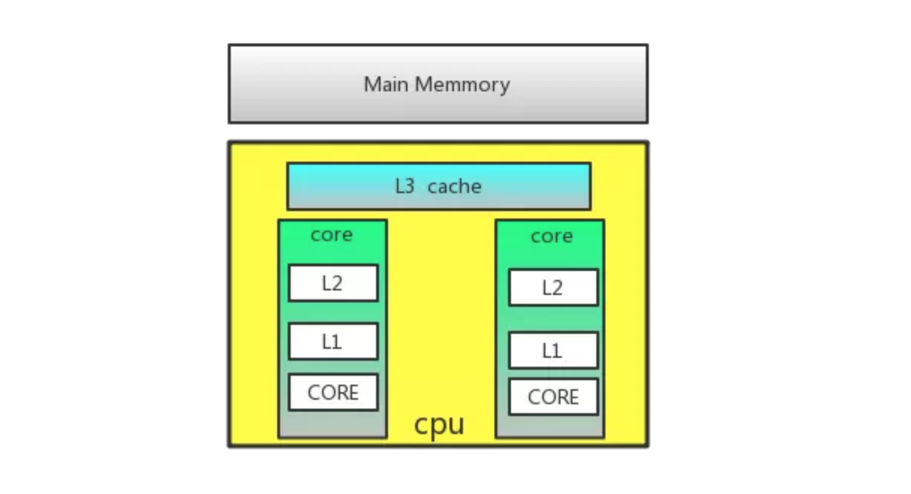
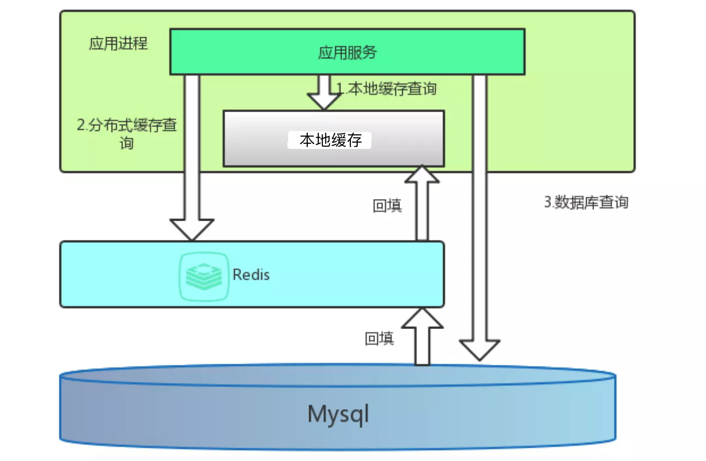

# 缓存理论：缓存架构

[TOC]

<!-- toc -->

> 如果一个项目需要用到缓存，那么我们脑中的直观反应如下图
>
> 
>
> 计算机体系结构中的缓存
>
> > cpu缓存和内存和业务缓存从某种程度上来讲很相似
>
> 

## 1. 多级缓存

> 缓存的目的是为了减少数据库的访问，因为数据库资源宝贵，其响应速度相对缓存来说慢很多
>
> - 图中没有展示的还有客户端，客户端也可以缓存一部分数据！
>
> - 本地缓存：应用进程中的缓存只保存使用最高频的数据
> - 外部缓存：
>   - 根据具体业务，可以有多级，层层防守
>   - 不同级别的缓存数据有效期不同
>
> 

## 2. 头条项目的方案

> - SQLAlchemy起到一定的本地缓存作用
>   - 在同一请求中多次相同的查询只查询数据库一次，SQLAlchemy做了本地缓存（类似Django中的Queryset查询结果集）
> - 使用Redis构建一层缓存
>   - redis cluster

## 3. 缓存存储的内容

> - 长期不变的数据
> - 经常被查询的数据

____

课后阅读: Python性能分析与优化 (图灵程序设计丛书)-2016-多格里奥(Fernando Doglio) (作者), 陶俊杰 陈小莉 (译者)

