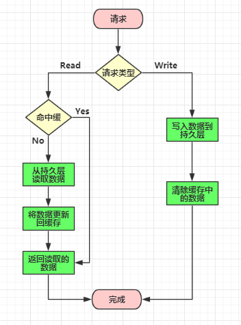
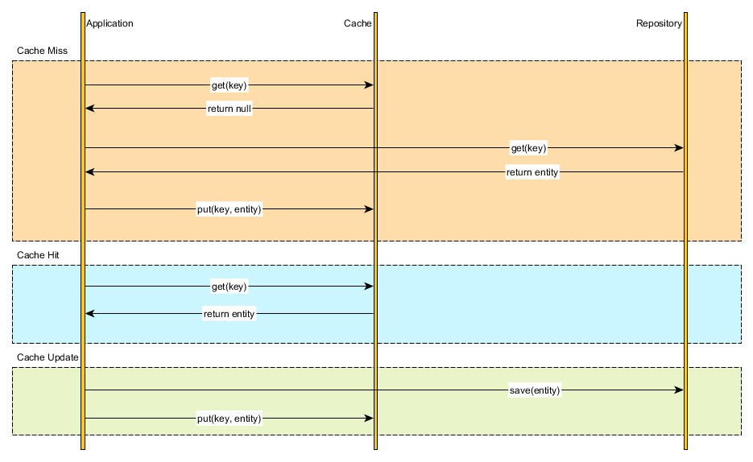
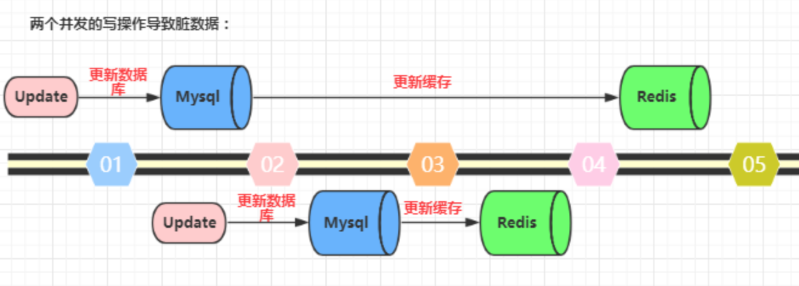
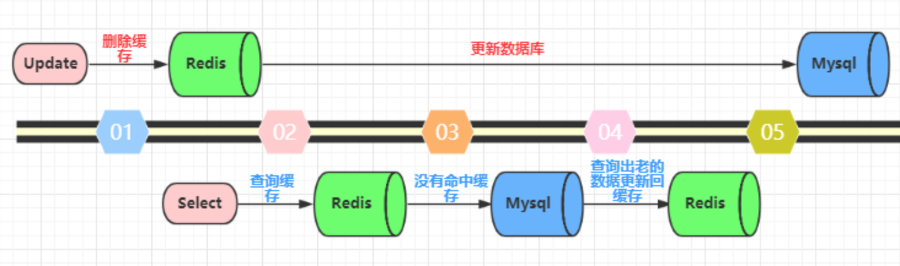
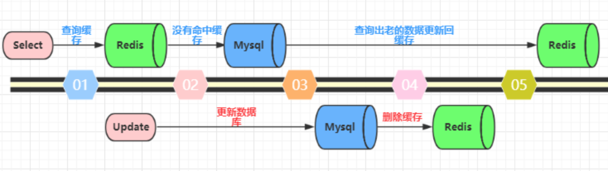
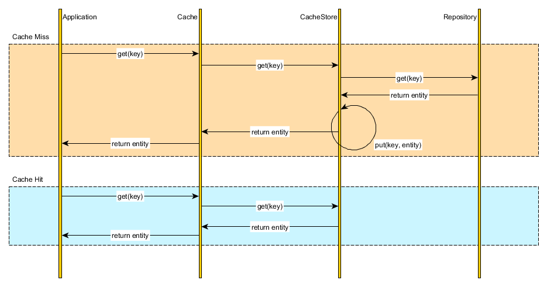
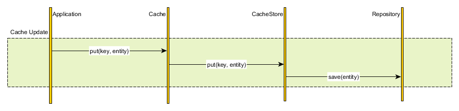
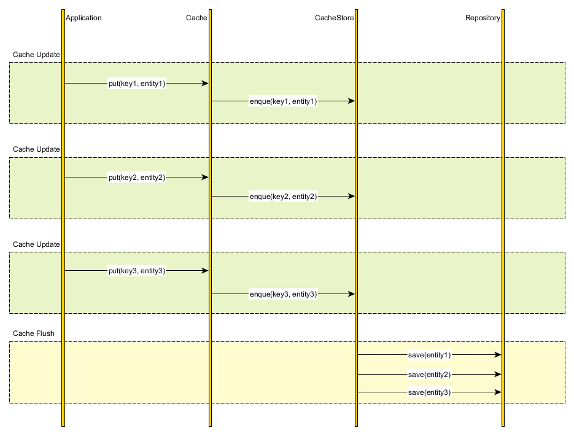

# 缓存理论：缓存模式

> 为了解决数据库的压力，我们采用缓存机制。如何使用缓存就需要我们了解缓存的模式。

[TOC]

<!-- toc -->

## 1. 缓存模式

> 缓存是为了降低数据库压力
>
> - 提升性能
>
>   - 绝大多数情况下，select 是出现性能问题最大的地方。一方面，select 会有很多像 join、group、order、like 等这样丰富的语义，而这些语义是非常耗性能的；另一方面，大多 数应用都是读多写少，所以加剧了慢查询的问题。
>
>   - 分布式系统中远程调用也会耗很多性能，因为有网络开销，会导致整体的响应时间下降。为了挽救这样的性能开销，在业务允许的情况（不需要太实时的数据）下，使用缓存是非常必要的事情。
>
> - 缓解数据库压力
>
>   - 当用户请求增多时，数据库的压力将大大增加，通过缓存能够大大降低数据库的压力。

### 1.1 Cache Aside 模式

> > Cache Aside（边缘缓存？咋翻译？）
>
> 具体读写缓存的操作由应用（视图）完成，这也是最常用的缓存模式
>
> - **失效**：应用程序先从 cache 取数据，没有得到，则从数据库中取数据，成功后，放到缓存中。
> - **命中**：应用程序从 cache 中取数据，取到后返回。
> - **更新**：先把数据存到数据库中，成功后，再让缓存**失效**。
>
> 

#### 1.1.1 Cache Aside的读模式

> 先读取缓存中的数据, 没有才会读取数据库中的数据
>
> 

#### 1.1.2 Cache Aside的写模式

> > 问题：缓存和数据库是两套独立的机制，mysql和redis是两个独立的系统, 在并发环境下, 无法保证更新的一致性，如何解决呢？
>
> - **结论：先写/更新数据库，再删除缓存**
>
> > 接下来就分析为什么`先更新数据库，再删除缓存`：
>
> - **先更新数据库，再更新缓存。**
>
>   > 这种做法最大的问题就是两个并发的写操作导致脏数据**。如下图（以Redis和Mysql为例），两个并发更新操作，数据库先更新的反而后更新缓存，数据库后更新的反而先更新缓存。这样就会造成数据库和缓存中的数据不一致，应用程序中读取的都是脏数据。
>   >
>   > 
>
> - **先删除缓存，再更新数据库。这个逻辑是错误的，因为两个并发的读和写操作导致脏数据**。
>
>   > 如下图（以Redis和Mysql为例）。假设更新操作先删除了缓存，此时正好有一个并发的读操作，没有命中缓存后从数据库中取出老数据并且更新回缓存，这个时候更新操作也完成了数据库更新。此时，数据库和缓存中的数据不一致，应用程序中读取的都是原来的数据（脏数据）。
>   >
>   > 
>
> - **先更新数据库，再删除缓存。**
>
>   > 在实际的系统中推荐使用这种方式。
>   >
>   > > 但是这种方式理论上还是可能存在问题。如下图（以Redis和Mysql为例），查询操作没有命中缓存，然后查询出数据库的老数据。此时有一个并发的更新操作，更新操作在读操作之后更新了数据库中的数据并且删除了缓存中的数据。然而读操作将从数据库中读取出的老数据更新回了缓存。这样就会造成数据库和缓存中的数据不一致，应用程序中读取的都是原来的数据（脏数据）。
>   >
>   > 
>   >
>   > > 但是，仔细想一想，这种并发的概率极低。因为这个条件需要发生在读缓存时缓存失效，而且有一个并发的写操作。实际上数据库的写操作会比读操作慢得多，而且还要加锁，而读操作必需在写操作前进入数据库操作，又要晚于写操作更新缓存，所有这些条件都具备的概率并不大。但是为了避免这种极端情况造成脏数据所产生的影响，我们还是要为缓存设置过期时间。

### 1.2 `Read/Write through`通读通写 

> `具体读写操作交给缓存层完成`, 即使后期修改存储方案, 业务代码不需要修改, 有利于项目的重构和架构升级

- ##### Read-through  通读 

> 

- ##### Write-through  通写

> 

### 1.3 `Write behind caching`合并写

> 具体读操作交给缓存层完成, 定时异步更新数据库
>
> 

## 2. 头条项目方案

* ##### Cache aside
  
    > 直接在视图函数中进行读写操作
    >
    > - 读：先读取缓存中的数据, 没有才会读取数据库中的数据
    > - 写：先写/更新数据库，再删除缓存
    
* ##### Read/Write-throught
  
    > 在Flask的视图函数中直接调用缓存层操作工具函数。
    >
    > - 构建一层抽象出来的缓存操作层，负责数据库查询和Redis缓存存取
    
    