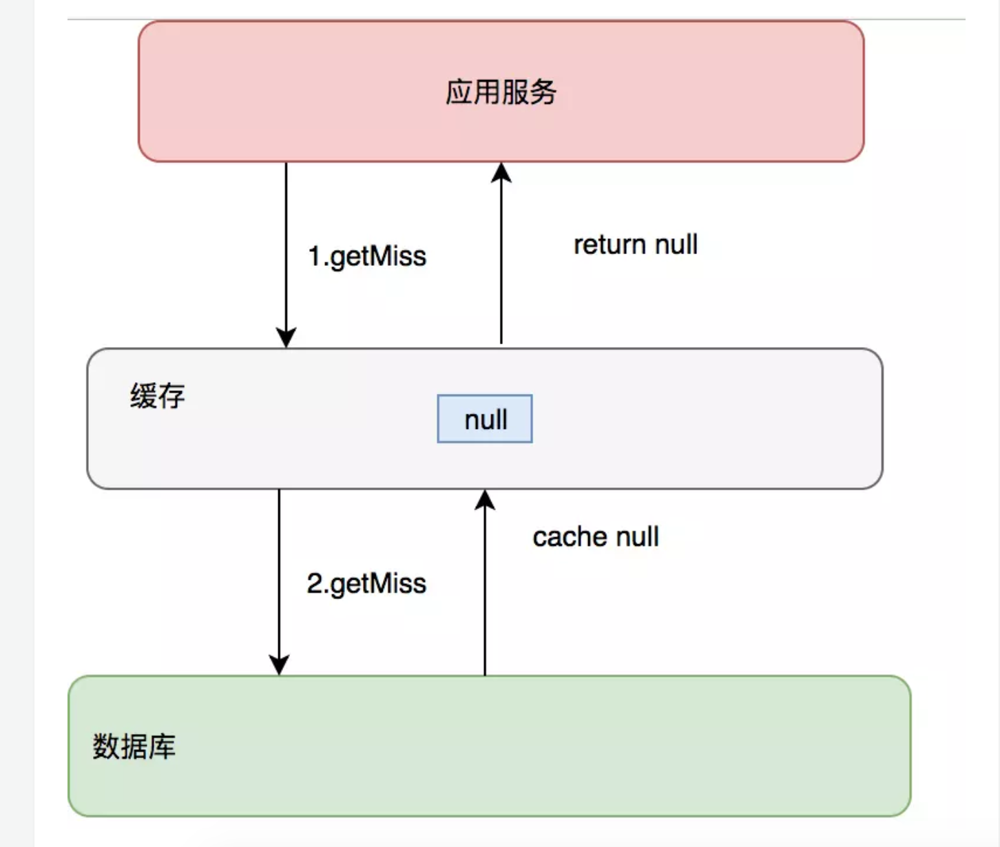
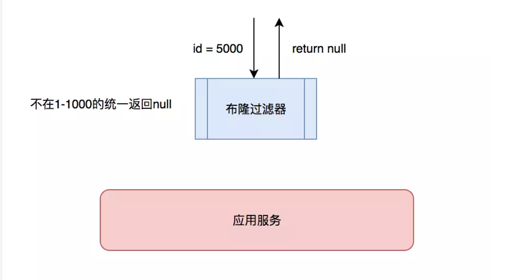
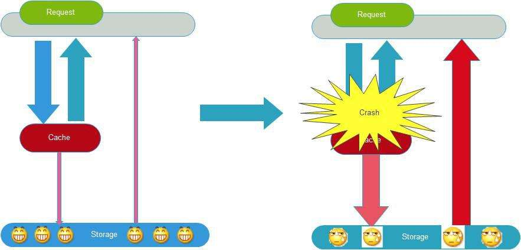

# 缓存理论：缓存问题

> 

[TOC]

<!-- toc -->

## 1 缓存穿透

### 1.1 缓存穿透的场景

> 有这样一种场景：
>
> - 访问数据库原本并不存在的数据, 缓存会被穿透, 直接访问数据库
> - 一段时间内重复上述动作导致数据库的的访问压力变大
>
> 这就是缓存穿透的场景
>
> > 缓存只是为了缓解数据库压力而添加的一层保护层，当从缓存中查询不到我们需要的数据就要去数据库中查询了。如果被黑客利用，频繁去访问缓存中没有的数据，那么缓存就失去了存在的意义，瞬间所有请求的压力都落在了数据库上，这样会导致数据库连接异常。

### 1.2 解决方案

> > 1. 被动方案：对于返回为NULL的依然缓存，对于抛出异常的返回不进行缓存` ，一般过期时间会比较短
> >
> > 2. 主动方案：制定一些规则过滤一些不可能存在的数据
>
> - 对于返回为NULL的依然缓存，对于抛出异常的返回不进行缓存` ，一般过期时间会比较短
>
>   > 采用这种手段的会增加我们缓存的维护成本，需要在插入缓存的时候删除这个空缓存，当然我们可以通过设置较短的超时时间来解决这个问题。
>   >
>   > 
>
> - 制定一些规则过滤一些不可能存在的数据
>
>   > 小数据用[BitMap](https://www.jianshu.com/p/bf9dbbc147ed)，大数据可以用[布隆过滤器](https://www.jianshu.com/p/2104d11ee0a2)；比如你的订单ID 明显是在一个范围1-1000，如果不是1-1000之内的数据那其实可以直接给过滤掉
>   >
>   > 

## 2. 缓存雪崩

### 2.1 缓存雪崩的场景

> - 如果大量缓存数据都在同一个时间过期, 那么很可能出现缓存集体失效, 会导致所有的请求都直接访问数据库, 导致数据库压力过大，这就是缓存雪崩的场景
>
>   

### 2.2 缓存雪崩的解决方案

> - `设置过期时间时, 添加随机值, 让过期时间进行一定程度分散`
>   - 给缓存加上一定区间内的随机生效时间，不同的key设置不同的失效时间，避免同一时间集体失效。比如以前是设置10分钟的超时时间，那每个Key都可以随机8-13分钟过期，尽量让不同Key的过期时间不同。
> - 多级缓存的方式来处理
>   - 不同级别缓存设置的超时时间不同，及时某个级别缓存都过期，也有其他级别缓存兜
> - 利用锁/队列的形式，串行化处理对数据库的请求
>   - 对数据库操作利用加锁或者队列方式避免过多请求同时对数据库服务器进行读写

## 3. 拓展阅读

- https://www.cnblogs.com/duanxz/p/3740595.html

- https://www.cnblogs.com/duanxz/p/3783369.html

- https://www.cnblogs.com/duanxz/p/3788366.html