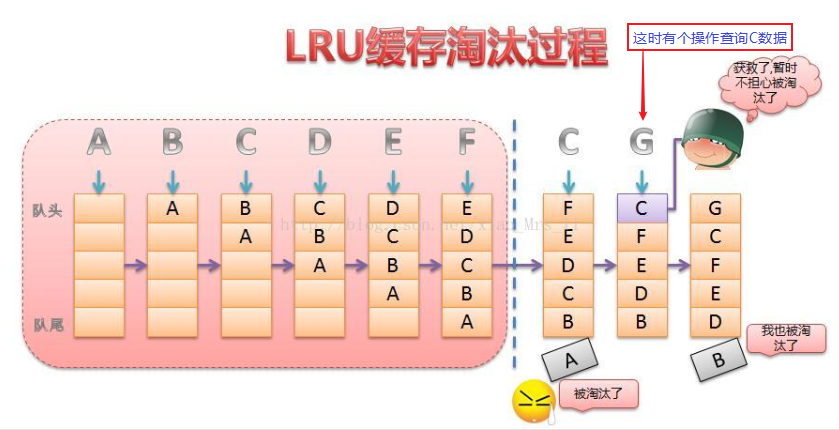
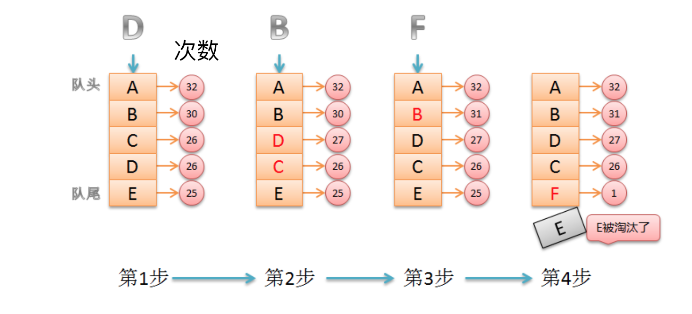

# 缓存理论：缓存有效期与淘汰策略

> 随着缓存数据的增多，最终缓存的数据量会趋于接近数据库的数据量；这个时候缓存就变成另外一个数据库了，日积月累，性能会越来越低，在设计缓存时一定要考虑使用`设置缓存有效期`和`缓存淘汰策略`避免这种情况的发生。

[TOC]

<!-- toc -->

## 1. 有效期TTL 

> **对于缓存数据，一定要设置有效期TTL**（Time to live）

### 1.1 设置缓存有效期的作用

> - 节省空间
>
> - 做到数据弱一致性
>   - 有效期失效后，重新缓存后，就可以保证数据的一致性

### 1.2 Redis的过期策略

> 过期策略通常有以下三种：
>
> - 定时过期（手动设置）
> - 惰性过期（自动）
> - 定期过期（自动）

#### 1.2.1 定时过期

> - 每个设置过期时间的key都需要创建一个定时器，到过期时间就会立即清除。
>   - 该策略可以立即清除过期的数据，对内存很友好
>   - 但是会占用大量的CPU资源去处理过期的数据，从而影响缓存的响应时间和吞吐量。
>
> - 设置方法
>
>   ```shell
>   setex('a', 300, 'aval')
>   setex('b', 600, 'bval')
>   ```

#### 1.2.2 惰性过期

> - 被动维护：只有当访问一个key时，才会判断该key是否已过期，过期则清除。
>   - 该策略可以最大化地节省CPU资源，却对内存非常不友好。
>
>   - 极端情况可能出现大量的过期key没有再次被访问，从而不会被清除，占用大量内存。

#### 1.2.3 定期过期

> 每隔一定的时间，会扫描一定数量的数据库的expires字典中一定数量的key，并清除其中已过期的key。
>
> - 该策略是前两者的一个折中方案：通过调整定时扫描的时间间隔和每次扫描的限定耗时，可以在不同情况下使得CPU和内存资源达到最优的平衡效果。
> - expires字典会保存所有设置了过期时间的key的过期时间数据，其中：
>   - key是指向`键空间`中的某个键的指针
>     - `键空间`是指该Redis集群中保存的所有键。
>   - value是该键的毫秒精度的UNIX时间戳表示的过期时间

### 1.3 Redis过期策略相关问题

> - **Redis服务自动同时使用了惰性过期和定期删除两种过期策略。**
>
>   - **Redis过期删除采用的是定期删除，默认是每100ms检测一次**，遇到过期的key则进行删除，这里的检测并不是顺序检测，而是随机检测。
>   - 当我们去读/写一个已经过期的key时，会触发Redis的惰性删除策略，直接会干掉过期的key
>
> - **为什么不用定时删除策略?**定时删除是针对某个key采取的手动措施
>
>   - 定时删除,用一个定时器来负责监视key,过期则自动删除。
>   - 虽然内存及时释放，但是十分消耗CPU资源。在大并发请求下，CPU要将时间应用在处理请求，而不是删除key，因此redis没有采用这一策略。
>
> - **定期删除+惰性删除是如何工作的呢?**
>
>   - 定期删除，redis默认每个100ms检查，是否有过期的key,有过期key则删除。需要说明的是，redis不是每个100ms将所有的key检查一次，而是随机抽取进行检查(如果每隔100ms,全部key进行检查，redis岂不是卡死)。因此，如果只采用定期删除策略，会导致很多key到时间没有删除。
>
>   - 于是，惰性删除派上用场。也就是说在你获取某个key的时候，redis会检查一下，这个key如果设置了过期时间那么是否过期了？如果过期了此时就会删除。
>
> - **采用定期删除+惰性删除就没其他问题了么?**
>   - 不是的，如果定期删除没删除key。然后你也没即时去请求key，也就是说惰性删除也没生效。这样，redis的内存会越来越高。那么就应该采用内存淘汰机制。


## 2. 缓存淘汰 eviction

> Redis的内存淘汰策略是指在Redis的用于缓存的内存不足时，怎么处理需要新写入且需要申请额外空间的数据。

### 2.1 Redis中的缓存淘汰策略

> - redis共有8种缓存淘汰策略
>   - redis 3.x 有6种淘汰策略：
>
>     > - noeviction：当内存不足以容纳新写入数据时，新写入操作会报错。
>     > - allkeys-lru：当内存不足以容纳新写入数据时，在键空间中，移除最近最少使用的key。
>     > - allkeys-random：当内存不足以容纳新写入数据时，在键空间中，随机移除某个key。
>     > - volatile-lru：当内存不足以容纳新写入数据时，在设置了过期时间的键空间中，移除最近最少使用的key。
>     > - volatile-random：当内存不足以容纳新写入数据时，在设置了过期时间的键空间中，随机移除某个key。
>     > - volatile-ttl：当内存不足以容纳新写入数据时，在设置了过期时间的键空间中，有更早过期时间的key优先移除。
>
>   - redis 4.x 开始支持LFU策略，最少频率使用
>
>     > - allkeys-lfu：当内存不足以容纳新写入数据时，在键空间中，移除使用次数最少的key。
>     > - volatile-lfu：当内存不足以容纳新写入数据时，在设置了过期时间的键空间中，移除使用次数最少的key。
>
> - 总结：
>
>   - noeviction：没有策略
>   - allkeys：所有键
>   - volatile：设置了过期时间的键
>   - random：随机移除某个key
>   - lru：淘汰没有使用的时间最长的key
>   - lfu：淘汰最近最少使用次数的key
>
> > 对于`allkeys`和`volatile`很好理解，接下来我们就来理解一下`lru`和`lfu`

### 2.2 LRU:淘汰没有使用的时间最长的key

> > LRU（Least recently used）算法根据数据的历史访问记录来进行淘汰数据，其核心思想是“如果数据最近被访问过，那么将来被访问的几率也更高”。
>
> - 基本思路
>
> 1. 新数据插入到列表头部；
> 2. 每当缓存命中（即缓存数据被访问），则将数据移到列表头部；
> 3. 当列表满的时候，将列表尾部的数据丢弃。
>
> 

### 2.3 LFU:淘汰最近最少使用次数的key

> > LFU（Least Frequently Used）它是基于“如果一个数据在最近一段时间内使用次数很少，那么在将来一段时间内被使用的可能性也很小”的思路。
>
> - 基本思路
>
> 1. 数据按使用次数在队列中排序：查询次数最多在队头，次数最少的在队尾；
> 2. 每当缓存命中（即缓存数据被访问），此时使用次数+1，并重新排队；
> 3. 数据的最近使用次数定期衰减，每过一段时间全部数据的使用次数都减半；
> 4. 当新数据被缓存，且列表满的时候，将队尾的数据丢弃，新数据进入队尾。
>
> 
>
> - 注意：
>   - **LFU需要定期衰减。**
>   - LFU影响一定性能。

### 2.4 Redis淘汰策略的配置

> ```shell
> # redis最大使用内存数量，如果没设置，将逐步占用全部内容
> maxmemory <bytes> 
> 
> # redis淘汰策略，内存达到上限将触发策略
> maxmemory-policy noeviction  
> 	# 默认 noeviction 不采取任何策略，内存上限写入数据将直接报错
> 	# 可选择上述8种其中一种
> ```


## 3. 头条项目中redis缓存淘汰方案

> - **思考题**：mySQL里有2000w数据，redis中只存了20w的数据，如何保证redis中的数据都是高频热点数据？
>   - 对缓存key都设置符合业务的合理过期时间
>   - 通过`maxmemory-policyreids`配置项选择合适的淘汰策略，比如使用` volatile-lru`策略
>
> - **这也就是toutiao项目中的redis缓存淘汰方案**
>
>   > 注意：**toutuao项目中用于缓存的是redis-cluster**，哨兵监控的主从redis是用于持久化存储当数据库来使用的


