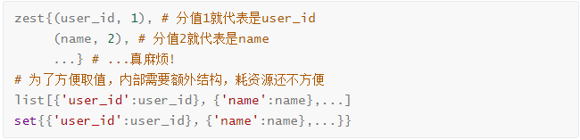

# 头条项目缓存与存储设计

[TOC]

<!-- toc -->

## 1. 头条项目缓存方案

- ##### Cache aside

  > 直接在视图函数中进行读写操作
  >
  > - 读：先读取缓存中的数据, 没有才会读取数据库中的数据
  > - 写：先写/更新数据库，再删除缓存

- ##### Read/Write-throught

  > 在Flask的视图函数中直接调用缓存层操作工具函数。
  >
  > - 构建一层抽象出来的缓存操作层，负责数据库查询和Redis缓存存取


## 2. 头条项目缓存及持久化数据结构设计

> **要选择合适的数据结构和key来缓存或持久化存储数据**

### 2.1 以用户基本信息为例

> > 对应数据库中的user_basic
>
> - 最终结论
>
>   - key : `user:{user_id}:profile`
>   - value : `string`
>
> - 分析：
>
>   - 多个用户的数据，保存为一条还是多条？
>     - 结论：多个用户数据，保存为多条
>       - redis只能对一个key中的不同的name设置同一个有效期
>       - 从有效期的角度考虑，如果保存为一条，会造成缓存雪崩的问题
>   - 缓存key键的选择
>     - 结论：`user:{user_id}:profile`
>       - 方便扩展
>   
>       - 层级清晰
>   
>      ```shell
>      user:1:profile # 用户id为1的基本信息
>      user:2:profile # 用户id为2的基本信息
>      user:1:profilex # 用户id为1的扩展信息
>      user:2:profilex # 用户id为2的扩展信息
>      ```
>
>   - 缓存值类型的选择
>     - 结论：`string`
>       - zset list set跟hash相比不好取指定的值，并且在redis中耗费资源都比string多，所以排除zset list set 
>      
>       - 相比较而言，hash比string占用更多资源，缓存目的就是为了降低数据库压力，同时缓存响应速度越快越好
>      
>       - string类型在python进程中进行序列化及反序列化，并没有占用redis的资源
>      
>         

### 2.2 以用户关注为例

> > 对应数据库中的user_relation
>
> - 最终结论
>
>   - key : `user:{user_id}:following`  
>   - value : `zset`
>
> - 分析
>
>   - key
>
>     - 参考本章节2.1小节，这里不做展开
>
>   - value 
>
>     - 分析：
>       - 打开产品原型文件，查看`我的-关注/粉丝`，发现需要按时间顺序分页展示
>       - 一个用户会存在关注多个用户的情况，用户关注最关键的是要缓存被关注用户的user_id，所以value需要存储多个被关注的user_id和对应的关注时间update_time
>     - 排除
>       - 排除string：如果string的话，就一次全部取出，对于`分页展示`的业务场景浪费资源
>       - 排除hash：只保存被关注的user_id和对应的关注时间update_time，大材小用，浪费资源
>       - 排除list：因为有update_time，如果要使用list，要么内部额外构建嵌套结构，要么按update_time的时间顺序写入list，也不合适
>       - 排除set：理由同上
>       - 就只剩下zset：可以用update_time作为user_id的分值，完美
>
>     ```shell
>      user:{user_id}:following = {
>      	(user_id_1, update_time_1),
>      	(user_id_2, update_time_2),
>      	...
>      }
>     ```

### 2.3 以用户搜索历史为例

> - 什么样的数据可以用redis进行持久化存储？
>
>   - **高频查询且允许丢失的非关键数据采用redis进行持久化存储**
>
>   > 头条项目在最初的时候，在数据库中创建了用户搜索历史表；但考虑到具体业务搜索历史被频繁查询，所以废弃了数据库中的user_search用户搜索历史表，而是把用户搜索历史数据持久化到redis中
>   >
>   > - 输入框下拉搜索：用户在搜索界面中，输入一个字符就要查询一次，数据库资源宝贵，大量的该类请求会从整体上影响数据库的效率
>   > - redis持久化存储，有可能丢失1秒的数据 ，用户搜索历史跟用户基本信息数据相比较，前者属于非关键数据，所以丢失1秒数据也是能接受的，且丢失1秒数据的情况不是高概率事件
>
> - 所以我们来设计一下用户搜索历史的持久化存储的key和数据类型
>
>   > - key : `user:{user_id}:his:searching`
>   > - value : `[{keyword,  search_time}]`
>   > - type : `zset`

### 2.4 以统计数据的用户发布数量为例

> - 在头条用户端-个人页位置会展示用户发布的总数
>
>   - key : `count:user:arts`
>   - value :   `[{user_id,  count}]`
>     - 把user_id作为zset的值（zset值不能重复，user_id是全局唯一的）
>     - 把发布总数作为scroe分数
>   - type : `zset`
>
> - 考虑toutiao项目有MIS后台功能，需要统计或展示全部用户发布数量，存成zset就不仅方便查询一个用户的发布总数，也方便对所有用户的发布总数的进行统计
>
>   ```python
>   redis_key						redis_value
>   							zset_value   zset_score
>   count:user:arts			[
>       						{user_id_1,  count1},
>       						{user_id_2,  count2},
>   						]
>   ```


## 3. [查表]头条项目缓存以及持久化数据结构表

> - redis-cluster 缓存
> - redis主从哨兵 持久化存储

### 3.1 User Cache 用户相关缓存

| key                        | 类型   | 说明                                            | 举例                        |
| -------------------------- | ------ | ----------------------------------------------- | --------------------------- |
| `user:{user_id}:profile`   | string | user_id用户的数据缓存，包括手机号、用户名、头像 |                             |
| `user:{user_id}:profilex`  | string | user_id用户的性别 生日                          |                             |
| `user:{user_id}:status`    | string | user_id用户是否可用                             |                             |
| `user:{user_id}:following` | zset   | user_id的关注用户                               | [{user_id, update_time}]    |
| `user:{user_id}:fans`      | zset   | user_id的粉丝用户                               | [{user_id, update_time}]    |
| `user:{user_id}:art`       | zset   | user_id的文章                                   | [{article_id, create_time}] |

### 3.2 Comment Cache 评论相关缓存

| key                       | 类型   | 说明                                         | 举例                           |
| ------------------------- | ------ | -------------------------------------------- | ------------------------------ |
| `art:{article_id}:comm`   | zset   | article_id文章的评论数据缓存，值为comment_id | [{comment_id,  create_time}]   |
| `comm:{comment_id}:reply` | zset   | comment_id评论的评论数据缓存，值为comment_id | [{'comment_id',  create_time}] |
| `comm:{comment_id}`       | string | 缓存的评论数据                               |                                |

### 3.3 Article Cache 频道和文章相关缓存

| key                       | 类型   | 说明           | 举例                     |
| ------------------------- | ------ | -------------- | ------------------------ |
| `ch:all`                  | string | 所有频道       |                          |
| `user:{user_id}:ch`       | string | 用户频道       |                          |
| `ch:{channel_id}:art:top` | zset   | 置顶文章       | [{article_id, sequence}] |
| `art:{article_id}:info`   | string | 文章的基本信息 |                          |
| `art:{article_id}:detail` | string | 文章的内容     |                          |

### 3.4 Announcement Cache 公告相关缓存

| key                          | 类型   | 说明         | 举例                             |
| ---------------------------- | ------ | ------------ | -------------------------------- |
| `announce`                   | zset   | 公告id和内容 | [{'json data', announcement_id}] |
| `announce:{announcement_id}` | string | 公告内容     | 'json data'                      |

### 3.6 阅读历史 持久存储

| key                          | 类型 | 说明         | 举例                       |
| ---------------------------- | ---- | ------------ | -------------------------- |
| `user:{user_id}:his:reading` | zset | 用户阅读历史 | [{article_id,  read_time}] |

### 3.7 搜索历史 持久存储

| key                            | 类型 | 说明         | 举例                      |
| ------------------------------ | ---- | ------------ | ------------------------- |
| `user:{user_id}:his:searching` | zset | 用户搜索历史 | [{keyword,  search_time}] |

### 3.8 统计数据 持久存储

| key                    | 类型 | 说明             | 举例                   |
| ---------------------- | ---- | ---------------- | ---------------------- |
| `count:art:reading`    | zset | 文章阅读数量     | [{article_id,  count}] |
| `count:user:arts`      | zset | 用户发表文章数量 | [{user_id,  count}]    |
| `count:art:collecting` | zset | 文章收藏数量     | [{article_id,  count}] |
| `count:art:liking`     | zset | 文章点赞数量     | [{article_id,  count}] |
| `count:art:comm`       | zset | 文章评论数量     | [{article_id,  count}] |
| `count:user:following` | zset | 用户关注数量     | [{user_id,  count}]    |

