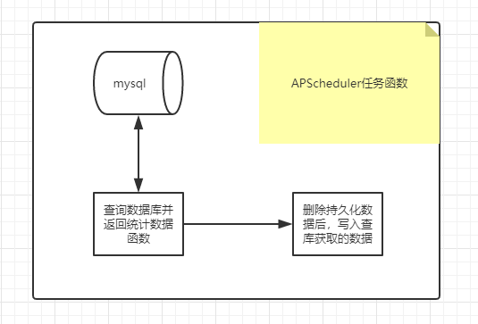

# 定时修正统计数据

> 定期进行数据库和持久化缓存数据同步

[TOC]

<!-- toc -->

## 1. 需求

> - 任务要求：
>   - 对`用户发布总数` 、`用户关注总数` 数据进行修正
>   - 每天凌晨3天，从数据库中查询并统计数据后，向redis同步，持久化保存
>   - 该任务要求使用`APScheduler`，且**以独立进程运行**

## 2. 分析

> ​	
>
> - `查询数据库并返回统计数据的函数`
>   - 因为是对持久化的统计数据进行操作，可以放入持久化数据工具类中
> - `删除持久数据后写入查库获取的统计数据函数`
>   - 因为是对持久化的统计数据进行操作，可以放入持久化数据工具类中
> - `定时任务函数`调用上述两个函数

## 3. 按分析步骤完成代码

### 3.1 完成查询数据库并返回统计数据的函数

> 在`/common/cache/statustic.py`的各个 持久化数据的工具类，创建并完成`db_query`函数
>
> > 以用户发布总数为例， `count:user:arts`中数据格式为
> >
> > ```shell
> > zset count:user:arts = [(user_id<value>, count<score>),
> > 						(user_id<value>, count<score>),
> > 						...]
> > ```
>
> - 向`news_article_basic`表查询status=2（通过审核）的所有数据，再根据user_id分组，再分别统计每个user_id有多少个article_id，返回db_query_ret
>
>   > `sql`
>   >
>   > ```sql
>   > mysql -uroot -p
>   > mysql
>   > use toutiao;
>   > 
>   > select news_article_basic.user_id, count(news_article_basic.article_id) 
>   > from news_article_basic 
>   > where status=2 
>   > group by news_article_basic.user_id;
>   > ```
>
> - 注意：把db_query函数设为静态方法，方便直接调用
>
>   - 该函数只是查询数据库并返回，且不需要入参，也用不上其他类属性
>
> - 参考代码
>
>   > 在`/common/cache/statustic.py`中
>
> ```python
> ......
> from sqlalchemy import func
> from models.user import Relation
> from models.news import Article
> from models import db
> ......
> class UserArticleCountStorage(BaseCountStorage):
>     """用户发布总数工具类"""
>     key = 'count:user:arts'
> 
>     @staticmethod
>     def db_query():
>         """查询数据库，返回（所有用户发布总数）统计数据
>         根据user_id向news_article_basic表查询status=2（通过审核）的所有数据，
>         再根据user_id分组，
>         再分别统计每个user_id有多少个article_id，返回db_query_ret
>         :return: db_query_ret=[(user_id, count), (user_id, count), (user_id, count), ...]
>         """
>         # select user_id, count(article_id) from news_article_basic
>         # where status=2 group by user_id
>         # 使用了sqlalchemy.func.count 就必须使用 db.session
>         db_query_ret = db.session.query(Article.user_id, func.count(Article.id)).\
>             filter(Article.status==Article.STATUS.APPROVED).\
>             group_by(Article.user_id).all()
>         return db_query_ret
> 
> 
> class UserFollowingCountStorage(BaseCountStorage):
>     """用户关注总数工具类"""
>     key = 'count:user:following'
> 
>     @staticmethod
>     def db_query():
>         """查询数据库，返回（所有用户关注总数）统计数据"""
> 
>         # select user_relation.user_id, count(user_relation.target_user_id)
>         # from user_relation
>         # where user_relation.relation=1 group by by user_relation.user_id
>         db_query_ret = db.session.query(Relation.user_id, func.count(Relation.target_user_id)).\
>             filter(Relation.relation==Relation.RELATION.FOLLOW).\
>             group_by(Relation.user_id)
>         return db_query_ret
> ```
>

### 3.2 完成删除持久数据后写入查库获取的统计数据函数

> 在`/common/cache/statustic.py`的`BaseCountStorage`类中完成`reset`函数
>
> > 直接在`BaseCountStorage`基类中完成所有子类都能调用的方法：重置redis的持久化数据
> >
> > - 先删除 redis中持久化的数据
> > - 再写入 数据库查询获取的数据
> >   - `BaseCountStorage`的子类的`db_query`函数的返回值作为入参
>
> - 注意点：
>   - 考虑使用redis_master.pipeline()
>   - 考虑reset函数设置为类方法
>     - 最终apscheduler定时任务函数中调用reset函数，类方法可以直接调用无需实例化
>
> - 参考代码
>
>   > 在`/common/cache/statustic.py`的`BaseCountStorage`类中
>
> ```python
>     ......
>     @classmethod
>     def reset(cls, db_query_ret):
>         """重置redis中持久化存储的统计数据
>         # 先删除 redis中持久化的数据
>         # 再写入 数据库查询获取的数据
>         :param db_query_ret: 统计数据工具类的自定义db_query函数的返回值[(user_id, count), ...]
>         :return:
>         """
>         # 可以复用flask_app中配置好的redis_master
>         # 通过toutiao/__init_.py中的create_app函数返回flask_app
>         # 考虑使用redis管道操作
>         p = current_app.redis_master.pipeline()
>         p.delete(cls.key) # 删除 zset key
> 
>         # zadd key score1 value1 score2 value2 ...
>         # 写入 zset key 方式一
>         redis_data = []
>         for user_id, count in db_query_ret:
>             redis_data.append(count)
>             redis_data.append(user_id)
>         p.zadd(cls.key, *redis_data) # *redis_data 表示参数解包
>         # 写入 zset key 方式二
>         # for user_id, count in db_query_ret:
>         #     p.zadd(cls.key, count, user_id)
>         p.execute() # 执行管道命令 
> ......
> ```
>
> 

### 3.3 完成持久化数据同步逻辑的定时任务

> 创建`/scheduler/main.py`
>
> - 导入/common/cache/statistic.py，分别调用各个统计数据的db_query和reset函数
>
> - **注意**：
>
>   > 调用/common/cache/statustic.py 中的  reset() 和 db_query() 使用了 
>   >
>   > - db.session对象
>   > - redis操作对象
>   >
>   > 思考：上哪去弄这两个东西呢？
>   >
>   > - `toutiao/__init__.py`中有创建flask_app的工厂函数
>   >   - 可以直接调用该函数，生成flask_app
>   >   - 从common/settings/default.py中拿到DefaultConfig配置对象
>   >
>   > - 假设我们已经创建了flask_app
>   >   - 拿就可以在 with flask_app.app_context() 其应用环境中完成逻辑
>
> - 完整代码

#### 3.3.1 完成APScheduler定时任务主逻辑代码

> 在`/scheduler/main.py`中
>
> ```python
> from apscheduler.schedulers.blocking import BlockingScheduler
> from apscheduler.executors.pool import ThreadPoolExecutor
> 
> def fix_statistics():
>     print('hahahah')
>     
> """第1部分. 创建并配置定时任务调度器，添加任务函数并执行"""
> # 执行器 线程池3个线程
> executors = {'default': ThreadPoolExecutor(3)}
> # 创建阻塞的调度器对象
> scheduler = BlockingScheduler(executors=executors)
> # 添加定时任务
> # scheduler.add_job(fix_statistics, 'cron', hour=3) # 在每天的凌晨3点执行
> # date触发器，不传时间参数，就立刻执行
> scheduler.add_job(fix_statistics, 'date') # 测试使用
> 
> """执行定时任务"""
> if __name__ == '__main__':
>     scheduler.start() # 阻塞，任务完成也不退出
> ```

#### 3.3.2 初步完成定任务函数并测试运行

> 在`/scheduler/main.py`中
>
> ```python
> ......
> """第2部分. 定时任务函数"""
> from cache import statistic
> def fix_statistics():
>     """ 定时任务函数 同步持久化存储的统计数据：调用持久化统计数据工具类的方法"""
>     # 对用户发布总数进行数据同步
>     db_query_ret = statistic.UserArticleCountStorage.db_query()
>     statistic.UserArticleCountStorage.reset(db_query_ret)
>     # 对用户关注总数进行数据同步
>     db_query_ret = statistic.UserFollowingCountStorage.db_query()
>     statistic.UserFollowingCountStorage.reset(db_query_ret)
> 
> """第1部分. 创建并配置定时任务调度器，添加任务函数并执行"""
> ......
> ```
>
> - 运行/scheduler/main.py报错：
>
>   ```shell
>   RuntimeError: No application found. Either work inside a view function or push an application context. 
>   ```
>
>   - 缺少application！要么工作在一个`view function`中，要么必须`push an application context`
>     - 问题的本质是：调用/common/cache/statustic.py 中工具类的  reset() 和 db_query() 使用了 
>       - db.session对象
>       - redis操作对象
>   - **那我们就可以给它一个 `flask application`！**
>     - 思考：上哪去弄这`flask app`呢？

#### 3.3.3 提供`flask_application`

> 思考：哪里有现成的flask_app呢？
>
> - 分析
>   - `toutiao/__init__.py`中有创建flask_app的工厂函数
>     - 可以直接调用该函数，生成flask_app
>     - 从`common/settings/default.py`中拿到`DefaultConfig配置对象`
>     - 这样就可以使用 `with flask_app.app_context()`下，其`flask app`上下文应用环境中，就有了`db.session对象`和`redis操作对象`
>
> - 在`/scheduler/main.py`中
>
>   ```python
>   ......
>   """第3部分. 生成flask_app
>   在with flask_app.app_context()中，就包含了db.session和redis_master及其配置"""
>   from toutiao import create_app
>   from settings.default import DefaultConfig
>   
>   flask_app = create_app(DefaultConfig)
>   # 创建定时任务中需要使用到的数据库对象和redis对象
>   # 可以通过调用create_app方法，创建flask app，会连带初始化数据库db对象和redis对象
>   # with flask_app.app_context()
>   
>   """第2部分. 定时任务函数"""
>   from cache import statistic
>   def fix_statistics():
>       """ 定时任务函数 同步持久化存储的统计数据：调用持久化统计数据工具类的方法"""
>       with flask_app.app_context():
>           # 对用户发布总数进行数据同步
>           db_query_ret = statistic.UserArticleCountStorage.db_query()
>           statistic.UserArticleCountStorage.reset(db_query_ret)
>           ......
>   ```
>
> - **测试运行**
>
>   > 在pycharmIDE中直接右键运行能跑通，那并不算真的能跑通！我们的需求是把定时数据同步任务做成独立进程，我们还**需要在命令行终端进行运行测试**。抛出异常如下：
>   >
>   > ```shell
>   > ......
>   >     from toutiao import create_app
>   > ModuleNotFoundError: No module named 'toutiao'
>   > ```
>
>   - 分析异常
>     - pycharm里能够导入`/toutiao`是因为把整个`toutiao-backend`项目的导包路径都作为导包路径了
>     - `scheduler/main.py`又需要独立运行，python默认只能从运行的位置同级和向下导入包模块
>     - 如果要是能够在执行代码的过程中，把整个项目路径也添加到导包环境中就解决了！
>       - 在python提供了`sys.path.insert`函数来添加导包路径

#### 3.3.4 把特定的路径添加到导包路径

> 在`/scheduler/main.py`中
>
> > - 通过`当前运行文件`定位到`项目文件夹`的路径
> > - 再通过`sys.path.insert`函数将`项目文件夹`的路径添加导包路径
> > - 这样当前文件一旦执行，就会先把`项目文件夹`的路径添加导包路径中，就可以找到`toutiao-backend/toutiao`包了！
> >
> > ```python
> > import os
> > import sys
> > from apscheduler.schedulers.blocking import BlockingScheduler
> > from apscheduler.executors.pool import ThreadPoolExecutor
> > 
> > """第4部分. 准备导包环境"""
> > # todo 当前是启动文件，所以导包路径是当前路径；从哪里执行就从哪里导包，python默认把向下的路径添加到导包环境变量中
> > # BASE_DIR = 上一级文件夹路径(上一级文件夹路径(当前文件)) == toutiao-backend
> > BASE_DIR = os.path.dirname(os.path.dirname(os.path.abspath(__file__)))
> > # 添加到导包路径中(toutiao-backend) == 把toutiao-backend添加到导包路径的环境变量中
> > sys.path.insert(0, os.path.join(BASE_DIR))
> > 
> > ......
> > ```
>
> - 再次测试运行发现找不到`toutiao-backend/common/settings`文件夹
>
>   ```shell
>   ......    
>       from settings.default import DefaultConfig
>   ModuleNotFoundError: No module named 'settings'
>   ```
>
> - 还是同样的思路，在代码中把`toutiao-backend/common/`添加到导包路径中
>
>   ```python
>   ......
>   """第4部分. 准备导包环境"""
>   # todo 当前是启动文件，所以导包路径是当前路径；从哪里执行就从哪里导包，python默认把向下的路径添加到导包环境变量中
>   # BASE_DIR = 上一级文件夹路径(上一级文件夹路径(当前文件)) == toutiao-backend
>   BASE_DIR = os.path.dirname(os.path.dirname(os.path.abspath(__file__)))
>   # 添加到导包路径中(toutiao-backend) == 把toutiao-backend添加到导包路径的环境变量中
>   sys.path.insert(0, os.path.join(BASE_DIR))
>   # 添加到导包路径中(拼接路径(toutiao-backend, common)) == 把toutiao-backend/common添加到导包路径的环境变量中
>   sys.path.insert(0, os.path.join(BASE_DIR, 'common'))
>   ......
>   ```
>
> - 测试运行成功！

## 4. 测试运行的方法

> ```shell
> ssh root@192.168.xx.xxx # 连接远程centos服务器
> # 输入密码chuanzhi
> source /home/python/.virtualenv/toutiao/bin/activate # 切换进虚拟环境
> cd /home/python/toutiao-backend/scheduler # 进入定时任务启动文件所在路径
> python main.py # 运行
> # ctrl + C 停止当前进程
> ```

## 5. 最终完成参考代码

#### 5.1 `/common/cache/statustic.py`

> ```python
> class BaseCountStorage():    
>     ......
>     @classmethod
>     def reset(cls, db_query_ret):
>         """重置redis的持久化数据：先删除，再写入
>         由定时任务调用的重置数据方法
>         /scheduler/statistic.py/__fix_statistics()调用此函数
>         :param db_query_ret: cls.db_query()函数返回的结果
>             db_query_ret = [(user_id, count), (user_id, count), (user_id, count), ...]
>         :return:
>         """
>         # todo 注意啊！此函数中的current_app跟同类其他函数的current_app那不是一个flask_app!
>         #  谁调用函数，函数中的current_app就从哪来！
>         #  /scheduler/statistic.py/__fix_statistics()调用本函数时，先with flask_app.app_context()!!
>         pl = current_app.redis_master.pipeline()
>         pl.delete(cls.key)
> 
>         # 方式一：向zset_key中一次写入一个 (value, score) == (user_id, count)
>         # for user_id, count in db_query_ret:
>         #     pl.zadd(cls.key, count, user_id)
> 
>         # 方式二：一次性写入一整个zset_key
>         redis_data = []
>         for user_id, count in db_query_ret:
>             redis_data.append(count)
>             redis_data.append(user_id)
>         # 此时 redis_data = [count1, user_id1, count2, user_id2, ..]
>         pl.zadd(cls.key, *redis_data) # func(*args)参数解包 args是列表或元祖，等价于把全部元素按顺序向func传参
>         # pl.zadd(cls.key, count1, user_id1, count2, user_id2, ..]
> 
>         pl.execute()
> 
> 
> class UserArticleCountStorage(BaseCountStorage):
>     """用户发布总数工具类"""
>     key = 'count:user:arts'
> 
>     @staticmethod
>     def db_query():
>         """
>         根据user_id向news_article_basic表查询status=2（通过审核）的所有数据，
>         再根据user_id分组，
>         再分别统计每个user_id有多少个article_id，返回db_query_ret
>         :return: db_query_ret=[(user_id, count), (user_id, count), (user_id, count), ...]
>         """
>         # select user_id, count(article_id) from news_article_basic
>         # where status=2 group by user_id
>         # 使用了sqlalchemy.func.count 就必须使用 db.session
>         return db.session.query(Article.user_id, func.count(Article.id))\
>             .filter(Article.status == Article.STATUS.APPROVED)\
>             .group_by(Article.user_id).all()
> 
> 
> class UserFollowingCountStorage(BaseCountStorage):
>     """用户关注总数工具类"""
>     key = 'count:user:following'
>     @staticmethod
>     def db_query():
>         return db.session.query(Relation.user_id, func.count(Relation.target_user_id)) \
>             .filter(Relation.relation == Relation.RELATION.FOLLOW)\
>             .group_by(Relation.user_id).all()
> 
> ```

#### 5.2 `/scheduler/main.py`

> ```python
> import os
> import sys
> from apscheduler.schedulers.blocking import BlockingScheduler
> from apscheduler.executors.pool import ThreadPoolExecutor
> 
> """第4部分. 准备导包环境"""
> # todo 当前是启动文件，所以导包路径是当前路径；从哪里执行就从哪里导包，python默认把向下的路径添加到导包环境变量中
> # BASE_DIR = 上一级文件夹路径(上一级文件夹路径(当前文件)) == toutiao-backend
> BASE_DIR = os.path.dirname(os.path.dirname(os.path.abspath(__file__)))
> # 添加到导包路径中(toutiao-backend) == 把toutiao-backend添加到导包路径的环境变量中
> sys.path.insert(0, os.path.join(BASE_DIR))
> # 添加到导包路径中(拼接路径(toutiao-backend, common)) == 把toutiao-backend/common添加到导包路径的环境变量中
> sys.path.insert(0, os.path.join(BASE_DIR, 'common'))
> 
> """第3部分. 生成flask_app
> 在with flask_app.app_context()中，就包含了db.session和redis_master及其配置"""
> from toutiao import create_app
> from settings.default import DefaultConfig
> 
> flask_app = create_app(DefaultConfig)
> # 创建定时任务中需要使用到的数据库对象和redis对象
> # 可以通过调用create_app方法，创建flask app，会连带初始化数据库db对象和redis对象
> # with flask_app.app_context()
> 
> """第2部分. 定时任务函数"""
> from cache import statistic
> def fix_statistics():
>     """ 定时任务函数 同步持久化存储的统计数据：调用持久化统计数据工具类的方法"""
>     with flask_app.app_context():
>         # 对用户发布总数进行数据同步
>         db_query_ret = statistic.UserArticleCountStorage.db_query()
>         statistic.UserArticleCountStorage.reset(db_query_ret)
>         # 对用户关注总数进行数据同步
>         db_query_ret = statistic.UserFollowingCountStorage.db_query()
>         statistic.UserFollowingCountStorage.reset(db_query_ret)
> 
> """第1部分. 创建并配置定时任务调度器，添加任务函数并执行"""
> # 执行器 线程池3个线程
> executors = {'default': ThreadPoolExecutor(3)}
> # 创建阻塞的调度器对象
> scheduler = BlockingScheduler(executors=executors)
> # 添加定时任务
> # scheduler.add_job(fix_statistics, 'cron', hour=3) # 在每天的凌晨3点执行
> # date触发器，不传时间参数，就立刻执行
> scheduler.add_job(fix_statistics, 'date') # 测试使用
> 
> """执行定时任务"""
> if __name__ == '__main__':
>     scheduler.start() # 阻塞，任务完成也不退出
> ```

