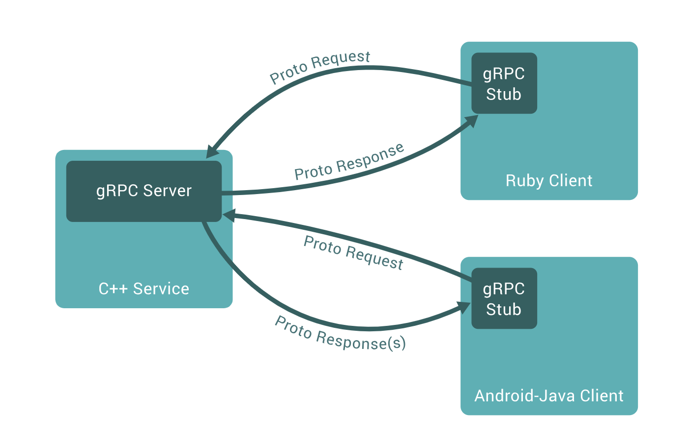

# gRPC

[TOC]

<!-- toc -->

## 1. 了解gRPC

> gRPC是由Google公司开源的高性能RPC框架。gRPC的消息协议使用Google自家开源的Protocol Buffers协议机制（proto3）进行数据序列化
>
> 
>
> - 优点
>
>   > - gRPC支持多语言和多平台
> >   - gRPC原生使用C、Java、Go进行了三种实现，而C语言实现的版本进行封装后又支持C++、C#、Node、ObjC、 Python、Ruby、PHP等开发语言
>   >   - 支持的平台包括：Linux、Android、iOS、MacOS、Windows
>   > - **gRPC基于http2.0标准, 支持双向流和多路复用**
> >   - 关于HTTP协议，如下图
>   >
> > 
> - toutiao项目为什么要选择RPC作为web系统和推荐系统的交互工具呢？
>   > - 把推荐系统封装成工具类或函数
>   >   - 两个系统耦合性太高 在web代码中包含了推荐系统的具体实现代码，关联性太高
>   >   - 本地调用
>   > - HTTP调用 把推荐系统当做单独的一个项目，独立运行部署，web直接调用
>   >   - 网络调用 HTTP接口
>   >     - 因HTTP自身协议要求，会发送很多请求及响应描述信息，跟rpc比效率相对较低
>   > - RPC调用
>   >   - 将网络调用封装的如同本地函数调用一样
>   >   - 网络上传输的调用数据 能节省很多描述信息所占用的字节
>   >   - rpc不像http，不具有严格协议，只要双方自行约定能调用就行
>
> - toutiao整个项目中有两个子系统之间的调用:
>
>   > - web系统向推荐系统请求并获取推荐文章，具体场景在
>   >   - 首页-文章推荐
>   >   - 详情页-猜你喜欢
>   > - im系统从AI系统中获取智能回复（nlp chat bot）
>
> - [【课后阅读】](https://www.jianshu.com/p/b0343bfd216e)


## 2. gRPC安装和使用流程

> - grpc安装
>
> ```shell
> pip install grpcio # python使用grpc的模块
> pip install grpcio-tools # 实现protocol buffer编译器、用于从.proto文件生成服务端和客户端代码的插件模块
> ```
>
> - 使用流程
> - 根据proto3协议对应的`接口定义语言`来描述接口需求
>   - 用proto3语法写一个proto文件
>   - 使用gRPC的编译器生成对应平台的客户端和服务端代码
>     - 用命令行生成python代码
>   - 实现客户端和服务端的具体逻辑
>     - 完成客户端和服务端的代码
>
> > 接下来我们就按照grpc的使用流程一步一步来学习

