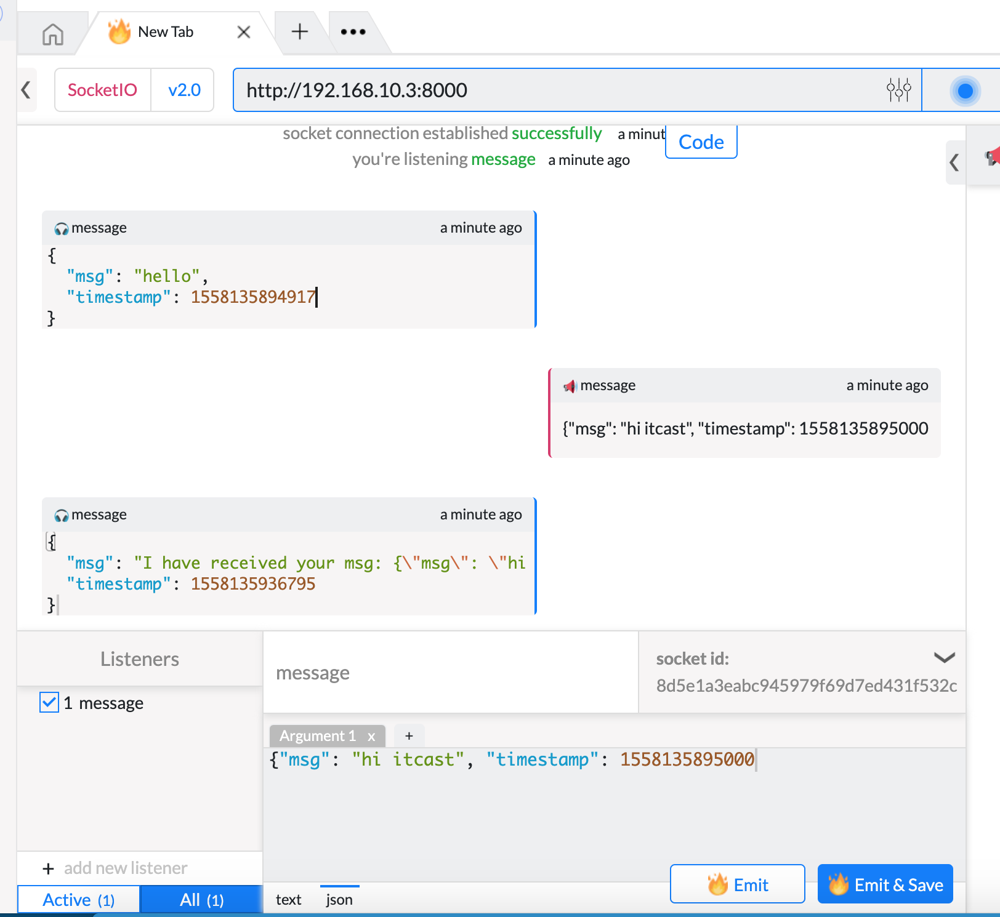

# [课后作业]头条聊天服务实现

[TOC]

<!-- toc -->

## 1. 项目需求

> - 模拟调用nlp聊天bot函数
>
>   ```python
>   def return_msg(data):
>       return 'I have received your msg: {}'.format(data), round(time.time()*1000)
>   ```
>
> - 独立进程，以命令行方式启动，启动时指定端口
>
> - IM服务端和客户端都监听`message`事件

## 2. 分析步骤

> - eventlet.monkey_patch猴子补丁
> - 创建sio服务对象，指定异步模式为eventlet
>   - `socketio.Server(async_mode='eventlet')`
> - 完成事件处理函数
>   - connect事件
>   - message事件
>     - 模拟调用nlp聊天bot函数
> - 通过命令行获取端口号
>   - `port = int(sys.argv[1]) # 如果len(sys.argv)<2 就exit(1)退出程序`
> - 创建使用sio应用对象
>   - `socketio.Middleware(sio服务对象)`
> - 创建监听对象
>   - `eventlet.listen(('', 指定的端口号))`
> - 启动服务
>   - `eventlet.wsgi.server(监听对象, sio应用对象)`

## 3. 完整代码

> 在toutiao-backend/im目录中创建server.py
>
> ```python
> def return_msg(data):
>     return 'I have received your msg: {}'.format(data), round(time.time()*1000)
> 
> import eventlet
> eventlet.monkey_patch()
> 
> import sys
> import time
> import socketio
> import eventlet.wsgi
> 
> # 创建sio对象
> sio = socketio.Server(async_mode='eventlet')
> 
> 
> """定义事件处理方法"""
> @sio.on('connect')
> def on_connect(sid, environ):
>     """
>     与客户端建立好连接后被执行
>     """
>     print('sid={}'.format(sid))
>     print('environ={}'.format(environ))
>     msg_data = {
>         'msg': 'hello',
>         'timestamp': round(time.time()*1000)
>     }
>  sio.emit('message', msg_data, room=sid)
> 
> @sio.on('message')
>    def on_message(sid, data):
>     """
>     接收message事件消息时执行
>     """
>     print('sid={} data={}'.format(sid, data))
>     """就在这个位置 调用NLP聊天bot的相关函数 
>     对data进行处理后 返回msg"""
>     msg, timestamp = return_msg(data)
>     msg_data = {
>         'msg': msg,
>         'timestamp': timestamp
>  }
>  sio.send(msg_data, room=sid)
>  # sio.emit('message', msg_data, room=sid)
> 
>    """通过命令行启动sio服务，并通过命令行指定端口"""
>    # 获取命令行参数，目的是想让im服务运行的端口在启动程序时指定
> if len(sys.argv) < 2: # 如果收到的参数小于2
>  print('ERROR: NO PORT! ')
>  exit(1) # 退出当前进程
> # socketio服务器运行的地址
> port = int(sys.argv[1])
> SERVER_ADDRESS = ('', port)
> 
> # 启动socketio服务器
> app = socketio.Middleware(sio)
>    sock = eventlet.listen(SERVER_ADDRESS)
> eventlet.wsgi.server(sock, app)
> ```

## 4. 独立进程启动IM聊天服务

> ssh连接远程服务器后，以独立进程启动聊天服务
>
> ```shell
> ssh root@192.168.45.128
> cd /home/python/toutiao-backend/im
> source /home/python/.virualenv/toutiao/bin/activate
> python server.py 8090 # 指定8090端口启动socketio聊天服务
> ```

## 5. 使用firecamp谷歌浏览器插件进行测试

> 


