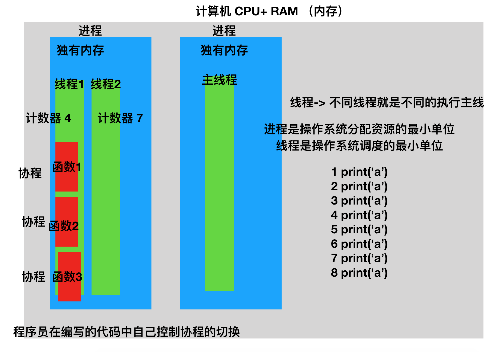
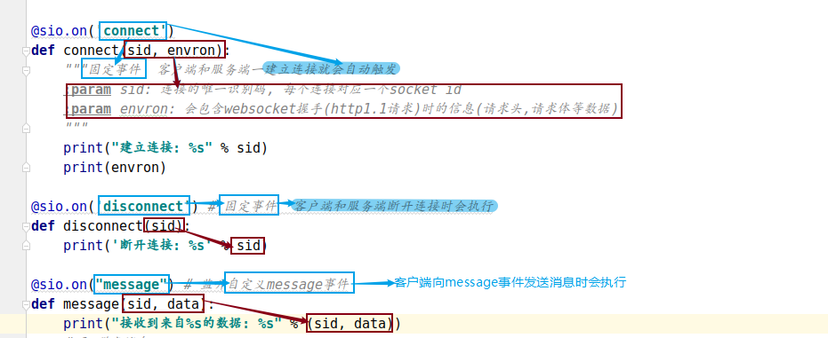
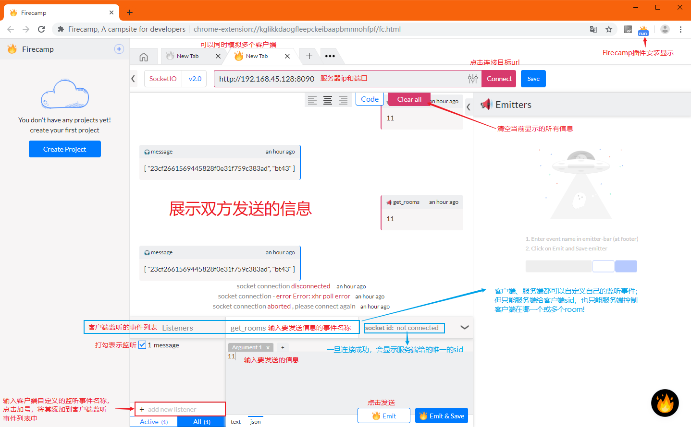

# Socket.IO

[TOC]

<!-- toc -->

## 1. `Socket.IO`简介

> **Socket.IO 本是一个面向实时 web 应用的 JavaScript 库，现在已成为拥有众多语言支持的Web即时通讯应用的框架。**
>
> Socket.IO 主要使用WebSocket协议。但是如果需要的话，Socket.io可以回退到几种其它方法，例如Adobe Flash Sockets，JSONP拉取，或是传统的AJAX拉取，并且在同时提供完全相同的接口。尽管它可以被用作WebSocket的包装库，它还是提供了许多其它功能，比如广播至多个套接字，存储与不同客户有关的数据，和异步IO操作。
>
> **Socket.IO  不等价于 WebSocket，一旦发现不能使用websocket协议时，就改用长轮询**，WebSocket只是Socket.IO实现即时通讯的其中一种技术依赖，而且Socket.IO还在实现WebSocket协议时做了一些调整。
>
> - 优点：
>
>   Socket.IO 会自动选择合适双向通信协议，仅仅需要程序员对套接字的概念有所了解。
>
>   有Python库的实现，可以在Python实现的Web应用中去实现IM后台服务。
>
> - 缺点：
>
>   Socket.io并不是一个基本的、独立的、能够回退到其它实时协议的WebSocket库，它实际上是一个依赖于其它实时传输协议的自定义实时传输协议的实现。该协议的协商部分使得支持标准WebSocket的客户端不能直接连接到Socket.io服务器，并且支持Socket.io的客户端也不能与非Socket.io框架的WebSocket或Comet服务器通信。因而，Socket.io要求客户端与服务器端均须使用该框架。
>
> - **总结**
>
>   > socket.io是基于websocket协议的一套成熟的解决方案
>   >
>   > - 优点
>   >   - 性能好
>   >   - 支持多平台多语言
>   > - 缺点
>   >   - 传输的数据并不完全遵循websocket协议, 这就要求客户端和服务端都必须使用socket.io解决方案

## 2. `scoket.io`与协程

> scoketio解决的是网络通信问题，网络通讯整个过程最浪费时间的就是等待数据的传输（网络IO），所以在python中，socketio一般都配合协程一起使用！
>
> - 补充知识点：图解进程、线程、协程
>
>   > 
>
> - python的协程库会帮助我们的代码控制协程自动切换，常见的python协程库
>   - eventlet 第三方模块 从python2开始就很流行
>   - asyncio 从python35版本开始加入原生模块

## 3. `socket.io`在python中的基本使用

> flask有第三扩展插件模块flask-socketio，是基于python-socketio模块的封装，我们选择后者来进行学习。
>
> 文档地址<https://python-socketio.readthedocs.io/en/latest/server.html>。

### 3.1 模块安装

> ```python
> pip install python-socketio # 安装和导包名字不一样 import socketio
> pip install eventlet  # eventlet包提供了协程的支持
> ```

### 3.2 python代码实现socketio服务

#### 3.2.1 python实现的socketio服务端代码

> ```python
> from eventlet import monkey_patch
> # 1. 猴子补丁 把所有IO操作重写 把同步处理改为异步处理 支持协程
> monkey_patch()
> 
> import socketio
> import eventlet.wsgi
> 
> # 2. 创建sio服务对象
> sio = socketio.Server(async_mode='eventlet')
> # 3. 创建使用sio服务对象的应用对象
> app = socketio.Middleware(sio)
> # 4. 创建监听对象
> socket = eventlet.listen(('', 8090))
> # 5.启动阻塞服务，利用监听对象 和sio应用对象
> # eventlet.wsgi.server(socket, app)
> 
> @sio.on('connect')
> def connect(sid, envron):
>  """固定事件  客户端和服务端一建立连接就会自动触发
>  :param sid: 连接的唯一识别码, 每个连接对应一个socket id
>  :param envron: 会包含websocket握手(http1.1请求)时的信息(请求头,请求体等数据)
>  """
>  print("建立连接: %s" % sid)
>  print(envron)
> 
> @sio.on('disconnect') # 固定事件  客户端和服务端断开连接时会执行
> def disconnect(sid):
>  print('断开连接: %s' % sid)
> 
> @sio.on("message") # 监听自定义message事件
> def message(sid, data):
>  print('接收到数据：%s' % data)
>  # 1. 群发消息
>  sio.send('老地方见')
>  # 2. 通过room参数 给指定的客户端发送消息
>  # 2.1 如果room=sid 就给sid用户发消息
>  sio.send('再见1', room=sid)
>  # sio.emit('add', '再见2', room=sid) # 向add事件信息通道发送消息
>  # 2.2 如果room=room_id 就给指定的房间发消息 加入房间的所有用户将收到消息
>  sio.send('再见3', room='bt43')
>  # sio.emit('add', '再见4', room='bt43')
> 
> @sio.on('enter_room_bt43') # 自定义enter_room_bt43事件
> def enter_room_bt43(sid, data):
>  sio.enter_room(sid, 'bt43')
>  print('用户{} 进入bt43房间'.format(sid))
> 
> @sio.on('leave_room_bt43') # 自定义leave_room_bt43事件 离开房间
> def leave_room_bt43(sid, data):
>  sio.leave_room(sid, 'bt43')
>  print('用户{} 离开bt43房间'.format(sid))
> 
> @sio.on('get_rooms')    #  自定义get_rooms事件 获取当前连接所在的房间
> def get_rooms(sid, data):
>  rooms = sio.rooms(sid)
>  print(rooms)
>  sio.send(rooms[0], rooms=sid)
>  # sio.send(rooms, rooms=sid) # 全体收到消息，rooms参数失效
> 
> # 启动服务
> eventlet.wsgi.server(socket, app)
> ```

#### 3.2.2 搭建socketio服务的步骤

> - eventlet.monkey_patch猴子补丁
> - 创建sio服务对象，指定异步模式为eventlet
>   - `socketio.Server(async_mode='eventlet')`
> - 创建使用sio应用对象
>   - `socketio.Middleware(sio服务对象)`
> - 创建监听对象
>   - `eventlet.listen(('', 8090))`
> - 启动服务
>   - `eventlet.wsgi.server(监听对象, sio应用对象)`

#### 3.2.3 监听事件的方法

> - 使用`sio应用对象.on('事件')`来装饰监听事件的函数
>
>   
>
> - connect事件
>   - sid参数：用户的唯一id
>   - envron参数：用户的请求头信息
> - disconnect事件
>   - sid
> - 自定义事件（默认为message事件)
>   - sid
>   - data：用户发送的数据

#### 3.2.4 向用户发送消息的方法

> ```python
> sio.send('信息')  # 广播，向所有监听默认事件message的用户发送信息
> sio.send("信息", room=sid) # 向指定sid的用户发送信息
> sio.send("信息", room='bt43') # 向被分配到bt43房间的所有用户发送信息
> sio.emit('add', '信息')  # 向所有监听add事件的用户发送信息
> sio.emit('add', "信息", room=sid) # 向监听add事件的指定sid的用户发送信息
> sio.emit('add', "信息", room='bt43') # 向被分配到bt43房间，且监听add事件的所有用户发送信息
> ```

- sio.send和sio.emit区别：send默认message事件，emit指定事件

#### 3.2.5 其他常用方法

> ```python
> sio.enter_room(sid, 'bt43') # 让指定用户加入bt43房间
> sio.leave_room(sid, 'bt43') # 让指定用户离开bt43房间
> rooms_list = sio.rooms(sid) # 获取指定用户加入的所有房间，返回列表
> ```

## 4. 使用Firecamp测试socketio

> python也有实现websocket客户端的包模块，比如`socketIO_client`（`pip install socketio-client-2`），但可以使用更简单的测试工具：`Firecamp`，一个可以运行在谷歌浏览器上，用于测试websocket的插件。
>
> 


