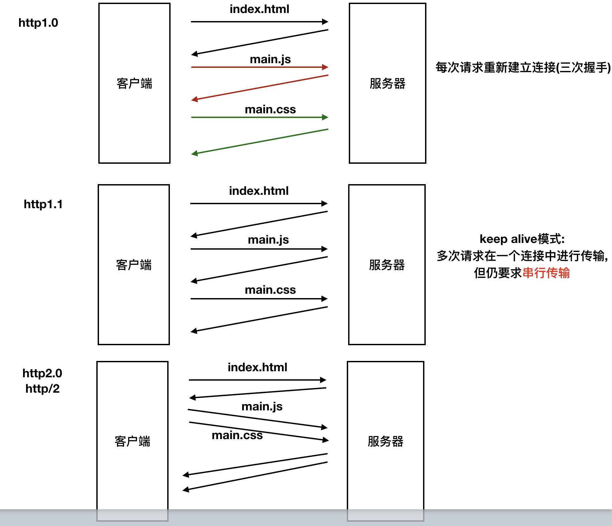
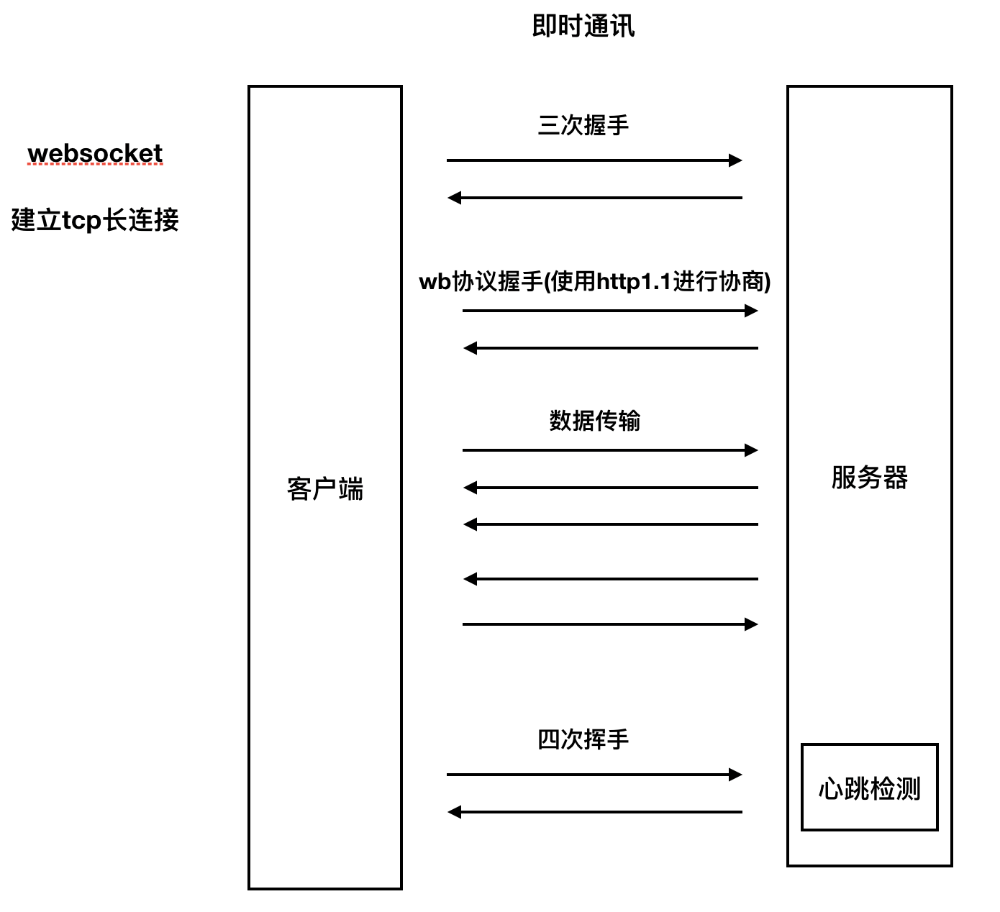
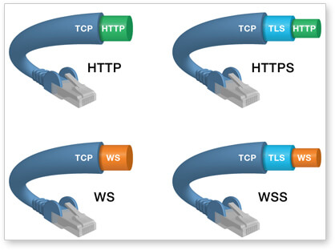

# 即时通讯和WebSocket

> **HTML5定义了WebSocket协议**，能更好的节省服务器资源和带宽，并且能够更实时地进行通讯。
>
> 在2008年诞生，2011年成为国际标准。现在基本所有浏览器都已经支持了。

[TOC]

<!-- toc -->

## 1. 即时通讯的需求场景

> 服务端需要主动推送消息给客户端，例如
>
> - 用户下了订单，需要在运营管理后台向运营人员推送新订单通知
> - 用户A关注了用户B，系统需要向用户B推送提示消息
> - 即时聊天

## 2. 传统的推送实现

> HTTP/1.x 不支持服务器主动推送，只能在客户端发起请求后做出回应。 （HTTP/2支持服务器主动推送，但HTTP/2 还未全面实施）
>
> 
>
> - 那么，基于HTTP 1.x 协议的传统推送方案都是怎么实现的呢？
>
>   > - 轮询
>   >
>   > 轮询是在特定的的时间间隔（如每1秒），由客户端对服务器发出HTTP请求，了解服务器有没有新的信息，然后由服务器告知有无新数据或返回最新的数据给客户端。
>   >
>   > 缺点：
>   >
>   > - 效率低下，浪费资源
>   >
>   >  必须不停连接，或者连接始终打开，但传输HTTP请求，然而HTTP请求可能包含较长的头部，其中真正有效的数据可能只是很小的一部分，显然这样会浪费很多的带宽等资源。
>   >
>   > - Comet （基于长连接）
>   >   - 长轮询
>   >     长轮询是在打开一条连接以后保持，等待服务器推送来数据再关闭的方式。
>   >   - iframe流
>   >     iframe流方式是在页面中插入一个隐藏的iframe，利用其src属性在服务器和客户端之间创建一条长链接，服务器向iframe传输数据（通常是HTML，内有负责插入信息的javascript），来实时更新页面。
>
> - 传统的推送缺点：
>
>   - 依然需要反复发出请求，而且长连接也会消耗服务器资源。
>   - 服务器处于被动，不能主动给客户端推送信息。

**在这种情况下，websocket协议就登上了历史舞台**

## 3. 了解webscoket协议

> WebSocket是一种在单个TCP连接上进行全双工通信的协议。
>
> - **在WebSocket API中，浏览器和服务器只需要完成一次握手（不是指建立TCP连接的那个三次握手，是指在建立TCP连接后传输一次握手数据），两者之间就直接可以创建持久性的连接，并进行双向数据传输。**
>
> 
>
> - Websocket使用ws或wss的统一资源标志符，类似于HTTPS，其中wss表示在TLS之上的Websocket。如：
>
> > ```
> > ws://example.com/wsapi
> > wss://secure.example.com/
> > ```
>
> - Websocket使用和 HTTP 相同的 TCP 端口，可以绕过大多数防火墙的限制。默认情况下，Websocket协议使用80端口；运行在TLS之上时，默认使用443端口。
>
>   
>
> - websocket和http都是基于tcp， http建立的是短连接, 而websocket建立的是长连接

### 3.1 WebSocket握手协议

> - WebSocket 是独立的、创建在 TCP 上的协议。但是 **Websocket 通过 HTTP/1.1 协议的101状态码进行握手。**
>   
> - 为了创建Websocket连接，需要通过浏览器发出请求，之后服务器进行回应，这个过程通常称为“握手”（handshaking）。
>   
> - 一个典型的Websocket握手请求如下：
>
>   > - 客户端请求
>   >
>   > ```http
>   > GET / HTTP/1.1
>   > Upgrade: websocket
>   > Connection: Upgrade
>   > Host: example.com
>   > Origin: http://example.com
>   > Sec-WebSocket-Key: sN9cRrP/n9NdMgdcy2VJFQ==
>   > Sec-WebSocket-Version: 13
>   > ```
>   >
>   > - 服务器回应
>   >
>   > ```http
>   > HTTP/1.1 101 Switching Protocols
>   > Upgrade: websocket
>   > Connection: Upgrade
>   > Sec-WebSocket-Accept: fFBooB7FAkLlXgRSz0BT3v4hq5s=
>   > Sec-WebSocket-Location: ws://example.com/
>   > ```
>   >
>   > - 报文解读
>   >   - Connection必须设置Upgrade，表示客户端希望连接升级。
>   >   - Upgrade字段必须设置Websocket，表示希望升级到Websocket协议。
>   >   - Sec-WebSocket-Key是随机的字符串，服务器端会用这些数据来构造出一个SHA-1的信息摘要。把“Sec-WebSocket-Key”加上一个特殊字符串“258EAFA5-E914-47DA-95CA-C5AB0DC85B11”，然后计算SHA-1摘要，之后进行BASE-64编码，将结果做为“Sec-WebSocket-Accept”头的值，返回给客户端。如此操作，**可以尽量避免普通HTTP请求被误认为Websocket协议。**
>   >   - Sec-WebSocket-Version 表示支持的Websocket版本。RFC6455要求使用的版本是13，之前草案的版本均应当弃用。
>   >   - Origin字段是可选的，通常用来表示在浏览器中发起此Websocket连接所在的页面，类似于Referer。但是，与Referer不同的是，Origin只包含了协议和主机名称。
>   >   - 其他一些定义在HTTP协议中的字段，如Cookie等，也可以在Websocket中使用。

### 3.2 WebSocket性能好开销小

> - **较少的控制开销。**在连接创建后，服务器和客户端之间交换数据时，用于协议控制的数据包头部相对较小。在不包含扩展的情况下，对于服务器到客户端的内容，此头部大小只有2至10字节（和数据包长度有关）；对于客户端到服务器的内容，此头部还需要加上额外的4字节的掩码。**相对于HTTP请求每次都要携带完整的头部，此项开销显著减少了。**
> - **更强的实时性。**由于协议是全双工的，所以**服务器可以随时主动给客户端下发数据。**相对于HTTP请求需要等待客户端发起请求服务端才能响应，延迟明显更少；即使是和Comet等类似的长轮询比较，其也能在短时间内更多次地传递数据。
> - **保持连接状态。**与HTTP不同的是，Websocket需要先创建连接，这就使得其成为一种有状态的协议，之后通信时可以省略部分状态信息。而HTTP请求可能需要在每个请求都携带状态信息（如身份认证等）。
>   更好的二进制支持。**Websocket定义了二进制帧，相对HTTP，可以更轻松地处理二进制内容。**
> - **可以支持扩展**。Websocket定义了扩展，用户可以扩展协议、实现部分自定义的子协议。如部分浏览器支持压缩等。
> - **更好的压缩效果**。相对于HTTP压缩，Websocket在适当的扩展支持下，可以沿用之前内容的上下文，在传递类似的数据时，可以显著地提高压缩率。
> - **没有同源限制，客户端可以与任意服务器通信。**
> - **可以发送文本，也可以发送二进制数据。**

**我们将学习基于websocket协议最流行的`socket.io`**

