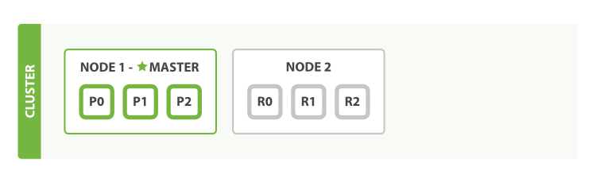
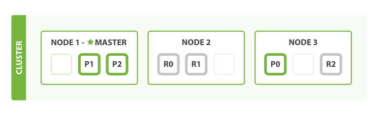
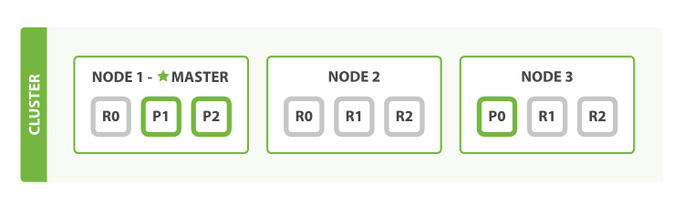
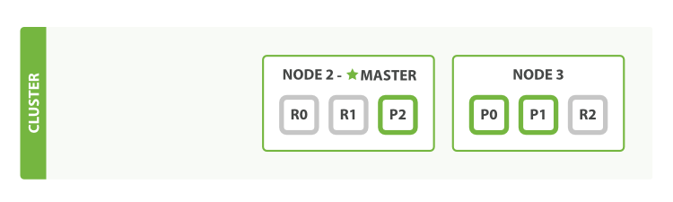

# 认识Elasticsearch

> `You know, for search!` ---- 了解Elasticsearch的概念、作用、集群
>
> 文档 <https://www.elastic.co/guide/cn/elasticsearch/guide/current/index.html

[TOC]

<!-- toc -->

## 本章节知识点总结

> - Elasticsearch既是搜索引擎, 也是数据库
>   - 主要作为索引数据库, 提高性能 (只存关系数据库的主键, 不存基础数据, 有主键就可以查到基础数据)
> - Elasticsearch版本
>   - 2.x   5.x   6.x
>   - 语法有一定区别, 不兼容
> - 特点
>   - 支持分布式  分片存储
>     - 复制 自动故障转移 
>       - 复制默认1（共2个）可以随时扩容
>     - 分片 提高吞吐
>       - 主分片默认5个 且一旦设置不能更改，主分片对应的复制分片可以随时扩容
>   - 虽然是Java开发的, 但是封装了一套http访问接口, 使用restful的设计风格  端口`9200`
>   - 文档型数据库   存字符串, 不是表, 也不是键值对
>   - 最受欢迎的搜索引擎
> - 向url发送请求来控制和使用Elasticsearch，默认端口是9200
> - Elasticsearch的层级名称是
>   - 索引库
>   - 类型映射
>   - 文档
>   - 字段

## 1. Elasticsearch简介

> **Elasticsearch是一个基于Lucene库的全文搜索引擎。**
>
> 它提供了一个分布式、支持多用户的全文搜索引擎，**具有HTTP Web接口和无模式JSON文档。**所有其他语言可以使用 **RESTful API 通过端口 *9200* 和 Elasticsearch 进行通信** 
>
> **Elasticsearch是用Java开发的**，并在Apache许可证下作为开源软件发布。官方客户端在Java、.NET（C#）、PHP、Python、Apache Groovy、Ruby和许多其他语言中都是可用的。
>
> 根据DB-Engines的排名显示，**Elasticsearch是最受欢迎的企业搜索引擎**，其次是Apache Solr，也是基于Lucene。
>
> Elasticsearch可以用于搜索各种文档。它提供可扩展的搜索，具有接近实时的搜索，并支持多租户。
>
> **Elasticsearch是分布式的**，这意味着索引可以被分成分片，每个分片可以有0个或多个副本。每个节点托管一个或多个分片，并充当协调器将操作委托给正确的分片。再平衡和路由是自动完成的。相关数据通常存储在同一个索引中，该索引由一个或多个主分片和零个或多个复制分片组成。一旦创建了索引，就不能更改主分片的数量。
>
> **Elasticsearch 是一个实时的分布式搜索分析引擎，它被用作全文检索、结构化搜索、分析以及这三个功能的组合；同时也是一个数据库**
>
> - Wikipedia 使用 Elasticsearch 提供带有高亮片段的全文搜索，还有 *search-as-you-type* 和 *did-you-mean* 的建议。
> - *卫报* 使用 Elasticsearch 将网络社交数据结合到访客日志中，实时的给它的编辑们提供公众对于新文章的反馈。
> - Stack Overflow 将地理位置查询融入全文检索中去，并且使用 *more-like-this* 接口去查找相关的问题与答案。
> - GitHub 使用 Elasticsearch 对1300亿行代码进行查询。
> - toutiao项目中用于全文检索和搜索提示。
>
>  Lucene 仅仅只是一个库，然而，Elasticsearch 不仅仅是 Lucene，并且也不仅仅只是一个全文搜索引擎。 它可以被下面这样准确的形容：
>
> - 一个分布式的实时文档存储，*每个字段* 可以被索引与搜索
> - 一个分布式实时分析搜索引擎
> - 能胜任上百个服务节点的扩展，并支持 PB 级别的结构化或者非结构化数据
>
> ##### 属于面向文档的数据库
>
> Elasticsearch 是 *面向文档* 的，意味着它存储整个对象或 *文档_。Elasticsearch 不仅存储文档，而且 _索引*每个文档的内容使之可以被检索。在 Elasticsearch 中，你 对文档进行索引、检索、排序和过滤--而不是对行列数据。
>
> **Elasticsearch 有2.x、5.x、6.x 三个大版本，我们在黑马头条中使用5.6版本。**

## 2. Elasticsearch的相关名词解释

> - 关于索引的两个概念
>
>   > 之前我们说的索引是名词，但当所以索引是动词的时候表示存储数据到 Elasticsearch 的行为
>
> - 相对于mysql来说Elasticsearch对库表数据字段有不同名称
>
>   > 一个 Elasticsearch 集群可以 包含多个 `索引（indices 数据库）`，相应的每个索引可以包含多个 `类型（type 表）` 。 这些不同的类型存储着多个 `文档（documents 数据行）` ，每个文档又有 多个 `属性*（fields 列）`。
>   >
>   > | Elasticsearch | Indices 索引库   | Types 索引类型 | Documents 文档 | Fields 字段/属性 |
>   > | ------------- | ---------------- | -------------- | -------------- | ---------------- |
>   > | mysql         | Databases 数据库 | Tables 表      | Rows 行        | Columns 列/字段  |
>

## 3. 了解Elasticsearch的集群(cluster)

> Elasticsearch 尽可能地屏蔽了分布式系统的复杂性。这里列举了一些在后台自动执行的操作：
>
> - 分配文档到不同的容器 或 *分片* 中，文档可以储存在一个或多个节点中
> - 按集群节点来均衡分配这些分片，从而对索引和搜索过程进行负载均衡
> - 复制每个分片以支持数据冗余，从而防止硬件故障导致的数据丢失
> - 将集群中任一节点的请求路由到存有相关数据的节点
> - 集群扩容时无缝整合新节点，重新分配分片以便从离群节点恢复
>
> 

### 3.1 节点(node)

> **一个运行中的 Elasticsearch 实例称为一个 节点**，而集群是由一个或者多个拥有相同 `cluster.name` 配置的节点组成， 它们共同承担数据和负载的压力。当有节点加入集群中或者从集群中移除节点时，集群将会重新平均分布所有的数据。
>
> 当一个节点被选举成为 **主节点（master）时， 它将负责管理集群范围内的所有变更**，例如增加、删除索引，或者增加、删除节点等。 而**主节点并不需要涉及到文档级别的变更和搜索等操作**，所以当集群只拥有一个主节点的情况下，即使流量的增加它也不会成为瓶颈。 任何节点都可以成为主节点。我们的示例集群就只有一个节点，所以它同时也成为了主节点。
>
> 作为用户，**我们可以将请求发送到 集群中的任何节点 ，包括主节点**。 每个节点都知道任意文档所处的位置，并且能够将我们的请求直接转发到存储我们所需文档的节点。 无论我们将请求发送到哪个节点，它都能负责从各个包含我们所需文档的节点收集回数据，并将最终结果返回給客户端。 Elasticsearch 对这一切的管理都是透明的。

### 3.2 分片(shard)

> 一个 `分片`是一个底层的`工作单元` ，它仅保存了 全部数据中的一部分。
>
> - es索引（Indices 索引库）实际上是指向一个或者多个物理 `分片`的 *逻辑命名空间* 。
>
> - 文档被存储和索引到分片内，但是应用程序是直接与索引而不是与分片进行交互。
>
> Elasticsearch 是利用分片将数据分发到集群内各处的。分片是数据的容器，文档保存在分片内，分片又被分配到集群内的各个节点里。 当你的集群规模扩大或者缩小时， Elasticsearch 会自动的在各节点中迁移分片，使得数据仍然均匀分布在集群里。

#### 3.2.1 主分片(primary shard)

> 索引内任意一个文档都归属于一个主分片，所以主分片的数目决定着索引能够保存的最大数据量。

#### 3.2.2 复制分片(副分片 replica shard)

> 一个副本分片只是一个主分片的拷贝。 副本分片作为硬件故障时保护数据不丢失的冗余备份，并为搜索和返回文档等读操作提供服务。
>
> **在索引建立的时候就已经确定了主分片数，但是副本分片数可以随时修改.。**
>
> 分片是一个功能完整的搜索引擎，它拥有使用一个节点上的所有资源的能力。 我们这个拥有6个分片（3个主分片和3个副本分片）的索引可以最大扩容到6个节点，每个节点上存在一个分片，并且每个分片拥有所在节点的全部资源。
>
> - 2 个节点
>
>   > 
>
>   
>
> - 3 个节点
>
>   > 
>
> - 拥有越多的副本分片时，也将拥有越高的吞吐量。
>
>   > 
>
> - 故障转移 failover
>
>   > - 选举新的主节点
>   > - 提升复制分片为主分片
>   >
>   > 

