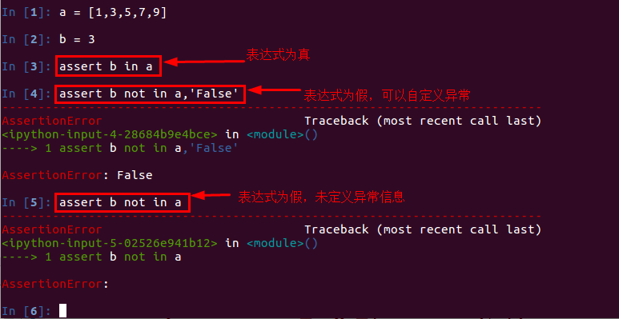

# unittest单元测试

[TOC]

<!-- toc -->

## 本章节总结

> - 黑盒测试
>
>   - 手工测试：通过手动界面操作进行程序的测试
>   - 自动化测试：通过代码自动模拟手动界面操作的测试
>   - 性能与安全测试：安全测试、渗透测试、压力测试等。。。
>
> - 白盒测试
>
>   - 通过代码来测试程序
>   - 粒度
>     - 单元测试   范围: 一个代码块, 如视图函数
>     - 集成测试   范围: 多个代码块配合 如测试令牌(先使用登录接口获取token, 再通过访问接口校验token)
>     - 系统测试  范围: 整个系统级别的测试, 包含整个系统所有的单元测试和集成测试
>     - 链路测试 范围: 多个系统构成的整个业务级别的测试, 包含以上所有测试
>   - 优点
>     - 测试代码可以复用
>     - 如果实现了测试的自动化, 就不需要开发者每次手动修改测试环境，方便代码合并审查及上线部署
>
> - unittest测试模块
>
>   - 本质是断言（预言）
>
>     - `assert  表达式 '自定义error或error'`表达式只能返回false 和 true
>
>   - unittest的使用
>
>     > ```python
>     > import unittest # python自带模块
>     > import requests
>     > class TestClass(unittest.TestCase):
>     > 
>     >     #该方法会首先执行，相当于做测试前的准备工作
>     >     def setUp(self):
>     >         pass
>     > 
>     >     #该方法会在测试代码执行完后执行，相当于做测试后的扫尾工作
>     >     def tearDown(self):
>     >         pass
>     >     
>     >     #测试代码 自定义函数名 但必须以test开头
>     >     def test_app_exists(self):
>     >         """断言：如果不给请求头，将返回403状态码
>     >         如果断言（预言）失败，就会抛出异常"""
>     >         resp = requests.get(url) 
>     >         self.assertEqual(resp.status_code, 403)
>     >     
>     > if __name__ == '__main__':
>     >     unittest.main() # 会自动运行所有测试方法
>     > ```
>
>   - unittest常用断言方法
>
>     > ```python
>     > assertEqual     #如果两个值相等，则pass
>     > assertNotEqual  #如果两个值不相等，则pass
>     > assertTrue      #判断bool值为True，则pass
>     > assertFalse     #判断bool值为False，则pass
>     > assertIsNone    #不存在，则pass
>     > assertIsNotNone #存在，则pass
>     > ```

## 1. 了解测试

### 1.1 为什么要测试

> Web程序开发过程一般包括以下几个阶段：
>
> - 需求分析
> - 设计阶段
> - 实现阶段
> - 测试阶段
>
> 其中测试阶段通过人工或自动来运行测试某个系统的功能。目的是检验其是否满足需求，并得出特定的结果，以达到弄清楚预期结果和实际结果之间的差别的最终目的。

### 1.2 测试的分类

> 测试从软件开发过程可以分为：
>
> - 单元测试
>   - 对单独的代码块(例如函数)分别进行测试,以保证它们的正确性
> - 集成测试
>   - 对大量的程序单元的协同工作情况做测试
> - 系统测试
>   - 同时对整个系统的正确性进行检查,而不是针对独立的片段
>
> 在众多的测试中，与程序开发人员最密切的就是单元测试，因为单元测试是由开发人员进行的，而其他测试都由专业的测试人员来完成。所以我们主要学习单元测试。

### 1.3 什么是单元测试

> - 程序开发过程中，写代码是为了实现需求。当我们的代码通过了编译(跑通)，只是说明它的语法正确，功能能否实现则不能保证。 因此，当我们的某些功能代码完成后，为了检验其是否满足程序的需求。可以通过编写测试代码，模拟程序运行的过程，检验功能代码是否符合预期。
> - 单元测试就是开发者编写一小段代码，检验目标代码的功能是否符合预期。通常情况下，单元测试主要面向一些功能单一的模块进行。
>   - 举个例子：一部手机有许多零部件组成，在正式组装一部手机前，手机内部的各个零部件，CPU、内存、电池、摄像头等，都要进行测试，这就是单元测试。
>
> - 在Web开发过程中，单元测试实际上就是一些“断言”（assert）代码。
>   - 断言就是判断一个函数或对象的一个方法所产生的结果是否符合你期望的那个结果。 python中assert断言是声明布尔值为真的判定，如果表达式为假会发生异常。单元测试中，一般使用assert来断言结果。

## 2. 断言方法的使用

> - 认识断言
>
>   - 断言：我认为xxxx，如果是请继续，如果不是就报错！
>   - `assert  表达式 '自定义error或error'`表达式只能返回false 和 true
>   - 
>
>   - python自带的unittest模块本质就是断言
>
> - **unittest常用的断言方法：**
>
>   > ```shell
>   > assertEqual     如果两个值相等，则pass
>   > assertNotEqual  如果两个值不相等，则pass
>   > assertTrue      判断bool值为True，则pass
>   > assertFalse     判断bool值为False，则pass
>   > assertIsNone    不存在，则pass
>   > assertIsNotNone 存在，则pass
>   > ......
>   > ```

## 3. unittest单元测试的基本写法

> **首先**，定义一个类，继承自unittest.TestCase
>
> ```python
> import unittest
> class TestClass(unittest.TestCase):
>     pass
> ```
>
> **其次**，在测试类中，定义两个测试方法
>
> ```python
> import unittest
> class TestClass(unittest.TestCase):
> 
>     #该方法会首先执行，方法名为固定写法
>     def setUp(self):
>         pass
> 
>     #该方法会在测试代码执行完后执行，方法名为固定写法
>     def tearDown(self):
>         pass
> ```
>
> **最后**，在测试类中，编写测试代码，单独运行，**`unittest.main()`会自动运行所有测试函数**
>
> ```python
> import unittest
> class TestClass(unittest.TestCase):
> 
>     #该方法会首先执行，相当于做测试前的准备工作
>     def setUp(self):
>         pass
> 
>     #该方法会在测试代码执行完后执行，相当于做测试后的扫尾工作
>     def tearDown(self):
>         pass
>     
>     #测试代码 自定义函数名 但必须以test开头
>     def test_app_exists(self):
>         pass
>     
> if __name__ == '__main__':
>     unittest.main()
> ```

## 4. 单元测试案例

> 以编写头条项目搜索业务中自动补全接口的单元测试为例。
>
> - flask框架提供了单元测试客户端：`flask_app.test_client`，配合unittest一起使用时，无需启动flask应用
>   - 同样的，你也可以requests配合unittest一起使用

### 4.1 完成unittest单元测试代码

> 在`toutiao-backend/toutiao`目录中新建 `tests`包，并在其中新建`test_search.py`文件
>
> ```python
> import os
> import sys
> 
> BASE_DIR = os.path.dirname(os.path.dirname(os.path.dirname(os.path.abspath(__file__))))
> sys.path.insert(0, os.path.join(BASE_DIR))
> sys.path.insert(0, os.path.join(BASE_DIR, 'common'))
> 
> 
> import unittest
> from toutiao import create_app
> from settings.testing import TestingConfig
> import json
> 
> 
> class SuggestionTest(unittest.TestCase):
>     """搜索建议接口测试案例"""
> 
>     def setUp(self):
>         """
>         在执行测试方法前先被执行
>         :return:
>         """
>         self.app = create_app(TestingConfig)
>         self.client = self.app.test_client()
> 
>     def test_missing_request_q_param(self):
>         """
>         测试缺少q的请求参数
>         """
>         resp = self.client.get('/v1_0/suggestion')
>         self.assertEqual(resp.status_code, 400)
> 
>     def test_request_q_param_error_length(self):
>         """
>         测试q参数错误长度
>         """
>         resp = self.client.get('/v1_0/suggestion?q='+'e'*51)
>         self.assertEqual(resp.status_code, 400)
> 
>     def test_normal(self):
>         """
>         测试正常请求
>         """
>         resp = self.client.get('/v1_0/suggestion?q=ptyhon')
>         self.assertEqual(resp.status_code, 200)
> 
>         resp_json = resp.data
>         resp_dict = json.loads(resp_json)
>         self.assertIn('message', resp_dict)
>         self.assertIn('data', resp_dict)
>         data = resp_dict['data']
>         self.assertIn('options', data)
> 
> 
> if __name__ == '__main__':
>     unittest.main()
> ```

### 4.2 单元测试的效果演示

> 修改`toutiao/resources/search/search.py`中的代码
>
> ```python
> class SuggestionResource(Resource):
>     """文章搜索联想建议：补全+纠错"""
>     def get(self):
>         """1. 先做自动补全，返回包含补全关键词的文章标题；
>         2. 如果没有补全的结果，就对关键词进行纠错，返回纠错后的关键词"""
>         qs_parser = RequestParser()
>         qs_parser.add_argument('q', type=inputs.regex(r'^.{1,60$'), required=True, location='args')
> # 这里脑子一抖，参数q的最大长度写成了60
> ```
>
> - 运行`toutiao/tests/test_search.py`文件 查看效果
>
> - 解读
>
>   > - 单元测试代码测试了查询关键字参数q的字符长度最长的情况是50（你可以理解为项目要求，就要求不能超过50）
>   > - 当项目代码中改成60后，不符合项目要求，所以测试代码抛出异常了
>   >   - 测试代码预言了51个字符的长度是错误的，但结果项目代码中61个才不对，所以项目代码错了！
>   >   - 如果你想就此案例进行精确测试的话，那就需要**设计完整且完善的测试用例**，比如在测试代码中断言q的字符长度从1到50都不应该报错
>   >     - **你会发现设计完整且完善的测试用例比写代码难多了！** 请珍惜你身边每一个能设计出近似完美的测试用例的工程师
>
> 

