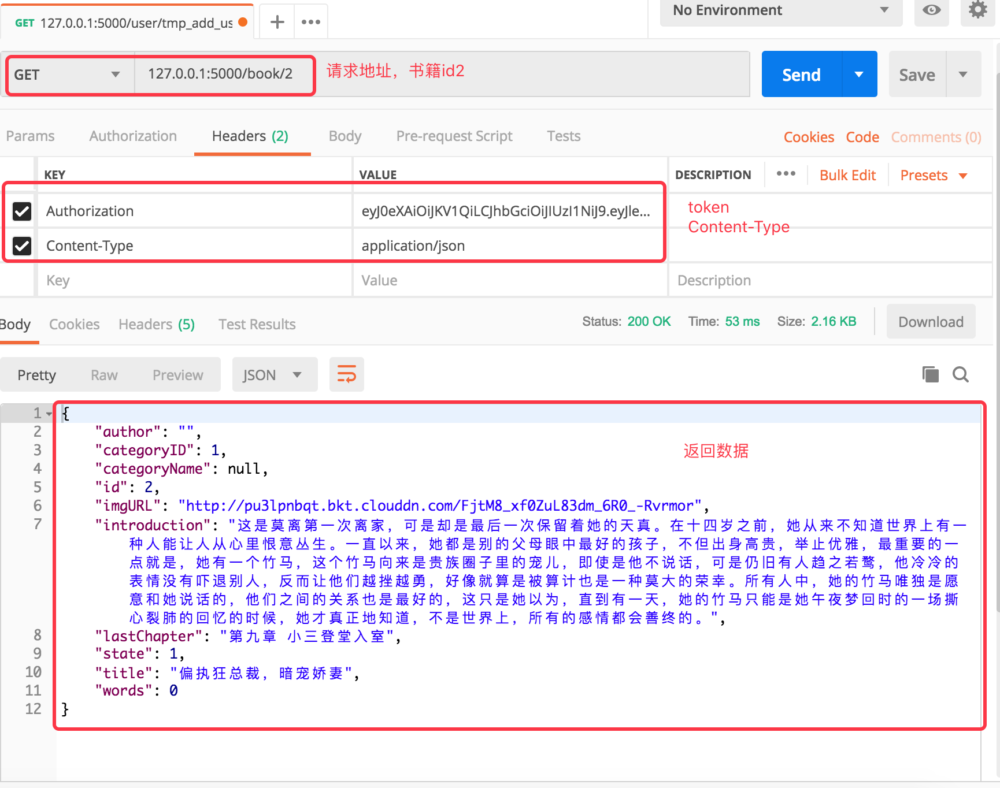

### 7.3小说-详情

- 在applet_app/book.py文件中实现业务。

#### 1-1 小说-详情接口设计

- 接口名称：小说-详情
- 接口路径：/book/:id
- 请求方法：GET
- 请求参数：

| 参数名称     | 是否必须 | 参数类型         | 参数位置    | 备注     |
| ------------ | -------- | ---------------- | ----------- | -------- |
| id           | True     | int              | URL路径参数 | 当前页数 |
| Content-Type | True     | application/json | Headers     | 参数类型 |

- 返回数据：

```python
{
    "author": "",
    "categoryID": 1,
    "categoryName": null,
    "id": 2,
    "imgURL": "http://pu3lpnbqt.bkt.clouddn.com/FjtM8_xf0ZuL83dm_6R0_-Rvrmor",
    "introduction": "这是莫离第一次离家...",
    "lastChapter": "第九章 小三登堂入室",
    "state": 1,
    "title": "偏执狂总裁，暗宠娇妻",
    "words": 0
}

```


#### 1-2 小说-详情的基本业务：

- 根据书籍id查询数据库书籍表
- 如果用户登录，查询数据库浏览记录表，判断查询结果，保存浏览记录
- 如果用户未登录，根据书籍id查询数据库书籍章节表，默认按照倒序排序
- 返回结果

#### 1-3 代码实现

1、定义book蓝图

```python
from flask import Blueprint

bp = Blueprint('book', __name__)

```

2、定义视图

```python
@bp.route('/<int:book_id>')
def detail(book_id):
    """
    获取书籍详情
    :param book_id:
    :return:
    """
    book = Book.query.get(book_id)
    if not book:
        return jsonify({'msg': '书籍不存在'}), 404

    # 添加浏览记录
    if g.user_id:
        bs = BrowseHistory.query.filter_by(user_id=g.user_id,
                                           book_id=book_id).first()
        if not bs:
            bs = BrowseHistory(user_id=g.user_id,
                               book_id=book_id)
        bs.updated = datetime.now()
        db.session.add(bs)
        db.session.commit()

    chapter = BookChapters.query.filter_by(book_id=book_id) \
        .order_by(BookChapters.chapter_id.desc()).first()
    # 返回数据
    data = {
        'id': book.book_id,
        'title': book.book_name,
        'introduction': book.intro,
        'author': book.author_name,
        'state': book.status,
        'categoryID': book.cate_id,
        'categoryName': book.cate_name,
        'imgURL': 'http://{}/{}'.format(current_app.config['QINIU_SETTINGS']['host'],book.cover),
        'words': book.word_count,
        'lastChapter': chapter.chapter_name if chapter else 'None',
    }
    return jsonify(data)
```

3、使用postman测试接口：



