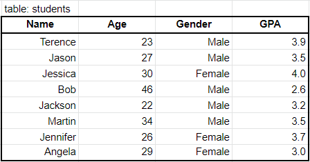
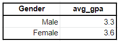
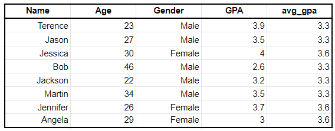
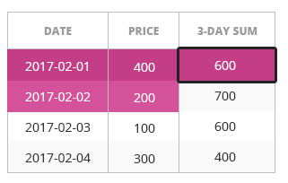

# 窗口函数

## 窗口函数简介

> 接下来的课程中我们来介绍**窗口函数window functions**.
>
> - MYSQL 8.0 之后，加入了窗口函数功能，简化了数据分析工作中查询语句的书写
> - 在没有窗口函数之前，我们需要通过定义临时变量和大量的子查询才能完成的工作，使用窗口函数实现起来更加简洁高效
> - 窗口函数是数据分析工作中必须掌握的工具，在SQL笔试中也是高频考点
> - 什么是窗口函数? 为什么说窗口函数可以使复杂的查询变得更加简单方便？

### 什么是窗口函数

- 窗口函数是类似于可以返回聚合值的函数，例如SUM()，COUNT()，MAX()。但是窗口函数又与普通的聚合函数不同，它不会对结果进行分组，使得输出中的行数与输入中的行数相同。

- 一个窗口函数大概看起来是这样：

  ```sql
  SELECT SUM() OVER(PARTITION BY ___ ORDER BY___) FROM Table 
  ```

  这里有3点需要牢记：

  - 聚合功能：在上述例子中，我们用了SUM()，但是你也可以用COUNT(), AVG()之类的计算功能
  - PARTITION BY：你只需将它看成GROUP BY子句，但是在窗口函数中，你要写PARTITION BY
  - ORDER BY：ORDER BY和普通查询语句中的ORDER BY没什么不同。注意，输出的顺序要仔细考虑

### 窗口函数示例

> 示例：集合函数VS窗口函数

- 假设我们有如下这个表格：



- 如果要按性别获取平均GPA，可以使用聚合函数并运行以下查询：

```sql
SELECT Gender, AVG(GPA) as avg_gpa FROM students GROUP BY Gender
```

- 结果如下：



- 现在我们想得到如下结果：



- 我们当然可以用我们刚刚提到的聚合函数，然后再将结果join到初始表，但这需要两个步骤。但如果我们使用窗口函数，我们则可以一步到位，并得到相同的结果：

```sql
SELECT *, AVG(GPA) OVER (PARTITION BY Gender) as avg_gpa FROM students 
```

- 通过上面的查询，就按性别对数据进行划分，并计算每种性别的平均GPA。然后，它将创建一个称为`avg_gpa`的新列，并为每行附加关联的平均GPA


### 窗口函数的优点

> - 简单
>   - 窗口函数更易于使用。在上面的示例中，与使用聚合函数然后合并结果相比，使用窗口函数仅需要多一行就可以获得所需要的结果。
>
> - 快速
>   - 这一点与上一点相关，使用窗口函数比使用替代方法要快得多。当你处理成百上千个千兆字节的数据时，这非常有用。
>
> - 多功能性
>   - 最重要的是，窗口函数具有多种功能，比如，添加移动平均线，添加行号和滞后数据，等等。


## 一  OVER()

### 学习目标

- 掌握窗口函数的基本语法和OVER()的使用方法

### 0 数据集介绍

- 本小结我们先介绍窗口函数中最重要的关键字 OVER()
- 在介绍具体内容之前先熟悉一下要用到的数据，我们选择了很常见的业务来介绍窗口函数的使用
  - 三张表：员工表，部门表，采购表
  - 员工表：员工id，姓名，员工所属部门id（`department_id`），工资（`salary`），工龄（`years_worked`)
  - 部门表：部门id，部门名称 
  - 采购表：每个部门（`department_id`）采购的物品明细（`item`)，物品价格（`price`）

**员工表（employee）**

| id   | first_name | last_name | department_id | salary | years_worked |
| ---- | :--------- | :-------- | :------------ | :----- | :----------- |
| 1    | Diane      | Turner    | 1             | 5330   | 4            |
| 2    | Clarence   | Robinson  | 1             | 3617   | 2            |
| 3    | Eugene     | Phillips  | 1             | 4877   | 2            |
| 4    | Philip     | Mitchell  | 1             | 5259   | 3            |
| 5    | Ann        | Wright    | 2             | 2094   | 5            |
| 6    | Charles    | Wilson    | 2             | 5167   | 5            |
| 7    | Russell    | Johnson   | 2             | 3762   | 4            |
| 8    | Jacqueline | Cook      | 2             | 6923   | 3            |
| 9    | Larry      | Lee       | 3             | 2796   | 4            |
| 10   | Willie     | Patterson | 3             | 4771   | 5            |
| 11   | Janet      | Ramirez   | 3             | 3782   | 2            |
| 12   | Doris      | Bryant    | 3             | 6419   | 1            |
| 13   | Amy        | Williams  | 3             | 6261   | 1            |
| 14   | Keith      | Scott     | 3             | 4928   | 8            |
| 15   | Karen      | Morris    | 4             | 6347   | 6            |
| 16   | Kathy      | Sanders   | 4             | 6286   | 1            |
| 17   | Joe        | Thompson  | 5             | 5639   | 3            |
| 18   | Barbara    | Clark     | 5             | 3232   | 1            |
| 19   | Todd       | Bell      | 5             | 4653   | 1            |
| 20   | Ronald     | Butler    | 5             | 2076   | 5            |

**部门表（DEPARTMENT）**

| id   | name            |
| :--- | :-------------- |
| 1    | IT              |
| 2    | Management      |
| 3    | Human Resources |
| 4    | Accounting      |
| 5    | Help Desk       |

**采购表（purchase)**

| id   | department_id | item         | price |
| :--- | :------------ | :----------- | :---- |
| 1    | 4             | monitor      | 531   |
| 2    | 1             | printer      | 315   |
| 3    | 3             | whiteboard   | 170   |
| 4    | 5             | training     | 117   |
| 5    | 3             | computer     | 2190  |
| 6    | 1             | monitor      | 418   |
| 7    | 3             | whiteboard   | 120   |
| 8    | 3             | monitor      | 388   |
| 9    | 5             | paper        | 37    |
| 10   | 1             | paper        | 695   |
| 11   | 3             | projector    | 407   |
| 12   | 4             | garden party | 986   |
| 13   | 5             | projector    | 481   |
| 14   | 2             | chair        | 180   |
| 15   | 2             | desk         | 854   |
| 16   | 2             | post-it      | 15    |
| 17   | 3             | paper        | 60    |
| 18   | 2             | tv           | 943   |
| 19   | 2             | desk         | 478   |
| 20   | 5             | keyboard     | 214   |

- 要用到的数据已经熟悉了，接下来我们使用上面的数据来介绍窗口函数

- 究竟什么是窗口函数？

  - 窗口函数是对表中**一组数据**进行计算的函数，**一组数据**跟当前行相关
  - 例如：想计算每三天的销售总金额，就可以使用窗口函数，以当前行为基准，选前一行，后一行，三行一组如下图所示

  

  

  - 之所以称之为窗口函数，是因为好像有一个固定大小的窗框划过数据集，滑动一次取一次，对窗口内的数据进行处理

- 看下窗口函数的语法：

  ```sql
  <window_function> OVER (...)
  ```

  - `<window_function>`  这里可以是我们之前已经学过的聚合函数，比如（`COUNT()`, `SUM()`, `AVG()` 等等）
    - 也以是其他函数，比如ranking 排序函数，分析函数等，后面的课程中会介绍
  -  `OVER(...)`  窗口函数的窗框通过`OVER(...)` 子句定义，窗口函数中很重要的部分就是通过`OVER(...)`  定义窗框 (开窗方式和大小)

### 1 OVER()基本用法

- 首先看`OVER (...)` 的最基本用法：  `OVER()`  意思是所有的数据都在窗口中，看下面的SQL

```sql
SELECT
  first_name,
  last_name,
  salary,  
  AVG(salary) OVER()
FROM employee;
```

- SQL并不复杂，主要看跟  `OVER()`  相关的部分

```
AVG(salary) OVER()
```

- `AVG(salary)`  意思是要计算平均工资，加上  `OVER()`  意味着对全部数据进行计算，所以就是在计算所有人的平均工资
- 需要注意的是，我们没有使用`GROUP BY`进行分组，这样在查询结果中除了聚合函数的结果之外，我们还可以显示其他数据
  - 如果使用`GROUP BY`  想将聚合结果与原始数据放到一个结果中，需要使用子查询，效率相对低

#### 练习1

- 需求：创建报表，除了查询每个人的工资之外，还要统计出公司每月的工资支出

```sql
SELECT
  first_name,
  last_name,
  salary,  
  SUM(salary) OVER()
FROM employee;
```

**查询结果**

| first_name | last_name | salary | sum   |
| :--------- | :-------- | :----- | :---- |
| Diane      | Turner    | 5330   | 94219 |
| Clarence   | Robinson  | 3617   | 94219 |
| Eugene     | Phillips  | 4877   | 94219 |
| Philip     | Mitchell  | 5259   | 94219 |
| Ann        | Wright    | 2094   | 94219 |
| Charles    | Wilson    | 5167   | 94219 |
| Russell    | Johnson   | 3762   | 94219 |
| Jacqueline | Cook      | 6923   | 94219 |
| Larry      | Lee       | 2796   | 94219 |
| Willie     | Patterson | 4771   | 94219 |
| Janet      | Ramirez   | 3782   | 94219 |
| Doris      | Bryant    | 6419   | 94219 |
| Amy        | Williams  | 6261   | 94219 |
| Keith      | Scott     | 4928   | 94219 |
| Karen      | Morris    | 6347   | 94219 |
| Kathy      | Sanders   | 6286   | 94219 |
| Joe        | Thompson  | 5639   | 94219 |
| Barbara    | Clark     | 3232   | 94219 |
| Todd       | Bell      | 4653   | 94219 |
| Ronald     | Butler    | 2076   | 94219 |

#### 练习2

- 需求：统计采购表中的平均采购价格，并与明细一起显示（每件物品名称，价格）

```sql
SELECT
  item,
  price,
  AVG(price) OVER()
FROM purchase;
```

**查询结果**

| item         | price | avg                  |
| :----------- | :---- | :------------------- |
| monitor      | 531   | 479.9500000000000000 |
| printer      | 315   | 479.9500000000000000 |
| whiteboard   | 170   | 479.9500000000000000 |
| training     | 117   | 479.9500000000000000 |
| computer     | 2190  | 479.9500000000000000 |
| monitor      | 418   | 479.9500000000000000 |
| whiteboard   | 120   | 479.9500000000000000 |
| monitor      | 388   | 479.9500000000000000 |
| paper        | 37    | 479.9500000000000000 |
| paper        | 695   | 479.9500000000000000 |
| projector    | 407   | 479.9500000000000000 |
| garden party | 986   | 479.9500000000000000 |
| projector    | 481   | 479.9500000000000000 |
| chair        | 180   | 479.9500000000000000 |
| desk         | 854   | 479.9500000000000000 |
| post-it      | 15    | 479.9500000000000000 |
| paper        | 60    | 479.9500000000000000 |
| tv           | 943   | 479.9500000000000000 |
| desk         | 478   | 479.9500000000000000 |
| keyboard     | 214   | 479.9500000000000000 |

### 2 将OVER()的结果用于进一步计算

- 通常，`OVER()`用于将当前行与一个聚合值进行比较，例如，我们可以计算出员工的薪水和平均薪水之间的差。

```sql
SELECT
  first_name,
  last_name,
  salary,
  AVG(salary) OVER(),
  salary - AVG(salary) OVER() as difference
FROM employee;
```

- 上面查询结果的最后一列显示了每名员工的工资和平均工资之间的差额，这就是**窗口函数的典型应用场景：将当前行与一组数据的聚合值进行比较**

#### 练习3

- 需求：创建报表统计每个员工的工龄和平均工龄之间的差值
- 报表中包含如下字段：
  - 员工的名字，员工的姓氏，员工的工龄，所有员工的平均工龄，员工工龄和平均工龄之间的差值

```sql
SELECT
  first_name,
  last_name,
  years_worked,
  AVG(years_worked) OVER(),
  years_worked - AVG(years_worked) OVER() AS difference
FROM employee;
```

**查询结果：**

| first_name | last_name | years_worked | avg  | difference |
| ---------- | --------- | ------------ | ---- | ---------- |
| Diane      | Turner    | 4            | 3.3  | 0.7        |
| Clarence   | Robinson  | 2            | 3.3  | -1.3       |
| Eugene     | Phillips  | 2            | 3.3  | -1.3       |
| Philip     | Mitchell  | 3            | 3.3  | -0.3       |
| Ann        | Wright    | 5            | 3.3  | 1.7        |
| Charles    | Wilson    | 5            | 3.3  | 1.7        |
| Russell    | Johnson   | 4            | 3.3  | 0.7        |
| Jacqueline | Cook      | 3            | 3.3  | -0.3       |
| Larry      | Lee       | 4            | 3.3  | 0.7        |
| Willie     | Patterson | 5            | 3.3  | 1.7        |
| Janet      | Ramirez   | 2            | 3.3  | -1.3       |
| Doris      | Bryant    | 1            | 3.3  | -2.3       |
| Amy        | Williams  | 1            | 3.3  | -2.3       |
| Keith      | Scott     | 8            | 3.3  | 4.7        |
| Karen      | Morris    | 6            | 3.3  | 2.7        |
| Kathy      | Sanders   | 1            | 3.3  | -2.3       |
| Joe        | Thompson  | 3            | 3.3  | -0.3       |
| Barbara    | Clark     | 1            | 3.3  | -2.3       |
| Todd       | Bell      | 1            | 3.3  | -2.3       |
| Ronald     | Butler    | 5            | 3.3  | 1.7        |

#### 练习4

- 我们看下面的例子：

```mysql
SELECT
  id,
  item,
  price,
  price / SUM(price) OVER()
FROM purchase
WHERE department_id = 2;
```

**查询结果**

| id   | item    | price | percent |
| ---- | ------- | ----- | ------- |
| 14   | chair   | 180   | 0.0729  |
| 15   | desk    | 854   | 0.3457  |
| 16   | post-it | 15    | 0.0061  |
| 18   | tv      | 943   | 0.3818  |
| 19   | desk    | 478   | 0.1935  |

- 在上面的SQL中，我们查询了id为2的部门所采购的所有商品，并将计算了每项支出占总采购金额的占比

- 需求：统计人力资源部（部门ID为3） 的员工薪资，并将每名员工的薪资与部门平均薪资进行比较
  - `first_name`，`last_name`，`salary` 和 `difference`（员工薪资与部门平均薪资的差值）

```mysql
select 
  first_name,
  last_name,
  salary,
  salary-AVG(salary) over() as difference
  from employee
  where department_id = 3
```

**查询结果**

| first_name | last_name | salary | difference |
| ---------- | --------- | ------ | ---------- |
| Larry      | Lee       | 2796   | -2030.1667 |
| Willie     | Patterson | 4771   | -55.1667   |
| Janet      | Ramirez   | 3782   | -1044.1667 |
| Doris      | Bryant    | 6419   | 1592.8333  |
| Amy        | Williams  | 6261   | 1434.8333  |
| Keith      | Scott     | 4928   | 101.8333   |

###  3 OVER()和COUNT()组合

- 接下来我们看一下， `OVER()` 与 `COUNT()` 如何组合使用

```mysql
SELECT 
  id, 
  name, 
  COUNT(id) OVER()
FROM department
ORDER BY name ASC;
```

- 在上面的SQL中，我们查询出每个部门的 `id` 和 `name` 部门名称，以及所有部门的数量，最后通过部门名字排序

#### 练习5

- 需求：查询月薪超过4000的员工，并统计所有月薪超过4000的员工数量
- 查询结果字段：`first_name`, `last_name`, `salary` 和 超过4000的员工数量

```mysql
SELECT
  first_name,
  last_name,
  salary,
  COUNT(id) OVER()
FROM employee
WHERE salary > 4000;
```

**查询结果：**

| first_name | last_name | salary | count |
| :--------- | :-------- | :----- | :---- |
| Diane      | Turner    | 5330   | 13    |
| Eugene     | Phillips  | 4877   | 13    |
| Philip     | Mitchell  | 5259   | 13    |
| Charles    | Wilson    | 5167   | 13    |
| Jacqueline | Cook      | 6923   | 13    |
| Willie     | Patterson | 4771   | 13    |
| Doris      | Bryant    | 6419   | 13    |
| Amy        | Williams  | 6261   | 13    |
| Keith      | Scott     | 4928   | 13    |
| Karen      | Morris    | 6347   | 13    |
| Kathy      | Sanders   | 6286   | 13    |
| Joe        | Thompson  | 5639   | 13    |
| Todd       | Bell      | 4653   | 13    |

### 4 OVER()强化练习

#### 练习6

- 需求：查询人力资源部（`department_id = 3`）的采购情况
- 查询如下字段：
  - `id`,`department_id`,`item`,`price`,最高采购金额，最高采购金额和每项采购的金额差值

```mysql
SELECT
  id,
  department_id,
  item,
  price,
  MAX(price) OVER() as max_price,
  MAX(price) OVER() - price AS difference
FROM purchase
WHERE department_id = 3;
```

**查询结果**

| id   | department_id | item       | price | max_price | difference |
| :--- | :------------ | :--------- | :---- | :-------- | :--------- |
| 3    | 3             | whiteboard | 170   | 2190      | 2020       |
| 5    | 3             | computer   | 2190  | 2190      | 0          |
| 7    | 3             | whiteboard | 120   | 2190      | 2070       |
| 8    | 3             | monitor    | 388   | 2190      | 1802       |
| 11   | 3             | projector  | 407   | 2190      | 1783       |
| 17   | 3             | paper      | 60    | 2190      | 2130       |

#### 练习7-一句SQL中使用两个窗口函数

- 接下来我们看一下如何在一句SQL中使用两个窗口函数
- 需求：创建报表，在purchase表基础上，添加平均价格和采购总金额两列
- 包含如下字段：`id`, `item`, `price`, 平均价格和所有物品总价格

```mysql
SELECT
  id,
  item,
  price,
  AVG(price) OVER(),
  SUM(price) OVER()
FROM purchase;
```

**查询结果**

| id   | item          | price | avg    | sum  |
| ---- | ------------- | ----- | ------ | ---- |
| 1    | monitor       | 531   | 479.95 | 9599 |
| 2    | printer       | 315   | 479.95 | 9599 |
| 3    | whiteboard    | 170   | 479.95 | 9599 |
| 4    | training      | 117   | 479.95 | 9599 |
| 5    | computer      | 2190  | 479.95 | 9599 |
| 6    | monitor       | 418   | 479.95 | 9599 |
| 7    | whiteboard    | 120   | 479.95 | 9599 |
| 8    | monitor       | 388   | 479.95 | 9599 |
| 9    | paper         | 37    | 479.95 | 9599 |
| 10   | paper         | 695   | 479.95 | 9599 |
| 11   | projector     | 407   | 479.95 | 9599 |
| 12   | garden  party | 986   | 479.95 | 9599 |
| 13   | projector     | 481   | 479.95 | 9599 |
| 14   | chair         | 180   | 479.95 | 9599 |
| 15   | desk          | 854   | 479.95 | 9599 |
| 16   | post-it       | 15    | 479.95 | 9599 |
| 17   | paper         | 60    | 479.95 | 9599 |
| 18   | tv            | 943   | 479.95 | 9599 |
| 19   | desk          | 478   | 479.95 | 9599 |
| 20   | keyboard      | 214   | 479.95 | 9599 |

### 5 OVER()的作用范围

- 窗口函数是可以与Where一起使用的，但是where 与窗口函数那个先执行呢？

```sql
SELECT
  first_name,
  last_name,
  salary,
  AVG(salary) OVER(),
  salary - AVG(salary) OVER()
FROM employee
WHERE department_id = 1;
```

- 在上面的SQL中，我们通过WHERE department_id = 1，过滤出部门ID为1的数据，窗口函数只作用于id = 1的部门
- **需要记住，窗口函数在`WHERE` 子句后执行！**

#### 练习8

- 需求：查询部门id为1，2，3三个部门员工的姓名，薪水，和这三个部门员工的平均薪资

```mysql
SELECT
  first_name,
  last_name,
  salary,
  AVG(salary) OVER() as avg
FROM employee
WHERE department_id IN (1, 2, 3);
```

**查询结果**

| first_name | last_name | salary | avg       |
| ---------- | --------- | ------ | --------- |
| Diane      | Turner    | 5330   | 4713.2857 |
| Clarence   | Robinson  | 3617   | 4713.2857 |
| Eugene     | Phillips  | 4877   | 4713.2857 |
| Philip     | Mitchell  | 5259   | 4713.2857 |
| Ann        | Wright    | 2094   | 4713.2857 |
| Charles    | Wilson    | 5167   | 4713.2857 |
| Russell    | Johnson   | 3762   | 4713.2857 |
| Jacqueline | Cook      | 6923   | 4713.2857 |
| Larry      | Lee       | 2796   | 4713.2857 |
| Willie     | Patterson | 4771   | 4713.2857 |
| Janet      | Ramirez   | 3782   | 4713.2857 |
| Doris      | Bryant    | 6419   | 4713.2857 |
| Amy        | Williams  | 6261   | 4713.2857 |
| Keith      | Scott     | 4928   | 4713.2857 |

### 6 在过滤条件中使用OVER()

- 看下面的SQL，我们打算查询所有员工中，薪资高于平均薪资的员工：

```SQL
SELECT
  first_name,
  last_name,
  salary,
  AVG(salary) OVER()
FROM employee
WHERE salary > AVG(salary) OVER();
```

- 上面的SQL能否正确执行？？
  - 执行上面的SQL时会返回错误信息：3593 - You cannot use the window function 'avg' in this context.', Time: 0.000000s
  - 原因是，窗口函数在WHERE子句之后执行，把窗口函数写在WHERE子句中会导致循环依赖


### 小结

- 可以使用<window_function> OVER()，对全部查询结果进行聚合计算
- 在WHERE条件执行之后，才会执行窗口函数
- 窗口函数在执行聚合计算的同时还可以保留每行的其它原始信息
- 不能在WHERE子句中使用窗口函数


#### 练习9

- 需求：统计ID 为1，3，5的部门，员工的平均工龄
- 结果字段：`first name`, `last name`, `years_worked` 和平均工龄

```mysql
SELECT
  first_name,
  last_name,
  years_worked,
  AVG(years_worked) OVER() as avg
FROM employee
WHERE department_id IN (1, 3, 5);
```

**查询结果**

| first_name | last_name | years_worked | avg  |
| ---------- | --------- | ------------ | ---- |
| Diane      | Turner    | 4            | 3    |
| Clarence   | Robinson  | 2            | 3    |
| Eugene     | Phillips  | 2            | 3    |
| Philip     | Mitchell  | 3            | 3    |
| Larry      | Lee       | 4            | 3    |
| Willie     | Patterson | 5            | 3    |
| Janet      | Ramirez   | 2            | 3    |
| Doris      | Bryant    | 1            | 3    |
| Amy        | Williams  | 1            | 3    |
| Keith      | Scott     | 8            | 3    |
| Joe        | Thompson  | 3            | 3    |
| Barbara    | Clark     | 1            | 3    |
| Todd       | Bell      | 1            | 3    |
| Ronald     | Butler    | 5            | 3    |

#### 练习10

- 需求：统计每一次采购的基本信息包括
  - `id`,
  -  `name` ，采购部门名称
  -  `item`，采购的物品明细
  -  `price`, 采购价格
  -  **minimum price** ，最低采购价格
  - 当前价格 `price` 与最低采购价格 **minimum price** 的差价

```mysql
SELECT
  purchase.id,
  name,
  item,
  price,
  MIN(price) OVER() AS min_price,
  price - MIN(price) OVER() AS diff
FROM purchase
JOIN department
  ON purchase.department_id = department.id;
```

**查询结果**

| id   | name            | item         | price | min_price | diff |
| :--- | :-------------- | :----------- | :---- | :-------- | :--- |
| 1    | Accounting      | monitor      | 531   | 15        | 516  |
| 2    | IT              | printer      | 315   | 15        | 300  |
| 3    | Human Resources | whiteboard   | 170   | 15        | 155  |
| 4    | Help Desk       | training     | 117   | 15        | 102  |
| 5    | Human Resources | computer     | 2190  | 15        | 2175 |
| 6    | IT              | monitor      | 418   | 15        | 403  |
| 7    | Human Resources | whiteboard   | 120   | 15        | 105  |
| 8    | Human Resources | monitor      | 388   | 15        | 373  |
| 9    | Help Desk       | paper        | 37    | 15        | 22   |
| 10   | IT              | paper        | 695   | 15        | 680  |
| 11   | Human Resources | projector    | 407   | 15        | 392  |
| 12   | Accounting      | garden party | 986   | 15        | 971  |
| 13   | Help Desk       | projector    | 481   | 15        | 466  |
| 14   | Management      | chair        | 180   | 15        | 165  |
| 15   | Management      | desk         | 854   | 15        | 839  |
| 16   | Management      | post-it      | 15    | 15        | 0    |
| 17   | Human Resources | paper        | 60    | 15        | 45   |
| 18   | Management      | tv           | 943   | 15        | 928  |
| 19   | Management      | desk         | 478   | 15        | 463  |
| 20   | Help Desk       | keyboard     | 214   | 15        | 199  |

