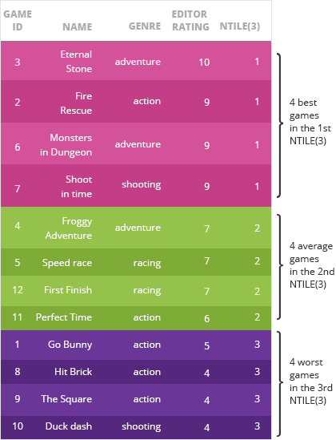

## 三 排序函数

> 到目前为止，我们已经介绍了如何在窗口函数中使用聚合函数`SUM()`, `COUNT()`, `AVG()`, `MAX()` 和 `MIN()`
>
> - 接下来，我们将学习如何通过窗口函数实现排序，具体语法如下：
>
> ```SQL
> <ranking function> OVER (ORDER BY <order by columns>).
> ```
>
> - 在后面的练习中我们会介绍常用的排序函数

### 学习目标

- 掌握窗口函数中，排序函数(ranking function)的使用方法


### 0 数据集介绍

游戏信息表

| id   | name                | platform      | genre     | editor_rating | size | released   | updated    |
| :--- | :------------------ | :------------ | :-------- | :------------ | :--- | :--------- | :--------- |
| 1    | Go Bunny            | iOS           | action    | 5             | 101  | 2015-05-01 | 2015-07-13 |
| 2    | Fire Rescue         | iOS           | action    | 9             | 36   | 2015-07-30 | 2016-09-27 |
| 3    | Eternal Stone       | iOS           | adventure | 10            | 125  | 2015-03-20 | 2015-10-25 |
| 4    | Froggy Adventure    | iOS           | adventure | 7             | 127  | 2015-05-01 | 2015-07-02 |
| 5    | Speed Race          | iOS           | racing    | 7             | 127  | 2015-03-20 | 2015-07-25 |
| 6    | Monsters in Dungeon | Android       | adventure | 9             | 10   | 2015-12-01 | 2015-12-15 |
| 7    | Shoot in Time       | Android       | shooting  | 9             | 123  | 2015-12-01 | 2016-03-20 |
| 8    | Hit Brick           | Android       | action    | 4             | 54   | 2015-05-01 | 2016-01-05 |
| 9    | The Square          | Android       | action    | 4             | 86   | 2015-12-01 | 2016-03-16 |
| 10   | Duck Dash           | Android       | shooting  | 4             | 36   | 2015-07-30 | 2016-05-23 |
| 11   | Perfect Time        | Windows Phone | action    | 6             | 55   | 2015-12-01 | 2016-01-07 |
| 12   | First Finish        | Windows Phone | racing    | 7             | 44   | 2015-10-01 | 2016-02-20 |

游戏销售表

| id   | game_id | price | date       |
| :--- | :------ | :---- | :--------- |
| 1    | 7       | 15.99 | 2016-03-07 |
| 2    | 12      | 13.99 | 2016-08-13 |
| 3    | 6       | 11.99 | 2016-01-21 |
| 4    | 11      | 7.99  | 2016-10-21 |
| 5    | 4       | 12.99 | 2016-05-03 |
| 6    | 2       | 1.99  | 2016-07-08 |
| 7    | 2       | 5.99  | 2016-03-29 |
| 8    | 10      | 18.99 | 2016-01-05 |
| 9    | 8       | 3.99  | 2016-07-18 |
| 10   | 4       | 7.99  | 2016-06-04 |
| 11   | 12      | 14.99 | 2016-10-16 |
| 12   | 10      | 15.99 | 2016-08-23 |
| ……   | ……      | ……    | ……         |

### 1 RANK()函数

- 首先我们来介绍使用最多的rank函数，使用方法如下：

```SQL
RANK() OVER (ORDER BY ...)
```

- `RANK()`会返回每一行的等级（序号）
- `ORDER BY`对行进行排序将数据按升序或降序排列，` RANK（）OVER（ORDER BY ...）`是一个函数，与`ORDER BY` 配合返回序号
- 看如下例子：

```mysql
SELECT
  name,
  platform,
  editor_rating,
  RANK() OVER(ORDER BY editor_rating) as rank_
FROM game;
```

- 上面的SQL对所有数据按编辑评分排序，RANK()函数会返回排序后的排名序号

| name                | platform      | editor_rating | rank_ |
| :------------------ | :------------ | :------------ | :---- |
| Duck Dash           | Android       | 4             | 1     |
| The Square          | Android       | 4             | 1     |
| Hit Brick           | Android       | 4             | 1     |
| Go Bunny            | iOS           | 5             | 4     |
| Perfect Time        | Windows Phone | 6             | 5     |
| First Finish        | Windows Phone | 7             | 6     |
| Froggy Adventure    | iOS           | 7             | 6     |
| Speed Race          | iOS           | 7             | 6     |
| Shoot in Time       | Android       | 9             | 9     |
| Monsters in Dungeon | Android       | 9             | 9     |
| Fire Rescue         | iOS           | 9             | 9     |
| Eternal Stone       | iOS           | 10            | 12    |

- 观察上面的查询结果：
  - 最后一列 rank_ 中显示了游戏的得分排名，得分最低（4分）的三个游戏并列倒数第一
  - 得分为5分的游戏，排名为4，这里并没有2和3 ，这个就是`rank()`函数的特点，当有并列的情况出现时，序号是不连续的

#### 练习16

- 需求：统计每个游戏的名字，分类，更新日期，更新日期序号

```mysql
SELECT
  name,
  genre,
  updated,
  RANK() OVER(ORDER BY updated) as date_rank
FROM game;
```

**查询结果**

| name                | genre     | updated    | date_rank |
| :------------------ | :-------- | :--------- | :-------- |
| Froggy Adventure    | adventure | 2015-07-02 | 1         |
| Go Bunny            | action    | 2015-07-13 | 2         |
| Speed Race          | racing    | 2015-07-25 | 3         |
| Eternal Stone       | adventure | 2015-10-25 | 4         |
| Monsters in Dungeon | adventure | 2015-12-15 | 5         |
| Hit Brick           | action    | 2016-01-05 | 6         |
| Perfect Time        | action    | 2016-01-07 | 7         |
| First Finish        | racing    | 2016-02-20 | 8         |
| The Square          | action    | 2016-03-16 | 9         |
| Shoot in Time       | shooting  | 2016-03-20 | 10        |
| Duck Dash           | shooting  | 2016-05-23 | 11        |
| Fire Rescue         | action    | 2016-09-27 | 12        |

### 2 DENSE_RANK()函数

- RANK() 函数返回的序号，可能会出现不连续的情况
- 如果想在有并列情况发生的时候仍然返回连续序号可以使用dense_rank()函数
- 将前面的例子做一个修改

```mysql
SELECT
  name,
  platform,
  editor_rating,
  DENSE_RANK() OVER(ORDER BY editor_rating) as rank_
FROM game;
```

**查询结果**

| name                | platform      | editor_rating | dense_rank |
| :------------------ | :------------ | :------------ | :--------- |
| Duck Dash           | Android       | 4             | 1          |
| The Square          | Android       | 4             | 1          |
| Hit Brick           | Android       | 4             | 1          |
| Go Bunny            | iOS           | 5             | 2          |
| Perfect Time        | Windows Phone | 6             | 3          |
| First Finish        | Windows Phone | 7             | 4          |
| Froggy Adventure    | iOS           | 7             | 4          |
| Speed Race          | iOS           | 7             | 4          |
| Shoot in Time       | Android       | 9             | 5          |
| Monsters in Dungeon | Android       | 9             | 5          |
| Fire Rescue         | iOS           | 9             | 5          |
| Eternal Stone       | iOS           | 10            | 6          |

- 从上面的结果中看出，dense_rank列的序号是连续的，1，2，3，4，5 （跟使用rank 有明显的区别，rank 会跳过2，3）

#### 练习17

- 对游戏的安装包大小进行排序，使用`DENSE_RANK()`，返回游戏名称，包大小以及序号

```mysql
SELECT
  name,
  size,
  DENSE_RANK() OVER(ORDER BY size)
FROM game
```

**查询结果**

| name                | size | dense_rank |
| :------------------ | :--- | :--------- |
| Monsters in Dungeon | 10   | 1          |
| Fire Rescue         | 36   | 2          |
| Duck Dash           | 36   | 2          |
| First Finish        | 44   | 3          |
| Hit Brick           | 54   | 4          |
| Perfect Time        | 55   | 5          |
| The Square          | 86   | 6          |
| Go Bunny            | 101  | 7          |
| Shoot in Time       | 123  | 8          |
| Eternal Stone       | 125  | 9          |
| Speed Race          | 127  | 10         |
| Froggy Adventure    | 127  | 10         |

### 3 ROW_NUMBER()

- 想获取排序之后的序号，也可以通过ROW_NUMBER() 来实现，从名字上就能知道，意思是返回行号

```mysql
SELECT
  name,
  platform,
  editor_rating,
  ROW_NUMBER() OVER(ORDER BY editor_rating) `row_number`
FROM game;
```

**查询结果**

| name                | platform      | editor_rating | row_number |
| :------------------ | :------------ | :------------ | :--------- |
| Duck Dash           | Android       | 4             | 1          |
| The Square          | Android       | 4             | 2          |
| Hit Brick           | Android       | 4             | 3          |
| Go Bunny            | iOS           | 5             | 4          |
| Perfect Time        | Windows Phone | 6             | 5          |
| First Finish        | Windows Phone | 7             | 6          |
| Froggy Adventure    | iOS           | 7             | 7          |
| Speed Race          | iOS           | 7             | 8          |
| Shoot in Time       | Android       | 9             | 9          |
| Monsters in Dungeon | Android       | 9             | 10         |
| Fire Rescue         | iOS           | 9             | 11         |
| Eternal Stone       | iOS           | 10            | 12         |

- 从上面的结果可以看出，`ROW_NUMBER()`返回的是唯一行号，跟`RANK()` 和 `DENSE_RANK()` 返回的是序号，序号会有并列情况出现

#### 练习18

- 需求，将游戏按发行时间排序，返回唯一序号

```mysql
SELECT
  name,
  released,
  ROW_NUMBER() OVER(ORDER BY released) `row_number`
FROM game;
```

**查询结果**

| name                | released   | row_number |
| :------------------ | :--------- | :--------- |
| Eternal Stone       | 2015-03-20 | 1          |
| Speed Race          | 2015-03-20 | 2          |
| Froggy Adventure    | 2015-05-01 | 3          |
| Hit Brick           | 2015-05-01 | 4          |
| Go Bunny            | 2015-05-01 | 5          |
| Duck Dash           | 2015-07-30 | 6          |
| Fire Rescue         | 2015-07-30 | 7          |
| First Finish        | 2015-10-01 | 8          |
| The Square          | 2015-12-01 | 9          |
| Shoot in Time       | 2015-12-01 | 10         |
| Perfect Time        | 2015-12-01 | 11         |
| Monsters in Dungeon | 2015-12-01 | 12         |

#### 练习19

- 对比 `RANK()`, `DENSE_RANK()`, `ROW_NUMBER()` 之间的区别，对上面的案例同时使用三个函数

```mysql
SELECT
  name,
  genre,
  released,
  RANK() OVER(ORDER BY released) as rank_num,
  DENSE_RANK() OVER(ORDER BY released) as dense_rank_num,
  ROW_NUMBER() OVER(ORDER BY released) as row_num
FROM game;
```

**查询结果**

| name                | genre     | released   | rank_num | dense_rank_num | row_num |
| :------------------ | :-------- | :--------- | :------- | :------------- | :------ |
| Eternal Stone       | adventure | 2015-03-20 | 1        | 1              | 1       |
| Speed Race          | racing    | 2015-03-20 | 1        | 1              | 2       |
| Froggy Adventure    | adventure | 2015-05-01 | 3        | 2              | 3       |
| Hit Brick           | action    | 2015-05-01 | 3        | 2              | 4       |
| Go Bunny            | action    | 2015-05-01 | 3        | 2              | 5       |
| Duck Dash           | shooting  | 2015-07-30 | 6        | 3              | 6       |
| Fire Rescue         | action    | 2015-07-30 | 6        | 3              | 7       |
| First Finish        | racing    | 2015-10-01 | 8        | 4              | 8       |
| The Square          | action    | 2015-12-01 | 9        | 5              | 9       |
| Shoot in Time       | shooting  | 2015-12-01 | 9        | 5              | 10      |
| Perfect Time        | action    | 2015-12-01 | 9        | 5              | 11      |
| Monsters in Dungeon | adventure | 2015-12-01 | 9        | 5              | 12      |

### 4 RANK()与ORDER BY多列排序

- 需求：在列表中查找比较新,且安装包体积较小的游戏（`released` ，`size`)

```sql
SELECT
  name,
  genre,
  editor_rating,
  RANK() OVER(ORDER BY released DESC, size ASC) `rank`
FROM game;
```

**查询结果**

| name                | genre     | editor_rating | rank |
| :------------------ | :-------- | :------------ | :--- |
| Monsters in Dungeon | adventure | 9             | 1    |
| Perfect Time        | action    | 6             | 2    |
| The Square          | action    | 4             | 3    |
| Shoot in Time       | shooting  | 9             | 4    |
| First Finish        | racing    | 7             | 5    |
| Fire Rescue         | action    | 9             | 6    |
| Duck Dash           | shooting  | 4             | 6    |
| Hit Brick           | action    | 4             | 8    |
| Go Bunny            | action    | 5             | 9    |
| Froggy Adventure    | adventure | 7             | 10   |
| Eternal Stone       | adventure | 10            | 11   |
| Speed Race          | racing    | 7             | 12   |

### 5 在窗口函数外使用RANK()与ORDER BY

- 之前的例子中，`ORDER BY` 排序都是写在窗口函数`OVER()` 中，窗口函数也可以和常规的ORDER BY写法一起使用，看下面的例子

```mysql
SELECT
  name,
  RANK() OVER (ORDER BY editor_rating) `rank`
FROM game
ORDER BY size DESC;
```

**查询结果**

| name                | rank |
| ------------------- | ---- |
| Froggy Adventure    | 6    |
| Speed Race          | 6    |
| Eternal Stone       | 12   |
| Shoot in Time       | 9    |
| Go Bunny            | 4    |
| The Square          | 1    |
| Perfect Time        | 5    |
| Hit Brick           | 1    |
| First Finish        | 6    |
| Duck Dash           | 1    |
| Fire Rescue         | 9    |
| Monsters in Dungeon | 9    |

- 从查询结果可以看出，`RANK()` 返回的序号是依据`editor_rating`列的大小进行排序的
- 最终的查询结果是按照安装包大小进行排序的

#### 练习20

- 需求：查询游戏名称，类别，安装包大小的排名序号，结果按发行日期降序排列

```mysql
SELECT
  name,
  genre,
  RANK() OVER(ORDER BY size) `rank`
FROM game
ORDER BY released DESC;
```

**查询结果**

| name                | genre     | rank |
| :------------------ | :-------- | :--- |
| Monsters in Dungeon | adventure | 1    |
| Perfect Time        | action    | 6    |
| The Square          | action    | 7    |
| Shoot in Time       | shooting  | 9    |
| First Finish        | racing    | 4    |
| Duck Dash           | shooting  | 2    |
| Fire Rescue         | action    | 2    |
| Froggy Adventure    | adventure | 11   |
| Go Bunny            | action    | 8    |
| Hit Brick           | action    | 5    |
| Speed Race          | racing    | 11   |
| Eternal Stone       | adventure | 10   |

#### 练习21

- 在游戏销售表中添加日期排序列（按日期从近到远排序），最终结果按打分（`editor_rating`）排序

```mysql
SELECT
  name,
  price,
  date,
  ROW_NUMBER() OVER(ORDER BY date DESC) `row_number`
FROM purchase, game
WHERE game.id = game_id
ORDER BY editor_rating;
```

**查询结果**

| name       | price | date       | row_number |
| ---------- | ----- | ---------- | ---------- |
| The Square | 14.99 | 2016/6/7   | 31         |
| Duck Dash  | 18.99 | 2016/1/5   | 59         |
| The Square | 1.99  | 2016/10/14 | 4          |
| The Square | 7.99  | 2016/1/21  | 57         |
| The Square | 4.99  | 2016/10/5  | 6          |
| Hit Brick  | 11.99 | 2016/2/27  | 52         |
| Hit Brick  | 18.99 | 2016/9/24  | 9          |
| The Square | 2.99  | 2016/3/24  | 49         |
| Hit Brick  | 8.99  | 2016/4/13  | 42         |
| Duck Dash  | 15.99 | 2016/8/23  | 12         |
| Hit Brick  | 7.99  | 2016/4/20  | 41         |
| ……         | ……    | ……         | ……         |

### 6 NTILE(X)

- `NTILE(X)`函数将数据分成X组，并给每组分配一个数字（1，2，3....)，例如：

  ```sql
  SELECT
    name,
    genre,
    editor_rating,
    NTILE(3) OVER (ORDER BY editor_rating DESC)
  FROM game;
  ```

-  在上面的查询中，通过 `NTILE(3)` 我们根据`editor_rating` 的高低，将数据分成了三组，并且给每组指定了一个标记

  - 1 这一组是评分最高的
  - 3 这一组是评分较低的
  - 2 这一组属于平均水平

  

- 注意：如果所有的数据不能被平均分组，那么有些组的数据会多一条，数据条目多的组会排在前面

#### 练习22 

- 将所有的游戏按照安装包大小分成4组，返回游戏名字，类别，安装包大小，和分组序号

```mysql
SELECT
  name,
  genre,
  size,
  NTILE(4) OVER (ORDER BY size DESC) `ntile`
FROM game;
```

**查询结果**

| name                | genre     | size | ntile |
| :------------------ | :-------- | :--- | :---- |
| Speed Race          | racing    | 127  | 1     |
| Froggy Adventure    | adventure | 127  | 1     |
| Eternal Stone       | adventure | 125  | 1     |
| Shoot in Time       | shooting  | 123  | 2     |
| Go Bunny            | action    | 101  | 2     |
| The Square          | action    | 86   | 2     |
| Perfect Time        | action    | 55   | 3     |
| Hit Brick           | action    | 54   | 3     |
| First Finish        | racing    | 44   | 3     |
| Fire Rescue         | action    | 36   | 4     |
| Duck Dash           | shooting  | 36   | 4     |
| Monsters in Dungeon | adventure | 10   | 4     |

#### 练习23

- 将所有的游戏按照升级日期降序排列分成4组，返回游戏名字，类别，更新日期，和分组序号

```mysql
SELECT
  name,
  genre,
  updated,
  NTILE(4) OVER(ORDER BY updated DESC) `ntile`
FROM game;
```

**查询结果**

| name                | genre     | updated     | ntile |
| :------------------ | :-------- | :---------- | :---- |
| Fire Rescue         | action    | 2016-09-27  | 1     |
| Duck Dash           | shooting  | 2016-05-23  | 1     |
| Shoot in Time       | shooting  | 2016-03-20  | 1     |
| The Square          | action    | 2016-03-16  | 2     |
| First Finish        | racing    | 2016-02-20  | 2     |
| Perfect Time        | action    | 2016-01-07  | 2     |
| Hit Brick           | action    | 2016-01-05  | 3     |
| Monsters in Dungeon | adventure | 2015-12-15  | 3     |
| Eternal Stone       | adventure | 2015-10-25  | 3     |
| Speed Race          | racing    | 2015-07-25  | 4     |
| Go Bunny            | action    | 2015-07-134 | 4     |
| Froggy Adventure    | adventure | 2015-07-02  | 4     |

### 7 排序函数综合练习

- 我们已经介绍了排序函数，由于数据量较小，我们将所有数据排序，并返回所有序号。接下来我们看一下如何返回指定排名的数据
- 需求：查找打分排名第二的游戏

```mysql
WITH ranking AS (
  SELECT
    name,
    RANK() OVER(ORDER BY editor_rating DESC) AS `rank`
  FROM game
)

SELECT name
FROM ranking
WHERE `rank` = 2;
```

**查询结果**

Fire Rescue
Monsters in Dungeon
Shoot in Time

#### 练习24

- 需求：查询安装包大小最小的游戏，返回游戏名称，类别，安装包大小
  -  `name`, `genre` and `size` 

```mysql
WITH ranking AS (
  SELECT
    name,
    genre,
    size,
    RANK() OVER(ORDER BY size) AS `rank`
  FROM game
)

SELECT
  name,
  genre,
  size
FROM ranking
WHERE `rank` = 1;
```

**查询结果**

| name                | genre     | size |
| :------------------ | :-------- | :--- |
| Monsters in Dungeon | adventure | 10   |

#### 练习25

- 需求：查询最近更新的游戏中，时间第二近的游戏，返回游戏名称，运行平台，更新时间

```mysql
WITH ranking AS (
  SELECT
    name,
    platform,
    updated,
    RANK() OVER(ORDER BY updated DESC) AS `rank`
  FROM game
)

SELECT
  name,
  platform,
  updated
FROM ranking
WHERE `rank` = 2;
```

**查询结果**

| name      | platform | updated    |
| :-------- | :------- | :--------- |
| Duck Dash | Android  | 2016-05-23 |

### 小结

本小节中，希望大家掌握如下内容

- 最基本的排序函数: `RANK() OVER(ORDER BY column1, column2...)`.

- 通过排序获取序号的函数介绍了如下三个：

  - `RANK()` – 返回排序后的序号 **rank** ，有并列的情况出现时序号不连续
  - `DENSE_RANK()` – 返回  **'连续'** 序号
  - `ROW_NUMBER()` – 返回连续唯一的行号，与排序`ORDER BY` 配合返回的是连续不重复的序号

- `NTILE(x)` – 将数据分组，并为每组添加一个相同的序号

- 获取排序后，指定位置的数据（第一位，第二位）可以通过如下方式：

  ```mysql
  WITH ranking AS
    (SELECT
      RANK() OVER (ORDER BY col2) AS RANK,
      col1
    FROM table_name)
  
  SELECT col1
  FROM ranking
  WHERE RANK = place1;
  ```


#### 练习 26

- 数据表

**Application**

- 字段说明：
  - `name` 应用名称 `platform` 应用运行的平台 `type` 应用类型
  -  `average_rating` 应用评分 `downloads` 下载次数 `income` 应用总收入

| id   | name                  | platform      | type     | average_rating | downloads | income    |
| :--- | :-------------------- | :------------ | :------- | :------------- | :-------- | :-------- |
| 1    | Manage your budget    | iOS           | business | 4.6407751550   | 34989     | 804397.11 |
| 2    | Banking App           | iOS           | business | 5.3498863368   | 4970      | 79470.30  |
| 3    | CouchSurfing          | iOS           | travel   | 6.3912259350   | 20210     | 646517.90 |
| 4    | Shopping List         | iOS           | utility  | 6.0639225361   | 33594     | 940296.06 |
| 5    | Stock 24 News         | Android       | business | 5.6434623087   | 8295      | 348307.05 |
| 6    | Perfect Notes         | Android       | utility  | 9.9605993188   | 29703     | 742277.97 |
| 7    | Amazing filters       | Android       | camera   | 8.7427015833   | 4120      | 197718.80 |
| 8    | OverseasTrade         | Windows Phone | business | 9.5007765361   | 12502     | 74886.98  |
| 9    | Scientific Calculator | Windows Phone | utility  | 5.7217209288   | 13015     | 572529.85 |
| 10   | Corporate Chat        | Windows Phone | business | 6.9995402484   | 13712     | 603190.88 |
| 11   | Click & Travel        | Windows Phone | travel   | 5.5346579098   | 26192     | 602154.08 |
| 12   | Cheap Apartments      | Windows Phone | travel   | 5.7184126335   | 12727     | 432590.73 |

- 根据平均得分对游戏进行排序，从高到底，降序排列，并给出排名，查询结果返回，游戏名称`name` ，平均得分`average_rating`, 排名`rank`

```sql
SELECT
  name,
  average_rating,
  RANK() OVER (ORDER BY average_rating DESC) 'rank'
FROM application;
```

**查询结果**

| name                  | average_rating | rank |
| :-------------------- | :------------- | :--- |
| Perfect Notes         | 9.9605993188   | 1    |
| OverseasTrade         | 9.5007765361   | 2    |
| Amazing filters       | 8.7427015833   | 3    |
| Corporate Chat        | 6.9995402484   | 4    |
| CouchSurfing          | 6.3912259350   | 5    |
| Shopping List         | 6.0639225361   | 6    |
| Scientific Calculator | 5.7217209288   | 7    |
| Cheap Apartments      | 5.7184126335   | 8    |
| Stock 24 News         | 5.6434623087   | 9    |
| Click & Travel        | 5.5346579098   | 10   |
| Banking App           | 5.3498863368   | 11   |
| Manage your budget    | 4.6407751550   | 12   |

#### 练习27

- 查找下载排名第三多的应用，返回应用名称和下载数量

```mysql
WITH ranking AS (
  SELECT
    name,
    downloads,
    RANK() OVER(ORDER BY downloads DESC) `rank`
  FROM application
)

SELECT
  name,
  downloads
FROM ranking
WHERE rank = 3;
```

返回结果

| name          | downloads |
| :------------ | :-------- |
| Perfect Notes | 29703     |

