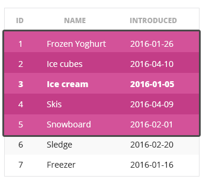
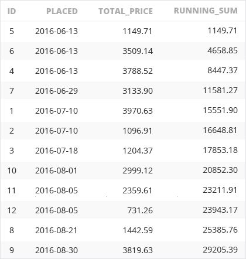
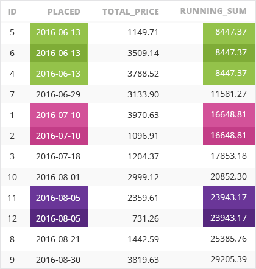
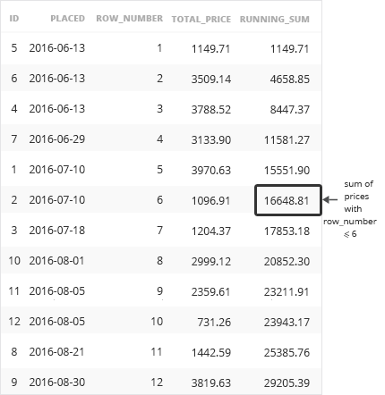
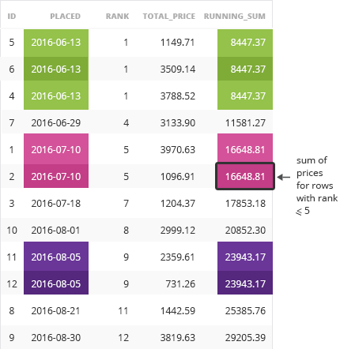

## 5 window frames 自定义窗口

### 学习目标：

- 掌握Window frames的使用方法


### 0 数据介绍

- 本小节用到的数据来自一家冰雪相关产品的公司
- 先看下该公司的产品

**PRODUCT**

| id   | name                     | introduced |
| :--- | :----------------------- | :--------- |
| 1    | Frozen Yoghurt（冻酸奶） | 2016-01-26 |
| 2    | Ice cubes（冰块）        | 2016-04-10 |
| 3    | Ice cream（冰淇淋）      | 2016-01-05 |
| 4    | Skis（滑雪板）           | 2016-04-09 |
| 5    | Snowboard (滑雪板-单板)  | 2016-02-01 |
| 6    | Sledge(雪橇)             | 2016-02-20 |
| 7    | Freezer(冰箱)            | 2016-01-16 |

**STOCK_CHANGE**

- 库存变化表：记录了仓库中商品变化情况，出库，入库
  -  `id` 每一次库存变化都对应一个id
  -  `product_id` 库存发生变化的产品ID
  -  `quantity` 库存变化数量(正数代表入库, 负数代表出库),
  -  `changed` 发生库存变化的时间

| id   | product_id | quantity | changed    |
| :--- | :--------- | :------- | :--------- |
| 1    | 5          | -90      | 2016-09-11 |
| 2    | 2          | -91      | 2016-08-16 |
| 3    | 5          | -15      | 2016-06-08 |
| 4    | 2          | 51       | 2016-06-10 |
| 5    | 1          | -58      | 2016-08-09 |
| 6    | 1          | -84      | 2016-09-28 |
| 7    | 4          | 56       | 2016-06-09 |
| 8    | 5          | 73       | 2016-09-22 |
| 9    | 1          | -43      | 2016-06-07 |
| 10   | 2          | -79      | 2016-07-27 |
| 11   | 4          | 93       | 2016-09-22 |
| 12   | 4          | 74       | 2016-06-13 |
| 13   | 2          | -37      | 2016-08-02 |
| 14   | 7          | 19       | 2016-07-14 |
| 15   | 7          | -72      | 2016-09-13 |
| 16   | 7          | -13      | 2016-08-28 |
| 17   | 3          | 23       | 2016-07-24 |
| 18   | 1          | 24       | 2016-08-17 |
| 19   | 3          | 77       | 2016-08-11 |
| 20   | 1          | 24       | 2016-08-28 |

**SINGLE_ORDER表**

- 记录订单基本信息
  - `id`
  - `placed` 下单时间
  - `total_price` 订单总价

| id   | placed     | total_price |
| :--- | :--------- | :---------- |
| 1    | 2016-07-10 | 3876.76     |
| 2    | 2016-07-10 | 3949.21     |
| 3    | 2016-07-18 | 2199.46     |
| 4    | 2016-06-13 | 2659.63     |
| 5    | 2016-06-13 | 602.03      |
| 6    | 2016-06-13 | 3599.83     |
| 7    | 2016-06-29 | 4402.04     |
| 8    | 2016-08-21 | 4553.89     |
| 9    | 2016-08-30 | 3575.55     |
| 10   | 2016-08-01 | 4973.43     |
| 11   | 2016-08-05 | 3252.83     |
| 12   | 2016-08-05 | 3796.42     |

**ORDER_POSITION表**

- 订单详情表：
  - `id`
  - `product_id` 订单中包含的商品id
  - `order_id` 该条记录对应的订单编号
  - `quantity` 订单对应商品数量

| id   | product_id | order_id | quantity |
| :--- | :--------- | :------- | :------- |
| 1    | 1          | 9        | 7        |
| 2    | 1          | 6        | 15       |
| 3    | 7          | 2        | 1        |
| 4    | 1          | 4        | 24       |
| 5    | 1          | 5        | 16       |
| 6    | 3          | 8        | 7        |
| 7    | 5          | 12       | 5        |
| 8    | 2          | 12       | 1        |
| 9    | 5          | 10       | 20       |
| 10   | 2          | 8        | 14       |
| 11   | 4          | 6        | 28       |
| 12   | 6          | 3        | 15       |
| 13   | 6          | 6        | 16       |
| 14   | 4          | 1        | 8        |
| 15   | 2          | 8        | 13       |
| 16   | 5          | 4        | 27       |
| 17   | 2          | 8        | 30       |
| 18   | 7          | 6        | 29       |
| 19   | 1          | 10       | 6        |
| 20   | 6          | 5        | 21       |
| 21   | 1          | 11       | 9        |
| 22   | 6          | 7        | 4        |
| 23   | 5          | 8        | 27       |
| 24   | 7          | 1        | 25       |
| 25   | 4          | 3        | 16       |
| 26   | 5          | 5        | 4        |
| 27   | 4          | 6        | 1        |
| 28   | 2          | 6        | 5        |
| 29   | 5          | 4        | 29       |
| 30   | 4          | 11       | 21       |
| 31   | 4          | 10       | 18       |
| 32   | 6          | 1        | 5        |
| 33   | 4          | 5        | 5        |
| 34   | 3          | 12       | 19       |
| 35   | 6          | 5        | 29       |
| 36   | 5          | 9        | 21       |
| 37   | 6          | 7        | 25       |
| 38   | 4          | 4        | 3        |
| 39   | 6          | 9        | 21       |
| 40   | 3          | 4        | 15       |
| 41   | 6          | 12       | 17       |
| 42   | 2          | 3        | 18       |
| 43   | 2          | 7        | 30       |
| 44   | 5          | 5        | 2        |
| 45   | 6          | 3        | 26       |
| 46   | 3          | 3        | 13       |
| 47   | 2          | 8        | 29       |
| 48   | 7          | 11       | 26       |
| 49   | 3          | 8        | 12       |
| 50   | 3          | 6        | 4        |

### 1 window frames概述

- **窗口框架（Window frames）** 可以以当前行为基准，精确的自定义要选取的数据范围

  - 例如：想选取当前行的前三行和后三行一共7行数据进行统计，相当于自定义一个固定大小的窗口，当当前行移动的时候，窗口也会随之移动

  - 看下面的例子，我们选中了当前行的前两行和后两行，一共5行数据

    

- 定义 **window frames** 有两种方式： `ROWS` 和 `RANGE` ，具体语法如下：

```
<window function> OVER (...
  ORDER BY <order_column>
  [ROWS|RANGE] <window frame extent>
)
```

- 上面的SQL框架中，... 代表了之前我们介绍的例如 `PARTITION BY`  子句，下面我们先关注 `ROWS` 和 `RANGE`的用法，然后再加上`PARTITION BY` 

- 看下面的例子

```mysql
SELECT
  id,
  total_price,
  SUM(total_price) OVER(
    ORDER BY placed
    ROWS UNBOUNDED PRECEDING) as `sum`
FROM single_order
```

- 在上面的查询中，我们对`total_price`列求和。 对于每一行，我们将当前行与它之前的所有行（“ UNBOUNDED PRECEDING”）相加，`total_price`列相当于到当前行的累加和，这个值随着当前行的变化而增加

**查询结果**

| id   | total_price | sum      |
| :--- | :---------- | :------- |
| 5    | 602.03      | 602.03   |
| 6    | 3599.83     | 4201.86  |
| 4    | 2659.63     | 6861.49  |
| 7    | 4402.04     | 11263.53 |
| 1    | 3876.76     | 15140.29 |
| 2    | 3949.21     | 19089.50 |
| 3    | 2199.46     | 21288.96 |
| 10   | 4973.43     | 26262.39 |
| 11   | 3252.83     | 29515.22 |
| 12   | 3796.42     | 33311.64 |
| 8    | 4553.89     | 37865.53 |
| 9    | 3575.55     | 41441.08 |


### 2 window frames定义

- 上面小结中介绍过，我们有两种方式来定义窗口大小（window frames），  `ROWS`和`RANGE`，
- 我们先介绍比较容易理解的`ROWS`方式，通用的语法如下：

```mysql
ROWS BETWEEN lower_bound AND upper_bound
```

- 在上面的框架中，`BETWEEN`   ... `AND` ... 意思是在... 之间，上限(upper_bund)和下限(lower_bound)的取值为如下5种情况：
  - `UNBOUNDED PRECEDING` – 对上限无限制
  - `PRECEDING` – 当前行之前的第 **n** 行 （ **n**  ，填入具体数字如：5 `PRECEDING` ）
  - `CURRENT ROW` – 仅当前行
  - `FOLLOWING` –当前行之后的第 **n** 行 （ **n**  ，填入具体数字如：5 `FOLLOWING` ）
  - `UNBOUNDED FOLLOWING` – 对下限无限制
- 需要注意的是：lower bound 需要在 upper bound之前，比如：`...ROWS BETWEEN CURRENT ROW AND UNBOUNDED PRECEDING` 是错误的写法

#### 练习28

- 统计到当前行为止的累计下单金额(running_total)，以及前后3天下单金额总和(sum_3_before_after)。

```mysql
SELECT
  id,
  total_price,
  SUM(total_price) OVER(ORDER BY placed ROWS UNBOUNDED PRECEDING) AS running_total,
  SUM(total_price) OVER(ORDER BY placed ROWS between 3 PRECEDING and 3 FOLLOWING) AS sum_3_before_after
FROM single_order;
```

**查询结果**

| id   | total_price | running_total | sum_3_before_after |
| :--- | :---------- | :------------ | :----------------- |
| 4    | 2659.63     | 2659.63       | 11263.53           |
| 5    | 602.03      | 3261.66       | 15140.29           |
| 6    | 3599.83     | 6861.49       | 19089.50           |
| 7    | 4402.04     | 11263.53      | 21288.96           |
| 1    | 3876.76     | 15140.29      | 23602.76           |
| 2    | 3949.21     | 19089.50      | 26253.56           |
| 3    | 2199.46     | 21288.96      | 26450.15           |
| 10   | 4973.43     | 26262.39      | 26602.00           |
| 11   | 3252.83     | 29515.22      | 26300.79           |
| 12   | 3796.42     | 33311.64      | 22351.58           |
| 8    | 4553.89     | 37865.53      | 20152.12           |
| 9    | 3575.55     | 41441.08      | 15178.69           |

#### 练习29

- 需求：按下单日期排序，统计订单日期，下单日期，到当前行为止的累计下单数量

```mysql
SELECT
  id,
  placed,
  COUNT(id) OVER(
    ORDER BY placed
    ROWS BETWEEN UNBOUNDED PRECEDING AND CURRENT ROW) AS `count`
FROM single_order;
```

**查询结果**

| id   | placed     | count |
| :--- | :--------- | :---- |
| 5    | 2016-06-13 | 1     |
| 6    | 2016-06-13 | 2     |
| 4    | 2016-06-13 | 3     |
| 7    | 2016-06-29 | 4     |
| 1    | 2016-07-10 | 5     |
| 2    | 2016-07-10 | 6     |
| 3    | 2016-07-18 | 7     |
| 10   | 2016-08-01 | 8     |
| 11   | 2016-08-05 | 9     |
| 12   | 2016-08-05 | 10    |
| 8    | 2016-08-21 | 11    |
| 9    | 2016-08-30 | 12    |

#### **练习30**

- 需求：仓库发货时需要手工拣货。 对于order_id = 5的订单，计算未分拣的商品数量总和。 对于该订单中的每种商品，按升序查询起出货明细中的ID，产品ID，产品数量和剩余未拣货商品的数量（包括当前行）

```mysql
SELECT
  id,
  product_id,
  quantity,
  SUM(quantity) OVER(
    ORDER BY id
    ROWS BETWEEN CURRENT ROW AND UNBOUNDED FOLLOWING) AS `sum
FROM order_position
WHERE order_id = 5;
```

**查询结果**

| id   | product_id | quantity | sum  |
| :--- | :--------- | :------- | :--- |
| 5    | 1          | 16       | 77   |
| 20   | 6          | 21       | 61   |
| 26   | 5          | 4        | 40   |
| 33   | 4          | 5        | 36   |
| 35   | 6          | 29       | 31   |
| 44   | 5          | 2        | 2    |

#### 练习31

- 需求：统计每件商品的上架日期，以及截至值该日期，上架商品种类数量

```mysql
SELECT
  id,
  name,
  introduced,
  COUNT(id) OVER(
    ORDER BY introduced
    ROWS BETWEEN UNBOUNDED PRECEDING AND CURRENT ROW)
FROM product;
```

**查询结果**

| id   | name           | introduced | count |
| :--- | :------------- | :--------- | :---- |
| 3    | Ice cream      | 2016-01-05 | 1     |
| 7    | Freezer        | 2016-01-16 | 2     |
| 1    | Frozen Yoghurt | 2016-01-26 | 3     |
| 5    | Snowboard      | 2016-02-01 | 4     |
| 6    | Sledge         | 2016-02-20 | 5     |
| 4    | Skis           | 2016-04-09 | 6     |
| 2    | Ice cubes      | 2016-04-10 | 7     |

#### 练习32

- 需求：针对每一笔订单，统计下单日期，订单总价，每5笔订单计算一次平均价格（当前行，前后各两行，按下单日期排序），并计算当前订单价格和每5笔订单平均价格的比率

```mysql
SELECT
  placed,
  total_price,
  AVG(total_price) OVER(ORDER BY placed ROWS BETWEEN 2 PRECEDING AND 2 FOLLOWING)
FROM single_order;
```

**查询结果**

| placed    | total_price | avg        | ratio    |
| --------- | ----------- | ---------- | -------- |
| 2016/6/13 | 2659.63     | 2287.16333 | 1.162851 |
| 2016/6/13 | 602.03      | 2815.8825  | 0.213798 |
| 2016/6/13 | 3599.83     | 3028.058   | 1.188825 |
| 2016/6/29 | 4402.04     | 3285.974   | 1.339645 |
| 2016/7/10 | 3876.76     | 3605.46    | 1.075247 |
| 2016/7/10 | 3949.21     | 3880.18    | 1.01779  |
| 2016/7/18 | 2199.46     | 3650.338   | 0.602536 |
| 2016/8/1  | 4973.43     | 3634.27    | 1.368481 |
| 2016/8/5  | 3252.83     | 3755.206   | 0.866219 |
| 2016/8/5  | 3796.42     | 4030.424   | 0.941941 |
| 2016/8/21 | 4553.89     | 3794.6725  | 1.200075 |
| 2016/8/30 | 3575.55     | 3975.28667 | 0.899445 |

### 3 window frames定义的简略写法

- 如果在我们定义window frames 的边界时，使用了`CURRENT ROW`  作为上边界或者下边界，可以使用如下简略写法：
  - `ROWS UNBOUNDED PRECEDING` 等价于 `BETWEEN UNBOUNDED PRECEDING AND CURRENT ROW`
  - `ROWS n PRECEDING` 等价于 `BETWEEN n PRECEDING AND CURRENT ROW`
  - `ROWS CURRENT ROW` 等价于 `BETWEEN CURRENT ROW AND CURRENT ROW`
- 注意，这种简略的写法不适合  `FOLLOWING`的情况
- 举例：

```mysql
SELECT
  id,
  name,
  introduced,
  COUNT(id) OVER(ORDER BY introduced ROWS BETWEEN UNBOUNDED PRECEDING AND CURRENT ROW)
FROM product;
```

可以简写成：

```mysql
SELECT
  id,
  name,
  introduced,
  COUNT(id) OVER(ORDER BY introduced ROWS UNBOUNDED PRECEDING)
FROM product;
```

#### 练习32

- 需求：统计product_id 为3的商品库存变化情况，按照进出库日期排序，并统计库存变化当日的累计库存
- 结果包括字段：`id`, `changed` （库存变化日期）， `quantity`（总量），`sum` (累计库存)

```mysql
SELECT
  id,
  changed,
  quantity,
  SUM(quantity) OVER(
    ORDER BY changed
    ROWS UNBOUNDED PRECEDING) as `sum`
FROM stock_change
WHERE product_id = 3;
```

查询结果

| id   | changed    | quantity | sum  |
| :--- | :--------- | :------- | :--- |
| 17   | 2016-07-24 | 23       | 23   |
| 19   | 2016-08-11 | 77       | 100  |

#### 练习33

- 需求：统计每个订单的下单日期，总价，每4个订单的平均价格（当前行以及前3行，按下单日期排序）

```mysql
SELECT
  placed,
  total_price,
  AVG(total_price) OVER(ORDER BY placed ROWS BETWEEN 3 PRECEDING AND CURRENT ROW)
FROM single_order;
```

**查询结果**

| placed    | total_price | avg        |
| --------- | ----------- | ---------- |
| 2016/6/13 | 2659.63     | 2659.63    |
| 2016/6/13 | 602.03      | 1630.83    |
| 2016/6/13 | 3599.83     | 2287.16333 |
| 2016/6/29 | 4402.04     | 2815.8825  |
| 2016/7/10 | 3876.76     | 3120.165   |
| 2016/7/10 | 3949.21     | 3956.96    |
| 2016/7/18 | 2199.46     | 3606.8675  |
| 2016/8/1  | 4973.43     | 3749.715   |
| 2016/8/5  | 3252.83     | 3593.7325  |
| 2016/8/5  | 3796.42     | 3555.535   |
| 2016/8/21 | 4553.89     | 4144.1425  |
| 2016/8/30 | 3575.55     | 3794.6725  |

### 4 使用range 定义window frames

- `ROWS` 和 `RANGE` 的区别是， `RANGE` （范围）考虑的是具体取值
- 比如下面的例子，从订单表中，提取出下单日期，订单总价以及累计订单金额：

```mysql
SELECT
  id,
  placed,
  total_price,
  SUM(total_price) OVER (ORDER BY placed ROWS UNBOUNDED PRECEDING) AS 'running_'
FROM single_order;
```



- 如果我们的需求发生了变化，比如知道每一天的订单总金额的累计情况，而不是每一笔都去累加

- 只需要将SQL中的`ROWS` 变成 `RANGE`就可以满足我们的需求

```mysql
SELECT
  id,
  placed,
  total_price,
  SUM(total_price) OVER(ORDER BY placed RANGE UNBOUNDED PRECEDING)
FROM single_order;
```




#### 练习34

- 修改上面的SQL，统计每天的平均总销售额

```mysql
SELECT
  id,
  placed,
  total_price,
  AVG(total_price) OVER(ORDER BY placed RANGE CURRENT ROW) AS `avg`
FROM single_order;
```

查询结果

| id   | placed    | total_price | avg        |
| ---- | --------- | ----------- | ---------- |
| 4    | 2016/6/13 | 2659.63     | 2287.16333 |
| 5    | 2016/6/13 | 602.03      | 2287.16333 |
| 6    | 2016/6/13 | 3599.83     | 2287.16333 |
| 7    | 2016/6/29 | 4402.04     | 4402.04    |
| 1    | 2016/7/10 | 3876.76     | 3912.985   |
| 2    | 2016/7/10 | 3949.21     | 3912.985   |
| 3    | 2016/7/18 | 2199.46     | 2199.46    |
| 10   | 2016/8/1  | 4973.43     | 4973.43    |
| 11   | 2016/8/5  | 3252.83     | 3524.625   |
| 12   | 2016/8/5  | 3796.42     | 3524.625   |
| 8    | 2016/8/21 | 4553.89     | 4553.89    |
| 9    | 2016/8/30 | 3575.55     | 3575.55    |

####  ROWS和RANGE

-  `ROWS` 和 `RANGE` 的区别，与 `ROW_NUMBER` 和 `RANK()`的区别类似
- 在下面的SQL查询中，使用 `ROWS` 会对所有行号小于等于当前行的`total_price` 求和
  - 这里 window frames 是 `ROWS UNBOUNDED PRECEDING` 
  - 相当于 `ROWS BETWEEN UNBOUNDED PRECEDING AND CURRENT ROW` 当前行之前所有行

```mysql
SELECT
  id,
  placed,
  total_price,
  ROW_NUMBER() OVER(ORDER BY placed),
  SUM(total_price) OVER(
    ORDER BY placed
    ROWS UNBOUNDED PRECEDING)
FROM single_order
```



- 下面的SQL中使用了 `RANGE` ， 对所有RANK（）小于或等于当前行的排名的所有行求和“ total_price”。

```mysql
SELECT
  id,
  placed,
  total_price,
  RANK() OVER(ORDER BY placed),
  SUM(total_price) OVER(
    ORDER BY placed
    RANGE UNBOUNDED PRECEDING)
FROM single_order
```



#### Range使用BETWEEN AND

- 和使用 `ROWS`一样，使用`RANGE` 一样可以通过 `BETWEEN ... AND...` 来自定义窗口
- 在使用`RANGE` 时，我们一般用
  -  `RANGE UNBOUNDED PRECEDING` 
  -  `RANGE BETWEEN CURRENT ROW AND UNBOUNDED FOLLOWING`
  -  `RANGE CURRENT ROW`
- 但是在使用`RANGE` 确定窗口大小是，==一般**不与 n PRECEDING 或 n FOLLOWING**== 一起使用
  - 使用ROWS，通过当前行计算前n行/后n行，很容易确定窗口大小
  - 使用RANGE，是通过行值来进行判断，如果使用**3 PRECEDING 或 3 FOLLOWING** 需要对当前行的值进行-3 或者+3操作，具体能选中几行很难确定，通过WINDOW FRAMES 我们希望定义的窗口大小是固定的、可预期的，但当RANGE 和**n PRECEDING 或 n FOLLOWING** 具体会选中几行数据，跟随每行取值不同而发生变化，窗口大小很可能不固定

#### 练习 35

- 需求：统计product_id 为7 的产品的库存变化，
- 统计返回如下内容：`id`，`quantity`， `changed` （变化日期），每天库存变化的次数`count`

```mysql
SELECT
  id,
  quantity,
  changed,
  COUNT(id) OVER(ORDER BY changed RANGE CURRENT ROW) AS `count`
FROM stock_change
WHERE product_id = 7;
```

**查询结果**

| id   | quantity | changed    | count |
| :--- | :------- | :--------- | :---- |
| 14   | 19       | 2016-07-14 | 1     |
| 16   | -13      | 2016-08-28 | 1     |
| 15   | -72      | 2016-09-13 | 1     |

#### 练习36

- 需求：统计每个产品的库存变化情况，返回如下字段
  - `id`, `product_id`, `quantity`, `changed` （库存变化发生日期），每件产品变化的总量`sum`

```mysql
SELECT
  id,
  product_id,
  quantity,
  changed,
  SUM(quantity) OVER(ORDER BY product_id RANGE CURRENT ROW)
FROM stock_change;
```

**查询结果**

| id   | product_id | quantity | changed   | sum  |
| ---- | ---------- | -------- | --------- | ---- |
| 5    | 1          | -58      | 2016/8/9  | -137 |
| 6    | 1          | -84      | 2016/9/28 | -137 |
| 9    | 1          | -43      | 2016/6/7  | -137 |
| 18   | 1          | 24       | 2016/8/17 | -137 |
| 20   | 1          | 24       | 2016/8/28 | -137 |
| 2    | 2          | -91      | 2016/8/16 | -156 |
| 4    | 2          | 51       | 2016/6/10 | -156 |
| 10   | 2          | -79      | 2016/7/27 | -156 |
| 13   | 2          | -37      | 2016/8/2  | -156 |
| 17   | 3          | 23       | 2016/7/24 | 100  |
| 19   | 3          | 77       | 2016/8/11 | 100  |
| 7    | 4          | 56       | 2016/6/9  | 223  |
| 11   | 4          | 93       | 2016/9/22 | 223  |
| 12   | 4          | 74       | 2016/6/13 | 223  |
| 1    | 5          | -90      | 2016/9/11 | -32  |
| 3    | 5          | -15      | 2016/6/8  | -32  |
| 8    | 5          | 73       | 2016/9/22 | -32  |
| 14   | 7          | 19       | 2016/7/14 | -66  |
| 15   | 7          | -72      | 2016/9/13 | -66  |
| 16   | 7          | -13      | 2016/8/28 | -66  |

#### 练习 37

- 需求：统计库存变化情况，返回如下字段
  -  `id`, `changed` （库存变化发生日期），库存变化到当前日期为止的累计次数`count`

```mysql
SELECT
  id,
  changed,
  COUNT(id) OVER(ORDER BY changed RANGE UNBOUNDED PRECEDING) AS `count`
FROM stock_change;
```

**查询结果**

| id   | changed    | count |
| :--- | :--------- | :---- |
| 9    | 2016-06-07 | 1     |
| 3    | 2016-06-08 | 2     |
| 7    | 2016-06-09 | 3     |
| 4    | 2016-06-10 | 4     |
| 12   | 2016-06-13 | 5     |
| 14   | 2016-07-14 | 6     |
| 17   | 2016-07-24 | 7     |
| 10   | 2016-07-27 | 8     |
| 13   | 2016-08-02 | 9     |
| 5    | 2016-08-09 | 10    |
| 19   | 2016-08-11 | 11    |
| 2    | 2016-08-16 | 12    |
| 18   | 2016-08-17 | 13    |
| 16   | 2016-08-28 | 15    |
| 20   | 2016-08-28 | 15    |
| 1    | 2016-09-11 | 16    |
| 15   | 2016-09-13 | 17    |
| 11   | 2016-09-22 | 19    |
| 8    | 2016-09-22 | 19    |
| 6    | 2016-09-28 | 20    |

#### 练习 38

- 需求：统计累计销售金额，返回如下内容
  - `id`, `placed` (下单日期), `total_price`
  - 累计总金额`sum`，按下单日期由远及近，统计当前日期之后的 total_price 之和

```mysql
SELECT
  id,
  placed,
  total_price,
  SUM(total_price) OVER(
    ORDER BY placed
    RANGE BETWEEN CURRENT ROW
      AND UNBOUNDED FOLLOWING) AS `sum`
FROM single_order;
```

**查询结果**

| id   | placed    | total_price | sum      |
| ---- | --------- | ----------- | -------- |
| 4    | 2016/6/13 | 2659.63     | 41441.08 |
| 5    | 2016/6/13 | 602.03      | 41441.08 |
| 6    | 2016/6/13 | 3599.83     | 41441.08 |
| 7    | 2016/6/29 | 4402.04     | 34579.59 |
| 1    | 2016/7/10 | 3876.76     | 30177.55 |
| 2    | 2016/7/10 | 3949.21     | 30177.55 |
| 3    | 2016/7/18 | 2199.46     | 22351.58 |
| 10   | 2016/8/1  | 4973.43     | 20152.12 |
| 11   | 2016/8/5  | 3252.83     | 15178.69 |
| 12   | 2016/8/5  | 3796.42     | 15178.69 |
| 8    | 2016/8/21 | 4553.89     | 8129.44  |
| 9    | 2016/8/30 | 3575.55     | 3575.55  |

### 5 默认的window frames

- 在之前的小节中，我们并没有写` range` 或 `rows` 这样的语句，这种情况下，会有一个默认的window frames 在工作，分两种情况：
  - 如果在OVER（...）中没有ORDER BY子句，则所有行视为一个window frames
  - 如果在OVER（...）中指定了ORDER BY子句，则会默认添加`RANGE UNBOUNDED PRECEDING`作为window frames

-  我们先看OVER（...）中没有ORDER BY子句的情况

```mysql
SELECT
  id,
  placed,
  total_price,
  SUM(total_price) OVER() AS `sum`
FROM single_order;
```

- 上面的SQL中查询了全部订单的总价，这里没有指定window frames ，默认情况就是计算全部数据

| id   | placed     | total_price | sum      |
| :--- | :--------- | :---------- | :------- |
| 1    | 2016-07-10 | 3876.76     | 41441.08 |
| 2    | 2016-07-10 | 3949.21     | 41441.08 |
| 3    | 2016-07-18 | 2199.46     | 41441.08 |
| 4    | 2016-06-13 | 2659.63     | 41441.08 |
| 5    | 2016-06-13 | 602.03      | 41441.08 |
| 6    | 2016-06-13 | 3599.83     | 41441.08 |
| 7    | 2016-06-29 | 4402.04     | 41441.08 |
| 8    | 2016-08-21 | 4553.89     | 41441.08 |
| 9    | 2016-08-30 | 3575.55     | 41441.08 |
| 10   | 2016-08-01 | 4973.43     | 41441.08 |
| 11   | 2016-08-05 | 3252.83     | 41441.08 |
| 12   | 2016-08-05 | 3796.42     | 41441.08 |

- 我们再看一下包含`ORDER BY` 的情况

```mysql
SELECT
  id,
  placed,
  total_price,
  SUM(total_price) OVER(ORDER BY placed)
FROM single_order;
```

- 上面的SQL来自之前的练习，统计了每笔订单的下单日期，订单金额，和以天为单位的累计订单金额
- 我们可以在上面的OVER中，ORDER BY后面加上 `RANGE UNBOUNDED PRECEDING`, 最终会得到相同的结果

| id   | placed    | total_price | sum      |
| ---- | --------- | ----------- | -------- |
| 4    | 2016/6/13 | 2659.63     | 6861.49  |
| 5    | 2016/6/13 | 602.03      | 6861.49  |
| 6    | 2016/6/13 | 3599.83     | 6861.49  |
| 7    | 2016/6/29 | 4402.04     | 11263.53 |
| 1    | 2016/7/10 | 3876.76     | 19089.5  |
| 2    | 2016/7/10 | 3949.21     | 19089.5  |
| 3    | 2016/7/18 | 2199.46     | 21288.96 |
| 10   | 2016/8/1  | 4973.43     | 26262.39 |
| 11   | 2016/8/5  | 3252.83     | 33311.64 |
| 12   | 2016/8/5  | 3796.42     | 33311.64 |
| 8    | 2016/8/21 | 4553.89     | 37865.53 |
| 9    | 2016/8/30 | 3575.55     | 41441.08 |

### 小结

- 我们可以在OVER（...）中定义一个窗口框架。 语法为：`[ROWS | RANGE] <window frames 定义>`
- ROWS 按行来处理数据（例如ROW_NUMBER（）函数）
- RANGE按行值来处理数据（例如RANK（）函数）
- `<window frame definition>` 按如下方式定义： `BETWEEN <lower bound> AND <upper bound>`, 其中边界通过以下方式定义：
  - `UNBOUNDED PRECEDING`,
  - `n PRECEDING` (`ROWS` only),
  - `CURRENT ROW`,
  - `n FOLLOWING` (`ROWS` only),
  - `UNBOUNDED FOLLOWING`

- 加下来我们进入本小结最终的练习，先介绍一下数据

| department_id | year | amount   |
| :------------ | :--- | :------- |
| 1             | 2011 | 65342.87 |
| 1             | 2012 | 75701.18 |
| 1             | 2013 | 77193.70 |
| 1             | 2014 | 48629.92 |
| 1             | 2015 | 57473.22 |
| 2             | 2011 | 45828.17 |
| 2             | 2012 | 39771.22 |
| 2             | 2013 | 38502.23 |
| 2             | 2014 | 66505.80 |
| 2             | 2015 | 62086.19 |
| 3             | 2011 | 35549.41 |
| 3             | 2012 | 47770.94 |
| 3             | 2013 | 42497.93 |
| 3             | 2014 | 64161.23 |
| 3             | 2015 | 41491.15 |

- 部门营收表 `revenue`，包含如下字段`department_id`部门ID, `year`年份 和 `amount`营收金额

#### 练习 39

- 需求：统计id 为2的部门的营收情况，包含如下字段
  - `department_id`, `year`, `amount`, 每三年收入总额（当前年份加上前两年）

```mysql
SELECT
  department_id,
  year,
  amount,
  SUM(amount) OVER(
    ORDER BY year
    ROWS BETWEEN 2 PRECEDING AND CURRENT ROW) AS `sum`
FROM revenue
WHERE department_id = 2;
```

**查询结果**

| department_id | year | amount   | sum       |
| :------------ | :--- | :------- | :-------- |
| 2             | 2011 | 45828.17 | 45828.17  |
| 2             | 2012 | 39771.22 | 85599.39  |
| 2             | 2013 | 38502.23 | 124101.62 |
| 2             | 2014 | 66505.80 | 144779.25 |
| 2             | 2015 | 62086.19 | 167094.22 |

#### 练习 40

- 需求：统计id为1的部门，每年的移动平均营收，返回如下字段
  - `department_id`, `year`, `amount` 
  - 移动平均营收 (按年排序，统计当前年份之前的所有年份的收入平均值)

```mysql
SELECT
  department_id,
  year,
  amount,
  AVG(amount) OVER(ORDER BY year ROWS UNBOUNDED PRECEDING) as `avg`
FROM revenue
WHERE department_id = 1;
```

| department_id | year | amount   | avg                |
| :------------ | :--- | :------- | :----------------- |
| 1             | 2011 | 65342.87 | 65342.870000000000 |
| 1             | 2012 | 75701.18 | 70522.025000000000 |
| 1             | 2013 | 77193.70 | 72745.916666666667 |
| 1             | 2014 | 48629.92 | 66716.917500000000 |
| 1             | 2015 | 57473.22 | 64868.178000000000 |

#### 练习 41

- 需求：统计每年所有部门的平均收入和每个部门当年收入和所有部门平均收入之差，按年排序
  -    `department_id`, `year`, `amount` 
  - `avg` 所有部门年平均收入，`diff` 部门收入与平均收入之差

```mysql
SELECT
  department_id,
  year,
  amount,
  AVG(amount) OVER(ORDER BY year RANGE CURRENT ROW) as `avg`,
  amount - AVG(amount) OVER(ORDER BY year RANGE CURRENT ROW) as diff
FROM revenue;
```

**查询结果**

| department_id | year | amount   | avg        | diff       |
| ------------- | ---- | -------- | ---------- | ---------- |
| 1             | 2011 | 65342.87 | 48906.8167 | 16436.0533 |
| 2             | 2011 | 45828.17 | 48906.8167 | -3078.6467 |
| 3             | 2011 | 35549.41 | 48906.8167 | -13357.407 |
| 1             | 2012 | 75701.18 | 54414.4467 | 21286.7333 |
| 2             | 2012 | 39771.22 | 54414.4467 | -14643.227 |
| 3             | 2012 | 47770.94 | 54414.4467 | -6643.5067 |
| 1             | 2013 | 77193.7  | 52731.2867 | 24462.4133 |
| 2             | 2013 | 38502.23 | 52731.2867 | -14229.057 |
| 3             | 2013 | 42497.93 | 52731.2867 | -10233.357 |
| 1             | 2014 | 48629.92 | 59765.65   | -11135.73  |
| 2             | 2014 | 66505.8  | 59765.65   | 6740.15    |
| 3             | 2014 | 64161.23 | 59765.65   | 4395.58    |
| 1             | 2015 | 57473.22 | 53683.52   | 3789.7     |
| 2             | 2015 | 62086.19 | 53683.52   | 8402.67    |
| 3             | 2015 | 41491.15 | 53683.52   | -12192.37  |

