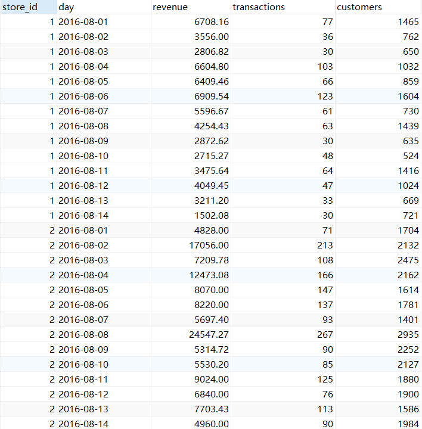
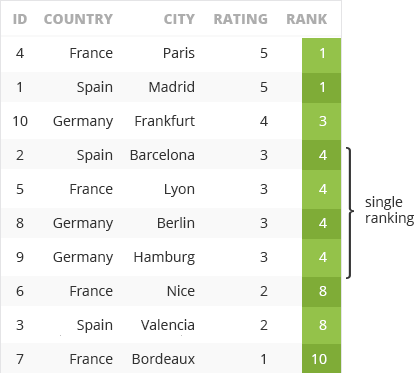
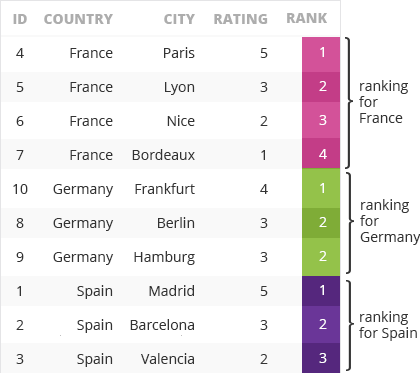

## 六 PARTITION BY 与 ORDER BY

### 学习目标

- 掌握排序函数，分析函数，window frame 与PARTITION BY ORDER BY 一起使用的用法


### 0 数据集介绍

- 商店表（store)
  -  `id`, `country` and `city`.  `rating` it has (1-5), based on customers' opinions.
  - 每个商店都有自己的编号`id`，国家`country` 和所在城市 `city` 。每个城市只有一家商店
  -  除此之外，表中该记录了每家商店开始营业的时间`opening_day`，以及用户对商店的评分`rating`（1-5）

| id   | country | city      | opening_day | rating |
| :--- | :------ | :-------- | :---------- | :----- |
| 1    | Spain   | Madrid    | 2014-05-30  | 5      |
| 2    | Spain   | Barcelona | 2015-07-28  | 3      |
| 3    | Spain   | Valencia  | 2014-12-13  | 2      |
| 4    | France  | Paris     | 2014-12-05  | 5      |
| 5    | France  | Lyon      | 2014-09-24  | 3      |
| 6    | France  | Nice      | 2014-03-15  | 2      |
| 7    | France  | Bordeaux  | 2015-07-29  | 1      |
| 8    | Germany | Berlin    | 2014-12-15  | 3      |
| 9    | Germany | Hamburg   | 2015-06-12  | 3      |
| 10   | Germany | Frankfurt | 2015-03-14  | 4      |

- 销售表（SALES）
  - 表中收集了2016年8月1日至2016年8月14日期间每个商店的销售数据，包括：
    - 商店的ID，日期`day`，当日的总收入 `revenue`， 交易笔数`transactions`，进店顾客数量`customers`（进店不一定购买）



### 1 PARTITION BY回顾

- 在本课程的第二部分，我们介绍了如何在OVER() 中使用PARTITION BY，它可以将数据按照行值进行分组，分组之后我们介绍了如何与`AVG()`, `COUNT()`, `MAX()`, `MIN()`, `SUM()`等聚合函数配合使用
- 我们在分组聚合计算时，数据的顺序并不会影响计算结果
- 在后面的课程中我们介绍了跟排序相关的内容，包括排序函数，window frames 和 分析函数
- 接下来我们将要介绍如何将PARTITION BY 与排序函数，window frames 和 分析函数组合使用，此时需要将PARTITION BY 与 ORDER BY组合起来，需要注意，PARTITION BY 需要在 ORDER BY前面

- 在进入到新的内容之前，我们快速回顾一下PARTITION BY的用法：

```mysql
SELECT
  country,
  city,
  rating,
  AVG(rating) OVER(PARTITION BY country)
FROM store;
```

- 在上面的查询中，我们查出了每家商店所在的国家，城市，评分以及每个国家商店的平均评分，如果我们不用 `PARTITION BY country` 那么我们查询的结果是对所有数据求平均值

#### 练习 60

- 需求： 统计每个商店的收入情况，返回字段如下：
  - 商店id ，日期`day`，收入`revenue`，每个商店的平均收入`avg_revenue`

```sql
SELECT
  store_id,
  day,
  revenue,
  AVG(revenue) OVER(PARTITION BY store_id) AS `avg_revenue`
FROM sales;
```

查询结果

| store_id | day       | revenue | avg_revenue |
| -------- | --------- | ------- | ----------- |
| 1        | 2016/8/1  | 6708.16 | 4333.72429  |
| 1        | 2016/8/2  | 3556    | 4333.72429  |
| 1        | 2016/8/3  | 2806.82 | 4333.72429  |
| 1        | 2016/8/4  | 6604.8  | 4333.72429  |
| 1        | 2016/8/5  | 6409.46 | 4333.72429  |
| 1        | 2016/8/6  | 6909.54 | 4333.72429  |
| 1        | 2016/8/7  | 5596.67 | 4333.72429  |
| 1        | 2016/8/8  | 4254.43 | 4333.72429  |
| 1        | 2016/8/9  | 2872.62 | 4333.72429  |
| 1        | 2016/8/10 | 2715.27 | 4333.72429  |
| 1        | 2016/8/11 | 3475.64 | 4333.72429  |
| 1        | 2016/8/12 | 4049.45 | 4333.72429  |
| 1        | 2016/8/13 | 3211.2  | 4333.72429  |
| 1        | 2016/8/14 | 1502.08 | 4333.72429  |
| 2        | 2016/8/1  | 4828    | 9105.27714  |
| 2        | 2016/8/2  | 17056   | 9105.27714  |
| ……       | ……        | ……      | ……          |

#### 练习 61

- 需求，统计2016年8月1日至8月7日之间的所有交易，返回如下字段
  - 商店id`store_id`, 具体日期 `day`, 交易数量 `transactions`, 当天所有商店的总交易量`sum`，每天单店交易数量占总体的百分比四舍五入为整数值）。

```mysql
SELECT
  store_id,
  day,
  transactions,
  SUM(transactions) OVER(PARTITION BY day) `sum`,
  ROUND(transactions/ SUM(transactions) OVER(PARTITION BY day)*100,) `percent`
FROM sales
WHERE day BETWEEN '2016-08-01' AND '2016-08-07';
```

**查询结果**

| store_id | day      | transactions | sum  | percent |
| -------- | -------- | ------------ | ---- | ------- |
| 1        | 2016/8/1 | 77           | 1021 | 8       |
| 2        | 2016/8/1 | 71           | 1021 | 7       |
| 3        | 2016/8/1 | 57           | 1021 | 6       |
| 4        | 2016/8/1 | 123          | 1021 | 12      |
| 5        | 2016/8/1 | 64           | 1021 | 6       |
| 6        | 2016/8/1 | 25           | 1021 | 2       |
| 7        | 2016/8/1 | 146          | 1021 | 14      |
| 8        | 2016/8/1 | 127          | 1021 | 12      |
| 9        | 2016/8/1 | 136          | 1021 | 13      |
| 10       | 2016/8/1 | 195          | 1021 | 19      |
| 1        | 2016/8/2 | 36           | 1030 | 3       |
| 2        | 2016/8/2 | 213          | 1030 | 21      |
| 3        | 2016/8/2 | 158          | 1030 | 15      |
| ……       | ……       | ……           | ……   | ……      |

### 2 RANK() 与 PARTITION BY ORDER BY

- 接下来，我们来看一下如何把 RANK() 与 `PARTITION BY` 和 `ORDER BY` 一起使用

- 到目前为止，所有排名的计算都是基于对所有数据进行排序得到的，比如下面的SQL，我们通过对评分`rating` 降序排列可以将所有商店依据用户评分进行排名

```mysql
SELECT
  id,
  country,
  city,
  rating,
  RANK() OVER(ORDER BY rating DESC) AS `rank`
FROM store;
```



- 现在我们加上 `PARTITION BY` ，可以用国家分组，对不同国家的商店按评分分别排序

```mysql
SELECT
  id,
  country,
  city,
  rating,
  RANK() OVER(PARTITION BY country ORDER BY rating DESC) AS `rank`
FROM store;
```

- 通过这种方式，我们可以得到每个国家区域内的第一名，第二名……



#### 练习 62

- 需求，统计2016年8月10日至8月14日之间的销售情况，返回如下字段
  - `store_id`, `day`,顾客数量`customers`, 每个商店在该段时间内按每日顾客数量排名（降序排列）

```mysql
SELECT
  store_id,
  day,
  customers,
  RANK() OVER (PARTITION BY store_id ORDER BY customers DESC) AS `rank`
FROM sales
WHERE day BETWEEN '2016-08-10' AND '2016-08-14';
```

**查询结果**

| store_id | day        | customers | rank |
| :------- | :--------- | :-------- | :--- |
| 1        | 2016-08-11 | 1416      | 1    |
| 1        | 2016-08-12 | 1024      | 2    |
| 1        | 2016-08-14 | 721       | 3    |
| 1        | 2016-08-13 | 669       | 4    |
| 1        | 2016-08-10 | 524       | 5    |
| 2        | 2016-08-10 | 2127      | 1    |
| 2        | 2016-08-14 | 1984      | 2    |
| 2        | 2016-08-12 | 1900      | 3    |
| 2        | 2016-08-11 | 1880      | 4    |
| 2        | 2016-08-13 | 1586      | 5    |
| 3        | 2016-08-14 | 1931      | 1    |
| 3        | 2016-08-13 | 1704      | 2    |
| 3        | 2016-08-10 | 1258      | 3    |
| 3        | 2016-08-12 | 1229      | 4    |
| 3        | 2016-08-11 | 1088      | 5    |
| 4        | 2016-08-14 | 3920      | 1    |
| 4        | 2016-08-12 | 3914      | 2    |
| 4        | 2016-08-10 | 3457      | 3    |
| 4        | 2016-08-13 | 2447      | 4    |
| ……       | ……         | ……        | ……   |


### 3 NTILE(x) 和 PARTITION BY ORDER BY

- 我们也可以使用其它排序函数如NTILE(x)， 用法与前面的RANK完全一致

```mysql
SELECT
  id,
  country,
  city,
  rating,
  NTILE(2) OVER(PARTITION BY country ORDER BY opening_day)
FROM store;
```

- 在上面的查询中，我们将数据按国家分组，进一步按照开业的时间远近划分成两组，一组开业时间较长，另一组开业时间较短

**查询结果**

| id   | country | city      | rating | NTILE |
| ---- | ------- | --------- | ------ | ----- |
| 6    | France  | Nice      | 2      | 1     |
| 5    | France  | Lyon      | 3      | 1     |
| 4    | France  | Paris     | 5      | 2     |
| 7    | France  | Bordeaux  | 1      | 2     |
| 8    | Germany | Berlin    | 3      | 1     |
| 10   | Germany | Frankfurt | 4      | 1     |
| 9    | Germany | Hamburg   | 3      | 2     |
| 1    | Spain   | Madrid    | 5      | 1     |
| 3    | Spain   | Valencia  | 2      | 1     |
| 2    | Spain   | Barcelona | 3      | 2     |

#### 练习 63

- 需求：统计2016年8月1日至8月10日之间的销售额，查询结果返回：
  - 商店ID`store_id`，日期`day` ，收入`revenue`，并将每个商店的销售数据按当日销售额分为4组

```mysql
SELECT
  store_id,
  day,
  revenue,
  NTILE(4) OVER (PARTITION BY store_id ORDER BY revenue DESC) `ntile`
FROM sales
WHERE day BETWEEN '2016-08-01' AND '2016-08-10';
```

**查询结果**

| store_id | day        | revenue  | ntile |
| :------- | :--------- | :------- | :---- |
| 1        | 2016-08-06 | 6909.54  | 1     |
| 1        | 2016-08-01 | 6708.16  | 1     |
| 1        | 2016-08-04 | 6604.80  | 1     |
| 1        | 2016-08-05 | 6409.46  | 2     |
| 1        | 2016-08-07 | 5596.67  | 2     |
| 1        | 2016-08-08 | 4254.43  | 2     |
| 1        | 2016-08-02 | 3556.00  | 3     |
| 1        | 2016-08-09 | 2872.62  | 3     |
| 1        | 2016-08-03 | 2806.82  | 4     |
| 1        | 2016-08-10 | 2715.27  | 4     |
| 2        | 2016-08-08 | 24547.27 | 1     |
| 2        | 2016-08-02 | 17056.00 | 1     |
| 2        | 2016-08-04 | 12473.08 | 1     |
| 2        | 2016-08-06 | 8220.00  | 2     |
| 2        | 2016-08-05 | 8070.00  | 2     |
| 2        | 2016-08-03 | 7209.78  | 2     |
| 2        | 2016-08-07 | 5697.40  | 3     |
| 2        | 2016-08-10 | 5530.20  | 3     |
| 2        | 2016-08-09 | 5314.72  | 4     |
| 2        | 2016-08-01 | 4828.00  | 4     |

### 4 在CTE中使用PARTITION BY ORDER BY 

- 我们可以在 CTE 中使用PARTITION BY ORDER BY  将数据进一步分组，对每组进一步排序

```mysql
WITH ranking AS (
  SELECT
    country,
    city,
    RANK() OVER(PARTITION BY country ORDER BY rating DESC) AS rank
  FROM store
)

SELECT
  country,
  city
FROM ranking
WHERE rank = 1;
```

- 在上面的SQL中，我们查询除了每个国家**顾客评价最高**的商店所在城市
  - 通过在CTE中使用窗口函数来获取每个国家/地区按评分的商店排名
  - 在外部查询中直接查询每个国家分数最高的店铺所在城市

#### 练习 64

- 需求：查询每个商店收入最高的那一天的具体日期，返回商店id `store_id`, 收入 `revenue` , 日期 `day`

```mysql
WITH ranking AS (
  SELECT
    store_id,
    revenue,
    day,
    RANK() OVER(PARTITION BY store_id ORDER BY revenue DESC) AS rank
  FROM sales
)

SELECT
  store_id,
  revenue,
  day
FROM ranking
WHERE rank = 1;
```

**查询结果**

| store_id | revenue  | day        |
| :------- | :------- | :--------- |
| 1        | 6909.54  | 2016-08-06 |
| 2        | 24547.27 | 2016-08-08 |
| 3        | 15845.45 | 2016-08-02 |
| 4        | 19693.13 | 2016-08-09 |
| 5        | 15665.50 | 2016-08-05 |
| 6        | 10493.54 | 2016-08-14 |
| 7        | 10202.21 | 2016-08-05 |
| 8        | 16133.33 | 2016-08-11 |
| 9        | 14398.50 | 2016-08-10 |
| 10       | 16536.36 | 2016-08-01 |

### 5 综合练习

#### 练习65

- 需求：分析2016年8月1日到8月3日的销售情况，对所有店铺每天的交易数量进行排名（不要有并列情况）
- 返回字段：
  - 店铺id `store_id`，日期 `day`，交易数量`transactions`，排名`place_no`

```mysql
SELECT
  store_id,
  day,
  transactions,
  ROW_NUMBER() OVER (PARTITION BY day ORDER BY transactions DESC) AS place_no
FROM sales
WHERE day
BETWEEN '2016-08-01' AND '2016-08-03';
```

**查询结果**

| store_id | day        | transactions | place_no |
| :------- | :--------- | :----------- | :------- |
| 10       | 2016-08-01 | 195          | 1        |
| 7        | 2016-08-01 | 146          | 2        |
| 9        | 2016-08-01 | 136          | 3        |
| 8        | 2016-08-01 | 127          | 4        |
| 4        | 2016-08-01 | 123          | 5        |
| 1        | 2016-08-01 | 77           | 6        |
| 2        | 2016-08-01 | 71           | 7        |
| 5        | 2016-08-01 | 64           | 8        |
| 3        | 2016-08-01 | 57           | 9        |
| 6        | 2016-08-01 | 25           | 10       |
| 2        | 2016-08-02 | 213          | 1        |
| 4        | 2016-08-02 | 190          | 2        |
| 3        | 2016-08-02 | 158          | 3        |
| 9        | 2016-08-02 | 136          | 4        |
| 10       | 2016-08-02 | 108          | 5        |
| 5        | 2016-08-02 | 61           | 6        |
| 8        | 2016-08-02 | 50           | 7        |
| 6        | 2016-08-02 | 39           | 8        |
| 7        | 2016-08-02 | 39           | 9        |
| ……       | ……         | ……           | ……       |

#### 练习66

- 需求：查询每天销冠商店的id,以及销售金额
  - 结果字段：销冠商店`store_id`, 日期`day`, 销售金额`revenue`

```mysql
WITH ranking AS (
  SELECT
    store_id,
    day,
    revenue,
    RANK() OVER(PARTITION BY day ORDER BY revenue DESC) AS rank
  FROM sales
)

SELECT
  store_id,
  day,
  revenue
FROM ranking
WHERE rank = 1;
```

**查询结果**

| store_id | day        | revenue  |
| :------- | :--------- | :------- |
| 10       | 2016-08-01 | 16536.36 |
| 2        | 2016-08-02 | 17056.00 |
| 4        | 2016-08-03 | 19661.13 |
| 2        | 2016-08-04 | 12473.08 |
| 5        | 2016-08-05 | 15665.50 |
| 4        | 2016-08-06 | 13722.67 |
| 4        | 2016-08-07 | 12885.22 |
| 2        | 2016-08-08 | 24547.27 |
| 4        | 2016-08-09 | 19693.13 |
| 4        | 2016-08-10 | 16824.07 |
| 8        | 2016-08-11 | 16133.33 |
| 4        | 2016-08-12 | 13307.60 |
| 4        | 2016-08-13 | 11011.50 |
| 4        | 2016-08-14 | 16711.58 |

#### 练习67

- 需求：分析每个店铺的销售情况，按销售笔数将所有日期划分为4组，找到每个店铺销售最差的那一组日期

```mysql
WITH ranking AS (
  SELECT
    store_id,
    day,
    transactions,
    NTILE(4) OVER(PARTITION BY store_id ORDER BY transactions) AS quartile
  FROM sales
)

SELECT
  store_id,
  day,
  transactions
FROM ranking
WHERE quartile = 1;
```

**查询结果**

| store_id | day        | transactions |
| :------- | :--------- | :----------- |
| 1        | 2016-08-14 | 30           |
| 1        | 2016-08-09 | 30           |
| 1        | 2016-08-03 | 30           |
| 1        | 2016-08-13 | 33           |
| 2        | 2016-08-01 | 71           |
| 2        | 2016-08-12 | 76           |
| 2        | 2016-08-10 | 85           |
| 2        | 2016-08-14 | 90           |
| 3        | 2016-08-06 | 38           |
| 3        | 2016-08-03 | 49           |
| 3        | 2016-08-08 | 51           |
| 3        | 2016-08-05 | 53           |
| 4        | 2016-08-01 | 123          |
| 4        | 2016-08-11 | 123          |
| 4        | 2016-08-05 | 134          |
| 4        | 2016-08-13 | 136          |
| 5        | 2016-08-06 | 37           |
| 5        | 2016-08-12 | 44           |
| 5        | 2016-08-09 | 53           |
| 5        | 2016-08-13 | 58           |

### 6 PARTITION BY ORDER BY 和 window frames组合

- 我们可以将`PARTITION BY ORDER BY` 与 window frames组合起来，创建更复杂的窗口

  ```mysql
  SELECT
    id,
    country,
    city,
    opening_day,
    rating,
    MAX(rating) OVER(
      PARTITION BY country
      ORDER BY opening_day
      ROWS BETWEEN UNBOUNDED PRECEDING AND CURRENT ROW)
  FROM store;
  ```

- 在上面的例子中，我们按国家分组，每组内按开业日期排序，查询了到当前日期位置，该国家以开业商店的最高得分

#### 练习68

- 需求：分析2016年8月1日到8月7日的销售数据，统计到当前日期为止的单日最高销售收入

  - 返回字段：商店id`store_id`，日期 `day`，销售收入 `revenue` 和 最佳销售收入 **best revenue** 

  ```mysql
  SELECT
    store_id,
    day,
    revenue,
    MAX(revenue) OVER(
      PARTITION BY store_id
      ORDER BY day
      ROWS BETWEEN UNBOUNDED PRECEDING AND CURRENT ROW) as best_revenue
  FROM sales
  WHERE day BETWEEN '2016-08-01' AND '2016-08-07';
  ```

  **查询结果**

  | store_id | day        | revenue  | best_revenue |
  | :------- | :--------- | :------- | :----------- |
  | 1        | 2016-08-01 | 6708.16  | 6708.16      |
  | 1        | 2016-08-02 | 3556.00  | 6708.16      |
  | 1        | 2016-08-03 | 2806.82  | 6708.16      |
  | 1        | 2016-08-04 | 6604.80  | 6708.16      |
  | 1        | 2016-08-05 | 6409.46  | 6708.16      |
  | 1        | 2016-08-06 | 6909.54  | 6909.54      |
  | 1        | 2016-08-07 | 5596.67  | 6909.54      |
  | 2        | 2016-08-01 | 4828.00  | 4828.00      |
  | 2        | 2016-08-02 | 17056.00 | 17056.00     |
  | 2        | 2016-08-03 | 7209.78  | 17056.00     |
  | 2        | 2016-08-04 | 12473.08 | 17056.00     |
  | 2        | 2016-08-05 | 8070.00  | 17056.00     |
  | 2        | 2016-08-06 | 8220.00  | 17056.00     |
  | 2        | 2016-08-07 | 5697.40  | 17056.00     |
  | 3        | 2016-08-01 | 4826.50  | 4826.50      |
  | 3        | 2016-08-02 | 15845.45 | 15845.45     |
  | 3        | 2016-08-03 | 3399.40  | 15845.45     |
  | 3        | 2016-08-04 | 5490.50  | 15845.45     |
  | 3        | 2016-08-05 | 4060.47  | 15845.45     |
  | 3        | 2016-08-06 | 2198.20  | 15845.45     |


#### 练习69

- 需求：统计2016年8月1日至2016年8月10日期间，每间商店的五日平均交易笔数（以当前行为基准，从两天前到两天后共五天）
  - 返回字段：商店ID`store_id`，日期` day`，交易笔数`transactions`，五日平均交易笔数 5day_avg

```mysql
SELECT
  store_id,
  day,
  transactions,
  AVG(transactions) OVER(
    PARTITION BY store_id
    ORDER BY day
    ROWS BETWEEN 2 PRECEDING AND 2 FOLLOWING) as `avg`
FROM sales
WHERE day BETWEEN '2016-08-01' AND '2016-08-10';
```


**查询结果**

| store_id | day       | transactions | avg      |
| -------- | --------- | ------------ | -------- |
| 1        | 2016/8/1  | 77           | 47.6667  |
| 1        | 2016/8/2  | 36           | 61.5     |
| 1        | 2016/8/3  | 30           | 62.4     |
| 1        | 2016/8/4  | 103          | 71.6     |
| 1        | 2016/8/5  | 66           | 76.6     |
| 1        | 2016/8/6  | 123          | 83.2     |
| 1        | 2016/8/7  | 61           | 68.6     |
| 1        | 2016/8/8  | 63           | 65       |
| 1        | 2016/8/9  | 30           | 50.5     |
| 1        | 2016/8/10 | 48           | 47       |
| 2        | 2016/8/1  | 71           | 130.6667 |
| 2        | 2016/8/2  | 213          | 139.5    |
| 2        | 2016/8/3  | 108          | 141      |
| ……       | ……        | ……           | ……       |

#### 练习 70

- 需求：分析销售情况，返回如下内容：
  - 商店ID`store_id`，日期`date`，收入`revenue` 和总部应收的未来现金流量（即该商店的总收入，从表中的当天到最后一天收入求和）

```mysql
SELECT
  store_id,
  day,
  revenue,
  SUM(revenue) OVER(
    PARTITION BY store_id
    ORDER BY day
    ROWS BETWEEN CURRENT ROW AND UNBOUNDED FOLLOWING)
FROM sales
```

**查询结果**

| store_id | day        | revenue  | sum       |
| :------- | :--------- | :------- | :-------- |
| 1        | 2016-08-01 | 6708.16  | 60672.14  |
| 1        | 2016-08-02 | 3556.00  | 53963.98  |
| 1        | 2016-08-03 | 2806.82  | 50407.98  |
| 1        | 2016-08-04 | 6604.80  | 47601.16  |
| 1        | 2016-08-05 | 6409.46  | 40996.36  |
| 1        | 2016-08-06 | 6909.54  | 34586.90  |
| 1        | 2016-08-07 | 5596.67  | 27677.36  |
| 1        | 2016-08-08 | 4254.43  | 22080.69  |
| 1        | 2016-08-09 | 2872.62  | 17826.26  |
| 1        | 2016-08-10 | 2715.27  | 14953.64  |
| 1        | 2016-08-11 | 3475.64  | 12238.37  |
| 1        | 2016-08-12 | 4049.45  | 8762.73   |
| 1        | 2016-08-13 | 3211.20  | 4713.28   |
| 1        | 2016-08-14 | 1502.08  | 1502.08   |
| 2        | 2016-08-01 | 4828.00  | 127473.88 |
| 2        | 2016-08-02 | 17056.00 | 122645.88 |
| 2        | 2016-08-03 | 7209.78  | 105589.88 |
| 2        | 2016-08-04 | 12473.08 | 98380.10  |
| ……       | ……         | ……       | ……        |

### 7 分析函数 与 PARTITION BY ORDER BY组合

#### LEAD 和 LAG

- 接下来我们来看将分析函数与PARTITION BY ORDER BY组合使用，看下面的例子

  ```mysql
  SELECT
    country,
    city,
    opening_day,
    LEAD(city, 1, 'NaN') OVER(PARTITION BY country ORDER BY opening_day)
  FROM store;
  ```

- 上面的查询中，我们将数据按国家分组组内按商店开业日期排序，查询了每个店铺开店的日期，以及同一国家下一个开业的商店所在城市

  | country | city      | opening_day | lead      |
  | ------- | --------- | ----------- | --------- |
  | France  | Nice      | 2014/3/15   | Lyon      |
  | France  | Lyon      | 2014/9/24   | Paris     |
  | France  | Paris     | 2014/12/5   | Bordeaux  |
  | France  | Bordeaux  | 2015/7/29   | NaN       |
  | Germany | Berlin    | 2014/12/15  | Frankfurt |
  | Germany | Frankfurt | 2015/3/14   | Hamburg   |
  | Germany | Hamburg   | 2015/6/12   | NaN       |
  | Spain   | Madrid    | 2014/5/30   | Valencia  |
  | Spain   | Valencia  | 2014/12/13  | Barcelona |
  | Spain   | Barcelona | 2015/7/28   | NaN       |

#### 练习71

- 需求：统计2016年8月5日 到 2016年8月10日之间，每天的单店交易笔数，前一天交易笔数，前一天和当天的交易笔数的差值

  - 返回字段：商店ID`store_id`, 日期`day`, 交易笔数`transactions`, 前一天交易笔数`lag`, 差值`diff`

  ```mysql
  SELECT
    store_id,
    day,
    transactions,
    LAG(transactions) OVER(PARTITION BY store_id ORDER BY day) as `lag`,
    transactions - LAG(transactions) OVER(PARTITION BY store_id ORDER BY day) as `diff`
  FROM sales
  WHERE day BETWEEN '2016-08-05' AND '2016-08-10';
  ```

  **查询结果**

  | store_id | day        | transactions | lag  | ?column? |
  | :------- | :--------- | :----------- | :--- | :------- |
  | 1        | 2016-08-05 | 66           | null | null     |
  | 1        | 2016-08-06 | 123          | 66   | 57       |
  | 1        | 2016-08-07 | 61           | 123  | -62      |
  | 1        | 2016-08-08 | 63           | 61   | 2        |
  | 1        | 2016-08-09 | 30           | 63   | -33      |
  | 1        | 2016-08-10 | 48           | 30   | 18       |
  | 2        | 2016-08-05 | 147          | null | null     |
  | 2        | 2016-08-06 | 137          | 147  | -10      |
  | 2        | 2016-08-07 | 93           | 137  | -44      |
  | 2        | 2016-08-08 | 267          | 93   | 174      |
  | 2        | 2016-08-09 | 90           | 267  | -177     |
  | 2        | 2016-08-10 | 85           | 90   | -5       |
  | 3        | 2016-08-05 | 53           | null | null     |
  | 3        | 2016-08-06 | 38           | 53   | -15      |
  | 3        | 2016-08-07 | 115          | 38   | 77       |
  | 3        | 2016-08-08 | 51           | 115  | -64      |
  | 3        | 2016-08-09 | 123          | 51   | 72       |
  | 3        | 2016-08-10 | 84           | 123  | -39      |
  | 4        | 2016-08-05 | 134          | null | null     |
  | 4        | 2016-08-06 | 214          | 134  | 80       |

#### FIRST_VALUE()

- 看下面的例子

  ```mysql
  SELECT
    country,
    city,
    rating,
    FIRST_VALUE(city) OVER(PARTITION BY country ORDER BY rating DESC)
  FROM store;
  ```

- 上面的查询，不但返回了每个商店的评分，还返回了该店铺所在国家评分最高的商店所在城市，这里需要与PARTITION BY配合，将每个商店按国家进行分组

  **查询结果**

  | country | city      | rating | highest_rating |
  | ------- | --------- | ------ | -------------- |
  | France  | Paris     | 5      | Paris          |
  | France  | Lyon      | 3      | Paris          |
  | France  | Nice      | 2      | Paris          |
  | France  | Bordeaux  | 1      | Paris          |
  | Germany | Frankfurt | 4      | Frankfurt      |
  | Germany | Berlin    | 3      | Frankfurt      |
  | Germany | Hamburg   | 3      | Frankfurt      |
  | Spain   | Madrid    | 5      | Madrid         |
  | Spain   | Barcelona | 3      | Madrid         |
  | Spain   | Valencia  | 2      | Madrid         |

#### 练习72

- 需求： 统计8月1日到8月3日的销售数据找到每个商店在这段时间内销售额最高的一天，返回如下信息:
  - 商店ID `store_id`, 日期 `day`, 当日销售收入 `revenue` , 销售收入最高一天的日期`best_revenue_day`

```mysql
SELECT
  store_id,
  day,
  revenue,
  FIRST_VALUE(day) OVER(PARTITION BY store_id ORDER BY revenue DESC) AS best_revenue_day
FROM sales
WHERE day BETWEEN '2016-08-01' AND '2016-08-03';
```

查询结果

| store_id | day        | revenue  | best_revenue_day |
| :------- | :--------- | :------- | :--------------- |
| 1        | 2016-08-01 | 6708.16  | 2016-08-01       |
| 1        | 2016-08-02 | 3556.00  | 2016-08-01       |
| 1        | 2016-08-03 | 2806.82  | 2016-08-01       |
| 2        | 2016-08-02 | 17056.00 | 2016-08-02       |
| 2        | 2016-08-03 | 7209.78  | 2016-08-02       |
| 2        | 2016-08-01 | 4828.00  | 2016-08-02       |
| 3        | 2016-08-02 | 15845.45 | 2016-08-02       |
| 3        | 2016-08-01 | 4826.50  | 2016-08-02       |
| 3        | 2016-08-03 | 3399.40  | 2016-08-02       |
| 4        | 2016-08-03 | 19661.13 | 2016-08-03       |
| 4        | 2016-08-02 | 13286.00 | 2016-08-03       |
| 4        | 2016-08-01 | 7393.33  | 2016-08-03       |
| 5        | 2016-08-03 | 6884.62  | 2016-08-03       |
| 5        | 2016-08-02 | 4804.19  | 2016-08-03       |
| 5        | 2016-08-01 | 4766.83  | 2016-08-03       |
| 6        | 2016-08-03 | 4575.18  | 2016-08-03       |
| 6        | 2016-08-02 | 3146.04  | 2016-08-03       |
| 6        | 2016-08-01 | 2311.71  | 2016-08-03       |
| 7        | 2016-08-01 | 7875.69  | 2016-08-01       |
| 7        | 2016-08-03 | 5445.00  | 2016-08-01       |

#### 练习73

- 需求：分析销售收入，返回如下字段：

  - 商店id`store_id` 
  - 日期`day`
  - 当日收入 `revenue`
  - 一周前收入 `lag`
  - 当日收入和一周前收入的百分比，保留两位有效数字 `round`
  
  
  
  ```mysql
  SELECT
    store_id,
    day,
    revenue,
    LAG(revenue,7) OVER(PARTITION BY store_id ORDER BY day) as `lag`,
    ROUND(revenue / LAG(revenue, 7) OVER(PARTITION BY store_id ORDER BY day) * 100, 2) as `round`
  FROM sales;
  ```
  
  **查询结果**
  
  | store_id | day        | revenue  | lag     | round |
  | :------- | :--------- | :------- | :------ | :---- |
  | 1        | 2016-08-01 | 6708.16  | null    | null  |
  | 1        | 2016-08-02 | 3556.00  | null    | null  |
  | 1        | 2016-08-03 | 2806.82  | null    | null  |
  | 1        | 2016-08-04 | 6604.80  | null    | null  |
  | 1        | 2016-08-05 | 6409.46  | null    | null  |
  | 1        | 2016-08-06 | 6909.54  | null    | null  |
  | 1        | 2016-08-07 | 5596.67  | null    | null  |
  | 1        | 2016-08-08 | 4254.43  | 6708.16 | 63.42 |
  | 1        | 2016-08-09 | 2872.62  | 3556.00 | 80.78 |
  | 1        | 2016-08-10 | 2715.27  | 2806.82 | 96.74 |
  | 1        | 2016-08-11 | 3475.64  | 6604.80 | 52.62 |
  | 1        | 2016-08-12 | 4049.45  | 6409.46 | 63.18 |
  | 1        | 2016-08-13 | 3211.20  | 6909.54 | 46.47 |
  | 1        | 2016-08-14 | 1502.08  | 5596.67 | 26.84 |
  | 2        | 2016-08-01 | 4828.00  | null    | null  |
  | 2        | 2016-08-02 | 17056.00 | null    | null  |
  | 2        | 2016-08-03 | 7209.78  | null    | null  |
  | 2        | 2016-08-04 | 12473.08 | null    | null  |
  | 2        | 2016-08-05 | 8070.00  | null    | null  |
  | 2        | 2016-08-06 | 8220.00  | null    | null  |

#### 练习74

- 需求： 分析店铺的客流情况，返回如下字段

  - 商店id`store_id` 
  - 日期`day`
  - 客流数量  `customers` 
  - 每天所有商店客流排名第5的客流数量 `nth_value`
  
  ```mysql
  SELECT
    store_id,
    day,
    customers,
    NTH_VALUE(customers, 5) OVER(
      PARTITION BY day
      ORDER BY customers DESC
      ROWS BETWEEN UNBOUNDED PRECEDING AND UNBOUNDED FOLLOWING) AS `nth_value`
  FROM sales;
  ```
  
  **查询结果**
  
  | store_id | day        | customers | nth_value |
  | :------- | :--------- | :-------- | :-------- |
  | 4        | 2016-08-01 | 2218      | 1896      |
  | 10       | 2016-08-01 | 2140      | 1896      |
  | 8        | 2016-08-01 | 1912      | 1896      |
  | 9        | 2016-08-01 | 1897      | 1896      |
  | 7        | 2016-08-01 | 1896      | 1896      |
  | 2        | 2016-08-01 | 1704      | 1896      |
  | 1        | 2016-08-01 | 1465      | 1896      |
  | 3        | 2016-08-01 | 1379      | 1896      |
  | 5        | 2016-08-01 | 773       | 1896      |
  | 6        | 2016-08-01 | 348       | 1896      |
  | 4        | 2016-08-02 | 3796      | 1360      |
  | 2        | 2016-08-02 | 2132      | 1360      |
  | 10       | 2016-08-02 | 1946      | 1360      |
  | 3        | 2016-08-02 | 1743      | 1360      |
  | 9        | 2016-08-02 | 1360      | 1360      |
  | 8        | 2016-08-02 | 1109      | 1360      |
  | 5        | 2016-08-02 | 973       | 1360      |
  | 6        | 2016-08-02 | 971       | 1360      |
  | 1        | 2016-08-02 | 762       | 1360      |
  | 7        | 2016-08-02 | 620       | 1360      |

### 小结

- 本小节我们介绍了使用分析函数与`PARTITION BY ORDER BY` 结合，添加排名或者把数据按照一定顺序分区

- 接下来我们通过几个习题来检验一下学习效果，先看一下数据集

维修记录表（repairs)

- 我们的维修商店统计了热销手机的维修情况，表中的字段包含
  - 电话型号 `phone`
  - 日期 `day`
  - 当日免费维修的数量 `free_repairs`
  - 当日付费维修的数量 `paid_repairs`
  - 当日的维修收入 `revenue`

| phone          | day        | free_repairs | paid_repairs | revenue |
| :------------- | :--------- | :----------- | :----------- | :------ |
| huawei mate 30 | 2020-03-01 | 51           | 21           | 1008    |
| huawei mate 30 | 2020-03-02 | 73           | 15           | 1320    |
| huawei mate 30 | 2020-03-03 | 57           | 30           | 1380    |
| huawei mate 30 | 2020-03-04 | 47           | 20           | 1740    |
| huawei mate 30 | 2020-03-05 | 49           | 21           | 861     |
| Samsung S10    | 2020-03-01 | 73           | 28           | 2044    |
| Samsung S10    | 2020-03-02 | 70           | 13           | 1001    |
| Samsung S10    | 2020-03-03 | 71           | 25           | 2425    |
| Samsung S10    | 2020-03-04 | 66           | 32           | 1920    |
| Samsung S10    | 2020-03-05 | 66           | 27           | 1539    |
| OnePlus 7T     | 2020-03-01 | 41           | 37           | 2849    |
| OnePlus 7T     | 2020-03-02 | 70           | 35           | 2660    |
| OnePlus 7T     | 2020-03-03 | 54           | 35           | 1470    |
| OnePlus 7T     | 2020-03-04 | 55           | 22           | 858     |
| OnePlus 7T     | 2020-03-05 | 38           | 21           | 861     |

#### 练习 75

- 需求：统计每一天，免费维修数量排名第二的手机型号，返回日期  `day` ，手机型号`phone`

  ```mysql
  WITH ranking AS (
    SELECT
      day,
      phone,
      RANK() OVER(PARTITION BY day ORDER BY free_repairs DESC) AS `rank`
    FROM repairs
  )
  
  SELECT
    day,
    phone
  FROM ranking
  WHERE `rank` = 2;
  ```
  
  **查询结果**

  | day      | phone          |
  | -------- | -------------- |
  | 2020/3/1 | huawei mate 30 |
  | 2020/3/2 | Samsung S10    |
  | 2020/3/2 | OnePlus 7T     |
  | 2020/3/3 | huawei mate 30 |
  | 2020/3/4 | OnePlus 7T     |
  | 2020/3/5 | huawei mate 30 |


#### 练习 76

- 需求： 对每款机型统计，

  - 手机型号 `phone`
  - 日期 `day`
  - 当日收入`revenue` 
  - 第一天收入 `first_revenue`
  
  For each **phone**, show the following information: `phone`, `day`, `revenue` and the **revenue** for the first repair for each phone (column name `first_revenue`)
  
  ```mysql
  SELECT
    phone,
    day,
    revenue,
    FIRST_VALUE(revenue) OVER(
      PARTITION BY phone
      ORDER BY day
      ROWS BETWEEN UNBOUNDED PRECEDING AND CURRENT ROW) AS first_revenue
  FROM repairs;
  ```
  
  **查询结果**
  
  | phone          | day      | revenue | first_revenue |
  | -------------- | -------- | ------- | ------------- |
  | huawei mate 30 | 2020/3/1 | 1008    | 1008          |
  | huawei mate 30 | 2020/3/2 | 1320    | 1008          |
  | huawei mate 30 | 2020/3/3 | 1380    | 1008          |
  | huawei mate 30 | 2020/3/4 | 1740    | 1008          |
  | huawei mate 30 | 2020/3/5 | 861     | 1008          |
  | OnePlus 7T     | 2020/3/1 | 2849    | 2849          |
  | OnePlus 7T     | 2020/3/2 | 2660    | 2849          |
  | OnePlus 7T     | 2020/3/3 | 1470    | 2849          |
  | OnePlus 7T     | 2020/3/4 | 858     | 2849          |
  | OnePlus 7T     | 2020/3/5 | 861     | 2849          |
  | Samsung S10    | 2020/3/1 | 2044    | 2044          |
  | Samsung S10    | 2020/3/2 | 1001    | 2044          |
  | Samsung S10    | 2020/3/3 | 2425    | 2044          |
  | Samsung S10    | 2020/3/4 | 1920    | 2044          |
  | Samsung S10    | 2020/3/5 | 1539    | 2044          |

#### 练习 77

- 需求： 对每款机型统计，

  - 手机型号 `phone`
  - 日期 `day`
  - 当日付费维修数量`paid_repairs` 
  - 前一天付费维修数量`lag`
  - 当天和前一天付费维修数量差值 `diff`
  
  ```mysql
  SELECT
    phone,
    day,
    paid_repairs,
    LAG(paid_repairs) OVER(PARTITION BY phone ORDER BY day) AS `lag`,
    paid_repairs - LAG(paid_repairs) OVER(PARTITION BY phone ORDER BY day) AS `diff`
  FROM repairs;
  ```
  
  查询结果
  
  | Phone          | day      | paid_repairs | lag  | diff |
  | -------------- | -------- | ------------ | ---- | ---- |
  | huawei mate 30 | 2020/3/1 | 21           | NULL | NULL |
  | huawei mate 30 | 2020/3/2 | 15           | 21   | -6   |
  | huawei mate 30 | 2020/3/3 | 30           | 15   | 15   |
  | huawei mate 30 | 2020/3/4 | 20           | 30   | -10  |
  | huawei mate 30 | 2020/3/5 | 21           | 20   | 1    |
  | OnePlus 7T     | 2020/3/1 | 37           | NULL | NULL |
  | OnePlus 7T     | 2020/3/2 | 35           | 37   | -2   |
  | OnePlus 7T     | 2020/3/3 | 35           | 35   | 0    |
  | OnePlus 7T     | 2020/3/4 | 22           | 35   | -13  |
  | OnePlus 7T     | 2020/3/5 | 21           | 22   | -1   |
  | Samsung S10    | 2020/3/1 | 28           | NULL | NULL |
  | Samsung S10    | 2020/3/2 | 13           | 28   | -15  |
  | Samsung S10    | 2020/3/3 | 25           | 13   | 12   |
  | Samsung S10    | 2020/3/4 | 32           | 25   | 7    |
  | Samsung S10    | 2020/3/5 | 27           | 32   | -5   |

