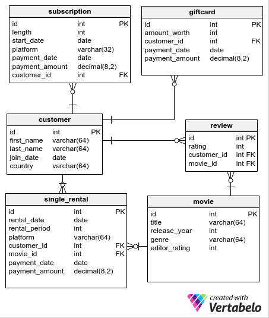

## 八 窗口函数回顾练习

### 0 数据介绍

- 本业务来自于在线电影网站，涉及6张表，顾客表`customer`，用户评分表`review` ，电影表`movie`，付费记录表`single_rental`，礼品卡表`giftcard`，注册信息表`subscription`，ER图如下

  

  

- 顾客表`customer` 保存基本用户信息，包括如下字段

  - 用户ID `id` 
  - 名字 `first_name` 
  - 姓氏 `last_name`
  - 注册日期`join_date` 
  - 国家 `country`

- 电影表`movie`，保存了跟电影相关的信息，包括如下字段

  - 电影在系统中的ID `id` 和电影名字`title` 
  - 电影上映年份 `release_year`
  - 电影的类型`genre` 
  - 电影的编辑评分`rating` (**0-10**)

- 用户评分表`review` ，包括如下字段

  - 每条评论的 `id`
  - 具体评分 `rating` (0-10)
  - 评价的用户ID `customer_id` 
  - 被评价的电影ID `movie_id`

- 点播记录表`single_rental`，网站的赢利方式之一是单独购1部电影的观看权限，权限时长不同（1天，3天，7天）价格也不同，包括如下字段：

  - 付费记录ID`id`， 
  - 授权开始时间`rental_date` 
  - 授权时长`rental_period` 单位是天
  - 付费平台`platform` (pc端desktop，手机客户端 mobile或平板端 tablet）
  - 付费用户ID`customer_id`
  - 授权电影ID`movie_id`
  - 付费日期`payment_date` （可以先看后付费）
  - 付款金额`payment_amount`

- 订阅（会员）记录表`subscription`，有的用户会购买会员（周会员，月会员，半年会员……），包括如下字段：

  - 订阅记录的`id`
  -  会员时长 `length` (天数)
  - 会员起始日期 `start_date`
  - 付费平台 `platform` (与上一张表一样)
  - 付费日期`payment_date`
  - 付费金额 `payment_amount` 
  - 付费用户ID `customer_id`

- 礼品卡表`giftcard`：网站支持购买礼品卡（充值卡）送给任何人，礼品卡可以在本网站消费，包括如下字段：

  - 礼品卡 `id`
  - 礼品卡面值 `amount_worth` (30, 50 或 100 )
  - 用户ID`customer_id`
  -  支付日期`payment_date` 
  - 支付金额 `payment_amount`.

### 1 OVER()复习

- 在这一小节中，我们介绍了窗口函数的基本语法`aggregate function + OVER()`，看下面的例子：

```mysql
SELECT
  title,
  editor_rating,
  AVG(editor_rating) OVER()
FROM movie;

```

- 这个简单的查询，最后一列通过窗口函数返回了所有电影的平均评分

#### 练习 90

- 需求：统计售出的礼品卡数量，返回如下字段：
  - 礼品卡ID`id`
  - 礼品卡面值 `amount_worth` 
  - 售出礼品卡总数量`count`

```mysql
SELECT
  id,
  amount_worth,
  COUNT(id) OVER() AS `count`
FROM giftcard;
```

查询结果

| id   | amount_worth | count |
| :--- | :----------- | :---- |
| 1    | 30           | 9     |
| 2    | 30           | 9     |
| 3    | 30           | 9     |
| 4    | 50           | 9     |
| 5    | 50           | 9     |
| 6    | 100          | 9     |
| 7    | 100          | 9     |
| 8    | 100          | 9     |
| 9    | 100          | 9     |

#### 练习 91 

- 需求：统计会员销售总金额返回如下字段
  -  `id`
  - 会员时长`length`
  - 会员起始时间 `start_date`
  - 支付金额  `payment_amount` 
  - 支付总金额 `sum`

```mysql
SELECT
  id,
  length,
  start_date,
  payment_amount,
  SUM(payment_amount) OVER() AS `sum`
FROM subscription;
```

查询结果

| id   | length | start_date | payment_amount | sum  |
| :--- | :----- | :--------- | :------------- | :--- |
| 1    | 7      | 2016-07-15 | 49             | 5143 |
| 2    | 7      | 2016-06-09 | 49             | 5143 |
| 3    | 7      | 2016-07-17 | 35             | 5143 |
| 4    | 30     | 2016-06-28 | 210            | 5143 |
| 5    | 30     | 2016-08-28 | 240            | 5143 |
| 6    | 30     | 2016-06-21 | 180            | 5143 |
| 7    | 30     | 2016-05-23 | 240            | 5143 |
| 8    | 180    | 2016-05-07 | 1440           | 5143 |
| 9    | 180    | 2016-08-18 | 1440           | 5143 |
| 10   | 180    | 2016-07-28 | 1260           | 5143 |

#### 练习 92

- 需求：对于点播记录数据，统计平均付费金额和单笔金额与平均金额的比例，返回如下字段
  - `id`
  - 权益时长`rental_period`
  - 付费金额 `payment_amount`
  - 平均付费金额 `avg`
  - 单笔金额与平均金额的比例 `ratio`

```mysql
SELECT
  id,
  rental_period,
  payment_amount,
  AVG(payment_amount) OVER() AS `avg`,
  payment_amount / AVG(payment_amount) OVER() AS `ratio`
FROM single_rental;
```

查询结果

| id   | rental_period | payment_amount | avg                 | ratio                  |
| :--- | :------------ | :------------- | :------------------ | :--------------------- |
| 1    | 1             | 6              | 20.1428571428571429 | 0.29787234042553191426 |
| 2    | 1             | 8              | 20.1428571428571429 | 0.39716312056737588568 |
| 3    | 1             | 9              | 20.1428571428571429 | 0.44680851063829787139 |
| 4    | 1             | 8              | 20.1428571428571429 | 0.39716312056737588568 |
| 5    | 1             | 6              | 20.1428571428571429 | 0.29787234042553191426 |
| 6    | 1             | 9              | 20.1428571428571429 | 0.44680851063829787139 |
| 7    | 1             | 9              | 20.1428571428571429 | 0.44680851063829787139 |
| 8    | 1             | 6              | 20.1428571428571429 | 0.29787234042553191426 |
| 9    | 1             | 6              | 20.1428571428571429 | 0.29787234042553191426 |
| 10   | 3             | 21             | 20.1428571428571429 | 1.0425531914893617     |
| 11   | 3             | 15             | 20.1428571428571429 | 0.74468085106382978565 |
| 12   | 3             | 12             | 20.1428571428571429 | 0.59574468085106382852 |
| 13   | 3             | 18             | 20.1428571428571429 | 0.89361702127659574278 |
| 14   | 3             | 24             | 20.1428571428571429 | 1.1914893617021277     |
| 15   | 7             | 28             | 20.1428571428571429 | 1.3900709219858156     |
| 16   | 7             | 28             | 20.1428571428571429 | 1.3900709219858156     |
| 17   | 7             | 49             | 20.1428571428571429 | 2.4326241134751773     |
| 18   | 7             | 28             | 20.1428571428571429 | 1.3900709219858156     |
| 19   | 7             | 49             | 20.1428571428571429 | 2.4326241134751773     |
| 20   | 7             | 21             | 20.1428571428571429 | 1.0425531914893617     |

### 2 PARTITION BY复习

- 在第二部分中，我们介绍了PARTITION BY的用法，通过PARTITION BY我们可以将数据分组，否则只能把所有的数据一起处理

```mysql
SELECT
  first_name,
  last_name,
  country,
  COUNT(id) OVER(PARTITION BY country)
FROM customer;
```

- 上面的SQL中，我们使用窗口函数按国家将数据分组，统计每个国家的客户数量

#### 练习 93

- 需求：按类别统计每部电影的平均编辑评分，返回字段

  - 电影名字 `title`
  - 电影编辑评分 `editor_rating`
  - 电影所属类别`genre` 
  -  该类电影的平均编辑评分 `avg`
  
  For each **movie**, show its `title`, `editor_rating`, `genre` and the **average** `editor_rating` of all movies of the same `genre`.

```mysql
SELECT
  title,
  editor_rating,
  genre,
  AVG(editor_rating) OVER(PARTITION BY genre) AS `avg`
FROM movie;
```

**查询结果**

| title                   | editor_rating | genre       | avg    |
| :---------------------- | :------------ | :---------- | :----- |
| Showgirls               | 3             | documentary | 3.0000 |
| Titanic                 | 10            | drama       | 9.0000 |
| Godfather               | 8             | drama       | 9.0000 |
| Avatar                  | 8             | fantasy     | 5.0000 |
| Plan 9 From Outer Space | 2             | fantasy     | 5.0000 |

#### 练习 94

- 需求: 统计用户对电影的评价情况，返回如下字段
  - 电影名称 `title`
  - 该电影的用户评分平均值 `avg_movie_rating`
  - 该电影所属类别的用户评分平均值 `avg_genre_rating`
  - 所有电影的用户评分平均值 `avg_rating`

```mysql
SELECT DISTINCT
  title,
  AVG(rating) OVER(partition by movie_id) AS avg_movie_rating,
  AVG(rating) OVER(partition by genre) AS avg_genre_rating,
  AVG(rating) OVER() AS avg_rating
FROM movie
JOIN review
  ON movie.id = review.movie_id;
```

**查询结果**

| title                   | avg_movie_rating | avg_genre_rating | avg_rating |
| :---------------------- | :--------------- | :--------------- | :--------- |
| Showgirls               | 3.0000           | 3.0000           | 5.7222     |
| Godfather               | 8.0000           | 8.6250           | 5.7222     |
| Avatar                  | 7.5000           | 3.6667           | 5.7222     |
| Titanic                 | 9.2500           | 8.6250           | 5.7222     |
| Plan 9 From Outer Space | 1.7500           | 3.6667           | 5.7222     |

#### 练习 95

- 需求: 统计不同面值礼品卡的销售情况，返回如下字段：
  - 礼品卡面值`amount_worth`
  - 当前面值的礼品卡销售量 `count_1`
  - 一共买了多少礼品卡 `count_2`
  - 当前面值销量占总销量百分比  `percentage`

```mysql
SELECT DISTINCT
  amount_worth,
  COUNT(id) OVER(PARTITION BY amount_worth) AS count_1,
  COUNT(id) OVER() AS count_2,
  ROUND(100 * COUNT(id) OVER(PARTITION BY amount_worth)  / COUNT(id) OVER()) AS percentage
FROM giftcard;
```

**查询结果**

| amount_worth | count_1 | count_2 | percentage |
| :----------- | :------ | :------ | :--------- |
| 100          | 4       | 9       | 44         |
| 30           | 3       | 9       | 33         |
| 50           | 2       | 9       | 22         |

#### 练习 96

- 需求： 统计所有点播电影用户的消费情况，返回如下字段
  - 用户名字`first_name`
  - 用户姓氏`last_name`
  - 用户平均消费金额 `avg_customer`
  - 按用户所属国家统计平均消费金额 `avg_country`

```mysql
SELECT DISTINCT
  first_name,
  last_name,
  AVG(payment_amount) OVER(PARTITION BY customer.id) AS avg_customer,
  AVG(payment_amount) OVER(PARTITION BY country) AS avg_country
FROM customer
JOIN single_rental
  ON customer.id = single_rental.customer_id;
```

**查询结果**

| first_name | last_name  | avg_customer        | avg_country         |
| :--------- | :--------- | :------------------ | :------------------ |
| Catherine  | Coleman    | 18.0000             | 12.5000             |
| Kathryn    | Reed       | 7.0000              | 12.5000             |
| Ryan       | Young      | 28.0000             | 26.2857142857142857 |
| Janet      | Simmons    | 14.3333333333333333 | 18.9000             |
| Brandon    | Thomas     | 10.0000             | 26.2857142857142857 |
| Jeffrey    | Washington | 20.8571428571428571 | 18.9000             |
| Eric       | Rivera     | 42.0000             | 26.2857142857142857 |

### 3 排序函数复习

- 我们再来看排序函数

```mysql
WITH ranking AS
  (SELECT
    title,
    RANK() OVER(ORDER BY editor_rating DESC) AS `rank`
  FROM movie)

SELECT title
FROM ranking
WHERE `rank` = 2;
```

- 这里我们使用了RANK函数获取电影的评分排名，然后查询除了排名为2的电影

#### 练习 97

- 需求：分析电影的评分情况，返回如下字段，
  - 电影名称`title`
  - 上映时间 `release_year`
  - 编辑评分 `editor_rating` 
  - 编辑评分排名`rank` 按从高分到低分排列，可以有并列，但序号连续

```mysql
SELECT
  title,
  release_year,
  editor_rating,
  DENSE_RANK() OVER (ORDER BY editor_rating DESC) AS `rank`
FROM movie;
```

**查询结果**

| title                   | release_year | editor_rating | rank |
| :---------------------- | :----------- | :------------ | :--- |
| Titanic                 | 1997         | 10            | 1    |
| Avatar                  | 2009         | 8             | 2    |
| Godfather               | 1972         | 8             | 2    |
| Showgirls               | 1995         | 3             | 3    |
| Plan 9 From Outer Space | 1959         | 2             | 4    |

#### 练习 98

- 需求：统计电影的付费点播情况，返回如下字段：
  - 电影名称`title`
  - 可看时长 `rental_period`
  - 付费金额 `payment_amount` 
  - 付费金额排名（降序） `rank` 可以有并列，序号可以不连续

```mysql
SELECT
  title,
  rental_period,
  payment_amount,
  RANK() OVER(ORDER BY payment_amount DESC) AS `rank`
FROM single_rental
JOIN movie
  ON single_rental.movie_id = movie.id;
```

**查询结果**

| title                   | rental_period | payment_amount | rank |
| :---------------------- | :------------ | :------------- | :--- |
| Showgirls               | 7             | 63             | 1    |
| Plan 9 From Outer Space | 7             | 49             | 2    |
| Plan 9 From Outer Space | 7             | 49             | 2    |
| Titanic                 | 7             | 28             | 4    |
| Avatar                  | 7             | 28             | 4    |
| Plan 9 From Outer Space | 7             | 28             | 4    |
| Titanic                 | 3             | 24             | 7    |
| Showgirls               | 3             | 21             | 8    |
| Godfather               | 7             | 21             | 8    |
| Avatar                  | 3             | 18             | 10   |
| Showgirls               | 3             | 15             | 11   |
| Showgirls               | 3             | 12             | 12   |
| Plan 9 From Outer Space | 1             | 9              | 13   |
| Plan 9 From Outer Space | 1             | 9              | 13   |
| Titanic                 | 1             | 9              | 13   |
| Godfather               | 1             | 8              | 16   |
| Avatar                  | 1             | 8              | 16   |
| Showgirls               | 1             | 6              | 18   |
| Godfather               | 1             | 6              | 18   |
| Avatar                  | 1             | 6              | 18   |

#### 练习 99

- 需求：查找最近付款购买的礼品卡中，排名为2的用户（排名不能有重复），返回如下字段
  - 用户名字 `first_name`
  - 用户姓氏`last_name`
  - 付款日期`payment_date`

```mysql
WITH ranking AS (
  SELECT
    first_name,
    last_name,
    payment_date,
    ROW_NUMBER() OVER(ORDER BY payment_date DESC) AS rank
  FROM customer
  JOIN giftcard
    ON customer.id = giftcard.customer_id
)

SELECT
  first_name,
  last_name,
  payment_date
FROM ranking
WHERE rank = 2;
```

**查询结果**

| first_name | last_name | payment_date |
| :--------- | :-------- | :----------- |
| Eric       | Rivera    | 2016-04-07   |

#### 练习 100

- 需求：统计每部电影的点播付费排名
  - 返回点播日期`rental_date`
  - 电影名字 `title` 
  - 电影类别`genre`
  - 付款金额 `payment_amount` 
  - 付费金额排名（从高到低按电影类别统计）`rank`

```mysql
SELECT
  rental_date,
  title,
  genre,
  payment_amount,
  RANK() OVER(PARTITION BY genre ORDER BY payment_amount DESC) AS `rank`
FROM movie
JOIN single_rental
  ON single_rental.movie_id = movie.id;
```

**查询结果**

| rental_date | title                   | genre       | payment_amount | rank |
| :---------- | :---------------------- | :---------- | :------------- | :--- |
| 2016-04-03  | Showgirls               | documentary | 63             | 1    |
| 2016-03-21  | Showgirls               | documentary | 21             | 2    |
| 2016-02-10  | Showgirls               | documentary | 15             | 3    |
| 2016-03-20  | Showgirls               | documentary | 12             | 4    |
| 2016-04-09  | Showgirls               | documentary | 6              | 5    |
| 2016-02-20  | Titanic                 | drama       | 28             | 1    |
| 2016-03-08  | Titanic                 | drama       | 24             | 2    |
| 2016-01-12  | Godfather               | drama       | 21             | 3    |
| 2016-03-25  | Titanic                 | drama       | 9              | 4    |
| 2016-04-05  | Godfather               | drama       | 8              | 5    |
| 2016-04-09  | Godfather               | drama       | 6              | 6    |
| 2016-03-15  | Godfather               | drama       | 6              | 6    |
| 2016-03-26  | Plan 9 From Outer Space | fantasy     | 49             | 1    |
| 2016-01-06  | Plan 9 From Outer Space | fantasy     | 49             | 1    |
| 2016-04-10  | Avatar                  | fantasy     | 28             | 3    |
| 2016-04-21  | Plan 9 From Outer Space | fantasy     | 28             | 3    |
| 2016-04-13  | Avatar                  | fantasy     | 18             | 5    |
| 2016-01-07  | Plan 9 From Outer Space | fantasy     | 9              | 6    |
| 2016-04-11  | Plan 9 From Outer Space | fantasy     | 9              | 6    |
| 2016-02-09  | Avatar                  | fantasy     | 8              | 8    |

### 4 window frame复习

- 在第4小节中，我们学习了如何定义任意大小的窗框 window frame,看下面的例子

```mysql
SELECT
  id,
  payment_date,
  payment_amount,
  SUM(payment_amount) OVER(
    ORDER BY payment_date
    ROWS BETWEEN UNBOUNDED PRECEDING AND CURRENT ROW)
FROM subscription;
```

- 在上面的SQL中，我们通过定义window frame 计算了**running total paid** 这里的window frame是从第一行到当前行

#### 练习 101

- 需求：统计点播付费总金额，返回如下字段
  -  `id`
  - 点播日期`rental_date`
  - 付费金额 `payment_amount` 
  - 按点播日期排序，截止到当日的付费总金额`sum`

```mysql
SELECT
  id,
  rental_date,
  payment_amount,
  SUM(payment_amount) OVER(
    ORDER BY rental_date
    ROWS BETWEEN UNBOUNDED PRECEDING AND CURRENT ROW) AS `sum`
FROM single_rental;
```

**查询结果**

| id   | rental_date | payment_amount | sum  |
| :--- | :---------- | :------------- | :--- |
| 19   | 2016-01-06  | 49             | 49   |
| 7    | 2016-01-07  | 9              | 58   |
| 20   | 2016-01-12  | 21             | 79   |
| 4    | 2016-02-09  | 8              | 87   |
| 11   | 2016-02-10  | 15             | 102  |
| 15   | 2016-02-20  | 28             | 130  |
| 14   | 2016-03-08  | 24             | 154  |
| 5    | 2016-03-15  | 6              | 160  |
| 12   | 2016-03-20  | 12             | 172  |
| 10   | 2016-03-21  | 21             | 193  |
| 3    | 2016-03-25  | 9              | 202  |
| 17   | 2016-03-26  | 49             | 251  |
| 21   | 2016-04-03  | 63             | 314  |
| 2    | 2016-04-05  | 8              | 322  |
| 8    | 2016-04-09  | 6              | 328  |
| 1    | 2016-04-09  | 6              | 334  |
| 18   | 2016-04-10  | 28             | 362  |
| 6    | 2016-04-11  | 9              | 371  |
| 13   | 2016-04-13  | 18             | 389  |
| 16   | 2016-04-21  | 28             | 417  |

#### 练习 102

- 需求：按付款日期排序，每五天统计一次平均付款金额，返回如下字段
  -  `id`
  - 点播日期 `rental_date`
  - 应用所属平台 `platform`
  - 付款日期 `payment_date`
  - 付款金额 `payment_amount` 
  - 5日平均付款金额 `avg`

```mysql
SELECT
  id,
  rental_date,
  platform,
  payment_date,
  payment_amount,
  AVG(payment_amount) OVER(
    ORDER BY payment_date
    ROWS BETWEEN 2 PRECEDING AND 2 FOLLOWING) AS `avg`
FROM single_rental;

```

**查询结果**

| id   | rental_date | platform | payment_date | payment_amount | avg     |
| :--- | :---------- | :------- | :----------- | :------------- | :------ |
| 19   | 2016-01-06  | desktop  | 2016-01-11   | 49             | 26.3333 |
| 7    | 2016-01-07  | desktop  | 2016-01-13   | 9              | 21.7500 |
| 20   | 2016-01-12  | desktop  | 2016-01-16   | 21             | 20.4000 |
| 4    | 2016-02-09  | desktop  | 2016-02-12   | 8              | 16.2000 |
| 11   | 2016-02-10  | mobile   | 2016-02-15   | 15             | 19.2000 |
| 15   | 2016-02-20  | mobile   | 2016-02-23   | 28             | 16.2000 |
| 14   | 2016-03-08  | desktop  | 2016-03-14   | 24             | 18.8000 |
| 5    | 2016-03-15  | mobile   | 2016-03-22   | 6              | 18.2000 |
| 10   | 2016-03-21  | desktop  | 2016-03-24   | 21             | 14.4000 |
| 12   | 2016-03-20  | tablet   | 2016-03-27   | 12             | 19.4000 |
| 3    | 2016-03-25  | tablet   | 2016-03-30   | 9              | 30.8000 |
| 17   | 2016-03-26  | mobile   | 2016-04-01   | 49             | 28.2000 |
| 21   | 2016-04-03  | desktop  | 2016-04-08   | 63             | 27.0000 |
| 2    | 2016-04-05  | mobile   | 2016-04-11   | 8              | 26.4000 |
| 8    | 2016-04-09  | mobile   | 2016-04-16   | 6              | 22.2000 |
| 1    | 2016-04-09  | desktop  | 2016-04-16   | 6              | 11.4000 |
| 18   | 2016-04-10  | tablet   | 2016-04-17   | 28             | 13.4000 |
| 6    | 2016-04-11  | tablet   | 2016-04-17   | 9              | 17.8000 |
| 13   | 2016-04-13  | desktop  | 2016-04-18   | 18             | 17.8000 |
| 16   | 2016-04-21  | mobile   | 2016-04-26   | 28             | 15.2500 |

#### 练习 103

- 需求：统计会员购买付款情况，返回如下字段：
  -  `id`
  - 会员时长 `length`
  - 下单平台`platform`
  - 购买日期 `payment_date`
  - 付款金额`payment_amount` 
  - 当前日期到最后一天付款总金额 `sum`

```mysql
SELECT
  id,
  length,
  platform,
  payment_date,
  payment_amount,
  SUM(payment_amount) OVER(
    ORDER BY payment_date
    RANGE BETWEEN CURRENT ROW AND UNBOUNDED FOLLOWING) AS `sum`
FROM subscription;

```

**查询结果**

| id   | length | platform | payment_date | payment_amount | sum  |
| :--- | :----- | :------- | :----------- | :------------- | :--- |
| 8    | 180    | mobile   | 2016-05-08   | 1440           | 5143 |
| 7    | 30     | mobile   | 2016-05-25   | 240            | 3703 |
| 2    | 7      | desktop  | 2016-06-10   | 49             | 3463 |
| 6    | 30     | desktop  | 2016-06-23   | 180            | 3414 |
| 1    | 7      | desktop  | 2016-07-16   | 49             | 3234 |
| 4    | 30     | tablet   | 2016-07-20   | 210            | 3185 |
| 3    | 7      | desktop  | 2016-07-20   | 35             | 3185 |
| 10   | 180    | tablet   | 2016-07-29   | 1260           | 2940 |
| 9    | 180    | desktop  | 2016-08-21   | 1440           | 1680 |
| 5    | 30     | mobile   | 2016-08-31   | 240            | 240  |

#### 练习 104

- 需求：分析电影的点播付费情况，对每个分类的电影按点播日期排序，找到到当前日期位置的最高付费金额，返回如下字段
  - 租赁日期`rental_date`
  - 电影名字 `title` 
  - 电影所属类别  `genre` 
  - 付费金额`payment_amount` 
  - 最高付费金额`highest_amount`

```mysql
SELECT
  rental_date,
  title,
  genre,
  payment_amount,
  MAX(payment_amount) OVER(
    PARTITION BY genre
    ORDER BY rental_date
    ROWS BETWEEN UNBOUNDED PRECEDING AND CURRENT ROW
  ) AS highest_amount
FROM movie
JOIN single_rental
  ON single_rental.movie_id = movie.id;

```

**查询结果**

| rental_date | title                   | genre       | payment_amount | highest_amount |
| :---------- | :---------------------- | :---------- | :------------- | :------------- |
| 2016-02-10  | Showgirls               | documentary | 15             | 15             |
| 2016-03-20  | Showgirls               | documentary | 12             | 15             |
| 2016-03-21  | Showgirls               | documentary | 21             | 21             |
| 2016-04-03  | Showgirls               | documentary | 63             | 63             |
| 2016-04-09  | Showgirls               | documentary | 6              | 63             |
| 2016-01-12  | Godfather               | drama       | 21             | 21             |
| 2016-02-20  | Titanic                 | drama       | 28             | 28             |
| 2016-03-08  | Titanic                 | drama       | 24             | 28             |
| 2016-03-15  | Godfather               | drama       | 6              | 28             |
| 2016-03-25  | Titanic                 | drama       | 9              | 28             |
| 2016-04-05  | Godfather               | drama       | 8              | 28             |
| 2016-04-09  | Godfather               | drama       | 6              | 28             |
| 2016-01-06  | Plan 9 From Outer Space | fantasy     | 49             | 49             |
| 2016-01-07  | Plan 9 From Outer Space | fantasy     | 9              | 49             |
| 2016-02-09  | Avatar                  | fantasy     | 8              | 49             |
| 2016-03-26  | Plan 9 From Outer Space | fantasy     | 49             | 49             |
| 2016-04-10  | Avatar                  | fantasy     | 28             | 49             |
| 2016-04-11  | Plan 9 From Outer Space | fantasy     | 9              | 49             |
| 2016-04-13  | Avatar                  | fantasy     | 18             | 49             |
| 2016-04-21  | Plan 9 From Outer Space | fantasy     | 28             | 49             |

### 5 分析函数复习

- 在第5小节我们介绍了分析函数，包括
  - `LEAD` 后一行
  -  `LAG` 前一行
  -  `FIRST_VALUE` 第一行
  - ``LAST_VALUE` 最后一行
  - `NTH_VALUE` 第N行

```mysql
SELECT
  id,
  rating,
  LAG(rating) OVER(ORDER BY id)
FROM review;
```

- 上面的SQL，将数据按id排序，取当前行的前一条评分

#### 练习 105

- 需求：找到购买礼品卡数据中时间最早和最晚的付费记录，返回如下字段
  - 礼品卡面值`amount_worth`
  - 付费金额 `payment_amount` 
  - 最早付费金额 `first_value`
  - 最晚付费金额 `last_value`

```mysql
SELECT
  amount_worth,
  payment_amount,
  FIRST_VALUE(payment_amount) OVER(ORDER BY payment_date) AS `first_value`,
  LAST_VALUE(payment_amount) OVER(
    ORDER BY payment_date
    ROWS BETWEEN UNBOUNDED PRECEDING AND UNBOUNDED FOLLOWING) AS `last_value`
FROM giftcard;
```

**查询结果**

| amount_worth | payment_amount | first_value | last_value |
| :----------- | :------------- | :---------- | :--------- |
| 100          | 99             | 99          | 78         |
| 100          | 83             | 99          | 78         |
| 50           | 36             | 99          | 78         |
| 100          | 73             | 99          | 78         |
| 30           | 15             | 99          | 78         |
| 50           | 33             | 99          | 78         |
| 30           | 15             | 99          | 78         |
| 30           | 17             | 99          | 78         |
| 100          | 78             | 99          | 78         |

#### 练习 106

- 需求： 分析电影点播付费数据，将所有数据按日期排序，返回如下字段
  - 付费ID `id`
  - 付费日期 `payment_date` 
  - 付费金额`payment_amount`
  - 前一天的付费金额`lag`
  - 当天和前一天付费金额的差值`delta`

```mysql
SELECT
  id,
  payment_date,
  payment_amount,
  LAG(payment_amount) OVER(ORDER BY payment_date) AS `lag`,
  payment_amount - LAG(payment_amount) OVER(ORDER BY payment_date) AS `delta`
FROM single_rental;
```

**查询结果**

| id   | payment_date | payment_amount | lag  | delta |
| :--- | :----------- | :------------- | :--- | :---- |
| 19   | 2016-01-11   | 49             | null | null  |
| 7    | 2016-01-13   | 9              | 49   | -40   |
| 20   | 2016-01-16   | 21             | 9    | 12    |
| 4    | 2016-02-12   | 8              | 21   | -13   |
| 11   | 2016-02-15   | 15             | 8    | 7     |
| 15   | 2016-02-23   | 28             | 15   | 13    |
| 14   | 2016-03-14   | 24             | 28   | -4    |
| 5    | 2016-03-22   | 6              | 24   | -18   |
| 10   | 2016-03-24   | 21             | 6    | 15    |
| 12   | 2016-03-27   | 12             | 21   | -9    |
| 3    | 2016-03-30   | 9              | 12   | -3    |
| 17   | 2016-04-01   | 49             | 9    | 40    |
| 21   | 2016-04-08   | 63             | 49   | 14    |
| 2    | 2016-04-11   | 8              | 63   | -55   |
| 8    | 2016-04-16   | 6              | 8    | -2    |
| 1    | 2016-04-16   | 6              | 6    | 0     |
| 18   | 2016-04-17   | 28             | 6    | 22    |
| 6    | 2016-04-17   | 9              | 28   | -19   |
| 13   | 2016-04-18   | 18             | 9    | 9     |
| 16   | 2016-04-26   | 28             | 18   | 10    |

#### 练习 107

- 需求：分析每天电影点播的付费情况，返回付下字段
  - 点播日期`rental_date`
  - 每日的总付款金额`payment_amounts`
  - 前一天的总付款金额`lag`
  - 当日和前一天的付款金额差值 `delta`

```mysql
WITH temporary AS (
  SELECT
    rental_date,
    SUM(payment_amount) AS payment_amounts
  FROM single_rental
  GROUP BY rental_date
)

SELECT
  rental_date,
  payment_amounts,
  LAG(payment_amounts) OVER(ORDER BY rental_date) AS `lag`,
  payment_amounts - LAG(payment_amounts) OVER(ORDER BY rental_date) AS delta
FROM temporary;

```

**查询结果**

| rental_date | payment_amounts | lag  | delta |
| :---------- | :-------------- | :--- | :---- |
| 2016-01-06  | 49              | null | null  |
| 2016-01-07  | 9               | 49   | -40   |
| 2016-01-12  | 21              | 9    | 12    |
| 2016-02-09  | 8               | 21   | -13   |
| 2016-02-10  | 15              | 8    | 7     |
| 2016-02-20  | 28              | 15   | 13    |
| 2016-03-08  | 24              | 28   | -4    |
| 2016-03-15  | 6               | 24   | -18   |
| 2016-03-20  | 12              | 6    | 6     |
| 2016-03-21  | 21              | 12   | 9     |
| 2016-03-25  | 9               | 21   | -12   |
| 2016-03-26  | 49              | 9    | 40    |
| 2016-04-03  | 63              | 49   | 14    |
| 2016-04-05  | 8               | 63   | -55   |
| 2016-04-09  | 12              | 8    | 4     |
| 2016-04-10  | 28              | 12   | 16    |
| 2016-04-11  | 9               | 28   | -19   |
| 2016-04-13  | 18              | 9    | 9     |
| 2016-04-21  | 28              | 18   | 10    |
| 2016-04-27  | 6               | 28   | -22   |

#### 练习 108

- 需求：分析客户的电影点播情况，返回如下字段
  - 客户名字
  - 客户姓氏
  - 每个用户的总付款金额
  - 所有用户中总付款金额中排名第4少的金额

```mysql
SELECT
  first_name,
  last_name,
  SUM(payment_amount) AS sum_of_payments,
  NTH_VALUE(SUM(payment_amount), 4) OVER(
    ORDER BY SUM(payment_amount)
    ROWS BETWEEN UNBOUNDED PRECEDING AND UNBOUNDED FOLLOWING) AS `nth_value`
FROM single_rental
JOIN customer
  ON customer.id = single_rental.customer_id
GROUP BY first_name, last_name;

```

**查询结果**

| first_name | last_name  | sum_of_payments | nth_value |
| :--------- | :--------- | :-------------- | :-------- |
| Kathryn    | Reed       | 14              | 36        |
| Ryan       | Young      | 28              | 36        |
| Brandon    | Thomas     | 30              | 36        |
| Catherine  | Coleman    | 36              | 36        |
| Janet      | Simmons    | 43              | 36        |
| Eric       | Rivera     | 126             | 36        |
| Jeffrey    | Washington | 146             | 36        |

### 6 PARTITION BY与ORDER BY组合复习

- 在第6小节，我们介绍了如何将PARTITION BY 与 ORDER BY组合使用

```mysql
SELECT
  title,
  release_year,
  LEAD(title) OVER(PARTITION BY genre ORDER BY release_year)
FROM movie;
```

- 在上面的例子中，最后一列返回了同类电影中按上映时间排序的下一部电影

#### 练习 109

- 需求：分析电影的编辑评分情况，将电影分类按评分高低降序排名，返回如下字段
  - 电影名称`title`
  - 电影类别 `genre`
  - 编辑评分`editor_rating` 
  - 该电影在所属分类的编辑评分排名`rank`

```mysql
SELECT
  title,
  genre,
  editor_rating,
  RANK() OVER(PARTITION BY genre ORDER BY editor_rating DESC) AS `rank`
FROM movie;
```

**查询结果**

| title                   | genre       | editor_rating | rank |
| :---------------------- | :---------- | :------------ | :--- |
| Showgirls               | documentary | 3             | 1    |
| Titanic                 | drama       | 10            | 1    |
| Godfather               | drama       | 8             | 2    |
| Avatar                  | fantasy     | 8             | 1    |
| Plan 9 From Outer Space | fantasy     | 2             | 2    |

#### 练习 110

- 需求：分析电影的用户评分情况，比较当前和上一个用户评分，返回如下字段
  - 评价ID `id`
  - 电影标题 `title`
  - 用户评价分数`rating`
  - 上一个用户的评价分数`lag`（每部电影按评价id排序）

```mysql
SELECT
  review.id,
  title,
  rating,
  LAG(rating) OVER(PARTITION BY movie_id ORDER BY review.id) AS `lag`
FROM review
JOIN movie
  ON review.movie_id = movie.id;
```

**查询结果**

| id   | title                   | rating | lag  |
| :--- | :---------------------- | :----- | :--- |
| 1    | Avatar                  | 7      | null |
| 2    | Avatar                  | 8      | 7    |
| 3    | Titanic                 | 10     | null |
| 4    | Titanic                 | 10     | 10   |
| 5    | Titanic                 | 8      | 10   |
| 6    | Titanic                 | 9      | 8    |
| 7    | Godfather               | 9      | null |
| 8    | Godfather               | 9      | 9    |
| 9    | Godfather               | 8      | 9    |
| 10   | Godfather               | 6      | 8    |
| 11   | Showgirls               | 3      | null |
| 12   | Showgirls               | 3      | 3    |
| 13   | Showgirls               | 5      | 3    |
| 14   | Showgirls               | 1      | 5    |
| 15   | Plan 9 From Outer Space | 1      | null |
| 16   | Plan 9 From Outer Space | 1      | 1    |
| 17   | Plan 9 From Outer Space | 3      | 1    |
| 18   | Plan 9 From Outer Space | 2      | 3    |

#### 练习 111

- 需求： 分析不同类型电影的用户评分情况，将不同类别按平均评分降序排名，返回如下字段：
  - 电影名称`title`
  - 所属类型`genre`
  - 该类型电影的平均评分`avg`
  - 该类型电影的平均评分排序`rank`

```mysql
SELECT
  title,
  genre,
  AVG(rating) AS `avg`,
  RANK() OVER(
    PARTITION BY genre
    ORDER BY AVG(rating) DESC) AS `rank`
FROM movie m
JOIN review r
  ON m.id = r.movie_id
GROUP BY title, genre;
```

**查询结果**

| title                   | genre       | avg                | rank |
| :---------------------- | :---------- | :----------------- | :--- |
| Showgirls               | documentary | 3.0000000000000000 | 1    |
| Titanic                 | drama       | 9.2500000000000000 | 1    |
| Godfather               | drama       | 8.0000000000000000 | 2    |
| Avatar                  | fantasy     | 7.5000000000000000 | 1    |
| Plan 9 From Outer Space | fantasy     | 1.7500000000000000 | 2    |

#### 练习 112

- 需求：分析充值会员的客户端使用情况将不同客户端按总充值金额从高到低排序，返回如下字段
  - 客户端名称 `platform`
  - 当前类型客户端的充值总金额 `sum`
  - 排名情况`rank`

```mysql
SELECT
  platform,
  SUM(payment_amount) AS `sum`,
  RANK() OVER(ORDER BY SUM(payment_amount) DESC) AS `rank`
FROM subscription
GROUP BY platform;
```

**查询结果**

| platform | sum  | rank |
| :------- | :--- | :--- |
| mobile   | 1920 | 1    |
| desktop  | 1753 | 2    |
| tablet   | 1470 | 3    |

#### 练习 113

- 需求：将充会员的用户按照消费金额高低分成3组,计算每组的最大最小付费金额，返回如下字段
  - 组号  `bucket`
  - 最小充值金额 `min`
  - 最大充值金额 `max`

```mysql
SELECT
  bucket,
  MIN(payment_amount) AS `min`,
  MAX(payment_amount) AS `max`
FROM (
  SELECT
    payment_amount,
    NTILE(3) OVER(ORDER BY payment_amount) AS bucket
  FROM subscription) c
GROUP BY bucket;

```

**查询结果**

| bucket | min  | max  |
| :----- | :--- | :--- |
| 3      | 1260 | 1440 |
| 2      | 210  | 240  |
| 1      | 35   | 180  |

