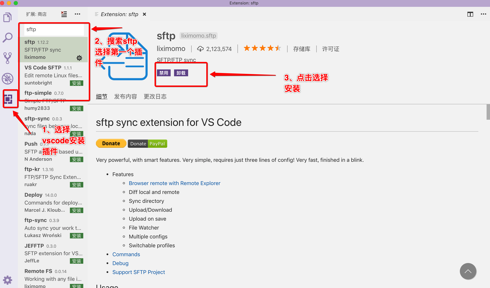
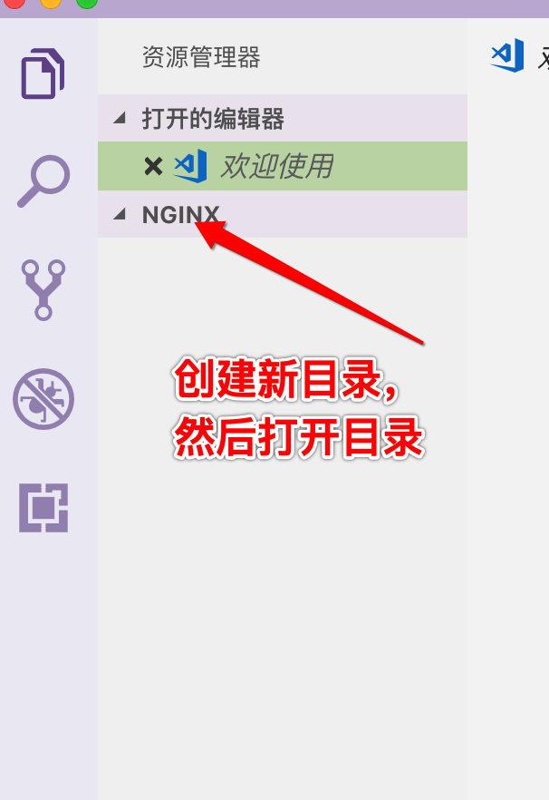
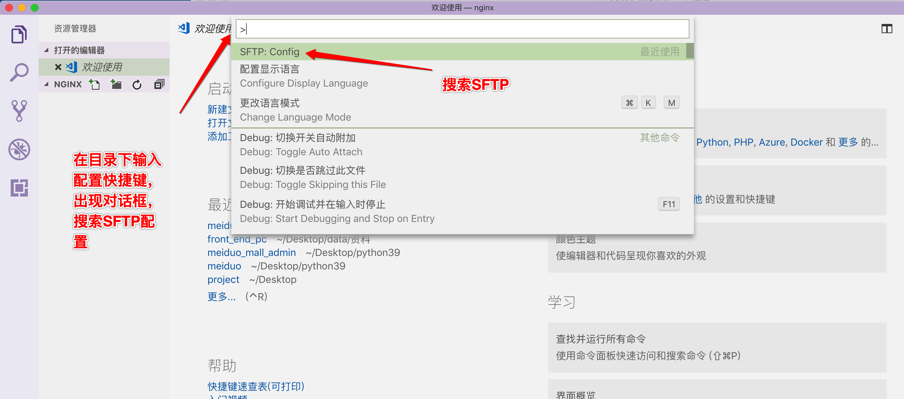
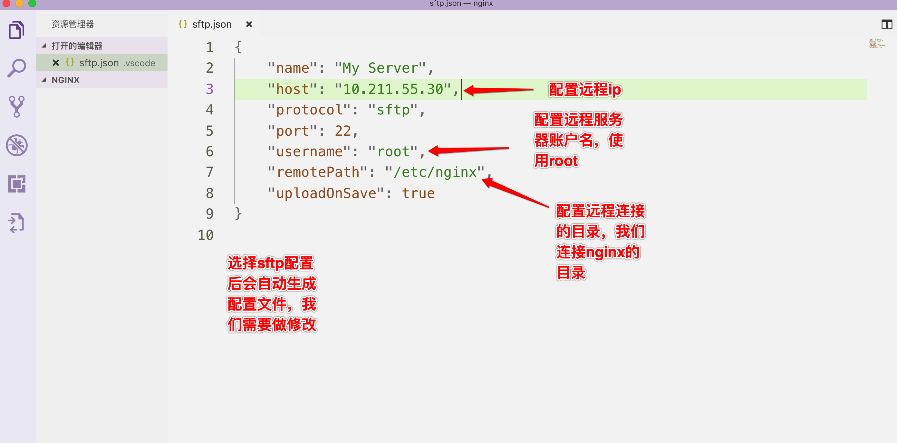
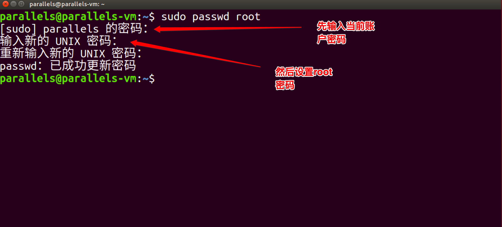
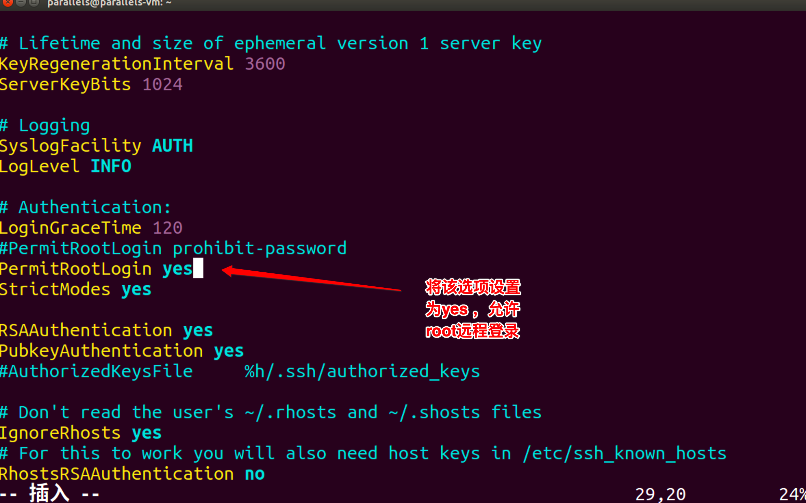
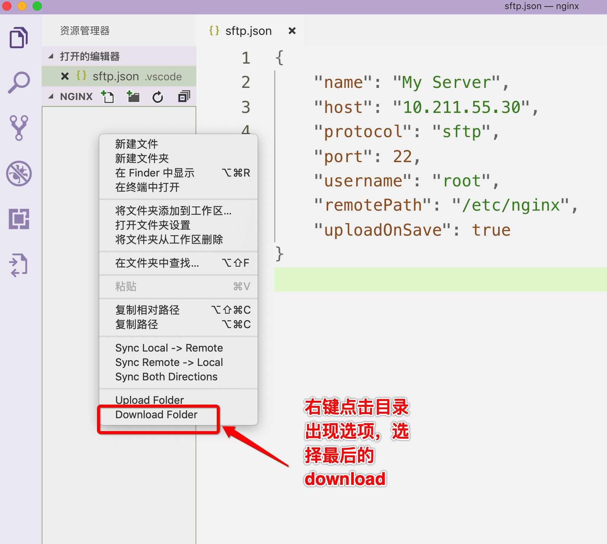
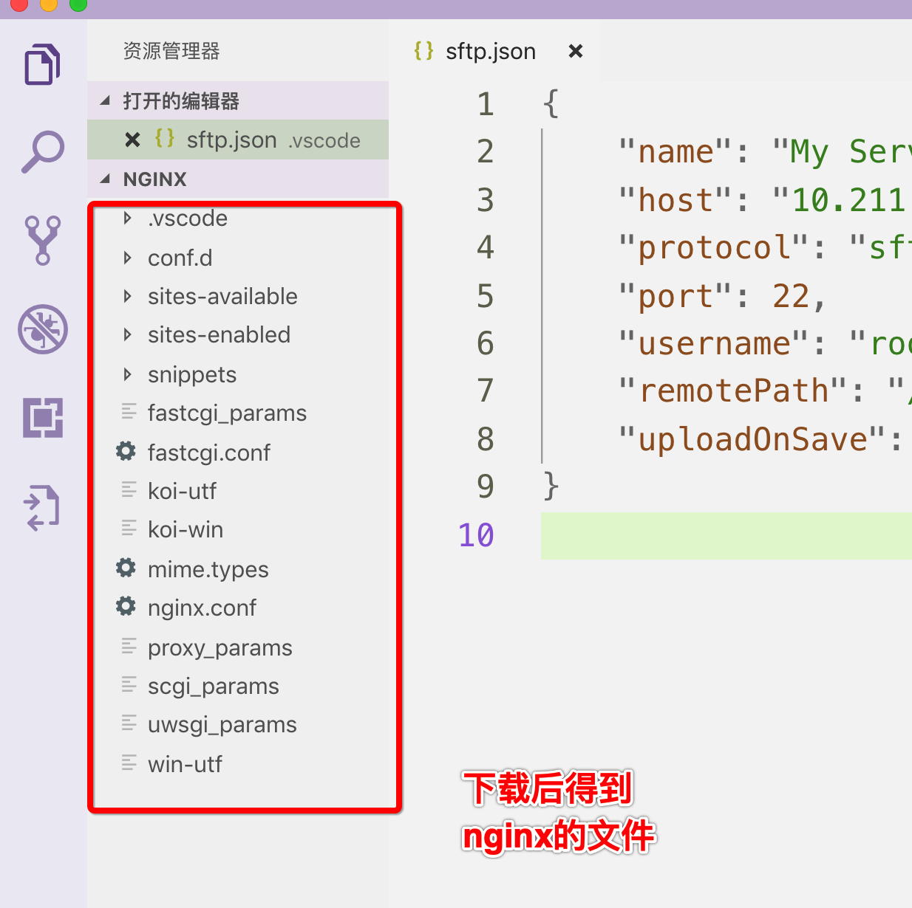
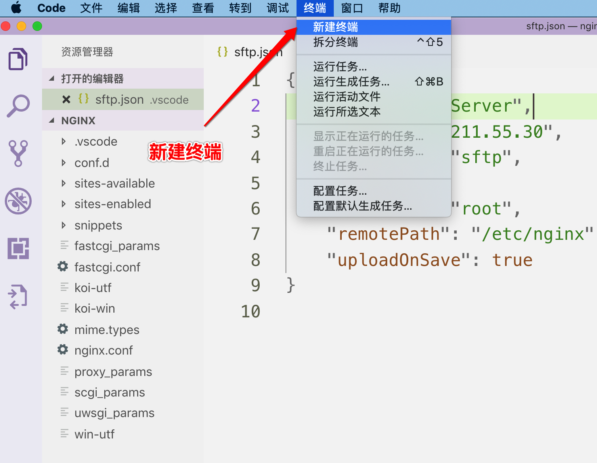
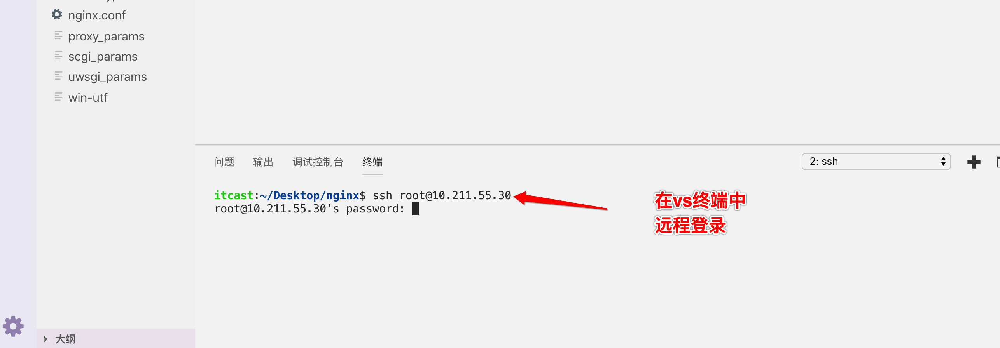

# vscode远程连接

[TOC]

### 1、安装vscode的sftp插件，如图所示：




### 2、创建目录nginx




### 2、配置远程连接插件

#### 在创建的目录下使用快捷键

windows系统快捷键

`ctrl + shift + P`

Mac系统快捷键

`command + shift +P`



#### 选择配置后按如下图配置



### 3、进入ubuntu系统安装openssh-server

```shell
sudo apt install openssh-server
```


### 4、设置ubuntu的root账户密码

```shell
sudo passwd root
```




### 5、设置允许root账户远程登录

打开ssh配置文件

```shell
 sudo vi /etc/ssh/sshd_config 
```

按照如图所示修改ssh配置



重启ssh服务

```shell
sudo service ssh restart 
```


### 6、下载远程服务器文件



输入密码开始下载远程文件


下载之后文件目录如下



### 7、打开vscode终端远程登录服务器



